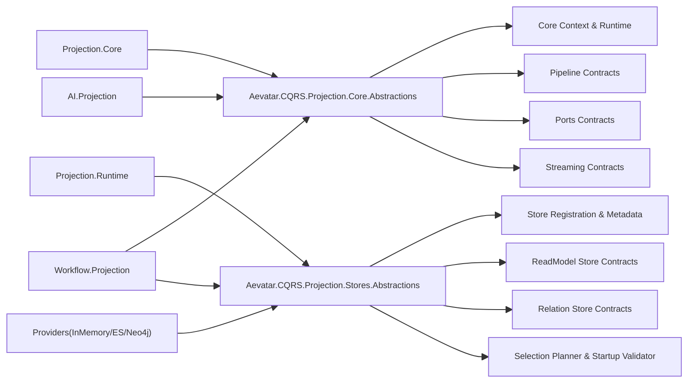

# Projection Abstractions 全量重构蓝图（2026-02-24）

## 1. 文档信息
- 状态：Implemented（Breaking）
- 兼容性策略：不保留兼容层，旧单体抽象项目直接删除
- 范围：`Projection.Abstractions` 体系及所有直接依赖方（Core/Runtime/Providers/Workflow/AI/Tests）
- 决策：将抽象层拆分为两个项目：`Aevatar.CQRS.Projection.Core.Abstractions` 与 `Aevatar.CQRS.Projection.Stores.Abstractions`

## 2. 重构目标
1. 把“投影管线抽象”与“存储/能力选择抽象”强制分离。
2. 消除单体抽象项目中职责混合导致的理解和演进成本。
3. 在无兼容负担下，形成清晰依赖方向：业务可按能力按需依赖。
4. 保持统一语义命名空间 `Aevatar.CQRS.Projection.Abstractions`，降低调用层改动噪声。

## 3. 目标架构

## 4. 项目拆分与职责

### 4.1 `Aevatar.CQRS.Projection.Core.Abstractions`
路径：`src/Aevatar.CQRS.Projection.Core.Abstractions/`

包含：
1. `Abstractions/Core`：`IProjectionContext`、`IProjectionRuntimeOptions`、`IProjectionClock`、`IProjectionStreamSubscriptionContext`
2. `Abstractions/Pipeline`：`IProjectionCoordinator`、`IProjectionDispatcher`、`IProjectionProjector`、`IProjectionLifecycleService`、`IProjectionEventReducer`、`IProjectionEventApplier` 等
3. `Abstractions/Ports`：activation/release/sink 端口协作契约
4. `Abstractions/Streaming`：session event hub / actor stream subscription 契约

边界：
1. 不包含 provider 能力声明与选择逻辑。
2. 不包含 readmodel/relation store 抽象。

### 4.2 `Aevatar.CQRS.Projection.Stores.Abstractions`
路径：`src/Aevatar.CQRS.Projection.Stores.Abstractions/`

包含：
1. `Abstractions/Core`：`IProjectionStoreRegistration<TStore>`、`DelegateProjectionStoreRegistration<TStore>`、`IProjectionStoreProviderMetadata`
2. `Abstractions/ReadModels`：store/provider 能力、requirements、runtime options、binding、selector
3. `Abstractions/Relations`：relation store/provider 与图查询模型
4. `Abstractions/Selection`：selection planner、selection runtime options、startup validator、provider selection exception

边界：
1. 不包含投影生命周期/调度/订阅主链路抽象。
2. 不包含业务模型与 provider 具体实现。

## 5. 依赖矩阵（重构后）
1. `Projection.Core` -> `Aevatar.CQRS.Projection.Core.Abstractions`
2. `Projection.Runtime` -> `Aevatar.CQRS.Projection.Stores.Abstractions`
3. `Projection.Providers.*` -> `Aevatar.CQRS.Projection.Stores.Abstractions`
4. `Workflow.Projection` -> `Aevatar.CQRS.Projection.Core.Abstractions` + `Aevatar.CQRS.Projection.Stores.Abstractions`
5. `Workflow.Presentation.AGUIAdapter` -> `Aevatar.CQRS.Projection.Core.Abstractions`
6. `AI.Projection` -> `Aevatar.CQRS.Projection.Core.Abstractions`
7. `Projection.StateMirror` -> 不再依赖 Projection Abstractions

## 6. Breaking 变更清单
1. 删除旧项目：`src/Aevatar.CQRS.Projection.Abstractions/Aevatar.CQRS.Projection.Abstractions.csproj`
2. 新增项目：
- `src/Aevatar.CQRS.Projection.Core.Abstractions/Aevatar.CQRS.Projection.Core.Abstractions.csproj`
- `src/Aevatar.CQRS.Projection.Stores.Abstractions/Aevatar.CQRS.Projection.Stores.Abstractions.csproj`
3. 解决方案与子解决方案改为引用新项目（`aevatar.slnx`、`aevatar.cqrs.slnf`）
4. 所有依赖方 `ProjectReference` 全量切换到新拆分项目

## 7. 选择链路治理（重构后）
1. 业务仅声明需求：`ProjectionReadModelRequirements`
2. Runtime 统一规划：`IProjectionStoreSelectionPlanner`
3. Provider 统一选择：`ProjectionStoreSelector`
4. 启动期统一 fail-fast：`IProjectionStoreStartupValidator`

约束：
1. Workflow 业务层不再承载 provider 选择规则，只消费组合层注入结果。
2. Provider capabilities 声明必须与真实实现一致，不允许“声明支持但未实现”。

## 8. 验证标准
1. `dotnet build aevatar.slnx --nologo` 通过
2. `dotnet test aevatar.slnx --nologo` 或关键分片测试通过
3. `bash tools/ci/architecture_guards.sh` 通过
4. `bash tools/ci/test_stability_guards.sh` 通过

## 9. 后续演进建议
1. 增加架构门禁：禁止新增 `src/Aevatar.CQRS.Projection.Abstractions/*` 单体项目回流。
2. 对 `Aevatar.CQRS.Projection.Core.Abstractions` 与 `Aevatar.CQRS.Projection.Stores.Abstractions` 做分片构建门禁，避免跨边界漂移。
3. 新增抽象优先落在两个项目之一，禁止在 Workflow 层复制通用抽象。
