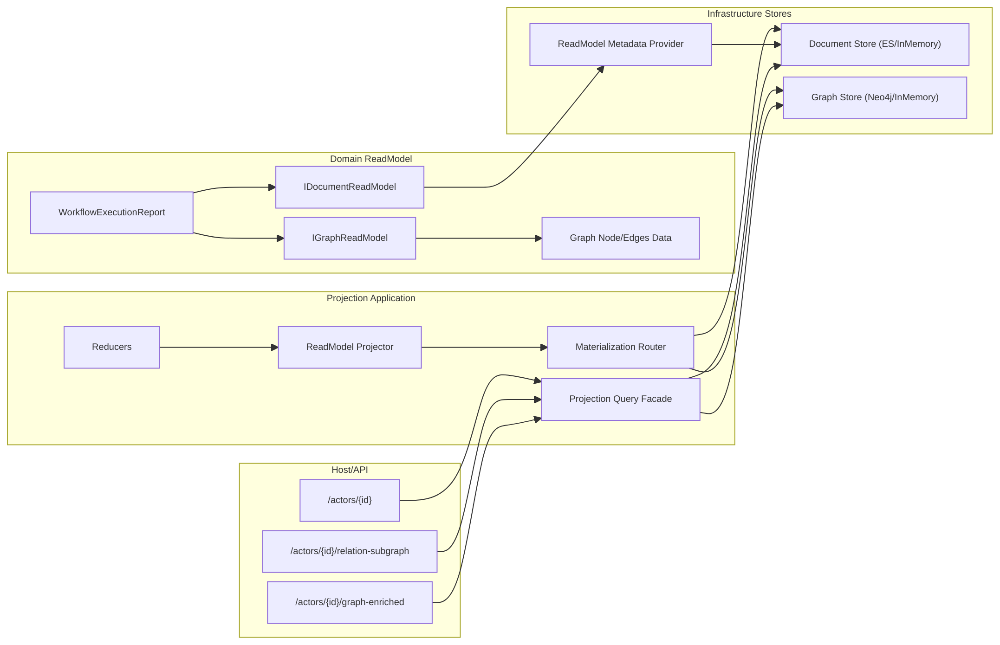
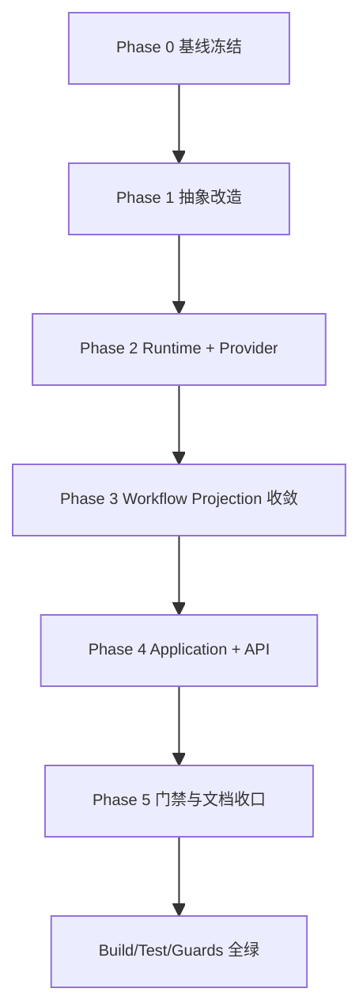

# Projection ReadModel 全量重构实施计划（v2，按仓库现状细化）

## 1. 本版更新说明

1. 采用你提出的核心规则：**索引 metadata 由 `TReadModel` 泛型 provider 提供**，不挂在 readmodel 实例方法上。
2. 计划已按当前仓库真实结构重写，覆盖到项目/目录/文件级实施方式。
3. 继续执行“无兼容重构”：删除旧链路，不保留兼容层和回退开关。

## 2. 目标与边界

1. 目标：开发者只定义 `State -> ReadModel`，并通过 readmodel 能力接口自动决定写入文档库/图库。
2. 目标：消除 `Bindings[Type.FullName]` 配置路由，改为类型能力路由。
3. 目标：消除 `ReadModel` 与 `Relation` 双体系心智割裂。
4. 非目标：不做旧配置兼容，不做灰度并存。

## 3. 仓库现状映射（实施基准）

| 层 | 项目 | 现状职责 | 重构动作 |
|---|---|---|---|
| 抽象 | `src/Aevatar.CQRS.Projection.Stores.Abstractions` | ReadModel/Relation/Selection 抽象 | 重构为 capability-first 抽象中心 |
| 运行时 | `src/Aevatar.CQRS.Projection.Runtime` | provider 选择、binding 解析、factory | 删除 binding 路径，新增 capability router |
| Provider | `src/Aevatar.CQRS.Projection.Providers.InMemory` | InMemory ReadModel + Relation | 拆分 Doc/Graph provider 能力注册 |
| Provider | `src/Aevatar.CQRS.Projection.Providers.Elasticsearch` | ES ReadModel + (弱)Relation | 收敛为 Document provider |
| Provider | `src/Aevatar.CQRS.Projection.Providers.Neo4j` | Neo4j ReadModel + Relation | 收敛为 Graph provider（可选保留 Doc） |
| 读侧业务 | `src/workflow/Aevatar.Workflow.Projection` | ReadModel projector + Relation projector | 合并为单 readmodel materialization 主链 |
| 应用层 | `src/workflow/Aevatar.Workflow.Application` | 查询/运行编排 | 查询改为统一 facade/port 聚合 |
| 接口层 | `src/workflow/Aevatar.Workflow.Infrastructure` | endpoints 协议适配 | 新增 graph-enriched endpoint，禁止手工两跳拼装 |
| Host 组合 | `src/workflow/extensions/Aevatar.Workflow.Extensions.Hosting` | provider 配置与注册 | 改为 Document/Graph provider 独立配置 |
| 门禁 | `tools/ci/architecture_guards.sh` 等 | 架构与路由守卫 | 新增 capability-first 规则守卫 |

## 4. 目标架构（最终）



## 5. 核心契约（重构后）

### 5.1 ReadModel 能力接口

```csharp
public interface IProjectionReadModel
{
    string Id { get; }
}

public interface IDocumentReadModel : IProjectionReadModel
{
    string DocumentScope { get; }
}

public interface IGraphReadModel : IProjectionReadModel
{
    GraphNodeDescriptor GraphNode { get; }
    IReadOnlyList<GraphEdgeDescriptor> GraphEdges { get; }
}

public sealed record GraphNodeDescriptor(
    string NodeId,
    string NodeType,
    IReadOnlyDictionary<string, string> Properties);

public sealed record GraphEdgeDescriptor(
    string EdgeId,
    string RelationType,
    string FromNodeId,
    string ToNodeId,
    IReadOnlyDictionary<string, string> Properties);
```

### 5.2 索引 metadata（泛型 provider）

```csharp
public sealed record DocumentIndexMetadata(
    string IndexName,
    string MappingJson,
    IReadOnlyDictionary<string, string> Settings,
    IReadOnlyDictionary<string, string> Aliases);

public interface IReadModelDocumentMetadataProvider<TReadModel>
    where TReadModel : class, IDocumentReadModel
{
    DocumentIndexMetadata Metadata { get; }
}
```

约束：

1. `DocumentIndexMetadata` 必须由 `TReadModel` 对应 provider 给出，禁止从运行时对象反射/动态拼接。
2. `IReadModelDocumentMetadataProvider<TReadModel>` 在 DI 中必须唯一注册。

### 5.3 路由与写入契约

```csharp
public interface IDocumentProjectionStore<TReadModel, in TKey>
    where TReadModel : class, IDocumentReadModel
{
    Task UpsertAsync(TReadModel readModel, CancellationToken ct = default);
    Task<TReadModel?> GetAsync(TKey key, CancellationToken ct = default);
    Task<IReadOnlyList<TReadModel>> ListAsync(int take = 50, CancellationToken ct = default);
}

public interface IGraphProjectionStore<TReadModel>
    where TReadModel : class, IGraphReadModel
{
    Task UpsertGraphAsync(TReadModel readModel, CancellationToken ct = default);
    Task<ProjectionRelationSubgraph> GetSubgraphAsync(string nodeId, int depth, int take, CancellationToken ct = default);
}

public interface IProjectionMaterializationRouter<TReadModel, in TKey>
    where TReadModel : class, IProjectionReadModel
{
    Task MaterializeAsync(TReadModel readModel, TKey key, CancellationToken ct = default);
}
```

## 6. 关键实施策略

1. 单一 projector 产出 `ReadModel`，materialization router 根据接口能力执行 Doc/Graph 单写或双写。
2. Graph 不再由单独 relation projector 维护；关系由 `IGraphReadModel.GraphEdges` 数据驱动。
3. Graph 写入必须执行边差异收敛（`toAdd/toUpdate/toDelete`），不能只 upsert。
4. 查询统一由 projection query facade 完成，endpoint 不手工先查图再查文档。
5. 默认 deduplicator 改为持久化实现，passthrough 只在测试 profile 注入。
6. 统一时间源到 `IProjectionClock`。

## 7. 文件级改造清单（按项目）

## 7.1 `src/Aevatar.CQRS.Projection.Stores.Abstractions`

新增：

1. `Abstractions/ReadModels/IProjectionReadModel.cs`
2. `Abstractions/ReadModels/IDocumentReadModel.cs`
3. `Abstractions/ReadModels/IGraphReadModel.cs`
4. `Abstractions/ReadModels/GraphNodeDescriptor.cs`
5. `Abstractions/ReadModels/GraphEdgeDescriptor.cs`
6. `Abstractions/ReadModels/DocumentIndexMetadata.cs`
7. `Abstractions/ReadModels/IReadModelDocumentMetadataProvider.cs`
8. `Abstractions/ReadModels/IDocumentProjectionStore.cs`
9. `Abstractions/ReadModels/IGraphProjectionStore.cs`
10. `Abstractions/Selection/IProjectionMaterializationRouter.cs`

修改：

1. `Abstractions/ReadModels/ProjectionReadModelRuntimeOptions.cs`（移除 `Bindings`）
2. `Abstractions/Selection/IProjectionStoreSelectionRuntimeOptions.cs`（改为 Document/Graph provider 选项）
3. `Abstractions/ReadModels/ProjectionReadModelRequirements.cs`（改为 capability bool 集合）

删除：

1. `Abstractions/ReadModels/IProjectionReadModelBindingResolver.cs`
2. `Abstractions/ReadModels/ProjectionReadModelBindingException.cs`
3. `Abstractions/ReadModels/ProjectionReadModelIndexKind.cs`

## 7.2 `src/Aevatar.CQRS.Projection.Runtime`

新增：

1. `Runtime/ProjectionReadModelCapabilityInspector.cs`
2. `Runtime/ProjectionMaterializationRouter.cs`
3. `Runtime/ProjectionDocumentMetadataResolver.cs`
4. `Runtime/ProjectionGraphWritePlanner.cs`

修改：

1. `Runtime/ProjectionStoreSelectionPlanner.cs`（基于 capability，不再读取 binding）
2. `Runtime/ProjectionReadModelProviderSelector.cs`（Document provider 选择）
3. `Runtime/ProjectionRelationStoreProviderSelector.cs`（重命名为 Graph provider selector）
4. `DependencyInjection/ServiceCollectionExtensions.cs`（注册新 router/resolver）

删除：

1. `Runtime/ProjectionReadModelBindingResolver.cs`

## 7.3 `src/Aevatar.CQRS.Projection.Providers.InMemory`

新增：

1. `Stores/InMemoryDocumentProjectionStore.cs`
2. `Stores/InMemoryGraphProjectionStore.cs`

修改：

1. `DependencyInjection/ServiceCollectionExtensions.cs`（改为注册 `IDocumentProjectionStore` / `IGraphProjectionStore`）

删除：

1. `Stores/InMemoryProjectionReadModelStore.cs`
2. `Stores/InMemoryProjectionRelationStore.cs`

## 7.4 `src/Aevatar.CQRS.Projection.Providers.Elasticsearch`

新增：

1. `Stores/ElasticsearchDocumentProjectionStore.cs`
2. `Stores/ElasticsearchIndexMetadataBootstrapper.cs`

修改：

1. `DependencyInjection/ServiceCollectionExtensions.cs`（仅注册 document provider）

删除：

1. `Stores/ElasticsearchProjectionRelationStore.cs`
2. `Stores/ElasticsearchProjectionReadModelStore.cs`

## 7.5 `src/Aevatar.CQRS.Projection.Providers.Neo4j`

新增：

1. `Stores/Neo4jGraphProjectionStore.cs`
2. `Stores/Neo4jGraphDiffWriter.cs`

修改：

1. `DependencyInjection/ServiceCollectionExtensions.cs`（默认注册 graph provider）

删除：

1. `Stores/Neo4jProjectionRelationStore.cs`
2. `Stores/Neo4jProjectionReadModelStore.cs`（若不保留图库文档能力）

## 7.6 `src/workflow/Aevatar.Workflow.Projection`

新增：

1. `Metadata/WorkflowExecutionReportDocumentMetadataProvider.cs`
2. `Orchestration/WorkflowProjectionQueryFacade.cs`

修改：

1. `ReadModels/WorkflowExecutionReadModel.cs`（实现 `IDocumentReadModel` + `IGraphReadModel`）
2. `Projectors/WorkflowExecutionReadModelProjector.cs`（完成 reduce 后只调用 materialization router）
3. `DependencyInjection/ServiceCollectionExtensions.cs`（移除 relation projector 注册，注册 metadata provider）
4. `Orchestration/WorkflowProjectionQueryReader.cs`（调用 facade，支持 graph-enriched）
5. `Orchestration/WorkflowProjectionReadModelUpdater.cs`（统一 clock 与 materialization）

删除：

1. `Projectors/WorkflowExecutionRelationProjector.cs`
2. `ReadModels/WorkflowExecutionRelationConstants.cs`（关系常量下沉到 graph descriptor）

## 7.7 `src/workflow/Aevatar.Workflow.Application.Abstractions`

修改：

1. `Projections/IWorkflowExecutionProjectionQueryPort.cs`（新增 graph-enriched 查询方法）
2. `Queries/WorkflowExecutionQueryModels.cs`（新增 graph-enriched DTO）

## 7.8 `src/workflow/Aevatar.Workflow.Application`

修改：

1. `Queries/WorkflowExecutionQueryApplicationService.cs`（统一走新 query port/facade）

## 7.9 `src/workflow/Aevatar.Workflow.Infrastructure`

修改：

1. `CapabilityApi/ChatQueryEndpoints.cs`（新增 `/actors/{actorId}/graph-enriched`）
2. `DependencyInjection/WorkflowCapabilityServiceCollectionExtensions.cs`（去掉 relation 分支显式依赖）

## 7.10 `src/workflow/extensions/Aevatar.Workflow.Extensions.Hosting`

修改：

1. `WorkflowProjectionProviderServiceCollectionExtensions.cs`
   1. 删除 `Projection:ReadModel:Bindings` 路径。
   2. 新增 `Projection:Document:Provider` 与 `Projection:Graph:Provider`。
   3. provider 注册改为 capability 对应注册。

## 7.11 测试项目

修改：

1. `test/Aevatar.CQRS.Projection.Core.Tests`
   1. 删除 binding resolver 相关测试。
   2. 新增 metadata provider、capability router、dual-write 路径测试。
2. `test/Aevatar.Workflow.Host.Api.Tests`
   1. 删除 `WorkflowExecutionRelationProjectorTests.cs`。
   2. 新增 graph-enriched 查询与统一 projector 行为测试。

## 7.12 CI / Guard

修改：

1. `tools/ci/architecture_guards.sh`
   1. 新增禁用 `Bindings[` / `Type.FullName` 路由规则。
   2. 新增 `IReadModelDocumentMetadataProvider<TReadModel>` 唯一注册守卫。
2. `tools/ci/projection_route_mapping_guard.sh`
   1. 保留 TypeUrl 精确路由守卫。
3. `tools/ci/projection_provider_e2e_smoke.sh`
   1. 增加 dual-write（ES + Neo4j）完整执行断言。

## 8. 实施阶段（可执行方式）

### Phase 0：基线冻结（0.5 天）

1. 执行并留档：
   1. `bash tools/ci/architecture_guards.sh`
   2. `bash tools/ci/projection_route_mapping_guard.sh`
   3. `dotnet test test/Aevatar.CQRS.Projection.Core.Tests/Aevatar.CQRS.Projection.Core.Tests.csproj --nologo`
   4. `dotnet test test/Aevatar.Workflow.Host.Api.Tests/Aevatar.Workflow.Host.Api.Tests.csproj --nologo`
2. 输出 ADR：确认无兼容策略与删除清单。

### Phase 1：抽象改造（2 天）

1. 先改 `Stores.Abstractions` 新接口与 metadata provider 泛型。
2. 删 binding 抽象与引用。
3. 修复编译并补最小单测。

### Phase 2：Runtime + Provider（3 天）

1. 落地 capability inspector/router/metadata resolver。
2. InMemory/ES/Neo4j provider 按 doc/graph 重建。
3. 补 dual-write 失败上报与重试策略测试。

### Phase 3：Workflow Projection 主链收敛（3 天）

1. `WorkflowExecutionReport` 实现双能力。
2. 删除 relation projector，统一写入 router。
3. QueryReader 改为统一 facade/port。

### Phase 4：Application + API（2 天）

1. 应用查询服务与 endpoint 全部接新 query port。
2. 新增 graph-enriched endpoint。
3. 删除 endpoint 手工二次拼装逻辑。

### Phase 5：门禁与文档收口（1.5 天）

1. 更新 CI 守卫与 E2E。
2. 删除遗留文档、遗留配置示例、遗留测试。
3. 重新执行全量验证命令。

## 9. 验证命令（阶段完成即跑）

1. `dotnet restore aevatar.slnx --nologo`
2. `dotnet build aevatar.slnx --nologo`
3. `dotnet test aevatar.slnx --nologo`
4. `bash tools/ci/architecture_guards.sh`
5. `bash tools/ci/projection_route_mapping_guard.sh`
6. `bash tools/ci/solution_split_guards.sh`
7. `bash tools/ci/solution_split_test_guards.sh`
8. `bash tools/ci/test_stability_guards.sh`

## 10. 验收标准（DoD）

1. 新增 readmodel 时不再需要 `Bindings` 配置。
2. `TReadModel` 的索引 metadata 必须由 `IReadModelDocumentMetadataProvider<TReadModel>` 提供且可被 runtime 解析。
3. 同一事件输入可稳定触发 doc/graph 双写（按能力接口自动路由）。
4. 图查询调用方不再手写两跳逻辑。
5. 全量门禁、构建、测试通过。

## 11. 不做项（明确删除）

1. 不保留旧 `Projection:ReadModel:Bindings` 配置。
2. 不保留旧 relation projector 与新 router 并存。
3. 不保留 compatibility adapter 或 feature flag 回退。

## 12. 阶段执行图



