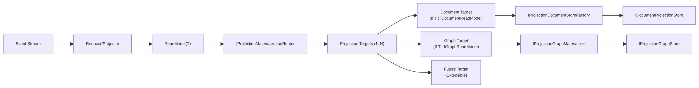
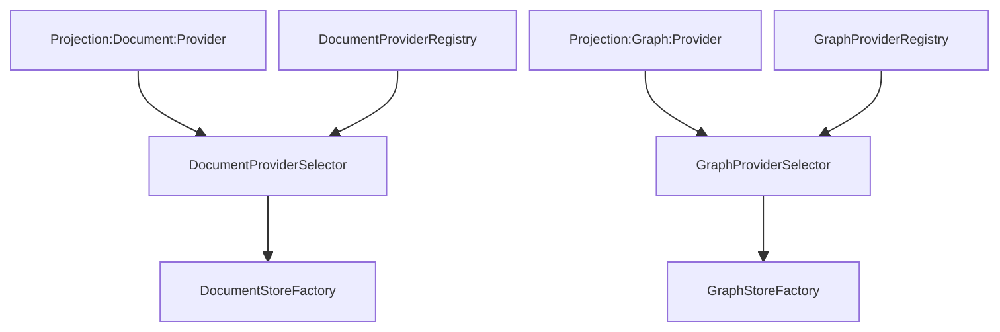
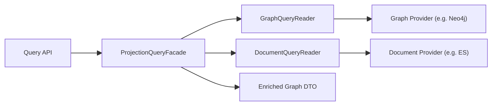

# Projection ReadModel 全量重构实施文档（v9，无兼容，无能力模型）

> 日期：2026-02-24  
> 范围：`Aevatar.CQRS.Projection.Stores.Abstractions`、`Aevatar.CQRS.Projection.Core.Abstractions`、`Aevatar.CQRS.Projection.Runtime.Abstractions`、`Aevatar.CQRS.Projection.Runtime`、`Aevatar.Workflow.Projection`

## 1. 结论先行

核心关系定义：`ReadModel` 与 `ProjectionTarget` 是标准 `1:N` 关系。

当前已实现 `N=2`：

1. `DocumentTarget`（Document Provider 链路）
2. `GraphTarget`（Graph Provider 链路）

关键决策（本版）：

1. 删除能力模型（`Capabilities/Requirements/CapabilityValidator`）整层。
2. Provider 选择改为“显式配置 + 启动失败即终止（fail-fast）”，不做能力协商与自动降级。
3. 索引与关系语义全部保留：
   - 索引：Document 链路（ES 等）
   - 关系：Graph 链路（Neo4j 等）
4. 写入编排保持单次路由、多目标分发（`1:N`）。

## 2. 当前实现诊断（As-Is）

### 2.1 已经对齐的部分

1. `Stores.Abstractions` 已基本收敛为纯存储契约（`IDocumentProjectionStore<,>` + `IProjectionGraphStore`）。
2. `IGraphProjectionStore<TReadModel>` 已删除，改用 `IProjectionGraphMaterializer<TReadModel>` 作为图写入适配层。
3. Workflow 查询已直接读取 `IProjectionGraphStore`，不再从 Materializer 读图。

### 2.2 需要继续删除的旧语义

1. 统一计划模型（Doc+Graph 绑定）：
   - `ProjectionStoreSelectionPlan`
   - `IProjectionStoreSelectionPlanner`
   - `ProjectionStoreSelectionPlanner`
2. 统一能力模型：
   - `ProjectionProviderCapabilities`
   - `ProjectionStoreRequirements`
   - `IProjectionProviderCapabilityValidator`
   - `ProjectionProviderCapabilityValidator`
3. 统一启动校验接口：
   - `IProjectionStoreStartupValidator`
   - `ProjectionStoreStartupValidator`
4. Workflow DI 仍使用统一 `BuildSelectionPlan`。

## 3. 目标架构（To-Be）

### 3.1 主链路 + 一对多目标分发



当前落地状态：`Projection Targets` 已实现 `Document + Graph` 两类目标。

### 3.2 Provider 选择（无能力协商）



选择规则：

1. 配置必须明确指定 provider（或使用明确默认值）。
2. 选择器仅做 provider name 匹配与唯一性判断。
3. 启动时仅做注册存在性 + 基础连接健康检查；失败立即报错退出。

### 3.3 查询组合门面（降低开发负担）



说明：业务层只调用 Facade，不再手工双查（先 Neo4j 再 ES）。

## 4. 契约重构（无兼容，直接替换）

### 4.1 保留的核心语义

1. `IDocumentProjectionStore<,>`：文档快照与索引写入。
2. `IProjectionGraphStore`：图节点/边关系写入与遍历查询。
3. `IProjectionMaterializationRouter<,>`：单次写入流程的多目标分发。
4. `IProjectionGraphMaterializer<TReadModel>`：从 ReadModel 派生图节点/边并写入 Graph。

### 4.2 删除的抽象层

删除整层能力协商模型：

1. `ProjectionProviderCapabilities`
2. `ProjectionStoreRequirements`
3. `IProjectionProviderCapabilityValidator`
4. `ProjectionProviderCapabilityValidator`
5. `ProjectionProviderCapabilityValidationException`

删除统一计划模型：

1. `ProjectionStoreSelectionPlan`
2. `IProjectionStoreSelectionPlanner`
3. `ProjectionStoreSelectionPlanner`
4. `IProjectionStoreSelectionRuntimeOptions`
5. `ProjectionStoreRuntimeOptions`

### 4.3 新的运行时配置模型

拆为两条独立配置契约：

1. `IProjectionDocumentRuntimeOptions`
2. `IProjectionGraphRuntimeOptions`

建议最小字段：

1. `ProviderName`
2. `FailFastOnStartup`

不再包含：`Requirements`、`Capabilities`、`FailOnUnsupportedCapabilities` 等协商语义。

### 4.4 启动校验模型

统一启动校验器拆分为：

1. `IProjectionDocumentStartupValidator`
2. `IProjectionGraphStartupValidator`

校验范围：

1. 目标 provider 是否注册。
2. 目标 provider 是否可创建。
3. 基础连接健康检查（如 ES ping、Neo4j session）。

不再校验：抽象能力矩阵。

## 5. ReadModel 声明模型（保留索引/关系）

目标：开发者只定义 `State + ReadModel`，由 ReadModel 声明决定投影目标。

建议契约（目标态）：

```csharp
public interface IProjectionReadModel {}

public interface IDocumentReadModel<TDocumentMetadataProvider> : IProjectionReadModel
    where TDocumentMetadataProvider : IProjectionDocumentMetadataProvider, new()
{
}

public interface IGraphReadModel<TGraphDescriptorProvider> : IProjectionReadModel
    where TGraphDescriptorProvider : IProjectionGraphDescriptorProvider, new()
{
}
```

语义结果：

1. `T : IDocumentReadModel<...>` -> 进入 DocumentTarget，保留索引能力。
2. `T : IGraphReadModel<...>` -> 进入 GraphTarget，保留关系能力。
3. 同时实现两者 -> 同一次流程扇出到两个目标（Doc + Graph）。
4. 该模型本质是 `1:N`，不是二选一。

## 6. 与项目现状对齐的实施计划

### Phase 1：删除统一计划与能力模型（Runtime.Abstractions）

删除文件（按现有路径）：

1. `src/Aevatar.CQRS.Projection.Runtime.Abstractions/Abstractions/Selection/ProjectionStoreSelectionPlan.cs`
2. `src/Aevatar.CQRS.Projection.Runtime.Abstractions/Abstractions/Selection/IProjectionStoreSelectionPlanner.cs`
3. `src/Aevatar.CQRS.Projection.Runtime.Abstractions/Abstractions/Selection/IProjectionStoreSelectionRuntimeOptions.cs`
4. `src/Aevatar.CQRS.Projection.Runtime.Abstractions/Abstractions/Selection/IProjectionStoreStartupValidator.cs`
5. `src/Aevatar.CQRS.Projection.Runtime.Abstractions/Abstractions/Selection/ProjectionStoreSelector.cs`
6. `src/Aevatar.CQRS.Projection.Runtime.Abstractions/Abstractions/ReadModels/ProjectionStoreRuntimeOptions.cs`
7. `src/Aevatar.CQRS.Projection.Runtime.Abstractions/Abstractions/ReadModels/ProjectionStoreRequirements.cs`
8. `src/Aevatar.CQRS.Projection.Runtime.Abstractions/Abstractions/ReadModels/ProjectionStoreSelectionOptions.cs`
9. `src/Aevatar.CQRS.Projection.Runtime.Abstractions/Abstractions/ReadModels/ProjectionProviderCapabilities.cs`
10. `src/Aevatar.CQRS.Projection.Runtime.Abstractions/Abstractions/ReadModels/IProjectionProviderCapabilityValidator.cs`
11. `src/Aevatar.CQRS.Projection.Runtime.Abstractions/Abstractions/ReadModels/ProjectionProviderCapabilityValidator.cs`
12. `src/Aevatar.CQRS.Projection.Runtime.Abstractions/Abstractions/ReadModels/ProjectionProviderCapabilityValidationException.cs`

新增文件（示例命名）：

1. `Abstractions/Documents/IProjectionDocumentRuntimeOptions.cs`
2. `Abstractions/Documents/ProjectionDocumentRuntimeOptions.cs`
3. `Abstractions/Documents/ProjectionDocumentSelectionOptions.cs`
4. `Abstractions/Documents/IProjectionDocumentStartupValidator.cs`
5. `Abstractions/Graphs/IProjectionGraphRuntimeOptions.cs`
6. `Abstractions/Graphs/ProjectionGraphRuntimeOptions.cs`
7. `Abstractions/Graphs/ProjectionGraphSelectionOptions.cs`
8. `Abstractions/Graphs/IProjectionGraphStartupValidator.cs`

### Phase 2：Runtime 实现替换（无能力协商）

1. 删除 `Runtime/ProjectionStoreSelectionPlanner.cs`。
2. 删除 `Runtime/ProjectionStoreStartupValidator.cs`，拆分实现：
   - `Runtime/ProjectionDocumentStartupValidator.cs`
   - `Runtime/ProjectionGraphStartupValidator.cs`
3. 删除 `Runtime/ProjectionProviderCapabilityValidatorService.cs`。
4. `ProjectionDocumentStoreFactory` 与 `ProjectionGraphStoreFactory` 改为仅接收对应 `SelectionOptions`。
5. `ProjectionDocumentStoreProviderSelector` 与 `ProjectionGraphStoreProviderSelector` 去掉 `requirements/capabilityValidator` 参数。

### Phase 3：Workflow 依赖替换

改造文件：

1. `src/workflow/Aevatar.Workflow.Projection/DependencyInjection/ServiceCollectionExtensions.cs`
   - 删除 `BuildSelectionPlan`。
   - 文档与图分别读取各自 runtime options。
2. `src/workflow/Aevatar.Workflow.Projection/Orchestration/WorkflowReadModelStartupValidationHostedService.cs`
   - 注入拆分后的 Document/Graph StartupValidator。
3. `src/workflow/extensions/Aevatar.Workflow.Extensions.Hosting/WorkflowProjectionProviderServiceCollectionExtensions.cs`
   - 分别注册 `ProjectionDocumentRuntimeOptions` 与 `ProjectionGraphRuntimeOptions`。

### Phase 4：ReadModel 泛型声明落地（索引与关系显式化）

1. `Stores.Abstractions` 将 `IDocumentReadModel`、`IGraphReadModel` 升级为泛型声明。
2. Document metadata 由 ReadModel 泛型 provider 提供（索引名、mapping、alias）。
3. Graph descriptor 由 ReadModel 泛型 provider 提供（节点与边关系定义）。

### Phase 5：查询门面落地

1. 在 `Workflow.Projection` 增加 `ProjectionQueryFacade`。
2. 提供单入口：输入 rootId，返回文档快照 + 图子图（可选深度）。
3. API 仅依赖 Facade，不直接双查存储。

### Phase 6：测试与门禁

1. 删除或重写依赖 `ProjectionStoreSelectionPlan`、`ProjectionStoreRequirements`、`ProjectionProviderCapabilities` 的测试。
2. 新增测试：
   - Document provider selection（name match/unique/fail-fast）
   - Graph provider selection（name match/unique/fail-fast）
   - Router `1:N` 扇出写入
   - Query facade 组合查询
3. `tools/ci/architecture_guards.sh` 增加规则：
   - 禁止 `ProjectionStoreSelectionPlan` 回流。
   - 禁止 `ProjectionStoreRequirements` 回流。
   - 禁止 `ProjectionProviderCapabilities` 回流。
   - 禁止 `CapabilityValidator` 回流。

## 7. 验收标准

全部满足即重构完成：

1. `Runtime.Abstractions` 与 `Runtime` 中不再存在能力协商模型（Capabilities/Requirements/Validator）。
2. `MaterializationRouter` 明确采用 `ReadModel -> Targets(1:N)` 扇出模型，当前 `N=2`（Document、Graph）。
3. ReadModel 同时声明文档与图能力时，单流程双写可用。
4. Document 索引语义保留并可验证（metadata 生效）。
5. Graph 关系语义保留并可验证（节点/边写入与遍历查询可用）。
6. Workflow 查询提供单门面，业务方无需手工双查。

## 8. 验证命令

```bash
dotnet restore aevatar.slnx --nologo
dotnet build aevatar.slnx --nologo
dotnet test aevatar.slnx --nologo
bash tools/ci/architecture_guards.sh
bash tools/ci/projection_route_mapping_guard.sh
bash tools/ci/solution_split_guards.sh
bash tools/ci/solution_split_test_guards.sh
bash tools/ci/test_stability_guards.sh
```

## 9. 执行策略

1. 删除优先，不保留兼容层与转发壳。
2. 所有旧命名（`ProjectionStore*` 统一计划/能力模型）直接移除。
3. 编译失败点逐项修复到新语义。
