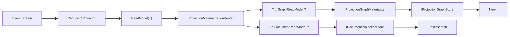
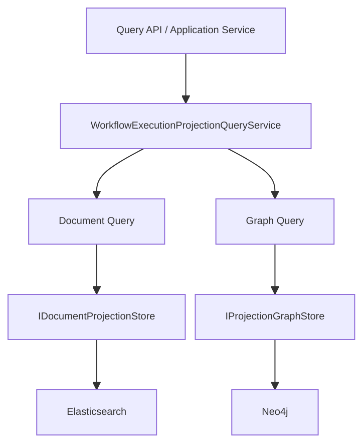
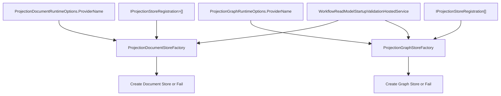

# Projection ReadModel 全量重构实施文档（v12，已完成，无兼容）

> 日期：2026-02-24  
> 范围：`Aevatar.CQRS.Projection.Stores.Abstractions`、`Aevatar.CQRS.Projection.Core.Abstractions`、`Aevatar.CQRS.Projection.Runtime.Abstractions`、`Aevatar.CQRS.Projection.Runtime`、`Aevatar.Workflow.Projection`、`Aevatar.Workflow.Extensions.Hosting`、`Aevatar.CQRS.Projection.Providers.*`

## 1. 最终结论

Workflow Projection 已彻底收敛为单链路 `1:N` 扇出模型，并固定生产职责分工：

1. `Document Target = Elasticsearch`（索引、检索、快照/列表查询）
2. `Graph Target = Neo4j`（关系、邻居、子图遍历）

同一 `ReadModel`（`WorkflowExecutionReport`）在一次投影中并行写入 `Document + Graph`，不是二选一。

## 2. 最终架构图

### 2.1 写入链路（单链路双写）

### 2.2 查询链路（索引与遍历并存）

### 2.3 Provider 选择与启动校验（极简）

## 3. 已完成的彻底重构项

### 3.1 Runtime 抽象与实现去层

1. 删除能力协商模型（Capabilities/Requirements/Validator）整层。
2. 删除薄封装中间层（Provider Registry / Provider Selector / Startup Validator）。
3. Provider 选择逻辑内聚到：
   - `ProjectionDocumentStoreFactory`
   - `ProjectionGraphStoreFactory`
4. 启动校验改为 HostedService 直接调用 Factory 进行真实创建 fail-fast。

### 3.2 ReadModel 抽象收敛

1. `IDocumentReadModel` 收敛为 marker。
2. 删除 `WorkflowExecutionReport.DocumentScope` 冗余字段。
3. 保留 `IProjectionDocumentMetadataProvider<TReadModel>` 作为索引 metadata 来源。

### 3.3 Neo4j Provider 职责收敛（仅 Graph）

已删除：

1. `src/Aevatar.CQRS.Projection.Providers.Neo4j/Stores/Neo4jProjectionReadModelStore.cs`
2. `src/Aevatar.CQRS.Projection.Providers.Neo4j/Configuration/Neo4jProjectionReadModelStoreOptions.cs`

已修改：

1. `src/Aevatar.CQRS.Projection.Providers.Neo4j/DependencyInjection/ServiceCollectionExtensions.cs`
   - 删除 `AddNeo4jDocumentStoreRegistration<TReadModel,TKey>(...)`
   - 仅保留 `AddNeo4jGraphStoreRegistration(...)`
2. `src/Aevatar.CQRS.Projection.Providers.Neo4j/README.md`
   - 改为 Graph-only 文档。

### 3.4 Workflow Hosting Provider 矩阵收敛

已修改：

1. `src/workflow/extensions/Aevatar.Workflow.Extensions.Hosting/WorkflowProjectionProviderServiceCollectionExtensions.cs`
   - `Projection:Document:Provider` 只允许 `InMemory | Elasticsearch`
   - `Projection:Graph:Provider` 只允许 `InMemory | Neo4j`
   - 删除 Document 分支中的 Neo4j 注册
   - 明确抛错：`Neo4j cannot be used as document provider`
2. `src/workflow/Aevatar.Workflow.Projection/README.md`
   - 删除 `Projection:Document:Providers:Neo4j:*` 相关说明

### 3.5 测试与门禁同步

已修改：

1. `test/Aevatar.CQRS.Projection.Core.Tests/ProjectionProviderE2EIntegrationTests.cs`
   - 删除 Neo4j Document Store E2E 场景
2. `test/Aevatar.Workflow.Host.Api.Tests/WorkflowHostingExtensionsCoverageTests.cs`
   - 新增断言：`Projection:Document:Provider=Neo4j` 必须抛错
3. `tools/ci/architecture_guards.sh`
   - 移除对 `Neo4jProjectionReadModelStore.cs` 必须存在的检查

## 4. 开发者使用模型（当前标准）

1. 定义 ReadModel：可同时实现 `IDocumentReadModel + IGraphReadModel`。
2. 注册 Provider：Document 与 Graph 各自注册，互不混用职责。
3. 配置 Provider：
   - `Projection:Document:Provider=Elasticsearch`（生产）
   - `Projection:Graph:Provider=Neo4j`（生产）

系统自动完成：

1. 单次流程双写（Document + Graph）。
2. 启动期双链路 fail-fast。
3. 查询期索引查询与图遍历并存。

## 5. 验收结果（本次执行）

1. `dotnet build aevatar.slnx --nologo`：通过
2. `dotnet test aevatar.slnx --nologo`：通过
3. `bash tools/ci/architecture_guards.sh`：通过
4. `bash tools/ci/projection_route_mapping_guard.sh`：通过
5. `bash tools/ci/solution_split_guards.sh`：通过
6. `bash tools/ci/solution_split_test_guards.sh`：通过
7. `bash tools/ci/test_stability_guards.sh`：通过

## 6. 最终验收标准（全部满足）

1. Workflow 生产路径固定为 `ES(Document) + Neo4j(Graph)`。
2. Workflow 不再支持 `Projection:Document:Provider=Neo4j`。
3. Neo4j Provider 仅承载 Graph Store。
4. Projection Router 双写语义保持不变。
5. 编译、测试、架构门禁全部通过。
