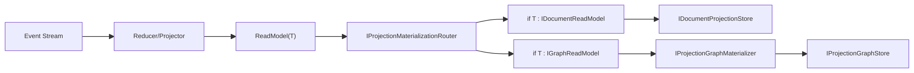

# Projection ReadModel 全量重构实施文档（v10，无兼容，极简抽象）

> 日期：2026-02-24  
> 范围：`Aevatar.CQRS.Projection.Stores.Abstractions`、`Aevatar.CQRS.Projection.Core.Abstractions`、`Aevatar.CQRS.Projection.Runtime.Abstractions`、`Aevatar.CQRS.Projection.Runtime`、`Aevatar.Workflow.Projection`

## 1. 结论先行

核心关系定义：`ReadModel -> ProjectionTarget` 是标准 `1:N`。

当前固定实现 `N=2`：

1. `DocumentTarget`（`IDocumentProjectionStore<,>`）
2. `GraphTarget`（`IProjectionGraphStore`）

本版最终架构（已落地）：

1. 不保留能力模型（Capabilities/Requirements/Validator）。
2. 不保留运行时薄封装层（Provider Registry / Provider Selector / Startup Validator）。
3. Provider 选择逻辑内聚到两个 Factory：
   - `ProjectionDocumentStoreFactory`
   - `ProjectionGraphStoreFactory`
4. Startup fail-fast 直接通过 Factory 触发真实 store 创建校验，不再多一层 validator。
5. Document metadata 继续保留，且由 `IProjectionDocumentMetadataProvider<TReadModel>`（ReadModel 泛型）提供。
6. `IDocumentReadModel` 收敛为 marker，删除无效 `DocumentScope` 字段。

## 2. 当前架构（v10）

### 2.1 运行主链路

### 2.2 Provider 选择与启动校验（极简）

选择规则（统一）：

1. 没有注册 provider -> 失败。
2. 有多个注册但未指定 providerName -> 失败。
3. 指定 providerName 但未命中 -> 失败。
4. 命中后创建失败 -> 失败。

## 3. 冗余删除清单（第二轮彻底去层）

### 3.1 Runtime.Abstractions 删除

1. `Abstractions/Documents/IProjectionDocumentRuntimeOptions.cs`
2. `Abstractions/Documents/IProjectionDocumentStartupValidator.cs`
3. `Abstractions/Documents/ProjectionDocumentSelectionOptions.cs`
4. `Abstractions/Graphs/IProjectionGraphRuntimeOptions.cs`
5. `Abstractions/Graphs/IProjectionGraphStartupValidator.cs`
6. `Abstractions/Graphs/IProjectionGraphStoreProviderRegistry.cs`
7. `Abstractions/Graphs/IProjectionGraphStoreProviderSelector.cs`
8. `Abstractions/Graphs/ProjectionGraphSelectionOptions.cs`
9. `Abstractions/ReadModels/IProjectionDocumentStoreProviderRegistry.cs`
10. `Abstractions/ReadModels/IProjectionDocumentStoreProviderSelector.cs`

### 3.2 Runtime 删除

1. `Runtime/ProjectionDocumentStoreProviderRegistry.cs`
2. `Runtime/ProjectionDocumentStoreProviderSelector.cs`
3. `Runtime/ProjectionDocumentStartupValidator.cs`
4. `Runtime/ProjectionGraphStoreProviderRegistry.cs`
5. `Runtime/ProjectionGraphStoreProviderSelector.cs`
6. `Runtime/ProjectionGraphStartupValidator.cs`

### 3.3 Stores.Abstractions 收敛

1. `IDocumentReadModel` 从带字段接口改为 marker。
2. 删除 `WorkflowExecutionReport.DocumentScope` 冗余实现。

## 4. 保留并强化的核心抽象

1. `IProjectionStoreRegistration<TStore>`：Provider 注册单一契约。
2. `IProjectionDocumentStoreFactory`：Document provider 选择 + 实例创建。
3. `IProjectionGraphStoreFactory`：Graph provider 选择 + 实例创建。
4. `ProjectionProviderSelectionException`：统一 fail-fast 错误模型。
5. `ProjectionDocumentRuntimeOptions` / `ProjectionGraphRuntimeOptions`：最小配置模型。

## 5. 与项目实际结构的落地映射

### 5.1 Runtime 层

- `src/Aevatar.CQRS.Projection.Runtime/Runtime/ProjectionStoreRegistrationSelector.cs`
  - 新增统一选择算法。
- `src/Aevatar.CQRS.Projection.Runtime/Runtime/ProjectionDocumentStoreFactory.cs`
  - 直接从 `IServiceProvider.GetServices<IProjectionStoreRegistration<...>>()` 拉注册并选择。
- `src/Aevatar.CQRS.Projection.Runtime/Runtime/ProjectionGraphStoreFactory.cs`
  - 同上。
- `src/Aevatar.CQRS.Projection.Runtime/DependencyInjection/ServiceCollectionExtensions.cs`
  - 仅注册 Factory / Materializer / Router / MetadataResolver。

### 5.2 Workflow 组装层

- `src/workflow/Aevatar.Workflow.Projection/DependencyInjection/ServiceCollectionExtensions.cs`
  - 直接注入并使用 `ProjectionDocumentRuntimeOptions` / `ProjectionGraphRuntimeOptions`。
  - Store 解析直接调用 factory + providerName。
- `src/workflow/Aevatar.Workflow.Projection/Orchestration/WorkflowReadModelStartupValidationHostedService.cs`
  - 启动校验改为直接调用 factory `Create(...)`。
- `src/workflow/extensions/Aevatar.Workflow.Extensions.Hosting/WorkflowProjectionProviderServiceCollectionExtensions.cs`
  - 只注册 concrete options，不再注册 interface 转发。

### 5.3 测试层

- `test/Aevatar.CQRS.Projection.Core.Tests/ProjectionReadModelRuntimeTests.cs`
  - 改为测试 DocumentFactory 选择行为。
- `test/Aevatar.CQRS.Projection.Core.Tests/ProjectionReadModelStoreSelectorTests.cs`
  - 改为测试 GraphFactory 选择行为。
- `test/Aevatar.Workflow.Host.Api.Tests/*`
  - 运行时 options 断言切换为 concrete 类型。

## 6. 开发者体验结果

开发者当前只需要关心三件事：

1. 定义 ReadModel（实现 `IDocumentReadModel` / `IGraphReadModel` 或同时实现）。
2. 注册对应 Provider（Document 与 Graph 各自独立注册）。
3. 配置 `ProjectionDocumentRuntimeOptions.ProviderName` 与 `ProjectionGraphRuntimeOptions.ProviderName`。

系统会在：

1. 运行时写入阶段自动执行 `1:N` 分发。
2. 启动阶段通过真实 store 创建做 fail-fast。

## 7. 验收标准（v10）

全部满足即视为“彻底重构完成”：

1. Runtime 不存在 Provider Registry/Selector/StartupValidator 三类薄层。
2. Runtime.Abstractions 不存在对应接口与 SelectionOptions 接口模型。
3. Store 选择只通过 factory + providerName 执行。
4. Document metadata 与 Graph relation 语义都保留并可运行。
5. `ReadModel -> Targets` 明确为 `1:N`，当前 `N=2`。
6. `dotnet build` 与相关测试通过。

## 8. 后续可选继续收敛（不影响当前完成态）

1. 若继续极简，可把 `IProjectionDocumentStoreFactory` / `IProjectionGraphStoreFactory` 也收敛为 concrete 注入。
2. 若继续减少类型数量，可评估 `GraphNodeDescriptor/GraphEdgeDescriptor` 与 `ProjectionGraphNode/ProjectionGraphEdge` 的边界合并。
