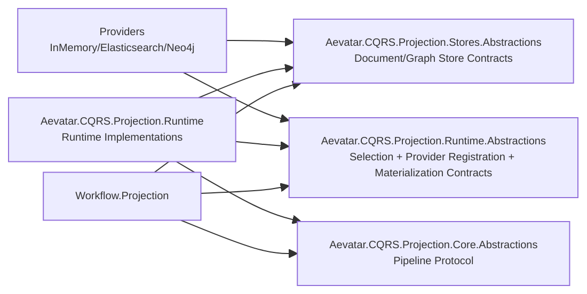

# Projection Abstractions 重构落地报告（v6，无兼容）

> 日期：2026-02-24

## 1. 本次重构已完成内容

1. 新增 `Aevatar.CQRS.Projection.Runtime.Abstractions`，承接 Runtime 策略/选择/Factory/Materialization 契约。
2. `Aevatar.CQRS.Projection.Stores.Abstractions` 彻底收敛为纯存储契约：
   - 仅保留 `IDocumentProjectionStore<,>`、`IProjectionGraphStore`、ReadModel/Graph 结构描述。
   - 删除 Selection/Core 运行时编排抽象（迁移至 Runtime.Abstractions）。
3. 删除 Graph 重复抽象：
   - 删除 `IGraphProjectionStore<TReadModel>`。
   - 新增 `IProjectionGraphMaterializer<TReadModel>`。
   - `ProjectionMaterializationRouter` 改为依赖 `IProjectionGraphMaterializer<TReadModel>`。
4. Runtime 实现落地：
   - `ProjectionGraphStoreAdapter<TReadModel>` 重构为 `ProjectionGraphMaterializer<TReadModel>`。
   - DI 改为注册 `IProjectionGraphMaterializer<>`。
5. Provider 元数据重复抽象清理：
   - 删除 `IProjectionStoreProviderMetadata`。
   - Provider 能力统一通过 `IProjectionStoreRegistration.Capabilities` 描述。
6. 命名语义统一：
   - `ProjectionDocumentStoreSelectionOptions` -> `ProjectionStoreSelectionOptions`
   - `ProjectionDocumentRequirements` -> `ProjectionStoreRequirements`

## 2. 当前边界（As-Built）



## 3. 关键契约（最终）

```csharp
public interface IProjectionGraphStore
{
    Task UpsertNodeAsync(ProjectionGraphNode node, CancellationToken ct = default);
    Task UpsertEdgeAsync(ProjectionGraphEdge edge, CancellationToken ct = default);
    Task DeleteEdgeAsync(string scope, string edgeId, CancellationToken ct = default);
    Task<IReadOnlyList<ProjectionGraphEdge>> GetNeighborsAsync(ProjectionGraphQuery query, CancellationToken ct = default);
    Task<ProjectionGraphSubgraph> GetSubgraphAsync(ProjectionGraphQuery query, CancellationToken ct = default);
}

public interface IProjectionGraphMaterializer<in TReadModel>
    where TReadModel : class
{
    Task UpsertGraphAsync(TReadModel readModel, CancellationToken ct = default);
}
```

## 4. 目录变化（核心）

1. 新增项目：`src/Aevatar.CQRS.Projection.Runtime.Abstractions/`
2. 迁移：
   - `Stores.Abstractions/Abstractions/Core/*` -> `Runtime.Abstractions/Abstractions/Core/*`
   - `Stores.Abstractions/Abstractions/Selection/*` -> `Runtime.Abstractions/Abstractions/Selection/*`
   - `Stores.Abstractions` 中 provider factory/selector/options/capabilities 相关抽象 -> `Runtime.Abstractions`
3. 删除：
   - `Stores.Abstractions/Abstractions/ReadModels/IGraphProjectionStore.cs`
   - `Runtime.Abstractions/Abstractions/Core/IProjectionStoreProviderMetadata.cs`

## 5. 验证状态

1. `dotnet build aevatar.slnx --nologo`：通过。

## 6. 后续可选收敛（非兼容）

1. 进一步收敛 `Core.Abstractions`：评估将 `IProjectionDispatcher/IProjectionCoordinator/IProjectionSubscriptionRegistry` 由对外契约下沉为实现细节。
2. 在 `architecture_guards.sh` 增补硬约束：
   - 禁止 `Stores.Abstractions` 回流 `Selection/*` 契约。
   - 禁止 `IGraphProjectionStore<` 回流。
3. 文档全仓术语收敛：`Runtime.Abstractions` 引用补齐（README/架构图/审计文档）。
