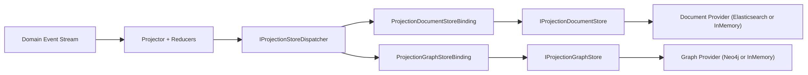
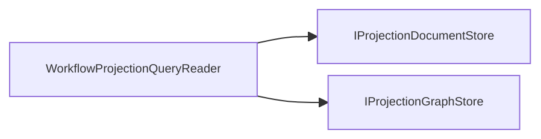

# Projection Store/ReadModel Full Refactor Plan (No Compatibility)

- Date: 2026-02-24
- Status: Completed
- Scope: `Aevatar.CQRS.Projection.*` + `Aevatar.Workflow.Projection` + `Aevatar.Workflow.Extensions.Hosting`

## 1. Refactor Targets

1. 单一主干：Projection 只保留一条权威运行链路（Dispatcher + Bindings）。
2. 一对多：一个 ReadModel 可同时投影到多个 Store。
3. 平行关系：Document Store 与 Graph Store 是同层平行实现。
4. 同类单实现：同类 Provider 在同一 Host 内只允许一个（Document 只能一个，Graph 只能一个）。
5. 删除冗余：移除 Router/Fanout/Registration/Marker/双模型等无效层。

## 2. Target Architecture

### 2.1 Write Path

### 2.2 Query Path

### 2.3 一对多语义

- ReadModel 是上层语义实体。
- Store 是下层持久化投影目标。
- `1 ReadModel : N Stores`（当前落地为 `N=2`: Document + Graph）。

## 3. Hard Refactor Scope

### 3.1 Removed

- `IProjectionStoreRegistration` / `DelegateProjectionStoreRegistration`
- `IProjectionMaterializationRouter` / `ProjectionMaterializationRouter`
- `IProjectionGraphMaterializer` / `ProjectionGraphMaterializer`
- `ProjectionDocumentStoreFanout` / `ProjectionGraphStoreFanout`
- `IDocumentReadModel` marker
- `GraphNodeDescriptor` / `GraphEdgeDescriptor`
- `ProjectionGraphSystemPropertyKeys`

### 3.2 Added

- `IProjectionStoreDispatcher<TReadModel,TKey>`
- `IProjectionStoreBinding<TReadModel,TKey>`
- `IProjectionQueryableStoreBinding<TReadModel,TKey>`
- `ProjectionStoreDispatcher<TReadModel,TKey>`
- `ProjectionDocumentStoreBinding<TReadModel,TKey>`
- `ProjectionGraphStoreBinding<TReadModel,TKey>`
- `ProjectionGraphManagedPropertyKeys`

### 3.3 Renamed For Parallel Semantics

- `IDocumentProjectionStore` -> `IProjectionDocumentStore`
- `InMemoryProjectionReadModelStore` -> `InMemoryProjectionDocumentStore`
- `ElasticsearchProjectionReadModelStore` -> `ElasticsearchProjectionDocumentStore`
- `ElasticsearchProjectionReadModelStoreOptions` -> `ElasticsearchProjectionDocumentStoreOptions`

## 4. Provider Policy

`AddWorkflowProjectionReadModelProviders(configuration)` 强制：

1. Document Provider exactly one:
   - `Projection:Document:Providers:Elasticsearch:Enabled=true`
   - or `Projection:Document:Providers:InMemory:Enabled=true`
2. Graph Provider exactly one:
   - `Projection:Graph:Providers:Neo4j:Enabled=true`
   - or `Projection:Graph:Providers:InMemory:Enabled=true`
3. 禁止旧配置：`Projection:Document:Provider` / `Projection:Graph:Provider`
4. 可用策略：`Projection:Policies:DenyInMemoryGraphFactStore`

## 5. Implementation Completion Checklist

- [x] Runtime 从 Router/Fanout 切换到 Dispatcher/Bindings
- [x] Workflow Projector/Updater 切换到 `IProjectionStoreDispatcher`
- [x] Graph 读模型统一为 `ProjectionGraphNode/ProjectionGraphEdge`
- [x] Provider DI 改为直接 Store 注册
- [x] Document/Graph Provider 命名体系并行化
- [x] 测试更新到 Dispatcher + Binding 模式
- [x] CI 架构门禁脚本同步新命名
- [x] 文档与 README 全量更新

## 6. Verification

执行命令：

1. `dotnet build aevatar.slnx --nologo`
2. `dotnet test test/Aevatar.CQRS.Projection.Core.Tests/Aevatar.CQRS.Projection.Core.Tests.csproj --nologo`
3. `dotnet test test/Aevatar.Workflow.Host.Api.Tests/Aevatar.Workflow.Host.Api.Tests.csproj --nologo`
4. `bash tools/ci/architecture_guards.sh`
5. `bash tools/ci/projection_route_mapping_guard.sh`
6. `bash tools/ci/test_stability_guards.sh`

结果：通过。
