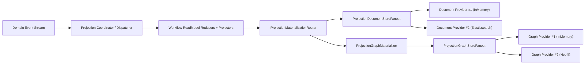
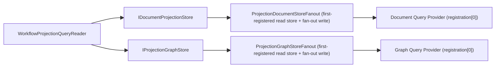

# Projection Store/ReadModel Full Refactor Plan (No Compatibility)

- Date: 2026-02-24
- Status: Completed
- Scope: `Aevatar.CQRS.Projection.*` + `Aevatar.Workflow.Projection` + `Aevatar.Workflow.Extensions.Hosting`

## 1. Refactor Goals

1. Remove single-provider selection (`providerName + factory + runtime options`) and switch to one-to-many fan-out.
2. Keep Document/Graph as independent provider categories.
3. Make read model routing capability-driven:
   - `IDocumentReadModel` -> document store fan-out
   - `IGraphReadModel` -> graph store fan-out
   - both interfaces -> both paths
4. Preserve index metadata and graph relation semantics:
   - document: `DocumentIndexMetadata`
   - graph: `IGraphReadModel.GraphNodes/GraphEdges`
5. Delete redundant abstraction layers and dead code without compatibility shims.

## 2. Target Architecture

### 2.1 Write Pipeline

### 2.2 Query Pipeline

## 3. Major Structural Changes

## 3.1 Removed (hard delete)

- `ProjectionDocumentRuntimeOptions`
- `ProjectionGraphRuntimeOptions`
- `ProjectionProviderNames`
- `IProjectionDocumentStoreFactory`
- `IProjectionGraphStoreFactory`
- `ProjectionProviderSelectionException`
- `ProjectionDocumentStoreFactory`
- `ProjectionGraphStoreFactory`
- `ProjectionStoreRegistrationSelector`

## 3.2 Added

- `ProjectionDocumentStoreFanout<TReadModel, TKey>`
- `ProjectionGraphStoreFanout`

## 3.3 Runtime DI Model

`AddProjectionReadModelRuntime()` now registers:

- `IDocumentProjectionStore<,>` -> `ProjectionDocumentStoreFanout<,>`
- `IProjectionGraphStore` -> `ProjectionGraphStoreFanout`
- `IProjectionGraphMaterializer<>`
- `IProjectionMaterializationRouter<,>`
- `IProjectionDocumentMetadataResolver`

## 3.4 Workflow Provider Registration Model

`AddWorkflowProjectionReadModelProviders(configuration)` now uses enable flags:

- `Projection:Document:Providers:InMemory:Enabled`
- `Projection:Document:Providers:Elasticsearch:Enabled`
- `Projection:Graph:Providers:InMemory:Enabled`
- `Projection:Graph:Providers:Neo4j:Enabled`

Rules:

1. Legacy single-select keys (`Projection:Document:Provider`, `Projection:Graph:Provider`) are rejected.
2. InMemory providers are fallback defaults when durable providers are not enabled.
3. `Projection:Policies:DenyInMemoryGraphFactStore=true` forbids in-memory graph fact store.
4. 多 provider 查询语义使用“注册顺序即查询顺序”：
   - query 读取总是走第一个注册 provider
   - 其余 provider 仅承担 fan-out 写入
   - Workflow Host 采用“耐久优先”注册顺序（Document: `Elasticsearch -> InMemory`，Graph: `Neo4j -> InMemory`）

## 3.6 Query Ordering & Graph Cleanup Hardening

- `IProjectionStoreRegistration<TStore>` 收敛为最小契约：`ProviderName + Create(IServiceProvider)`。
- `ProjectionDocumentStoreFanout` / `ProjectionGraphStoreFanout` 改为：
  - 第一个注册 provider 为 query store；
  - 其余 provider 自动作为 fan-out 副本；
  - 无需 `primary` 配置，降低宿主层配置负担。
- `IProjectionGraphStore` 增加 owner 生命周期接口：
  - `ListEdgesByOwnerAsync(scope, ownerId, take)`
  - `ListNodesByOwnerAsync(scope, ownerId, take)`
  - `DeleteNodeAsync(scope, nodeId)`
- `ProjectionGraphMaterializer<TReadModel>` 从锚点子图清理重构为 owner-based 精确清理（边+节点）：
  - 写边时注入系统属性：`projectionManaged=true`、`projectionOwnerId=<ReadModelType>:<ReadModelId>`
  - 写节点时同样注入系统属性：`projectionManaged=true`、`projectionOwnerId=<ReadModelType>:<ReadModelId>`
  - 清理时按 owner 列举已有边/节点并做差集删除，不再依赖 `Depth/Take` 子图扫描窗口。
  - 节点删除前执行邻接检查，仅删除无任何关系边的孤立节点，避免误删跨 owner 共享节点。
  - graph owner 标识收敛为 `IGraphReadModel.Id`；`Id` 为空直接 fail-fast，禁止 fallback 到节点/边推断。

## 3.7 Elasticsearch Metadata Behavior

`ElasticsearchProjectionReadModelStore` now consumes full `DocumentIndexMetadata`:

- `IndexName` as logical scope input
- `Mappings` as structured mappings object (`IReadOnlyDictionary<string, object?>`)
- `Settings` as structured settings object (`IReadOnlyDictionary<string, object?>`)
- `Aliases` as structured aliases object (`IReadOnlyDictionary<string, object?>`)

Index bootstrap now uses structured metadata payload instead of stringified JSON fragments.

## 3.8 Neo4j Subgraph Query Optimization

- `Neo4jProjectionGraphStore.GetSubgraphAsync` 从“逐层逐节点 `GetNeighborsAsync` 循环”重构为单次 Cypher 拉取边（按 `direction/depth/edgeTypes/take`），随后一次节点补全查询。
- 移除子图遍历的 N+1 风险，降低高出度场景下查询放大。

## 4. Project-Level Responsibility Split (Post-Refactor)

- `Aevatar.CQRS.Projection.Stores.Abstractions`
  - pure read model/store contracts and metadata contracts
- `Aevatar.CQRS.Projection.Runtime.Abstractions`
  - store registration + materialization contracts only
- `Aevatar.CQRS.Projection.Runtime`
  - fan-out composition + graph materialization + metadata resolver
- `Aevatar.CQRS.Projection.Providers.*`
  - concrete provider implementations only
- `Aevatar.Workflow.Projection`
  - workflow reducers/projectors/read model/query services
- `Aevatar.Workflow.Extensions.Hosting`
  - host-layer provider enablement and policy binding

## 5. Implementation Status by Module

- Runtime: completed
- Runtime.Abstractions: completed
- Provider extensions: completed
- Workflow projection composition: completed
- Workflow hosting provider extension: completed
- Tests: completed and updated to fan-out semantics
- Readme/docs sync: completed

## 6. Verification

Commands executed:

1. `dotnet build aevatar.slnx --nologo`
2. `dotnet test aevatar.slnx --nologo`
3. `bash tools/ci/architecture_guards.sh`
4. `bash tools/ci/projection_route_mapping_guard.sh`
5. `bash tools/ci/solution_split_guards.sh`
6. `bash tools/ci/solution_split_test_guards.sh`
7. `bash tools/ci/test_stability_guards.sh`

Result: all passed.
