# ReadModel 图关系能力重构文档（实施版）

## 1. 文档信息
- 状态：Implemented（当前分支已落地）
- 版本：v2.0
- 日期：2026-02-24
- 分支：`feat/readmodel-graph-relations`
- 适用目录：`src/`、`test/`、`docs/architecture/`

## 2. 目标与边界

### 2.1 目标
1. 在现有单一 Projection 主链路中引入“图关系事实”能力，不新增平行系统。
2. 让 `ReadModel` 的 `Graph` 绑定不仅代表“存储类型”，还代表“可用关系能力”。
3. 在 Workflow 读侧提供关系查询能力（邻接、子图），并保持 `Command -> Event -> Projection -> Query` 主干不变。

### 2.2 非目标
1. 不引入第二套 Projection Pipeline。
2. 不在中间层新增 `actorId -> context` 之类进程内事实态缓存。
3. 不引入跨业务域的通用图 DSL。

## 3. 重构前现状分析（As-Is）

### 3.1 ReadModel 索引能力
1. 运行时已存在统一选择链：`Bindings -> Requirements -> Capabilities -> Selector -> StoreFactory`。
2. `ProjectionReadModelIndexKind` 已支持 `Document` / `Graph`。
3. Provider 已支持统一注册与能力协商：InMemory / Elasticsearch / Neo4j。

### 3.2 关系能力缺口
1. 抽象层缺少关系一等接口：只有 `IProjectionReadModelStore<TReadModel,TKey>`，没有节点/边读写与遍历契约。
2. `Graph` 绑定未约束“关系能力”：Provider 选择只关注索引，不关注关系存储/遍历。
3. Workflow 读侧关系数据仅以 `Topology` 列表存在于文档读模型，未形成图事实源。
4. API 没有关系端点，仅有 actor snapshot/timeline。

## 4. 设计原则（与仓库顶级规则对齐）
1. 单主干：关系能力挂接既有 Runtime 选择器与 Projector 协调器。
2. 分层清晰：
- `Abstractions` 定义关系契约。
- `Runtime` 做能力协商与创建。
- `Providers` 做关系存储实现。
- `Workflow` 做关系语义映射与查询暴露。
3. 事实源唯一：关系事实进入 `IProjectionRelationStore`；`WorkflowExecutionReport.Topology` 保留为派生视图。
4. 可验证：构建、测试、架构门禁、测试稳定性门禁全部可执行。

## 5. 目标架构（To-Be）

```mermaid
%%{init: {"maxTextSize": 100000, "flowchart": {"useMaxWidth": false, "nodeSpacing": 10, "rankSpacing": 50}, "themeVariables": {"fontSize": "10px"}}}%%
flowchart LR
    A["Projection Bindings"] --> B["ProjectionReadModelBindingResolver"]
    B --> C["ProjectionReadModelRequirements"]
    C --> D["ReadModel Provider Selector"]
    C --> E["Relation Provider Selector"]
    D --> F["IProjectionReadModelStore"]
    E --> G["IProjectionRelationStore"]
    F --> H["WorkflowExecutionReadModelProjector"]
    F --> I["WorkflowExecutionRelationProjector"]
    G --> I
    I --> J["Graph Facts (Node/Edge)"]
    H --> K["WorkflowExecutionReport"]
    K --> L["WorkflowProjectionQueryReader"]
    J --> L
```

## 6. 抽象层重构内容

### 6.1 新增关系契约
新增文件：
1. `src/Aevatar.CQRS.Projection.Abstractions/Abstractions/IProjectionRelationStore.cs`
2. `src/Aevatar.CQRS.Projection.Abstractions/Abstractions/ProjectionRelationNode.cs`
3. `src/Aevatar.CQRS.Projection.Abstractions/Abstractions/ProjectionRelationEdge.cs`
4. `src/Aevatar.CQRS.Projection.Abstractions/Abstractions/ProjectionRelationQuery.cs`
5. `src/Aevatar.CQRS.Projection.Abstractions/Abstractions/ProjectionRelationSubgraph.cs`
6. `src/Aevatar.CQRS.Projection.Abstractions/Abstractions/ProjectionRelationDirection.cs`

### 6.2 新增关系 Provider 选择抽象
新增文件：
1. `IProjectionRelationStoreRegistration`
2. `DelegateProjectionRelationStoreRegistration`
3. `IProjectionRelationStoreProviderRegistry`
4. `IProjectionRelationStoreProviderSelector`
5. `IProjectionRelationStoreFactory`

### 6.3 能力模型扩展
扩展文件：
1. `ProjectionReadModelRequirements`
- `RequiresRelations`
- `RequiresRelationTraversal`
2. `ProjectionReadModelProviderCapabilities`
- `SupportsRelations`
- `SupportsRelationTraversal`
3. `ProjectionReadModelCapabilityValidator`
- 新增关系能力校验规则。

## 7. Runtime 重构内容

### 7.1 新增关系 Runtime 组件
新增文件：
1. `ProjectionRelationStoreProviderRegistry`
2. `ProjectionRelationStoreProviderSelector`
3. `ProjectionRelationStoreFactory`

### 7.2 运行时注入扩展
文件：`src/Aevatar.CQRS.Projection.Runtime/DependencyInjection/ServiceCollectionExtensions.cs`
1. 注册关系 Provider Registry/Selector/Factory。

### 7.3 绑定语义增强
文件：`ProjectionReadModelBindingResolver.cs`
1. 当 binding 为 `Graph` 时，要求：
- `requiresRelations = true`
- `requiresRelationTraversal = true`

## 8. Provider 层重构内容

### 8.1 InMemory
新增：
1. `InMemoryProjectionRelationStore`

扩展：
1. `AddInMemoryRelationStoreRegistration(...)`
2. InMemory ReadModel capability 增加 relation 支持声明。

能力：
1. 节点/边 upsert
2. 邻居查询
3. 有界深度子图查询（BFS 风格）

### 8.2 Elasticsearch
新增：
1. `ElasticsearchProjectionRelationStore`（显式 no-op）

扩展：
1. `AddElasticsearchRelationStoreRegistration(...)`

能力声明：
1. `supportsRelations=false`
2. `supportsRelationTraversal=false`

### 8.3 Neo4j
新增：
1. `Neo4jProjectionRelationStore`
2. `Neo4jProjectionRelationStoreOptions`

扩展：
1. `AddNeo4jRelationStoreRegistration(...)`
2. Neo4j ReadModel capability 增加 relation 支持声明。

能力：
1. 节点/边 upsert/delete
2. 邻居查询（入/出/双向）
3. 有界深度子图查询
4. 节点唯一约束自动初始化（可配置）

## 9. Workflow 层重构内容

### 9.1 关系投影器
新增文件：
1. `src/workflow/Aevatar.Workflow.Projection/Projectors/WorkflowExecutionRelationProjector.cs`

策略：
1. 复用同一 `IProjectionProjector<WorkflowExecutionProjectionContext, IReadOnlyList<WorkflowExecutionTopologyEdge>>` 主链。
2. `InitializeAsync` 创建根 actor 与 run 节点，并写 `OWNS` 边。
3. `CompleteAsync` 按 runtime topology 写 `CHILD_OF` 边，并按 step 写 `CONTAINS_STEP` 边。
4. 关系 scope 固定为 `WorkflowExecutionRelationConstants.Scope`。

### 9.2 关系查询链路
扩展：
1. `IWorkflowProjectionQueryReader`
2. `WorkflowProjectionQueryReader`
3. `IWorkflowExecutionProjectionPort`
4. `WorkflowExecutionProjectionService`
5. `IWorkflowExecutionQueryApplicationService`
6. `WorkflowExecutionQueryApplicationService`
7. `WorkflowExecutionReadModelMapper`
8. `WorkflowExecutionQueryModels`

新增：
1. `WorkflowExecutionRelationConstants`

### 9.3 Workflow DI 选择器接入
文件：`src/workflow/Aevatar.Workflow.Projection/DependencyInjection/ServiceCollectionExtensions.cs`
1. 在既有 ReadModel selector 基础上增加 Relation selector。
2. `IProjectionRelationStore` 使用同一 selection plan（provider + requirements）。

### 9.4 启动期 fail-fast 校验增强
文件：`WorkflowReadModelStartupValidationHostedService.cs`
1. 启动时同时校验：
- ReadModel Provider 选择与能力
- Relation Provider 选择与能力

## 10. Host 与 API 改造

### 10.1 Provider 组合层
文件：`src/workflow/extensions/Aevatar.Workflow.Extensions.Hosting/WorkflowProjectionProviderServiceCollectionExtensions.cs`
1. 为三类 provider 全部注册 relation store：
- InMemory
- Elasticsearch
- Neo4j

### 10.2 新增关系查询端点
文件：`src/workflow/Aevatar.Workflow.Infrastructure/CapabilityApi/ChatQueryEndpoints.cs`
1. `GET /api/actors/{actorId}/relations?take=200`
2. `GET /api/actors/{actorId}/relation-subgraph?depth=2&take=200`

## 11. 关系模型约定（Workflow）
1. NodeType
- `Actor`
- `WorkflowRun`
- `WorkflowStep`
2. RelationType
- `OWNS`
- `CHILD_OF`
- `CONTAINS_STEP`
3. Scope
- `workflow-execution-relations`

## 12. Provider 能力矩阵

| Provider | IndexKinds | SupportsRelations | SupportsRelationTraversal | 说明 |
|---|---|---:|---:|---|
| InMemory | None | Yes | Yes | 开发/测试优先，内存实现 |
| Elasticsearch | Document | No | No | 文档索引，不作为关系事实源 |
| Neo4j | Graph | Yes | Yes | 生产图关系能力 |

## 13. 迁移与上线建议（最佳实践）
1. Phase 1：合并结构改造（本次）
- 接口、Runtime、Provider、Workflow API 全链路到位。
2. Phase 2：关系数据回填（可选）
- 从历史 `WorkflowExecutionReport.Topology` 扫描并幂等写回关系边。
3. Phase 3：灰度切流
- 对关键租户/环境启用 `Graph + Neo4j` 绑定。
4. Phase 4：清理
- 删除历史临时拼装逻辑，固定关系查询走 relation store。

## 14. 验证与门禁

### 14.1 已执行验证命令
1. `dotnet build aevatar.slnx --nologo`
2. `dotnet test test/Aevatar.Workflow.Application.Tests/Aevatar.Workflow.Application.Tests.csproj --nologo`
3. `dotnet test test/Aevatar.Workflow.Host.Api.Tests/Aevatar.Workflow.Host.Api.Tests.csproj --nologo`
4. `dotnet test aevatar.slnx --nologo`
5. `bash tools/ci/architecture_guards.sh`
6. `bash tools/ci/test_stability_guards.sh`

### 14.2 验证结果
1. 全部通过，无编译错误。
2. 受影响测试与全量测试通过。
3. 架构门禁与测试稳定性门禁通过。

## 15. 风险与后续优化

### 15.1 当前风险
1. Elasticsearch relation store 为 no-op，若配置为文档 provider 且未声明 Graph 绑定，关系查询会返回空结果。
2. Workflow relation projector 目前以 `CompleteAsync` 为主写入点，超长运行中间态关系不实时可见。

### 15.2 建议优化
1. 增加 relation query 指标（QPS、P95、结果规模）与告警阈值。
2. 增加 Neo4j relation E2E（容器化）专项测试。
3. 如需实时关系可视化，可在 `ProjectAsync` 逐步增量写入关键边类型。

## 16. 关键变更清单（按层）

### 16.1 Abstractions
1. 新增关系模型与 relation provider 选择抽象。
2. 扩展 requirements/capabilities/validator。

### 16.2 Runtime
1. 新增 relation provider registry/selector/factory。
2. Graph binding 对应关系能力要求。

### 16.3 Providers
1. InMemory/Neo4j 完整 relation store。
2. Elasticsearch 显式不支持关系。

### 16.4 Workflow
1. 新增 `WorkflowExecutionRelationProjector`。
2. Query/Application/Port/API 全链路支持 relations/subgraph。
3. 启动期 relation provider fail-fast。

### 16.5 Tests
1. 全部 fake 接口实现同步。
2. 新增关系查询应用层测试与 API 端点测试。
3. Host provider 注册覆盖扩展到 relation registration。
