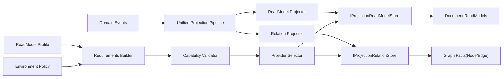

# ReadModel 双速能力架构重构文档（Simple + Rich）

## 1. 文档信息
- 状态：Proposed（Breaking, 不保留兼容层）
- 版本：v1.0
- 日期：2026-02-24
- 适用范围：`src/Aevatar.CQRS.Projection.*`、`src/workflow/*`、`test/*`、`tools/ci/*`
- 目标：实现“默认简单开发路径 + 可治理的高级能力路径”，并保持单一 Projection 主链路

## 2. 背景与问题

### 2.1 当前问题
1. ReadModel 与 Relation 能力已具备基础框架，但“简单场景”和“复杂场景”缺少统一分层策略。
2. 一些领域语义（如 `StartedAt`）曾被误放到基础抽象，导致抽象层与 Workflow 语义耦合。
3. 关系查询能力可用但表达力有限，难以覆盖复杂图查询（过滤、路径约束、分页游标、多根聚合）。
4. Provider 组合虽支持 split（ReadModel/Relation 分离），但缺少环境分级模板与强门禁，易误配。
5. 存在空类/薄封装类，基础抽象复用不足，增加维护成本。

### 2.2 根因
1. “能力扩展点”与“默认路径”未显式分层。
2. 能力声明、模型定义、Provider 选择存在，但缺少统一的“模型 Profile + 环境策略”收敛机制。
3. 治理规则没有完整固化到启动校验和 CI 门禁（尤其生产环境组合约束）。

## 3. 重构目标

### 3.1 主目标
1. 保持最小开发路径：普通业务只需实现 ReadModel + Reducer，不需要理解图能力细节。
2. 提供丰富能力路径：复杂需求可启用 Graph/Relation/Advanced Query，不污染默认路径。
3. 严格分层：`Domain / Application / Infrastructure / Host`，`Workflow` 不侵入基础抽象语义。
4. 单一主链路：所有能力基于统一 Projection Pipeline 插件化扩展，不引入第二系统。
5. 可治理：启动期 fail-fast + CI guard，确保环境配置、能力声明、实现行为一致。
6. 职责边界清晰：`Workflow` 不负责 `Graph/Document` 与 provider 选择，选择权在业务方组合层。

### 3.2 非目标
1. 不引入额外中间层事实缓存（禁止 `actorId -> context` 进程内事实态映射）。
2. 不在本轮引入跨产品通用图分析 DSL 引擎。
3. 不保留历史兼容壳层。
4. 不在 `Workflow` 业务层编排 provider/index kind 选择逻辑。

## 4. 设计原则
1. 默认极简：内核接口最小化，降低开发门槛。
2. 能力叠加：高级能力通过可选接口/能力声明按需启用。
3. 约束优先：任何扩展必须走能力校验和策略合并，禁止绕过选择器。
4. 语义分层：基础层只保留通用语义（`CreatedAt/UpdatedAt`），领域语义下沉到领域模型。
5. 一致性可选分级：默认最终一致；强一致需求通过可选模式（Outbox/Checkpoint）开启。
6. 组合层决策：ReadModel 投影到哪个 provider 由业务方/Host 组合层决定，Workflow 只消费抽象端口。

## 5. 目标架构



### 5.1 关键点
1. 只保留一个权威主链：`Event -> Projector -> Store`。
2. 复杂能力通过 Profile 与 Policy 驱动 Provider 选择，不在 `Workflow` 业务代码里硬编码 Provider。
3. Workflow/AI 等领域仅定义“自己的模型和关系语义”，不修改基础抽象含义。
4. Provider 选择权在业务方组合层，Runtime 负责能力校验与 fail-fast。

## 6. 抽象层重构（Abstractions）

### 6.1 统一基础实体基类（消除空类）
新增统一基类（示意）：

```csharp
public abstract class ProjectionReadModelBase<TKey>
    where TKey : notnull
{
    public TKey Id { get; init; } = default!;
    public long StateVersion { get; set; }
    public string LastEventId { get; set; } = string.Empty;
    public DateTimeOffset CreatedAt { get; set; } = DateTimeOffset.UtcNow;
    public DateTimeOffset UpdatedAt { get; set; } = DateTimeOffset.UtcNow;
}
```

规则：
1. 基类只包含跨域通用语义，不包含 Workflow 特有字段（如 `StartedAt`）。
2. 领域字段（例如 `StartedAt/EndedAt/Duration`）保留在领域 ReadModel 内。

### 6.2 双层能力接口
保留最小接口：
1. `IProjectionReadModelStore<TReadModel, TKey>`

新增可选高级接口（示意）：
1. `IProjectionReadModelQueryStore<TReadModel, TKey>`：条件过滤、分页游标、多字段排序。
2. `IProjectionRelationStore`：节点/边写入与基础邻接查询。
3. `IProjectionRelationTraversalStore`：子图/路径遍历（可独立能力开关）。
4. `IProjectionSchemaValidationCapability`：Schema 校验能力声明与执行入口。
5. `IProjectionAliasCapability`：Alias 能力声明与执行入口。

说明：
1. 高级接口均为可选实现，不影响默认路径。
2. 选择器根据 `Capabilities` 判定可用性，禁止运行时盲调。

### 6.3 ReadModel Profile（模型声明式扩展）
新增 `IReadModelProfile<TReadModel, TKey>`（示意职责，由业务方在组合层声明）：
1. 声明模型索引类型要求（`Document/Graph`）。
2. 声明关系能力要求（`RequiresRelations/RequiresTraversal`）。
3. 声明默认排序（建议 `CreatedAt desc, UpdatedAt desc, Id desc`）。
4. 声明关系节点/边 ID 规则。

Profile 合并优先级：
1. `GlobalDefault < ModelProfile < EnvironmentOverride`
2. 只允许“收紧要求”，不允许“放松底线”。

## 7. 关系模型重构（Relations）

### 7.1 关系属性类型升级
当前 `Dictionary<string,string>` 升级为可序列化值模型（示意）：
1. `Dictionary<string, ProjectionValue>`
2. `ProjectionValue` 支持 `string/number/bool/datetime/json`

目标：
1. 保持可移植序列化。
2. 支持复杂过滤和排序。

### 7.2 关系 ID 规则标准化
统一规则：
1. 节点 ID 必须包含业务隔离维度（如 `tenant`、`rootActorId`、`commandId`）。
2. Step 节点强制包含 run 维度，禁止 `step:{rootActorId}:{stepId}` 这种会跨 run 冲突的格式。

建议格式：
1. `run:{rootActorId}:{commandId}`
2. `step:{rootActorId}:{commandId}:{stepId}`

### 7.3 关系查询分层
1. 简单查询：邻居查询（默认 API）。
2. 中级查询：有界深度子图。
3. 高级查询：关系类型过滤 + 属性过滤 + 游标分页 + 路径约束（高级接口/高级端点）。

## 8. Provider 分级策略（Simple -> Rich）

说明：
1. 本节模板由业务方在 Host/组合层应用。
2. `Workflow` 层不读取、不判断 provider 类型；只通过抽象端口读写投影。

### 8.1 环境模板
1. `LocalDev`
- ReadModel: `InMemory` 或 `Elasticsearch`
- Relation: `InMemory`（仅开发）
- 用途：快速反馈

2. `Standard(Production)`
- ReadModel: `Elasticsearch`
- Relation: `Neo4j`
- 用途：生产默认推荐，文档检索 + 图关系可用

3. `DocOnly(Production)`
- ReadModel: `Elasticsearch`
- Relation: Disabled
- 用途：不需要图关系的场景

4. `GraphAdvanced(Production)`
- ReadModel: `Neo4j` 或双写策略
- Relation: `Neo4j`
- 用途：高图密度业务

### 8.2 强约束
1. 生产环境禁止 `InMemoryRelationStore` 作为事实源（启动即失败）。
2. 生产环境强制 `FailOnUnsupportedCapabilities=true`。
3. 若启用关系 API，必须 `RequiresRelations=true` 且 relation provider 支持 traversal。

## 9. Runtime 选择与校验重构

### 9.1 选择流程
1. 业务方在 Host 组合层提供 `GlobalReadModelOptions + ReadModelProfile`。
2. Runtime 合并 `ReadModelProfile`。
3. Runtime 应用 `EnvironmentPolicy`。
4. Runtime 生成 `ProjectionReadModelRequirements`。
5. Runtime 执行 `CapabilityValidator`。
6. Runtime 选择 readmodel/relation provider。
7. 启动校验（Host startup validator）在应用启动前 fail-fast。

### 9.2 错误模型
1. Provider 未指定且多注册：明确抛错。
2. 能力不匹配：结构化异常包含 `requirements/capabilities/violations`。
3. 生产策略违规（如 in-memory relation）：专用策略异常。

## 10. Workflow 分层收敛

### 10.1 基础抽象去 Workflow 语义
1. 基类只保留 `CreatedAt/UpdatedAt`。
2. `StartedAt/EndedAt` 保留在 `WorkflowExecutionReport`（领域模型）。

### 10.2 Workflow 与 Provider 边界
1. Workflow 只依赖：
- `IProjectionReadModelStore`
- `IProjectionRelationStore`
2. Workflow 不包含：
- `Graph/Document` 选择分支
- `Elasticsearch/Neo4j/InMemory` provider 分支
- capability 协商逻辑
3. 若 provider 能力不匹配，由 Runtime/启动校验报错，不在 Workflow 内做兜底分支。

### 10.3 Query 接口分层
1. 基础端点保留：
- `/actors/{actorId}`
- `/actors/{actorId}/timeline`
- `/actors/{actorId}/relations`
- `/actors/{actorId}/relation-subgraph`

2. 高级端点新增（可选）：
- 支持 `direction`、`relationTypes`、`property filters`、`cursor`。
- 这些是业务查询语义，不代表 Workflow 在做 provider/index kind 决策。

### 10.4 投影职责
1. ReadModelProjector：只负责文档视图。
2. RelationProjector：只负责图事实写入。
3. Coordinator：保持统一调度，不在 Workflow 层引入二次编排系统。

## 11. 一致性与幂等策略

### 11.1 默认模式（最终一致）
1. ReadModel 和 Relation 独立写入。
2. OCC + 去重保证单存储内正确性。

### 11.2 强一致增强模式（可选）
1. 引入 Projection Outbox（事件级写入意图记录）。
2. 以 `eventId + projector` 作为幂等键。
3. 使用 checkpoint/compensation 补偿部分成功。

### 11.3 幂等键规则
1. `dedupKey = {projectionId}:{eventId}:{projectorName}`
2. relation edge upsert 使用确定性 edgeId，禁止随机 ID。

## 12. 索引与排序策略

### 12.1 默认排序
1. 默认 `CreatedAt desc`
2. 次排序 `UpdatedAt desc`
3. 稳定 tie-break `Id desc`（或 `_id desc`）

### 12.2 约束
1. 任意 provider 的 `ListAsync` 必须提供稳定顺序保证。
2. 若 provider 无法保证稳定排序，必须显式抛错，不允许“静默无序”。

## 13. 配置模型重构

### 13.1 配置分区
1. `Projection:ReadModel:*`：业务方在 Host 组合层声明全局默认与 Provider 配置。
2. `Projection:Policies:*`：环境策略（例如 production guard）。
3. `Projection:Profiles:*`：按模型覆盖规则。

### 13.2 配置示例（生产标准模板）

```yaml
Projection:
  ReadModel:
    Provider: Elasticsearch
    RelationProvider: Neo4j
    FailOnUnsupportedCapabilities: true
    Bindings:
      Aevatar.Workflow.Projection.ReadModels.WorkflowExecutionReport: Graph
    Providers:
      Elasticsearch:
        Endpoints: ["http://elasticsearch:9200"]
        IndexPrefix: "aevatar"
        MissingIndexBehavior: Throw
      Neo4j:
        Uri: "bolt://neo4j:7687"
        AutoCreateConstraints: true
  Policies:
    Environment: Production
    DenyInMemoryRelationFactStore: true
```

## 14. 代码级重构清单（按层）

### 14.1 Abstractions
1. 新增 `ProjectionReadModelBase<TKey>`（或等价通用基类）。
2. 新增 `IReadModelProfile<TReadModel, TKey>` 与 Profile 描述模型。
3. 新增高级可选接口：Query/Traversal/Schema/Alias 能力接口。
4. 升级关系属性类型定义，支持 typed value。

### 14.2 Runtime
1. 新增 Profile Registry + Requirements Builder。
2. 新增 Policy Validator（环境策略校验）。
3. 扩展 selector 日志，输出最终合并后的 requirements。

### 14.3 Providers
1. InMemory Provider 显式标注 `DevOnly` 元数据。
2. Elasticsearch Provider 保持 Document 优先，明确高级查询能力边界。
3. Neo4j Provider 承担 Relation + Traversal 主实现，并补齐 e2e 验证。

### 14.4 Workflow
1. 替换 Step 节点 ID 规则，纳入 `commandId` 维度。
2. Query 只透传业务查询参数，不承载 provider/index kind 选择逻辑。
3. 维持默认简单 API，不破坏使用门槛。

## 15. 测试与门禁

### 15.1 新增测试
1. Profile 合并优先级测试（Global/Profile/Env）。
2. 生产策略测试（禁止 InMemory Relation）。
3. Relation Provider e2e（Neo4j）：
- 节点/边 upsert
- 邻居查询
- 深度子图
- 过滤/分页（若启用高级查询）
4. Step 节点 ID 唯一性测试（跨 run 不冲突）。

### 15.2 CI 门禁
1. `tools/ci/architecture_guards.sh`：
- 禁止基础抽象出现 Workflow 语义字段名。
- 禁止中间层 `actor/run/session` 事实态字典字段。
2. `tools/ci/projection_provider_e2e_smoke.sh`：
- 增加 relation provider e2e 目标与 executed==total 校验。
3. 生产配置扫描：
- `Production + InMemoryRelationProvider` 直接 fail。

## 16. 分阶段实施计划

### Phase 1（基础抽象收敛）
1. 引入通用基类与 Profile 抽象。
2. 清理空类与无价值薄封装。
3. 完成基础单测。

### Phase 2（能力分层落地）
1. 引入高级可选接口与 capability 路径。
2. Runtime 增加 Profile+Policy 合并与校验。
3. 保持默认调用路径不变。

### Phase 3（Provider 与 Workflow 深化）
1. Workflow Step ID 规则修复。
2. 高级关系查询链路贯通（端口到 API）。
3. Relation e2e 与生产策略门禁落地。

### Phase 4（生产切换）
1. 默认生产模板切至 `Elasticsearch + Neo4j`。
2. 灰度启用高级查询能力。
3. 观察指标与告警收敛。

## 17. 可观测性与运维
1. 指标：
- provider selection failure
- capability violation
- relation query p95/p99
- subgraph result size
- OCC conflict retry count
2. 日志：
- 结构化输出 `requirements/capabilities/provider`
3. 告警：
- 生产策略违规配置
- relation traversal error rate 超阈值

## 18. 风险与应对
1. 风险：高级能力接口扩展过快导致复杂度回升。
- 应对：接口增量必须有真实场景和 e2e 覆盖。
2. 风险：强一致模式引入写放大。
- 应对：默认保持最终一致，按域开启强一致。
3. 风险：Provider 能力声明与实现漂移。
- 应对：能力声明一致性测试 + 启动期校验 + e2e。

## 19. 验收标准（DoD）
1. 默认开发路径只需 ReadModel + Reducer 即可运行。
2. 复杂能力通过 Profile/Policy 可启用且受校验治理。
3. 基础抽象不含 Workflow 语义字段（仅通用元数据）。
4. 生产标准模板不允许 InMemory Relation 事实源。
5. Workflow 代码中不存在 provider/index kind 选择分支。
6. Relation e2e + 架构门禁 + 全量 build/test 通过。

## 20. 结论
本方案通过“默认极简 + 能力插件 + 治理前置”实现双速架构：
1. 让大多数开发者保持低认知成本。
2. 让复杂需求获得可扩展、可验证、可运维的高级能力。
3. 避免抽象层次倒挂和语义污染，维持长期演进质量。
