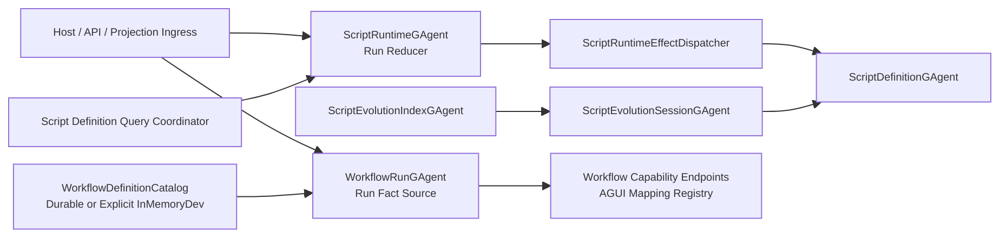

# Runtime Phase-3 Final Architecture Debt Elimination 重构蓝图（v1, Breaking Change）

## 1. 文档元信息

1. 状态：`Proposed`
2. 版本：`v1`
3. 日期：`2026-03-07`
4. 决策级别：`Architecture Breaking Change`
5. 适用范围：
   - `src/Aevatar.Scripting.*`
   - `src/workflow/Aevatar.Workflow.Application*`
   - `src/workflow/Aevatar.Workflow.Infrastructure`
   - `src/workflow/Aevatar.Workflow.Presentation.AGUIAdapter`
   - `demos/Aevatar.Demos.Workflow.Web`
   - `test/Aevatar.Scripting.*`
   - `test/Aevatar.Workflow.*`
   - `test/Aevatar.Integration.Tests` 中相关场景
6. 非范围：
   - `Aevatar.CQRS.*` 主投影协议本身
   - Orleans durable callback reminder-only 主策略
   - 已完成的 `WorkflowRunGAgent` actorized-run 主链重构
7. 本版结论：
   - `Workflow` phase-1 / phase-2 已经解决了“run 事实源错位”的主问题，但系统仍残留若干会继续制造架构回流的债点。
   - 剩余问题不再是单一模块 bug，而是“命名与语义不清的内存事实源”“旧扩展模型兼容壳”“新的单体 actor 文件”和“中间层 demo 违背生产架构”的组合。
   - 彻底收口的唯一正确方向是：
     1. 生产语义中的唯一事实源必须是 Actor 持久态或显式分布式状态。
     2. `InMemory` 能力必须在类型名和 DI 装配上显式暴露为开发/测试实现。
     3. `Workflow` 子系统不能继续保留旧 `IEventModule` 心智入口。
     4. Scripting 侧要从“功能已对，但 actor 仍耦合”继续演进到“reducer / effect / recovery / query”边界清晰。

## 2. 背景与现状

### 2.1 已经完成的工作

截至 `2026-03-07`，以下高风险问题已经完成收口：

1. `WorkflowGAgent` 已收窄为 definition actor。
2. `WorkflowRunGAgent` 已成为 run 级持久事实源。
3. Workflow 中大部分旧 stateful runtime modules 已从主链移除。
4. durable callback 已统一为 reminder-only。
5. script definition-query pending 已变成可恢复事实，而不是 activation-local 丢失态。

对应历史文档：

1. `docs/architecture/workflow-runtime-actorized-run-persistent-state-refactor-blueprint-2026-03-07.md`
2. `docs/architecture/workflow-runtime-phase2-full-decoupling-refactor-blueprint-2026-03-07.md`
3. `docs/architecture/actor-runtime-stream-callback-request-reply-capability-refactor-blueprint-2026-03-05.md`

### 2.2 当前剩余问题的共同根因

现在的剩余问题有一个共同模式：

1. 语义已经偏向正确方向，但实现边界还没完全收紧。
2. dev/test 便利抽象和 production 语义抽象仍混在一起。
3. 旧模型虽然不再是主链，但仍通过遗留类型、demo、兼容适配留在代码库中，容易把错误心智重新带回实现。
4. 部分 demo 与边缘适配仍保留过期心智，容易把错误模型重新带回主链。

## 3. 剩余结构性问题

### P1. `ScriptRuntimeGAgent` 仍是下一个核心单体

当前 `src/Aevatar.Scripting.Core/ScriptRuntimeGAgent.cs` 同时承担：

1. run ingress
2. definition snapshot query 发起
3. pending query recovery
4. timeout callback fired 处理
5. run committed / failed 持久化
6. `TransitionState` reducer
7. activation-local pending runtime bookkeeping

直接证据：

1. 文件内部同时含有 `OnActivateAsync` 恢复逻辑、`HandleRunScriptRequested`、`HandleScriptDefinitionSnapshotResponded`、timeout 清理、`TransitionState` 和 `Apply*` reducer。
2. `_pendingDefinitionQueries` 作为 activation-local 结构仍直接由 root actor 自己管理，容易再次把“运行态 lease”和“持久业务事实”搅在一起。

问题本质：

1. 正确性已经提升，但 reducer、effect、recovery、completion 没有被显式建模。
2. 后续继续加功能时，很容易重新把副作用、查询恢复、失败收敛写回一个类里。

### P2. `ScriptEvolutionManagerGAgent` 与 `ScriptEvolutionSessionGAgent` 的职责重叠

当前 `src/Aevatar.Scripting.Core/ScriptEvolutionManagerGAgent.cs` 仍同时承担：

1. proposal 归一化
2. flow 执行
3. validation/promotion/rejection 终态持久化
4. callback response
5. query 响应

而仓库中已经存在 `src/Aevatar.Scripting.Core/ScriptEvolutionSessionGAgent.cs` 作为 proposal/session 粒度 actor。

问题本质：

1. 单 proposal 生命周期已经有 session actor 形态，但 manager actor 仍然在持有过多 proposal 细节。
2. “索引 actor”和“proposal owner actor”没有彻底分离。
3. 这会让 Scripting 侧再次出现“一个 manager 持有大量生命周期事实”的老问题。

### P3. `WorkflowDefinitionRegistry` 语义含混，仍是 Application 层内存事实源

当前 `src/workflow/Aevatar.Workflow.Application/Workflows/WorkflowDefinitionRegistry.cs`：

1. 以 `ConcurrentDictionary<string, string>` 持有 definition YAML。
2. 公开 `Register/GetYaml/GetNames`。
3. 同时承载内建 `direct/auto/auto_review` workflow 的注册入口。

问题本质：

1. 它既像 dev/test bootstrap seed，又像 production definition catalog。
2. “名称注册表”和“权威 definition 存储”没有分离。
3. 抽象名 `IWorkflowDefinitionRegistry` 会误导后续代码继续把生产 definition 语义压在进程内字典上。

### P4. `Workflow` 仍保留旧扩展模型的回流入口

当前仍残留：

1. `src/workflow/Aevatar.Workflow.Core/Modules/WorkflowCallModule.cs`
2. `demos/Aevatar.Demos.Workflow.Web/DemoWorkflowModuleFactory.cs`
3. demo program 中对 `IEventModuleFactory` 的替换注册

问题本质：

1. 主链已经切到 primitive/runtime actor 模型，但仓库仍展示“Workflow 也可以继续靠 `IEventModuleFactory` 注入 module”。
2. `WorkflowCallModule` 这类遗留壳会给维护者错误信号，误以为旧 `IEventModule` 还是推荐扩展面。
3. 如果不删除，旧设计会通过 demo、sample、测试慢慢回流。

### P5. Host/API 与 AGUI Adapter 已出现新的肥文件热点

当前：

1. `src/workflow/Aevatar.Workflow.Infrastructure/CapabilityApi/ChatEndpoints.cs` 同时承担 HTTP ingress、SSE、command mode、resume/signal、错误映射。
2. `src/workflow/Aevatar.Workflow.Presentation.AGUIAdapter/EventEnvelopeToAGUIEventMapper.cs` 同时承载 mapper 本体和所有 handler 实现。

问题本质：

1. 这类文件当前未必错误，但已经成为维护热点。
2. 如果继续增长，会复制 `WorkflowRunGAgent` 过去的单体化问题。
3. edge adapter 的职责边界不够清晰，会把协议映射、错误处理、路由组织继续揉在一起。

### P6. 文档与命名还没有完全切到“显式语义”

当前仍存在：

1. `WorkflowDefinitionRegistry` 这类带生产误导性的类型名。
2. Application README 中“名称 -> YAML 内存注册表”的文档仍处于主路径。
3. demo 代码与正式架构文档之间仍有口径偏差。

问题本质：

1. 架构如果不能在命名上自解释，后续就只能靠口头约束。
2. 最终会再次把“本来只用于开发期的便利实现”误当成正式模式。

## 4. 不可妥协的架构决策

1. 生产语义中的跨请求、跨节点事实不得由中间层 `Dictionary/ConcurrentDictionary/HashSet` 持有。
2. `InMemory` / `Local` / `Demo` 实现必须在类型名、命名空间和 DI 注册点上显式标明其语义。
3. `Workflow` 子系统不再保留 `IEventModuleFactory` 作为推荐扩展入口；相关兼容壳应直接删除。
4. `ScriptRuntime` 与 `ScriptEvolution` 的正确性必须以持久态和显式 correlation 为准，而不是 root actor 中的隐藏临时集合。
5. Host/API/Presentation 只负责协议适配与组合，不承载业务编排。
6. 若某个 demo 与正式架构原则冲突，应优先重构 demo，而不是降低正式架构标准。
7. 文档、命名、门禁必须与目标架构一致；不能接受“代码是新模型，文档和示例还是旧模型”的长期状态。

## 5. 目标架构总览

### 5.1 目标状态摘要

1. `WorkflowDefinitionCatalog` 成为 definition 权威来源抽象。
2. `InMemoryWorkflowDefinitionCatalog` 只用于开发/测试，不再伪装成通用 `Registry`。
3. `ScriptRuntimeGAgent` 只保留 reducer 与 orchestration boundary，effect、query recovery、terminal persistence 拆为明确协作者或 partial slices。
4. `ScriptEvolutionSessionGAgent` 成为 proposal 生命周期 owner；manager 只保留索引与查询入口。
5. 与 Workflow 主线平行、且不再符合当前架构方向的 demo 直接删除，不再进入重构主线。
6. Workflow demo 与正式 runtime 统一到 primitive handler 模型。
7. API / AGUI 维持纯 adapter 角色，按协议和责任分文件。

## 6. 详细重构设计

### 6.1 WP1: Workflow Definition Catalog 语义重构

#### 6.1.1 目标

把当前 `IWorkflowDefinitionRegistry` 拆成显式语义的两层：

1. `IWorkflowDefinitionCatalog`
   - 语义：权威 definition 存储/查询
   - 能力：`Get`, `List`, `Put/Upsert` 或等价 actor/port
2. `IWorkflowDefinitionSeedSource`
   - 语义：开发期或启动期种子定义来源
   - 能力：返回内建 YAML 或文件定义集合

#### 6.1.2 破坏性决策

1. 删除 `IWorkflowDefinitionRegistry`。
2. 删除 `WorkflowDefinitionRegistry` 这一通用命名。
3. 内建 `direct/auto/auto_review` 从 registry 类中迁出，进入 `WorkflowBuiltInDefinitions` 或 `BuiltInWorkflowDefinitionSeedSource`。
4. Application 层不再默认把 `ConcurrentDictionary` 伪装成 production catalog。

#### 6.1.3 新模型

1. `InMemoryWorkflowDefinitionCatalog`
   - 仅用于 dev/test/demo
   - 类型名中显式包含 `InMemory`
2. `WorkflowDefinitionCatalogBootstrapHostedService`
   - 从 `IWorkflowDefinitionSeedSource` 把内建定义写入 catalog
3. `IWorkflowDefinitionLookupService`
   - 只读查询门面，供 run resolver / query service 使用
4. 如需生产持久化：
   - 优先走 actor 持久态或独立 read model
   - 禁止继续把 `ConcurrentDictionary` 升格为生产事实源

#### 6.1.4 主要影响文件

1. `src/workflow/Aevatar.Workflow.Application.Abstractions/Workflows/IWorkflowDefinitionRegistry.cs`
2. `src/workflow/Aevatar.Workflow.Application/Workflows/WorkflowDefinitionRegistry.cs`
3. `src/workflow/Aevatar.Workflow.Application/DependencyInjection/ServiceCollectionExtensions.cs`
4. `src/workflow/Aevatar.Workflow.Application/Runs/WorkflowRunActorResolver.cs`
5. `src/workflow/Aevatar.Workflow.Application/Queries/WorkflowExecutionQueryApplicationService.cs`
6. `src/workflow/Aevatar.Workflow.Infrastructure/Workflows/RegistryWorkflowDefinitionResolver.cs`
7. `src/workflow/Aevatar.Workflow.Infrastructure/Workflows/WorkflowDefinitionBootstrapHostedService.cs`

### 6.2 WP2: 删除 Workflow 旧扩展模型回流入口

#### 6.2.1 目标

彻底删掉 `Workflow` 路径中仍在展示旧 `IEventModule` 心智的文件和 demo。

#### 6.2.2 破坏性决策

1. 删除 `src/workflow/Aevatar.Workflow.Core/Modules/WorkflowCallModule.cs`。
2. 删除 `demos/Aevatar.Demos.Workflow.Web/DemoWorkflowModuleFactory.cs`。
3. `demos/Aevatar.Demos.Workflow.Web` 中不再替换 `IEventModuleFactory`。
4. demo 自定义步骤如果仍然保留，统一改成 `IWorkflowPrimitiveHandler` 或现行 primitive registry 接口。

#### 6.2.3 结果

1. 仓库中不再出现“Workflow 推荐靠 event module factory 扩展”的示例。
2. `workflow_call` 语义只保留 run-owned 正式实现。
3. 旧扩展思路不会再通过 demo、README、测试回流。

#### 6.2.4 主要影响文件

1. `src/workflow/Aevatar.Workflow.Core/Modules/WorkflowCallModule.cs`
2. `demos/Aevatar.Demos.Workflow.Web/DemoWorkflowModuleFactory.cs`
3. `demos/Aevatar.Demos.Workflow.Web/Program.cs`
4. `demos/Aevatar.Demos.Workflow.Web/*` 中 demo primitive 模块
5. 相关 demo/coverage/integration tests

### 6.3 WP3: `ScriptRuntimeGAgent` 结构彻底瘦身

#### 6.3.1 目标

保留现有正确语义，但把 `ScriptRuntimeGAgent` 拆成清晰的四个职责面：

1. `Ingress`
2. `Recovery`
3. `Persist/Finalize`
4. `State Transition`

#### 6.3.2 不变的业务语义

1. `RunScriptRequestedEvent` 一旦被 runtime 接受，就必须最终收敛为 `committed` 或 `failed`。
2. `pending_definition_queries` 仍保留在 `ScriptRuntimeState` 作为持久业务事实。
3. activation-local 结构仅允许承担 lease/cache 语义，不得再次变成事实源。

#### 6.3.3 重构方案

1. root actor 保留为 `ScriptRuntimeGAgent`，但拆成多文件：
   - `ScriptRuntimeGAgent.cs`：构造、activate/deactivate、顶层边界
   - `ScriptRuntimeGAgent.Ingress.cs`
   - `ScriptRuntimeGAgent.DefinitionQuery.cs`
   - `ScriptRuntimeGAgent.Completion.cs`
   - `ScriptRuntimeGAgent.StateTransitions.cs`
2. 将 `_pendingDefinitionQueries` 显式重命名为 lease/runtime cache 语义，如：
   - `_pendingDefinitionQueryLeases`
   - 或提取到 `ScriptRuntimePendingQueryRuntimeTable`
3. 提取 effect dispatcher：
   - `ScriptRuntimeEffectDispatcher`
   - 负责 query 发送、timeout 注册/取消、orchestrator 调用
4. 提取 terminal persistence helper：
   - `ScriptRunCommitWriter`
   - `ScriptRunFailureWriter`
   - 或等价内部协作者

#### 6.3.4 主要影响文件

1. `src/Aevatar.Scripting.Core/ScriptRuntimeGAgent.cs`
2. 新增 `src/Aevatar.Scripting.Core/ScriptRuntimeGAgent.*.cs`
3. 新增 `src/Aevatar.Scripting.Core/Runtime/*`
4. `test/Aevatar.Scripting.Core.Tests/Runtime/ScriptRuntimeGAgentEventDrivenQueryTests.cs`
5. `test/Aevatar.Scripting.Core.Tests/Runtime/ScriptRuntimeGAgentBranchCoverageTests.cs`

### 6.4 WP4: `ScriptEvolution` 改成 session-owned 终局模型

#### 6.4.1 目标

把 proposal 生命周期事实从 manager actor 中彻底挪到 session actor，让 manager 只保留索引与查询入口。

#### 6.4.2 破坏性决策

1. `ScriptEvolutionManagerGAgent` 角色收窄为 `index/query actor`。
2. proposal 级 flow 执行、validation/promotion 终态、回调响应都转由 `ScriptEvolutionSessionGAgent` 持有。
3. `ScriptEvolutionManagerState.proposals` 不再存整份 proposal 终态，只保留：
   - `latest_proposal_by_script`
   - `proposal_id -> session_actor_id` 索引
   - 或等价最小索引

#### 6.4.3 新模型

1. `ScriptEvolutionSessionGAgent`
   - owner：单 proposal 生命周期
   - 负责：normalize、flow 执行、terminal event、回调响应、投影终态发布
2. `ScriptEvolutionIndexGAgent` 或保留原名但收窄语义
   - 负责：`script_id -> latest proposal` 索引
   - 负责：query 入口转发
3. 若外部仍需按 proposal 查询，优先：
   - 直接定位 session actor
   - 或读取投影/read model

#### 6.4.4 主要影响文件

1. `src/Aevatar.Scripting.Core/ScriptEvolutionManagerGAgent.cs`
2. `src/Aevatar.Scripting.Core/ScriptEvolutionSessionGAgent.cs`
3. `src/Aevatar.Scripting.Abstractions/script_host_messages.proto`
4. `src/Aevatar.Scripting.Infrastructure/Ports/RuntimeScriptEvolutionLifecycleService.cs`
5. `test/Aevatar.Scripting.Core.Tests/Runtime/ScriptEvolutionSessionGAgentTests.cs`
6. `test/Aevatar.Scripting.Core.Tests/Runtime/*Evolution*`

### 6.5 WP5: 删除平行的 CaseProjection demo

#### 6.5.1 目标

把 `CaseProjection` 整条 demo 族谱从仓库中移除，不再维护一套与 `Workflow` 平行、且架构方向不一致的投影演示实现。

#### 6.5.2 破坏性决策

1. 删除 `Aevatar.Demos.CaseProjection.Abstractions`。
2. 删除 `Aevatar.Demos.CaseProjection`。
3. 删除 `Aevatar.Demos.CaseProjection.Extensions.Sla`。
4. 删除 `Aevatar.Demos.CaseProjection.Host`。
5. 删除解决方案、README、守卫脚本中的所有正式引用。

#### 6.5.3 推荐模型

原因：

1. 该 demo 已经与 `Workflow` 形成平行体系，继续保留只会强化双轨模型。
2. 它本身违反当前“投影编排 Actor 化”和“中间层状态约束”。
3. 对这类平行体系，删除优于继续投资重构。

#### 6.5.4 主要影响文件

1. `demos/Aevatar.Demos.CaseProjection.Abstractions/*`
2. `demos/Aevatar.Demos.CaseProjection/*`
3. `demos/Aevatar.Demos.CaseProjection.Extensions.Sla/*`
4. `demos/Aevatar.Demos.CaseProjection.Host/*`
5. `aevatar.slnx`
6. `demos/README.md`
7. `tools/ci/projection_route_mapping_guard.sh`

### 6.6 WP6: Host/API 与 AGUI Adapter 去单体化

#### 6.6.1 目标

在不改变外部协议的前提下，把 edge adapter 按职责拆开。

#### 6.6.2 `WorkflowCapabilityEndpoints` 新结构

建议拆成：

1. `WorkflowChatSseEndpoints`
2. `WorkflowCommandEndpoints`
3. `WorkflowRunControlEndpoints`
4. `WorkflowCapabilityErrorResponses`
5. `WorkflowCapabilityTraceHelpers`

原则：

1. endpoint file 只组织路由与少量参数校验
2. 错误映射、trace header、response writer 单独封装
3. 业务编排仍留在 Application/Port，不回灌到 endpoint

#### 6.6.3 `EventEnvelopeToAGUIEventMapper` 新结构

建议拆成：

1. `EventEnvelopeToAGUIEventMapper.cs`
2. `Mappings/StartWorkflowAGUIEventEnvelopeMappingHandler.cs`
3. `Mappings/StepRequestAGUIEventEnvelopeMappingHandler.cs`
4. `Mappings/StepCompletedAGUIEventEnvelopeMappingHandler.cs`
5. `Mappings/AITextStreamAGUIEventEnvelopeMappingHandler.cs`
6. `Mappings/WorkflowLifecycleAGUIEventEnvelopeMappingHandler.cs`
7. `Mappings/ToolCallAGUIEventEnvelopeMappingHandler.cs`
8. `Mappings/WorkflowSuspensionAGUIEventEnvelopeMappingHandler.cs`

原则：

1. 每个 handler 一个文件
2. mapper 主文件只保留聚合器
3. handler 顺序与 DI 注册一致

### 6.7 WP7: 命名、文档、门禁统一收口

#### 6.7.1 命名规则

1. dev/test 限定实现统一带：
   - `InMemory`
   - `Local`
   - `Demo`
2. 生产语义抽象统一使用：
   - `Catalog`
   - `Lookup`
   - `LeaseStore`
   - `Index`
   - `Session`

#### 6.7.2 文档更新要求

至少同步更新：

1. `src/workflow/Aevatar.Workflow.Application/README.md`
2. `src/workflow/Aevatar.Workflow.Application.Abstractions/README.md`
3. `src/workflow/Aevatar.Workflow.Presentation.AGUIAdapter/README.md`
4. `docs/WORKFLOW.md`
5. `docs/architecture/workflow-vs-n8n-comparison.md`
6. `demos/*` 下 README 或说明文档

#### 6.7.3 门禁要求

新增或更新守卫：

1. 禁止 `src/workflow/**` 与 `demos/Aevatar.Demos.Workflow.Web/**` 再引用 `IEventModuleFactory`。
2. 禁止 `src/workflow/Aevatar.Workflow.Core/Modules/WorkflowCallModule.cs` 重新出现。
3. 禁止 `Application/Projection/Orchestration/Demo` 中再次出现 `run/session/context` 到上下文对象的服务级 `Dictionary/ConcurrentDictionary` 字段。
4. 对 `WorkflowDefinitionCatalog` 明确区分 `InMemory` 与非 `InMemory` 实现，避免通用 `Registry` 命名回流。

## 7. 推荐实施顺序

### Phase A: 先删错误入口

1. WP2 删除 `WorkflowCallModule` 和 demo `IEventModuleFactory`
2. WP7 加门禁，避免旧模型回流

原因：

1. 这是成本最低、收益最高的收口。
2. 先删旧入口，再做深度重构，能避免中途继续产生新耦合。

### Phase B: 再修语义含混的事实源

1. WP5 删除平行的 `CaseProjection` demo
2. WP1 `WorkflowDefinitionCatalog` 语义重构

原因：

1. 一项是删除平行体系，一项是修正语义含混的 definition 事实源。
2. 修完后，仓库主线和命名边界才真正一致。

### Phase C: 最后拆核心 actor 结构

1. WP3 `ScriptRuntimeGAgent` 去单体化
2. WP4 `ScriptEvolution` session-owned 收口
3. WP6 edge adapter 去单体化

原因：

1. 这些项对正确性要求高，且依赖前面语义边界先明确。
2. 放在后面做，改动会更稳定。

## 8. Breaking Changes 清单

1. 删除 `IWorkflowDefinitionRegistry` / `WorkflowDefinitionRegistry`。
2. 删除 `WorkflowCallModule`。
3. 删除 `DemoWorkflowModuleFactory` 与 workflow demo 中对 `IEventModuleFactory` 的装配。
4. 删除 `CaseProjection` demo 全部项目、README 入口和解决方案引用。
5. `ScriptEvolutionManagerState` 不再持有完整 proposal 明细。
6. 内建 workflow YAML 常量迁移到新的 seed source 或 built-in definitions 类型。

## 9. 测试与验证矩阵

### 9.1 必须新增或重写的测试

1. `WorkflowDefinitionCatalogContractTests`
   - 验证 `InMemory` 与正式 catalog 抽象的行为边界
2. `WorkflowLegacyExtensionRemovalTests`
   - 验证 workflow demo 与 core 不再依赖 `IEventModuleFactory`
3. `ScriptRuntimeActivationRecoveryTests`
   - 验证拆分后 definition-query pending 仍跨 reactivation 收敛
4. `ScriptEvolutionSessionOwnershipTests`
   - 验证 proposal 终态归属 session actor，manager 仅持索引
5. `CaseProjectionDemoRemovalGuards`
   - 验证解决方案、README、守卫脚本中不再残留正式引用
6. `WorkflowCapabilityEndpointsContractTests`
   - 验证 SSE / command / resume / signal 拆分后协议不变
7. `AGUIEventMappingHandlerCompositionTests`
   - 验证 handler 拆文件后 DI 顺序和映射行为不变

### 9.2 提交前必须执行

1. `dotnet build aevatar.slnx --nologo`
2. `dotnet test aevatar.slnx --nologo`
3. `bash tools/ci/architecture_guards.sh`
4. `bash tools/ci/test_stability_guards.sh`
5. `bash tools/ci/solution_split_test_guards.sh`
6. 若新增专门守卫：
   - `bash tools/ci/workflow_runtime_state_guards.sh`
   - `bash tools/ci/projection_route_mapping_guard.sh`
   - 新增的 demo/session guard 脚本

## 10. 完成定义（DoD）

当且仅当满足以下条件，才算本蓝图完成：

1. `Workflow` 路径和 workflow demo 中不再有 `IEventModuleFactory`。
2. 仓库中不再存在 `WorkflowCallModule`。
3. `WorkflowDefinitionRegistry` 已被显式语义的新 catalog/seed 抽象替换。
4. 仓库中不再存在 `CaseProjection` demo 项目、解决方案条目和守卫引用。
5. `ScriptRuntimeGAgent` 已按 reducer/effect/recovery/finalize 边界拆分。
6. `ScriptEvolutionManagerGAgent` 已收窄为索引/query 角色，proposal 生命周期 owner 为 session actor。
7. `ChatEndpoints` 与 `EventEnvelopeToAGUIEventMapper` 已完成职责拆分。
8. 文档、README、门禁、测试全部对齐到新模型。
9. `build/test/guards` 全部通过。

## 11. 一句话总结

Phase-3 的目标不是再补几个点状 bug，而是把剩余“看起来能跑、但仍会把旧模型带回来的架构债”一次性清空：显式化事实源、删除旧扩展壳、拆掉新的单体 actor、把 demo 与正式架构完全对齐。
