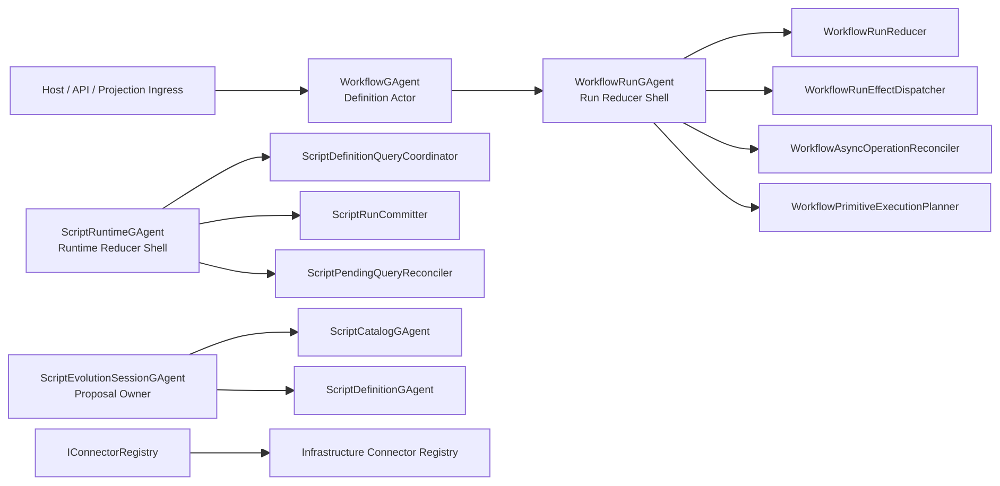

# Runtime Phase-4 Core Decomposition And Final Cleanup 重构蓝图（Delivered, Breaking Change）

## 1. 文档元信息

1. 状态：`Delivered`
2. 版本：`v1`
3. 日期：`2026-03-07`
4. 决策级别：`Architecture Breaking Change`
5. 适用范围：
   - `src/workflow/Aevatar.Workflow.Core`
   - `src/workflow/Aevatar.Workflow.Application*`
   - `src/workflow/Aevatar.Workflow.Infrastructure`
   - `src/workflow/extensions/Aevatar.Workflow.Extensions.Hosting`
   - `src/Aevatar.Scripting.*`
   - `test/Aevatar.Workflow.*`
   - `test/Aevatar.Scripting.*`
   - `test/Aevatar.Integration.Tests`
   - `demos/Aevatar.Demos.Workflow*`
6. 非范围：
   - `Aevatar.CQRS.*` 主投影协议重写
   - Orleans reminder-only durable callback 主策略
   - 已完成的 phase-1 / phase-2 / phase-3 重构内容
7. 本版结论：
   - 本阶段工作已完成，phase-4 文档中列出的结构性问题已在主干实现中收口。
   - `WorkflowRunGAgent` 已继续拆成显式协作者，`ScriptEvolutionManagerGAgent` 已删除，`pending_definition_queries` 已收窄到最小事实集。
   - `InMemoryConnectorRegistry` 已下沉到 Infrastructure，Hosting/demo 的兼容命名与配置壳也已删除。

## 2. 背景

截至 `2026-03-07`，以下目标已完成：

1. `WorkflowGAgent` 已收窄为 definition actor。
2. `WorkflowRunGAgent` 已成为 run 级事实源。
3. `WorkflowRunStateUpdatedEvent` 已删除，主链改为 patch/domain-event 模型。
4. `ScriptRuntimeGAgent` 已拆成 `Ingress / DefinitionQuery / Completion / StateTransitions` partial slices。
5. `ScriptEvolutionSessionGAgent` 已成为 proposal 生命周期 owner。
6. `CaseProjection` demo、`WorkflowCallModule`、`IEventModuleFactory` 主链回流口都已清理。

对应已交付文档：

1. `docs/architecture/workflow-runtime-actorized-run-persistent-state-refactor-blueprint-2026-03-07.md`
2. `docs/architecture/workflow-runtime-phase2-full-decoupling-refactor-blueprint-2026-03-07.md`
3. `docs/architecture/runtime-phase3-final-architecture-debt-elimination-blueprint-2026-03-07.md`

本蓝图记录的是已交付的 phase-4 收口内容：

1. `WorkflowRunGAgent` 已继续拆成显式协作者，不再把新增原语逻辑堆回 actor shell。
2. `ScriptEvolutionManagerGAgent` 已删除，proposal 生命周期由 `ScriptEvolutionSessionGAgent` 单独持有。
3. `ScriptRuntimeState.pending_definition_queries` 已收窄到最小恢复事实集。
4. `InMemoryConnectorRegistry` 已从 Core 下沉到 Infrastructure。
5. Hosting/demo 中的兼容命名与旧配置别名已清理。

## 3. 交付前问题快照（已解决）

### P1. `WorkflowRunGAgent` 过大（交付前）

当前非生成代码中，Workflow runtime 最大热点仍是：

1. `src/workflow/Aevatar.Workflow.Core/WorkflowRunGAgent.StepRequests.cs`：约 `768` 行
2. `src/workflow/Aevatar.Workflow.Core/WorkflowRunGAgent.cs`：约 `747` 行
3. `src/workflow/Aevatar.Workflow.Core/WorkflowRunGAgent.Infrastructure.cs`：约 `588` 行
4. `src/workflow/Aevatar.Workflow.Core/WorkflowRunCallbackRuntime.cs`：约 `263` 行
5. `src/workflow/Aevatar.Workflow.Core/WorkflowRunStatefulCompletionRuntime.cs`：约 `376` 行

问题本质：

1. 主链虽然已经切成 partial files，但责任还是聚在一个 actor 类型上。
2. `step dispatch / callback reconcile / effect assembly / primitive-specialized logic` 仍混杂。
3. 一旦继续加原语或扩展，这个点最容易再次膨胀。

### P2. `ScriptEvolutionManagerGAgent` 是可删的索引壳（交付前）

交付前生产链上：

1. `ScriptEvolutionSessionGAgent` 已经是 proposal 生命周期 owner。
2. `ScriptEvolutionManagerState` 只剩：
   - `proposal_session_actor_ids`
   - `latest_proposal_by_script`
3. `IScriptingActorAddressResolver` 当时仍暴露 `GetEvolutionManagerActorId()`。
4. `RuntimeScriptEvolutionLifecycleService` 与 `ScriptEvolutionSessionGAgent` 当时仍会 best-effort 调 manager actor。

问题本质：

1. manager 已不再承载核心业务决策。
2. 当前索引 map 没有形成强业务事实源，只是“还没删掉的中间壳”。
3. 继续保留会让 Scripting 侧维持“session actor + index actor”双心智。

### P3. `ScriptRuntimeState.pending_definition_queries` 不是最小事实集（交付前）

交付前 `PendingScriptDefinitionQueryState` 持久化：

1. `request_id`
2. `run_event`
3. `queued_at_unix_time_ms`
4. `timeout_callback_id`

其中：

1. `timeout_callback_id` 已经能由 `request_id` 纯函数推导。
2. `run_event` 复用了完整 `RunScriptRequestedEvent`，语义可以继续收窄为专用 pending message。

问题本质：

1. 正确性已经足够，但 persisted fact 还不够瘦。
2. 如果不继续收口，后续很容易又把“方便字段”加回 business state。

### P4. `InMemoryConnectorRegistry` 在 Core（交付前）

交付前：

1. `src/workflow/Aevatar.Workflow.Core/Connectors/InMemoryConnectorRegistry.cs` 是默认 `IConnectorRegistry` 实现。
2. `src/workflow/Aevatar.Workflow.Core/ServiceCollectionExtensions.cs` 直接注册这个 in-memory 实现。

问题本质：

1. `IConnectorRegistry` 是稳定抽象，但 `InMemoryConnectorRegistry` 是明显的基础设施实现。
2. 把它留在 Core 会继续模糊 `Domain/Core` 与 `Infrastructure` 的边界。
3. 即使它不构成 correctness 风险，也不符合“开发期实现显式下沉”的架构要求。

### P5. Hosting/demo 残留少量兼容语义名（交付前）

交付前仍存在：

1. `src/workflow/extensions/Aevatar.Workflow.Extensions.Hosting/WorkflowProjectionProviderServiceCollectionExtensions.cs` 中的旧 provider 别名配置面。
2. `demos/Aevatar.Demos.Workflow.Web/Program.cs` 中的旧 demo 分组命名。

问题本质：

1. 这些残留不会破坏行为，但会延续“兼容优先”的心智。
2. 在已经明确“不考虑兼容性”的前提下，应继续删到命名层也不再暧昧。

## 4. 不可妥协的架构决策

1. `WorkflowRunGAgent` 必须继续收窄；partial file 不是终点，只是过渡。
2. 没有强业务语义的索引 actor 必须删除，而不是长期保留。
3. Actor 持久态只保留“恢复运行所必需的最小事实”，不保留可推导字段。
4. `InMemory` 实现必须位于 `Infrastructure` 或显式 `Demo/Test` 语义位置，不能停留在 Core。
5. 兼容性桥接若无明确业务价值，应直接删除，不保留空壳或旧配置别名。
6. 每个重构工作包都必须伴随 guard/test/doc 同步更新。

## 5. 目标架构总览

### 5.1 目标状态摘要

1. `WorkflowRunGAgent` 只保留 actor 边界、事件入口和状态提交。
2. 具体 planning / reconcile / effect-assembly 由显式协作者承担。
3. `ScriptEvolutionManagerGAgent` 删除；proposal 生命周期与 decision query 全部以 session actor 为准。
4. `PendingScriptDefinitionQueryState` 收窄为最小必要事实。
5. connector registry 默认实现从 Core 下沉到 Infrastructure。
6. Hosting/demo 不再保留 `legacy` 命名与兼容配置别名。

## 6. 详细重构设计

### 6.1 WP1: `WorkflowRunGAgent` 去单体化

#### 6.1.1 目标

把当前 `WorkflowRunGAgent` 从“大 actor + 多 partial files”收敛成“薄 actor shell + 显式 runtime collaborators”。

#### 6.1.2 新的内部边界

新增协作者，全部保持无状态或只依赖显式输入输出：

1. `WorkflowRunReducer`
   - 输入：`WorkflowRunState + ingress/domain event`
   - 输出：`WorkflowRunPlanResult`
2. `WorkflowPrimitiveExecutionPlanner`
   - 负责 step-type 专属 planning，不直接发副作用
3. `WorkflowAsyncOperationReconciler`
   - 统一处理 callback fired / tool result / connector result / signal / resume 对账
4. `WorkflowRunEffectDispatcher`
   - 只负责把 persisted plan 转成 side effects

#### 6.1.3 破坏性决策

1. `WorkflowRunGAgent.*.cs` 中的 primitive-specific 私有方法继续下沉。
2. 原来混在 `StepRequests / StatefulCompletions / Callbacks / Infrastructure` 中的逻辑不再允许直接新增。
3. 所有新原语能力必须通过 planner/reconciler 扩展，而不是再向 actor shell 堆方法。

#### 6.1.4 主要影响文件

1. `src/workflow/Aevatar.Workflow.Core/WorkflowRunGAgent.cs`
2. `src/workflow/Aevatar.Workflow.Core/WorkflowRunGAgent.StepRequests.cs`
3. `src/workflow/Aevatar.Workflow.Core/WorkflowRunStatefulCompletionRuntime.cs`
4. `src/workflow/Aevatar.Workflow.Core/WorkflowRunCallbackRuntime.cs`
5. `src/workflow/Aevatar.Workflow.Core/WorkflowRunGAgent.Infrastructure.cs`
6. `src/workflow/Aevatar.Workflow.Core/WorkflowRunDispatchRuntime.cs`
7. `src/workflow/Aevatar.Workflow.Core/WorkflowRunStatePatchSupport.cs`
8. `test/Aevatar.Workflow.Core.Tests/*`
9. `test/Aevatar.Integration.Tests/*Workflow*`

#### 6.1.5 验收标准

1. actor shell 文件总行数明显下降。
2. 原语专属逻辑不再散落在 actor shell 中。
3. callback / external completion / signal / resume 走统一 reconcile 入口。
4. 不新增任何 service-level `Dictionary/ConcurrentDictionary` 事实态。

### 6.2 WP2: 删除 `ScriptEvolutionManagerGAgent`

#### 6.2.1 目标

把 proposal 生命周期与 query authority 彻底收敛到 `ScriptEvolutionSessionGAgent`。

#### 6.2.2 破坏性决策

1. 删除 `ScriptEvolutionManagerGAgent`。
2. 删除 `ScriptEvolutionManagerState`。
3. 删除 `proposal_session_actor_ids` / `latest_proposal_by_script`。
4. 删除 `GetEvolutionManagerActorId()`。
5. 删除只为 manager 服务的 proposal indexed / rollback stamped 事件与调用链。

#### 6.2.3 新模型

1. session actor id 由 proposal id 纯函数推导，或由 application/lifecycle service 直接确定。
2. decision 查询直接以 session actor 为准，不再保留额外 fallback 端口。
3. rollback 直接走 session/callback 或 catalog port，不再经 manager。

#### 6.2.4 主要影响文件

1. `src/Aevatar.Scripting.Core/ScriptEvolutionManagerGAgent.cs`
2. `src/Aevatar.Scripting.Core/ScriptEvolutionSessionGAgent.cs`
3. `src/Aevatar.Scripting.Abstractions/script_host_messages.proto`
4. `src/Aevatar.Scripting.Core/Ports/IScriptingActorAddressResolver.cs`
5. `src/Aevatar.Scripting.Infrastructure/Ports/DefaultScriptingActorAddressResolver.cs`
6. `src/Aevatar.Scripting.Infrastructure/Ports/RuntimeScriptEvolutionLifecycleService.cs`
7. `test/Aevatar.Scripting.Core.Tests/Runtime/ScriptEvolutionManagerGAgentTests.cs`
8. `test/Aevatar.Scripting.Core.Tests/Runtime/ScriptEvolutionSessionGAgentTests.cs`
9. `test/Aevatar.Integration.Tests/*ScriptAutonomousEvolution*`

#### 6.2.5 验收标准

1. 生产代码中不再存在 `GetEvolutionManagerActorId()`。
2. session actor 成为唯一 proposal lifecycle owner。
3. 演化 query 与 rollback 语义不再依赖独立 manager actor。

### 6.3 WP3: `ScriptRuntimeState.pending_definition_queries` 最小化

#### 6.3.1 目标

把 pending definition query persisted fact 收敛到真正必要的最小集合。

#### 6.3.2 破坏性决策

1. 删除 `PendingScriptDefinitionQueryState.TimeoutCallbackId`。
2. 删除 `ScriptDefinitionQueryQueuedEvent.TimeoutCallbackId`。
3. 优先评估把 `RunEvent` 收窄为专用 `PendingScriptRunRequest` message。
4. 保留 `queued_at_unix_time_ms` 仅当恢复顺序需要稳定排序。

#### 6.3.3 主要影响文件

1. `src/Aevatar.Scripting.Abstractions/script_host_messages.proto`
2. `src/Aevatar.Scripting.Core/ScriptRuntimeGAgent.cs`
3. `src/Aevatar.Scripting.Core/ScriptRuntimeGAgent.Ingress.cs`
4. `src/Aevatar.Scripting.Core/ScriptRuntimeGAgent.DefinitionQuery.cs`
5. `src/Aevatar.Scripting.Core/ScriptRuntimeGAgent.StateTransitions.cs`
6. `test/Aevatar.Scripting.Core.Tests/Runtime/ScriptRuntimeGAgentEventDrivenQueryTests.cs`
7. `test/Aevatar.Scripting.Core.Tests/Runtime/ScriptRuntimeGAgentReplayContractTests.cs`
8. `test/Aevatar.Scripting.Core.Tests/Contracts/ScriptProtoContractsTests.cs`

#### 6.3.4 验收标准

1. pending query persisted state 中不再有可推导 callback id。
2. 所有 timeout id 在运行时统一由纯函数构造。
3. replay / reactivation 契约测试继续通过。

### 6.4 WP4: `InMemoryConnectorRegistry` 下沉到 Infrastructure

#### 6.4.1 目标

把 connector registry 默认实现从 Core 移到 Infrastructure，Core 只保留抽象。

#### 6.4.2 破坏性决策

1. `src/workflow/Aevatar.Workflow.Core/Connectors/InMemoryConnectorRegistry.cs` 删除。
2. `src/workflow/Aevatar.Workflow.Core/ServiceCollectionExtensions.cs` 不再直接 new/注册 in-memory 实现。
3. 在 `Infrastructure` 新建显式 `InMemoryWorkflowConnectorRegistry`。

#### 6.4.3 主要影响文件

1. `src/workflow/Aevatar.Workflow.Core/Connectors/InMemoryConnectorRegistry.cs`
2. `src/workflow/Aevatar.Workflow.Core/ServiceCollectionExtensions.cs`
3. `src/workflow/Aevatar.Workflow.Infrastructure/*`
4. `docs/CONNECTOR.md`
5. `test/Aevatar.Workflow.*`

#### 6.4.4 验收标准

1. Core 中不再出现 in-memory connector implementation。
2. connector 默认实现语义在命名和装配层显式落到 Infrastructure。
3. 现有 connector tests 不回退。

### 6.5 WP5: 删除 Hosting/demo 兼容壳和旧命名

#### 6.5.1 目标

把剩余 `legacy` / 兼容配置壳彻底删干净。

#### 6.5.2 破坏性决策

1. 删除 `Projection:Document:Provider` / `Projection:Graph:Provider` 旧配置别名。
2. demo 分组命名不再使用 `legacy`。
3. active docs 中不再将任何现行能力描述为“兼容旧路径”。

#### 6.5.3 主要影响文件

1. `src/workflow/extensions/Aevatar.Workflow.Extensions.Hosting/WorkflowProjectionProviderServiceCollectionExtensions.cs`
2. `demos/Aevatar.Demos.Workflow.Web/Program.cs`
3. `demos/Aevatar.Demos.Workflow.Web/wwwroot/app.js`
4. `docs/WORKFLOW*.md`
5. `docs/CONNECTOR.md`

#### 6.5.4 验收标准

1. 现行代码路径不再出现无业务价值的 `legacy*` 配置名。
2. demo 只保留当前架构口径。

### 6.6 WP6: 门禁与文档同步

#### 6.6.1 新增/调整 guard

1. 禁止生产代码再次出现 `GetEvolutionManagerActorId()`。
2. 禁止 `PendingScriptDefinitionQueryState` 再持久化 `TimeoutCallbackId`。
3. 禁止 `Aevatar.Workflow.Core` 重新出现 `InMemoryConnectorRegistry`。
4. 对 `WorkflowRunGAgent` 引入新的体量或职责边界守卫：
   - 可选：文件行数上限
   - 更推荐：禁止在 actor shell 中新增 primitive-specific handler 名称模式

#### 6.6.2 文档同步范围

1. `docs/SCRIPTING_ARCHITECTURE.md`
2. `docs/WORKFLOW.md`
3. `docs/CONNECTOR.md`
4. `src/workflow/*/README.md`
5. `docs/architecture/*.md` 中当前有效蓝图

## 7. 实施结果

已按下列顺序完成交付：

1. `WP3`：删除 `PendingScriptDefinitionQueryState.TimeoutCallbackId`，timeout callback id 改为纯函数构造。
2. `WP2`：删除 `ScriptEvolutionManagerGAgent`、地址解析与相关 proto/tests。
3. `WP4`：把 `InMemoryConnectorRegistry` 从 Core 下沉到 Infrastructure。
4. `WP5`：删除 Hosting/demo 兼容壳与旧命名。
5. `WP1`：为 `WorkflowRunGAgent` 增加 `WorkflowRunReducer / WorkflowPrimitiveExecutionPlanner / WorkflowAsyncOperationReconciler / WorkflowRunEffectDispatcher`，继续压薄 actor shell。
6. `WP6`：同步完成 active docs、README、CI guards 与覆盖测试。

## 8. 影响分析

### 8.1 API / 外部行为

本阶段大多数变更不影响外部 API 形状，但会影响：

1. 内部 actor 拓扑与地址解析
2. proto message 结构
3. DI 默认注册点
4. 配置键兼容面

### 8.2 最大风险

1. 删除 manager actor 时，若 session actor 定位策略不统一，可能打断 rollback / decision query。
2. `WorkflowRunGAgent` 深拆时，若 reducer/effect 边界不清，会引入隐藏行为漂移。
3. 删除 `TimeoutCallbackId` 后，若运行时构造函数与旧 tests 不一致，会造成 replay 契约断裂。

## 9. 测试矩阵

### 9.1 必跑单测

1. `dotnet test test/Aevatar.Scripting.Core.Tests/Aevatar.Scripting.Core.Tests.csproj --nologo`
2. `dotnet test test/Aevatar.Workflow.Core.Tests/Aevatar.Workflow.Core.Tests.csproj --nologo`
3. `dotnet test test/Aevatar.Workflow.Application.Tests/Aevatar.Workflow.Application.Tests.csproj --nologo`
4. `dotnet test test/Aevatar.Workflow.Host.Api.Tests/Aevatar.Workflow.Host.Api.Tests.csproj --nologo`

### 9.2 必跑集成

1. `dotnet test test/Aevatar.Integration.Tests/Aevatar.Integration.Tests.csproj --nologo`
2. 至少覆盖：
   - Workflow run 主链
   - sub-workflow
   - script autonomous evolution
   - Orleans scripting consistency

### 9.3 必跑门禁

1. `bash tools/ci/architecture_guards.sh`
2. `bash tools/ci/runtime_callback_guards.sh`
3. `bash tools/ci/test_stability_guards.sh`
4. `bash tools/ci/solution_split_test_guards.sh`
5. 新增后对应的 phase-4 专项 guards

## 10. DoD

满足以下条件才算本阶段完成：

1. `WorkflowRunGAgent` 不再是“大量 primitive-specific logic 的唯一落点”。
2. `ScriptEvolutionManagerGAgent` 与相关地址解析、proto state、tests 已全部删除或被证明无必要。
3. `PendingScriptDefinitionQueryState` 仅保留最小恢复事实。
4. Core 中不再存在 `InMemoryConnectorRegistry`。
5. Hosting/demo 不再保留无业务价值的 `legacy` 配置别名与命名。
6. 文档、README、门禁全部同步到新口径。
7. `dotnet build aevatar.slnx --nologo` 通过。
8. `dotnet test aevatar.slnx --nologo` 通过。

## 11. 交付结论

phase-4 文档中定义的 `WP1` 到 `WP6` 已全部完成，当前仓库不再保留本蓝图所列的兼容壳、冗余索引 actor、冗余 pending callback 字段和 Core 层 in-memory connector 实现。后续若继续重构，应进入新的 phase 文档，而不是继续沿用本蓝图追加未交付事项。
