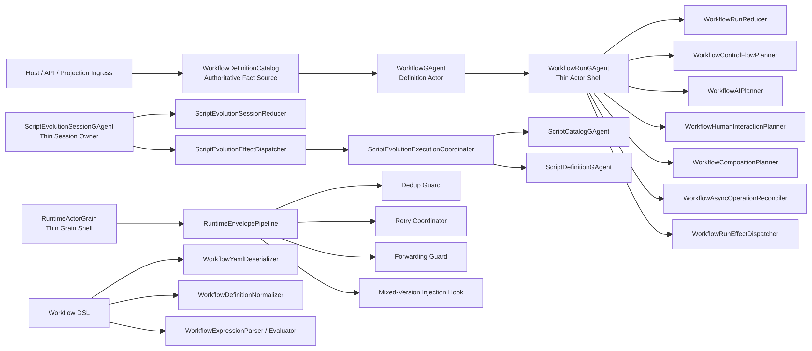

# Runtime Phase-5 Runtime / Definition Catalog / Core Decomposition 重构蓝图（Delivered, Breaking Change）

## 1. 文档元信息

1. 状态：`Delivered`
2. 版本：`v1`
3. 日期：`2026-03-07`
4. 决策级别：`Architecture Breaking Change`
5. 适用范围：
   - `src/workflow/Aevatar.Workflow.Core`
   - `src/workflow/Aevatar.Workflow.Application*`
   - `src/Aevatar.Scripting.*`
   - `src/Aevatar.Foundation.Core`
   - `src/Aevatar.Foundation.Runtime.Implementations.*`
   - `test/Aevatar.Workflow.*`
   - `test/Aevatar.Scripting.*`
   - `test/Aevatar.Foundation.*`
   - `test/Aevatar.Integration.Tests`
6. 非范围：
   - mixed-version 升级验证链删除或收窄
   - Orleans reminder-only durable callback 主策略回退
   - `Aevatar.CQRS.*` 主投影协议重写
   - AI provider failover 产品语义调整
7. 本版结论：
   - phase-1 到 phase-4 已经解决了主干 correctness 与大部分历史兼容壳问题。
   - phase-5 已完成剩余结构性热点收口：删除 `RunManager`、移除 Application 默认进程内 definition fact source、去掉 script evolution fallback baseline、继续拆分 `WorkflowRunGAgent`、将 `RuntimeActorGrain` 收敛为 pipeline shell，并拆开 Workflow DSL 的 parse / normalize / evaluate 边界。
   - mixed-version 升级验证链保持保留并继续受测试覆盖。

## 2. 背景

截至 `2026-03-07`，仓库已经完成这些关键收口：

1. `WorkflowGAgent` 已收窄为 definition actor。
2. `WorkflowRunGAgent` 已成为 run 级事实源。
3. `Workflow` 主链已经摆脱旧 `IEventModuleFactory` 回流口。
4. `ScriptRuntimeGAgent` 已拆为多份 partial slice。
5. `ScriptEvolutionManagerGAgent` 已删除，主 proposal owner 已收敛到 session actor。
6. `pending_definition_queries` 已收窄，不再持久化 `TimeoutCallbackId`。
7. `InMemoryConnectorRegistry` 已从 Core 下沉到 Infrastructure。
8. mixed-version 升级验证链已恢复并保留。

对应已交付文档：

1. `docs/architecture/workflow-runtime-actorized-run-persistent-state-refactor-blueprint-2026-03-07.md`
2. `docs/architecture/workflow-runtime-phase2-full-decoupling-refactor-blueprint-2026-03-07.md`
3. `docs/architecture/runtime-phase3-final-architecture-debt-elimination-blueprint-2026-03-07.md`
4. `docs/architecture/runtime-phase4-core-decomposition-and-final-cleanup-blueprint-2026-03-07.md`

phase-5 解决的是“剩余结构性热点”，不是再开第二条架构主干。

注：第 3-9 节保留的是本次交付前的问题快照、工作包设计、风险和验收标准，作为实施证据继续留档。

## 3. 交付前剩余结构性问题快照

### P1. `WorkflowRunGAgent` 仍是最大的 Workflow 单体热点

当前非生成代码中，Workflow runtime 最大热点仍然集中在：

1. `src/workflow/Aevatar.Workflow.Core/WorkflowRunGAgent.StepRequests.cs`
2. `src/workflow/Aevatar.Workflow.Core/WorkflowRunGAgent.cs`
3. `src/workflow/Aevatar.Workflow.Core/WorkflowRunGAgent.Infrastructure.cs`
4. `src/workflow/Aevatar.Workflow.Core/WorkflowRunCallbackRuntime.cs`
5. `src/workflow/Aevatar.Workflow.Core/WorkflowRunStatefulCompletionRuntime.cs`

问题本质：

1. actor shell 仍直接掌握大量 primitive-specific 行为。
2. `planner / reducer / reconcile / effect dispatch` 边界虽然存在，但还没把原语族彻底切出去。
3. 每次再加新原语，都很容易回到“往 actor shell 再塞一个 handler”。

### P2. `WorkflowDefinitionCatalog` 仍默认落在 Application 层进程内字典

当前：

1. `src/workflow/Aevatar.Workflow.Application/Workflows/InMemoryWorkflowDefinitionCatalog.cs` 是 `ConcurrentDictionary<string, string>`。
2. `src/workflow/Aevatar.Workflow.Application/DependencyInjection/ServiceCollectionExtensions.cs` 默认把它注册为 `IWorkflowDefinitionCatalog` 和 `IWorkflowDefinitionLookupService`。

问题本质：

1. 类型名已经明确是 `InMemory`，但 DI 默认仍把它变成全局 catalog。
2. 这会继续让 production 语义默认依赖进程内事实源。
3. 这与“事实源唯一 + 开发期实现显式下沉”的要求不一致。

### P3. `ScriptEvolutionSessionGAgent` 与 `RuntimeScriptEvolutionFlowPort` 仍耦合过重

当前：

1. `src/Aevatar.Scripting.Core/ScriptEvolutionSessionGAgent.cs` 同时承担 session owner、proposal ingress、decision query response、flow 执行触发、终态持久化。
2. `src/Aevatar.Scripting.Infrastructure/Ports/RuntimeScriptEvolutionFlowPort.cs` 同时承担 compile、catalog baseline 查询、definition upsert、promotion、compensation。
3. `RuntimeScriptEvolutionFlowPort` 仍保留“catalog query 失败时，根据 `BaseRevision` 拼 fallback baseline 继续推进”的兜底语义。

问题本质：

1. session actor 还没有真正只做 session owner + reducer。
2. flow port 现在更像“脚本演化编排器”，而不只是 port。
3. “query 失败 -> base revision fallback” 仍然是隐藏业务降级，不够硬。

### P4. `RunManager` 是无业务价值的死层

当前：

1. `src/Aevatar.Foundation.Core/Context/RunManager.cs` 维护 `scopeId -> RunContext` 的 `ConcurrentDictionary`。
2. `RunManager` 仍在 Local / Orleans runtime DI 中注册。
3. 除单测与 DI 注册外，仓库中没有生产调用点。

问题本质：

1. 这不是“待演进能力”，而是没有业务消费者的残留层。
2. 它还与“中间层不维护 run/session ID 事实映射”的架构约束冲突。
3. 继续保留只会增加误导和维护面。

### P5. `RuntimeActorGrain` 仍是 Foundation runtime 的大单体

当前 `src/Aevatar.Foundation.Runtime.Implementations.Orleans/Grains/RuntimeActorGrain.cs` 同时承担：

1. activation / deactivation
2. self-stream subscription
3. envelope dedup
4. retry / auto-retry schedule
5. forwarding / publisher-chain guard
6. compatibility injection
7. parent-child relationship persistence
8. agent lifecycle binding

问题本质：

1. 这个 grain 仍是整个 runtime 的规则汇聚点。
2. mixed-version 能力本身应该保留，但不等于它必须和 dedup/retry/forwarding 写在同一个类里。
3. runtime 规则继续增长时，这里最容易再次成为错误密度最高的热点。

### P6. Workflow DSL 解析与表达式引擎还偏重

当前：

1. `src/workflow/Aevatar.Workflow.Core/Primitives/WorkflowParser.cs` 同时做 YAML 反序列化、role normalize、alias default、root parameter lift、branches normalize。
2. `src/workflow/Aevatar.Workflow.Core/Expressions/WorkflowExpressionEvaluator.cs` 同时做表达式解析和求值。

问题本质：

1. 当前实现还够用，但 DSL 一旦再长，就会重新长成两个“工具性单体”。
2. parser / evaluator 未拆 AST、normalization、validation 边界，后续很难做严格验证与静态检查。

## 4. 不可妥协的架构决策

1. mixed-version 升级验证链必须保留：
   - `CompatibilityFailureInjectionPolicy`
   - `DistributedMixedVersionClusterIntegrationTests`
   - `tools/ci/distributed_mixed_version_smoke.sh`
2. Application 层不能再默认提供进程内 definition 事实源作为 production 语义。
3. 没有业务消费者的层必须直接删除，不做“也许以后有用”的保留。
4. actor / grain shell 只保留边界职责；规则、reducer、reconcile、effect dispatch 必须继续下沉。
5. 任何 fallback 若不是明确产品语义，而只是实现兜底，优先删除而不是继续抽象化。
6. `InMemory` / `Local` / `Demo` 能力必须在类型名、命名空间、DI 装配点上显式暴露其语义。

## 5. 目标架构总览

### 5.1 目标状态摘要

1. `WorkflowRunGAgent` 只保留 run actor 边界，不再直接承载大批 primitive-specific 私有方法。
2. `WorkflowDefinitionCatalog` 成为显式权威抽象，`InMemory` 只在 dev/test 装配中出现。
3. `ScriptEvolutionSessionGAgent` 收敛成 session owner，真正的执行编排下沉到独立 coordinator。
4. `RuntimeActorGrain` 保留 mixed-version hook，但 envelope pipeline 其他规则拆出。
5. `RunManager` 整层删除。
6. Workflow DSL 拥有更清晰的 parse / normalize / validate / evaluate 边界。

## 6. 详细重构设计

### 6.1 WP1: 删除 `RunManager`

#### 6.1.1 目标

删除无业务价值、且与架构约束冲突的 `RunManager` / `RunContextScope`。

#### 6.1.2 破坏性决策

1. 删除 `IRunManager`。
2. 删除 `RunManager`。
3. 删除 `RunContextScope`。
4. 删除 Local / Orleans runtime 中的 `IRunManager` DI 注册。
5. 删除或重写仅覆盖这套死层的单测。

#### 6.1.3 主要影响文件

1. `src/Aevatar.Foundation.Abstractions/Context/IRunManager.cs`
2. `src/Aevatar.Foundation.Core/Context/RunManager.cs`
3. `src/Aevatar.Foundation.Runtime.Implementations.Orleans/DependencyInjection/ServiceCollectionExtensions.cs`
4. `src/Aevatar.Foundation.Runtime.Implementations.Local/DependencyInjection/ServiceCollectionExtensions.cs`
5. `test/Aevatar.Foundation.Core.Tests/RuntimeAndContextTests.cs`
6. `src/Aevatar.Foundation.Core/README.md`

#### 6.1.4 验收标准

1. 生产代码中不再存在 `IRunManager` / `RunManager` / `RunContextScope`。
2. Local / Orleans runtime DI 不再注册这层死依赖。
3. 仓库中不存在 `scopeId -> RunContext` 中间层事实映射。

### 6.2 WP2: `WorkflowDefinitionCatalog` 语义硬化

#### 6.2.1 目标

把 definition 权威事实源从“Application 默认内存实现”改为“显式抽象 + 显式 dev/test 实现”。

#### 6.2.2 破坏性决策

1. `AddWorkflowApplication()` 不再默认 new `InMemoryWorkflowDefinitionCatalog` 作为全局 catalog。
2. Application 层只保留抽象与 seed contract，不持有默认 in-memory system-of-record。
3. `InMemoryWorkflowDefinitionCatalog` 移到更明确的 dev/test 装配位置。
4. Host 若需要内建 `direct/auto/auto_review`，必须显式选择：
   - persistent catalog implementation
   - or `InMemory` dev/test implementation

#### 6.2.3 新模型

1. `IWorkflowDefinitionCatalog`
   - 权威定义事实源
2. `IWorkflowDefinitionLookupService`
   - query-facing lookup abstraction
3. `IWorkflowDefinitionSeedSource`
   - 内建 workflow / 文件目录 / demo workflow 种子来源
4. `InMemoryWorkflowDefinitionCatalog`
   - 仅开发/测试/演示装配可见

#### 6.2.4 主要影响文件

1. `src/workflow/Aevatar.Workflow.Application/DependencyInjection/ServiceCollectionExtensions.cs`
2. `src/workflow/Aevatar.Workflow.Application/Workflows/InMemoryWorkflowDefinitionCatalog.cs`
3. `src/workflow/Aevatar.Workflow.Application/Workflows/IWorkflowDefinitionSeedSource.cs`
4. `src/workflow/Aevatar.Workflow.Infrastructure/*Workflows*`
5. `src/workflow/Aevatar.Workflow.Host.Api/*`
6. `demos/Aevatar.Demos.Workflow.Web/*`
7. `test/Aevatar.Workflow.Application.Tests/*`
8. `docs/WORKFLOW.md`
9. `src/workflow/Aevatar.Workflow.Application/README.md`

#### 6.2.5 验收标准

1. Application 默认装配不再把 `ConcurrentDictionary` 暴露为 production catalog。
2. `InMemoryWorkflowDefinitionCatalog` 只能通过显式 dev/test 路径装配。
3. 文档中不再把 Application 内存 catalog 描述成默认正式事实源。

### 6.3 WP3: `ScriptEvolution` 继续去单体化，并删除 query-failure fallback baseline

#### 6.3.1 目标

让 session actor 只负责 session owner 语义，把执行编排和副作用调度拆出，并消除 catalog baseline 的隐藏降级。

#### 6.3.2 破坏性决策

1. `RuntimeScriptEvolutionFlowPort` 不再在 query 失败/null 时使用 `BaseRevision` 构造 fallback baseline。
2. catalog baseline 要么来自 query，要么流程失败并显式返回失败原因。
3. `ScriptEvolutionSessionGAgent` 中的 execute/query/persist 边界继续拆开。

#### 6.3.3 新模型

1. `ScriptEvolutionSessionReducer`
   - 只处理 started / validated / promoted / rejected / completed state transition
2. `ScriptEvolutionExecutionCoordinator`
   - compile、catalog query、definition upsert、promotion、compensation
3. `ScriptEvolutionEffectDispatcher`
   - 只负责执行 coordinator 并把结果映射回 domain event

#### 6.3.4 主要影响文件

1. `src/Aevatar.Scripting.Core/ScriptEvolutionSessionGAgent.cs`
2. `src/Aevatar.Scripting.Infrastructure/Ports/RuntimeScriptEvolutionFlowPort.cs`
3. `src/Aevatar.Scripting.Core/Ports/IScriptEvolutionFlowPort.cs`
4. `test/Aevatar.Scripting.Core.Tests/Runtime/ScriptEvolutionSessionGAgentTests.cs`
5. `test/Aevatar.Scripting.Core.Tests/Runtime/RuntimeScriptEvolutionFlowPortTests.cs`
6. `test/Aevatar.Integration.Tests/*ScriptAutonomousEvolution*`
7. `docs/SCRIPTING_ARCHITECTURE.md`

#### 6.3.5 验收标准

1. query 失败/null 时不再出现 `fallback_base_revision_after_*` 这类隐式降级路径。
2. session actor 不再直接承载大块执行编排分支。
3. promotion / compensation 失败路径有清晰的显式事件和测试覆盖。

### 6.4 WP4: `WorkflowRunGAgent` phase-5 继续拆分

#### 6.4.1 目标

继续把 primitive-specific 处理从 actor shell 中挤出去，按原语族分协作者。

#### 6.4.2 新的内部边界

1. `WorkflowControlFlowPlanner`
   - `delay / wait_signal / while / race`
2. `WorkflowHumanInteractionPlanner`
   - `human_input / human_approval`
3. `WorkflowAIPlanner`
   - `llm_call / evaluate / reflect / cache`
4. `WorkflowCompositionPlanner`
   - `parallel / foreach / map_reduce / workflow_call`
5. `WorkflowPrimitiveDispatchTable`
   - 负责 canonical type -> planner route

#### 6.4.3 破坏性决策

1. `WorkflowRunGAgent.StepRequests.cs` 不再长期承载大段原语实现。
2. actor shell 中不再新增任何新的 primitive-specific private method。
3. 所有新原语必须挂到 planner family，而不是直接进 actor。

#### 6.4.4 主要影响文件

1. `src/workflow/Aevatar.Workflow.Core/WorkflowRunGAgent.cs`
2. `src/workflow/Aevatar.Workflow.Core/WorkflowRunGAgent.StepRequests.cs`
3. `src/workflow/Aevatar.Workflow.Core/WorkflowRunCallbackRuntime.cs`
4. `src/workflow/Aevatar.Workflow.Core/WorkflowRunGAgent.Infrastructure.cs`
5. `src/workflow/Aevatar.Workflow.Core/WorkflowPrimitiveExecutionPlanner.cs`
6. `src/workflow/Aevatar.Workflow.Core/*Planner*.cs`
7. `test/Aevatar.Workflow.Core.Tests/*`
8. `test/Aevatar.Integration.Tests/*Workflow*`

#### 6.4.5 验收标准

1. `WorkflowRunGAgent.StepRequests.cs` 行数显著下降。
2. planner family 成为原语扩展的唯一入口。
3. callback / resume / external completion 继续只经 `WorkflowAsyncOperationReconciler` 对账。

### 6.5 WP5: `RuntimeActorGrain` pipeline 化

#### 6.5.1 目标

在不碰 mixed-version 升级验证链的前提下，把 `RuntimeActorGrain` 拆成更清晰的 envelope pipeline 协作者。

#### 6.5.2 破坏性决策

1. 保留 `CompatibilityFailureInjectionPolicy`，但不再让它与 dedup/retry/forwarding 混在同一个方法里。
2. `HandleEnvelopeAsync` 改成薄入口：
   - parse
   - initialize / bind agent
   - pass to pipeline
3. dedup / retry / forwarding / compatibility injection / tracing 由独立协作者负责。

#### 6.5.3 新模型

1. `RuntimeEnvelopePipeline`
2. `RuntimeEnvelopeDedupGuard`
3. `RuntimeEnvelopeRetryCoordinator`
4. `RuntimeEnvelopeForwardingGuard`
5. `RuntimeEnvelopeCompatibilityInjectionHook`

#### 6.5.4 主要影响文件

1. `src/Aevatar.Foundation.Runtime.Implementations.Orleans/Grains/RuntimeActorGrain.cs`
2. `src/Aevatar.Foundation.Runtime.Implementations.Orleans/Grains/*RuntimeEnvelope*.cs`
3. `test/Aevatar.Foundation.Runtime.Hosting.Tests/*Runtime*`
4. `tools/ci/distributed_mixed_version_smoke.sh`
5. `docs/architecture/orleans-rolling-upgrade-mixed-version-design.md`

#### 6.5.5 验收标准

1. `RuntimeActorGrain` 只保留 grain shell 责任。
2. mixed-version 注入链测试仍保留且继续通过。
3. retry / dedup / forwarding / compatibility injection 具备独立测试边界。

### 6.6 WP6: Workflow DSL 引擎拆边界

#### 6.6.1 目标

把 workflow DSL 从“两个大工具类”收敛成 parse / normalize / validate / evaluate 的显式边界。

#### 6.6.2 破坏性决策

1. `WorkflowParser` 不再同时做所有 role/step normalization。
2. `WorkflowExpressionEvaluator` 不再混合表达式解析和执行。
3. 新的 DSL 规则必须先落 normalize/AST/validator，再进入 runtime。

#### 6.6.3 新模型

1. `WorkflowYamlDeserializer`
2. `WorkflowDefinitionNormalizer`
3. `WorkflowDefinitionStaticValidator`
4. `WorkflowExpressionParser`
5. `WorkflowExpressionRuntimeEvaluator`

#### 6.6.4 主要影响文件

1. `src/workflow/Aevatar.Workflow.Core/Primitives/WorkflowParser.cs`
2. `src/workflow/Aevatar.Workflow.Core/Expressions/WorkflowExpressionEvaluator.cs`
3. `src/workflow/Aevatar.Workflow.Core/Validation/WorkflowValidator.cs`
4. `test/Aevatar.Workflow.Core.Tests/*Parser*`
5. `test/Aevatar.Workflow.Core.Tests/*Expression*`
6. `docs/WORKFLOW.md`

#### 6.6.5 验收标准

1. DSL 解析、归一化、静态校验、表达式执行各有明确文件边界。
2. alias/default/normalize 规则有独立测试，不再只能通过集成行为覆盖。
3. workflow 语法扩展时，不需要继续往单文件塞 switch/if。

### 6.7 WP7: 文档、门禁与迁移策略

#### 6.7.1 新增或调整 guard

1. 禁止 `IRunManager` / `RunManager` 回流。
2. 禁止 `AddWorkflowApplication()` 再直接注册 `InMemoryWorkflowDefinitionCatalog` 为默认 production catalog。
3. 禁止 `RuntimeScriptEvolutionFlowPort` 再出现 `fallback_base_revision_after_query_failure` / `fallback_base_revision_after_null_query`。
4. 对 `WorkflowRunGAgent` 增加新的职责边界守卫：
   - 禁止直接新增 primitive-specific handler 名称模式
   - 或限制 actor shell 文件体量

#### 6.7.2 文档同步范围

1. `docs/WORKFLOW.md`
2. `docs/SCRIPTING_ARCHITECTURE.md`
3. `src/workflow/Aevatar.Workflow.Application/README.md`
4. `src/workflow/Aevatar.Workflow.Core/README.md`
5. `docs/architecture/orleans-rolling-upgrade-mixed-version-design.md`
6. 本 phase-5 蓝图

## 7. 实施顺序

推荐按下面顺序落地：

1. `WP1`：先删 `RunManager`，这是纯减法，风险最低。
2. `WP2`：再收紧 `WorkflowDefinitionCatalog` 语义，把默认进程内事实源拿掉。
3. `WP3`：删除 `ScriptEvolution` 的 fallback baseline，并切 session / coordinator 边界。
4. `WP4`：继续压薄 `WorkflowRunGAgent`。
5. `WP5`：拆 `RuntimeActorGrain`，但保留 mixed-version 验证链。
6. `WP6`：最后收拾 DSL 解析与表达式引擎。
7. `WP7`：每个工作包完成后立即同步 guard/doc/test，不在最后一次性补。

## 8. 风险与取舍

1. 删除 `RunManager` 风险最低，但会暴露是否还有隐藏使用者；需要先用全仓搜索与 build/test 兜底。
2. `WorkflowDefinitionCatalog` 语义硬化会影响 host/demo 默认装配，需要同步更新入口工程。
3. `ScriptEvolution` 删除 fallback baseline 后，短期内会让流程更“硬失败”；这是故意选择，而不是回归。
4. `RuntimeActorGrain` 拆分必须严格保护 mixed-version 测试能力，不能再误删注入链。
5. DSL 拆边界收益高，但不是 correctness blocker，应放在核心事实源和 actor shell 收紧之后。

## 9. 测试矩阵

### 9.1 必跑单测

1. `dotnet test test/Aevatar.Foundation.Core.Tests/Aevatar.Foundation.Core.Tests.csproj --nologo`
2. `dotnet test test/Aevatar.Workflow.Application.Tests/Aevatar.Workflow.Application.Tests.csproj --nologo`
3. `dotnet test test/Aevatar.Workflow.Core.Tests/Aevatar.Workflow.Core.Tests.csproj --nologo`
4. `dotnet test test/Aevatar.Scripting.Core.Tests/Aevatar.Scripting.Core.Tests.csproj --nologo`
5. `dotnet test test/Aevatar.Foundation.Runtime.Hosting.Tests/Aevatar.Foundation.Runtime.Hosting.Tests.csproj --nologo`

### 9.2 必跑集成

1. `dotnet test test/Aevatar.Integration.Tests/Aevatar.Integration.Tests.csproj --nologo`
2. 至少覆盖：
   - Workflow run 主链
   - script autonomous evolution
   - Orleans runtime retry / callback
   - mixed-version distributed cluster

### 9.3 必跑门禁

1. `bash tools/ci/architecture_guards.sh`
2. `bash tools/ci/projection_route_mapping_guard.sh`
3. `bash tools/ci/runtime_callback_guards.sh`
4. `bash tools/ci/test_stability_guards.sh`
5. `bash tools/ci/solution_split_test_guards.sh`
6. `bash tools/ci/distributed_mixed_version_smoke.sh`

## 10. DoD

满足以下条件，phase-5 才算完成：

1. `RunManager` 及其 DI 注册全部删除。
2. Application 不再默认把 `InMemoryWorkflowDefinitionCatalog` 当成正式 definition fact source。
3. `ScriptEvolution` 主链不再存在 query-failure fallback baseline。
4. `WorkflowRunGAgent` 不再继续充当原语实现总集。
5. `RuntimeActorGrain` 已拆成薄 grain shell + pipeline 协作者，同时 mixed-version 链保持完整。
6. Workflow DSL 具备 parse / normalize / validate / evaluate 的明确边界。
7. 文档、README、门禁、测试全部同步到新口径。
8. `dotnet build aevatar.slnx --nologo` 通过。
9. `dotnet test aevatar.slnx --nologo` 通过。

## 11. 备注

1. 本文档是下一阶段蓝图，不代表当前仓库处于错误状态；它定义的是“还未完全达到你当前架构标准的剩余工作”。
2. mixed-version 升级验证链在 phase-5 中是保护对象，不是待删除对象。
3. 若 phase-5 完成，后续若还有优化，应再开新的 phase 文档，而不是继续把本蓝图追加成无限清单。
