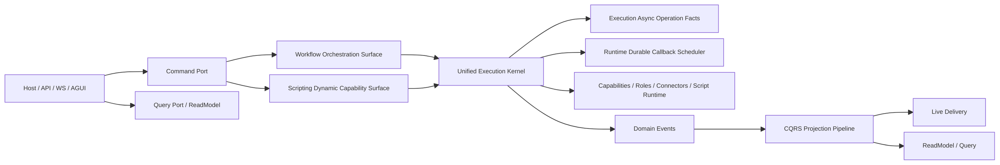
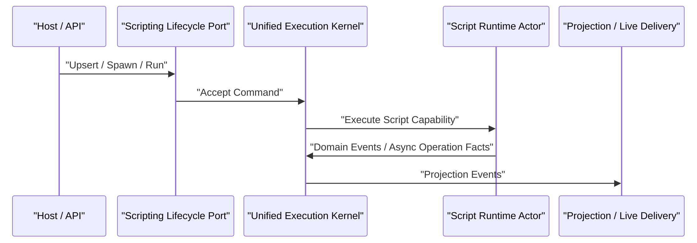
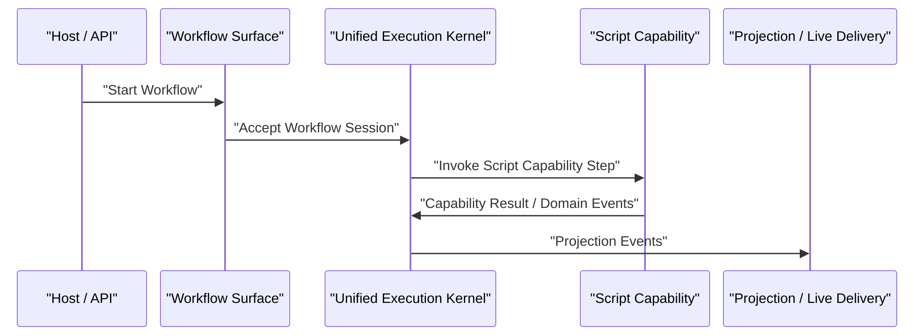

# Runtime Phase-8 Unified Execution Kernel / Workflow Orchestration / Scripting Dynamic Capability 重构蓝图（Delivered, Breaking Change）

## 1. 文档元信息

1. 状态：`Delivered`
2. 版本：`v3`
3. 日期：`2026-03-07`
4. 决策级别：`Architecture Breaking Change`
5. 适用范围：
   - `src/workflow/Aevatar.Workflow.*`
   - `src/Aevatar.Scripting.*`
   - `src/Aevatar.CQRS.Core.Abstractions`
   - `src/Aevatar.CQRS.Projection.*`
   - `src/Aevatar.Foundation.Core`
   - `src/Aevatar.Foundation.Runtime`
   - `src/Aevatar.Host.*`
   - `src/Aevatar.Mainnet.Host.Api`
   - `docs/WORKFLOW.md`
   - `docs/SCRIPTING_ARCHITECTURE.md`
   - `docs/architecture/*`
   - `test/Aevatar.Workflow.*`
   - `test/Aevatar.Scripting.*`
   - `test/Aevatar.CQRS.*`
   - `test/Aevatar.Integration.Tests`
6. 非范围：
   - Orleans mixed-version 升级验证链删除或弱化
   - Workflow YAML 新产品语法设计
   - Script 领域规则本身变更
   - Elasticsearch / Neo4j / InMemory projection provider 的底层存储实现重写
   - LLM provider / connector 产品语义调整
7. 本版结论：
   - 这轮交付已经把 `scripting` 从“对称 DSL”叙事收正为“动态 capability implementation layer”。
   - `workflow` 与 `scripting` 继续并存，但外部协议已经统一到：
     - `command ack`
     - `live delivery`
     - `query/read model`
   - `scripting evolution/runtime` 的 query authority 已切回 owner actor state：
     - `RuntimeScriptEvolutionSnapshotQueryService`
     - `RuntimeScriptExecutionSnapshotQueryService`
   - `CQRS Projection` 已收窄回读侧与 live delivery；不再作为 scripting completion/query authority。
   - `workflow` run 创建已不再硬依赖 projection live delivery。

## 1.1 已交付结果快照

1. `workflow`
   - run 可在无 live delivery 的情况下被接受
   - projection attachment 降级为可选能力，不再是业务 gate
2. `scripting`
   - evolution 命令返回 `ScriptEvolutionCommandAccepted`
   - direct runtime run 返回 `ScriptRuntimeRunAccepted`
   - proposal/runtime 终态查询改为 owner actor state snapshot query
   - script capability surface 通过 `ScriptEvolutionDecision` 暴露基于 `ack + live delivery + snapshot query` 的高层 terminal helper
3. `projection`
   - scripting projection 层移除了把 read model store 当作 query authority 的做法
   - `ScriptEvolutionSessionCompletedEvent` 通过 session actor stream mirror 提供 live delivery
4. 验证
   - `ScriptExternalEvolutionE2ETests` 通过
   - `ScriptAutonomousEvolutionOrleans3ClusterConsistencyTests` 通过

## 2. 修正后的核心判断

### 2.1 `scripting` 不是“仅仅用于编排”

从当前代码看，`scripting` 已经明确承担了“动态能力定义、编译、执行、状态推进、读模型演算”的职责，而不是单纯编排：

1. [AddScriptCapability()](/Users/auric/aevatar/src/Aevatar.Scripting.Hosting/DependencyInjection/ServiceCollectionExtensions.cs#L19) 注册了：
   - `IScriptExecutionEngine`
   - `IScriptPackageCompiler`
   - `IScriptRuntimeCapabilityComposer`
   - `IScriptRuntimeExecutionOrchestrator`
   - `IScriptLifecyclePort`
   - `IScriptEvolutionFlowPort`
2. [RoslynScriptPackageCompiler.cs](/Users/auric/aevatar/src/Aevatar.Scripting.Infrastructure/Compilation/RoslynScriptPackageCompiler.cs#L28) 会：
   - 校验源码与沙箱策略
   - 做 Roslyn 语义编译
   - 动态加载程序集
   - 强制脚本实现 `IScriptPackageRuntime`，见 [RoslynScriptPackageCompiler.cs](/Users/auric/aevatar/src/Aevatar.Scripting.Infrastructure/Compilation/RoslynScriptPackageCompiler.cs#L201)
3. [ScriptRuntimeExecutionOrchestrator.cs](/Users/auric/aevatar/src/Aevatar.Scripting.Application/Runtime/ScriptRuntimeExecutionOrchestrator.cs#L26) 会：
   - 编译脚本包
   - 创建 `ScriptExecutionContext`
   - 调 `HandleRequestedEventAsync(...)`
   - 调 `ApplyDomainEventAsync(...)`
   - 调 `ReduceReadModelAsync(...)`
4. [IScriptLifecyclePort.cs](/Users/auric/aevatar/src/Aevatar.Scripting.Core/Ports/IScriptLifecyclePort.cs#L12) 明确暴露了：
   - `ProposeAsync`
   - `UpsertDefinitionAsync`
   - `SpawnRuntimeAsync`
   - `RunRuntimeAsync`
   - `PromoteCatalogRevisionAsync`
   - `RollbackCatalogRevisionAsync`
   - `GetCatalogEntryAsync`

这说明 `scripting` 的正确定位应该是：

1. 动态业务实现层
2. 动态 capability/runtime 定义层
3. 可替代大量静态业务代码的实现面

而不是“只是另一套编排 DSL”。

### 2.2 `workflow` 也不是“更强的 scripting”

`workflow` 的价值不在于表达能力最大，而在于：

1. 显式编排
2. 可审计
3. 可投影
4. 可治理
5. 可做 timeout / retry / signal / human-gate / fanout 这类系统级 orchestration

直接证据：

1. [workflow_run_state.proto](/Users/auric/aevatar/src/workflow/Aevatar.Workflow.Core/workflow_run_state.proto#L22) 显式持久化了大量 orchestration facts
2. [WorkflowRunGAgent.Dispatch.cs](/Users/auric/aevatar/src/workflow/Aevatar.Workflow.Core/WorkflowRunGAgent.Dispatch.cs#L9) 直接承担 step dispatch + timeout registration
3. [WorkflowAsyncOperationReconciler.cs](/Users/auric/aevatar/src/workflow/Aevatar.Workflow.Core/WorkflowAsyncOperationReconciler.cs#L9) 统一承担 callback / timeout / response 对账

因此终局上：

1. `scripting` 应该比 YAML workflow 更灵活
2. 但这种灵活是“能力实现灵活”
3. 不是“系统编排主干有两套”

一句话：

`script 更擅长做事，workflow 更擅长排事。`

## 3. 最佳实践基线

本蓝图采用下面 14 条硬约束：

1. 一个系统可以有多种 authoring / implementation surface，但只能有一个权威 execution kernel。
2. `workflow` 与 `scripting` 可以并存，但不能成为两套并列的通用 runtime 主干。
3. `workflow` 是显式业务编排层，不负责承载复杂动态业务实现细节。
4. `scripting` 是动态 capability implementation layer，可以替代大量静态业务代码，但不负责成为第二套通用 workflow engine。
5. `scripting` 允许直接被调用，不必强制包进 workflow；但 direct invocation 也必须使用同一 execution kernel。
6. callback / timeout / retry / async completion 必须统一为“登记事实 -> durable signal -> actor 内对账”的单模型。
7. Actor 持久态是跨事件、跨重激活事实的唯一来源；中间层 lease / sink / session 不能成为事实源。
8. CQRS Projection 只做 `Command -> Event -> ReadModel -> Live Delivery`，不负责业务流程推进。
9. 外部同步确认允许 `command ack`，但 `command ack` 不能演化成第二套长流程 runtime。
10. authoring surface 的差异应该体现在 compiler / planner / capability packaging，不应该体现在 runtime kernel 的异步语义分裂。
11. projection lease 只能表示 live delivery handle，不能暗示事实状态或业务 session。
12. 平台内核、runtime scheduler、projection pipeline、基础设施适配器不允许迁移进 scripting。
13. 删除优于兼容：旧的 session callback / projection callback 编排壳如果不再是主干，应直接删除。
14. 架构规则必须能门禁化，不能靠团队记忆维持。

## 4. 重构前问题快照

### P1. 系统现在存在三套并行的运行时编排叙事

第一套是 `workflow` 的显式业务编排 runtime：

1. [workflow_run_state.proto](/Users/auric/aevatar/src/workflow/Aevatar.Workflow.Core/workflow_run_state.proto#L22) 中包含：
   - `pending_timeouts`
   - `pending_retry_backoffs`
   - `pending_delays`
   - `pending_signal_waits`
   - `pending_human_gates`
   - `pending_llm_calls`
   - `pending_parallel_steps`
   - `pending_map_reduce_steps`
   - `pending_sub_workflows`
2. [WorkflowRunGAgent.Dispatch.cs](/Users/auric/aevatar/src/workflow/Aevatar.Workflow.Core/WorkflowRunGAgent.Dispatch.cs#L9) 负责 dispatch 与 callback registration
3. [WorkflowAsyncOperationReconciler.cs](/Users/auric/aevatar/src/workflow/Aevatar.Workflow.Core/WorkflowAsyncOperationReconciler.cs#L9) 负责 timeout / callback / completion 对账

第二套是 `scripting` 的动态 capability runtime + specialized orchestration：

1. [ScriptRuntimeExecutionOrchestrator.cs](/Users/auric/aevatar/src/Aevatar.Scripting.Application/Runtime/ScriptRuntimeExecutionOrchestrator.cs#L26) 自己承担动态能力执行主链
2. [ScriptRuntimeGAgent.DefinitionQuery.cs](/Users/auric/aevatar/src/Aevatar.Scripting.Core/ScriptRuntimeGAgent.DefinitionQuery.cs#L147) 自己维护 definition query wait / timeout / recovery
3. [ScriptEvolutionSessionGAgent.Lifecycle.cs](/Users/auric/aevatar/src/Aevatar.Scripting.Core/ScriptEvolutionSessionGAgent.Lifecycle.cs#L12) 自己维护 evolution session execution orchestration
4. [ScriptEvolutionSessionState](/Users/auric/aevatar/src/Aevatar.Scripting.Abstractions/script_host_messages.proto#L106) 已持有 session terminal facts 与 pending reply facts

第三套是 `projection callback` 的 session/lease/live-sink orchestration：

1. [WorkflowRunContextFactory.cs](/Users/auric/aevatar/src/workflow/Aevatar.Workflow.Application/Runs/WorkflowRunContextFactory.cs#L32) 要先看 `ProjectionEnabled`
2. [EventSinkProjectionLeaseOrchestrator.cs](/Users/auric/aevatar/src/Aevatar.CQRS.Core.Abstractions/Streaming/EventSinkProjectionLeaseOrchestrator.cs#L8) orchestrate `ensure + attach + detach + release`
3. [ProjectionRuntimeLeaseBase.cs](/Users/auric/aevatar/src/Aevatar.CQRS.Projection.Core/Orchestration/ProjectionRuntimeLeaseBase.cs#L3) 维护 live sink subscription container

结论：

1. `workflow` 不是唯一 runtime owner
2. `scripting` 不只是 capability runtime，也已经带着第二套 specialized orchestration runtime
3. `projection` 仍在被当作应用层 session orchestration 壳

### P2. `scripting` 的真实目标和文档叙事不一致

当前实现表明，`scripting` 不是“另一个 DSL”，而是“动态代码实现层”：

1. [RoslynScriptPackageCompiler.cs](/Users/auric/aevatar/src/Aevatar.Scripting.Infrastructure/Compilation/RoslynScriptPackageCompiler.cs#L58) 真正做 Roslyn 编译
2. [RoslynScriptPackageCompiler.cs](/Users/auric/aevatar/src/Aevatar.Scripting.Infrastructure/Compilation/RoslynScriptPackageCompiler.cs#L212) 强制脚本实现 runtime interface
3. [ScriptRuntimeExecutionOrchestrator.cs](/Users/auric/aevatar/src/Aevatar.Scripting.Application/Runtime/ScriptRuntimeExecutionOrchestrator.cs#L79) 驱动脚本处理请求事件
4. [ScriptRuntimeExecutionOrchestrator.cs](/Users/auric/aevatar/src/Aevatar.Scripting.Application/Runtime/ScriptRuntimeExecutionOrchestrator.cs#L131) 与 [ScriptRuntimeExecutionOrchestrator.cs](/Users/auric/aevatar/src/Aevatar.Scripting.Application/Runtime/ScriptRuntimeExecutionOrchestrator.cs#L136) 直接让脚本参与 state apply 与 read model reduce

但现有 phase-8 初版文档把它写成了与 `workflow DSL` 对称的 `Scripting DSL`。这会把边界画错。

### P3. `scripting` 的 direct invocation 与 orchestrated invocation 没有被明确区分

当前 `scripting` 同时支持：

1. 直接执行动态 capability
   - `SpawnRuntimeAsync(...)`
   - `RunRuntimeAsync(...)`
2. 维护 definition/catalog/evolution 生命周期
3. 也可以被 workflow 间接调用

问题在于：

1. 文档里没有明确“direct invocation 是一等能力”
2. 架构上容易被误写成“所有 script 都应该变成 workflow 子步骤”
3. 这会错误削弱 `scripting` 替代静态业务代码的价值

### P4. `workflow` 与 `scripting` 的边界仍不够硬

现在真实存在的风险是：

1. 开发者会把复杂业务流程继续塞进 scripting session/runtime
2. 或者把所有动态业务实现都误塞回 workflow primitive
3. 这样两边都会越界：
   - `workflow` 变得过重
   - `scripting` 变成第二套通用编排系统

### P5. `CQRS projection callback` 仍然带着“应用层编排入口”语义

这是现有外部协议不统一的核心来源：

1. `workflow` 这边更像 “先建 projection session，再启动 run”
2. `scripting` 这边更像 “直接 request-reply 等 terminal decision”
3. 同一个系统内同时存在：
   - projection-lease 主导的外部完成协议
   - request-reply 主导的外部完成协议

## 5. 重构前根因分析

这些问题的根因不是“文件太长”，而是下面 7 个架构偏差没有彻底清掉：

1. 错把 `scripting` 理解成了 `workflow` 的对称 DSL，而不是动态 capability implementation layer。
2. authoring surface、capability implementation、execution kernel 三层没有明确拆开。
3. specialized orchestration 没有被限制在脚本领域内部，开始向通用业务编排外溢。
4. projection live delivery 被设计成了应用层 session 编排壳。
5. callback / timeout 只统一到了底层传输与 fired-envelope，没有统一到领域级 async-operation contract。
6. direct capability invocation 与 orchestrated capability invocation 没有共享同一个清晰协议模型。
7. 外部 API 没有统一成：
   - command ack
   - live delivery
   - query/read model

## 6. 终局目标

phase-8 完成后，系统必须满足下面 12 条终局约束：

1. `workflow` 与 `scripting` 都能存在，但职责不同：
   - `workflow` = orchestration surface
   - `scripting` = dynamic capability implementation surface
2. `scripting` 可以直接替代大量静态业务代码。
3. `scripting` 可以被直接调用，也可以被 workflow 调用。
4. `workflow` 是唯一的通用业务编排 authority。
5. `scripting` 不再对外提供第二套通用 orchestration runtime。
6. `workflow` 与 `scripting` 必须共享同一个 `Unified Execution Kernel`。
7. 所有 timeout / retry / callback / async response 一律通过统一 `Execution Async Operation` 契约登记与对账。
8. `CQRS projection` 只保留：
   - reducer / projector
   - store dispatch
   - live delivery
   - query/read model
9. `projection lease/session` 不再承担应用层业务会话事实。
10. direct script invocation 与 workflow-invoked script capability 使用同一 kernel、同一 async-operation 语义。
11. 外部完成协议统一成：
   - `Command Ack`
   - `Live Delivery`
   - `Query / ReadModel`
12. 所有需要跨 reactivation 收敛的 pending fact 都只能存在于 owner actor state 中，不存在于 projection runtime lease 或中间层 sink 容器中。

## 7. 目标架构

### 7.1 总体模型

### 7.2 分层解释

#### Platform Kernel Layer

包括：

1. `Foundation Runtime`
2. `Durable Callback Scheduler`
3. `CQRS Projection Pipeline`
4. `Host` 组合与基础设施适配

这一层是平台内核，不允许迁入 scripting。

#### Workflow Orchestration Surface

负责：

1. 声明式业务编排
2. 多 capability 排程
3. timeout / retry / signal / human-gate / fanout / map-reduce 等系统级 orchestration

不负责：

1. 实现复杂业务算法本体
2. 替代动态能力实现层

#### Scripting Dynamic Capability Surface

负责：

1. 动态定义业务能力
2. 动态编译和加载运行时代码
3. 定义 script runtime 如何处理请求事件
4. 定义 domain event 应用与 read model 演算
5. 定义脚本能力的 contract / state / read model

不负责：

1. 成为第二套通用 workflow engine
2. 替代平台 callback/projection/runtime kernel

#### Unified Execution Kernel

是唯一权威 runtime，负责：

1. execution session / run owner
2. async operation registration
3. timeout / callback / retry fired reconcile
4. effect dispatch
5. terminal completion / failure
6. emitting domain events for projection

#### CQRS Projection

只负责：

1. consume domain events
2. update read models
3. live push
4. read-side query

明确不负责：

1. 启动业务 session
2. 维护业务 callback runtime
3. 业务流程完成等待

## 8. 两条主入口，但一个内核

### 8.1 Direct Script Capability Invocation

这条入口必须保留，而且是一等能力：

语义：

1. 用户直接调用一个 script capability
2. 不需要 workflow
3. 但仍然使用统一 execution session / async operation / projection 协议

### 8.2 Workflow-Orchestrated Capability Invocation

第二条入口仍然存在：

语义：

1. workflow 编排多个能力
2. script capability 只是其中一种 capability
3. 两条路径共享同一个 kernel 与同一套 async-operation 语义

## 9. 明确的破坏性决策

1. 删除“`scripting` 与 `workflow` 是对称 DSL”的叙事。
2. 保留 `scripting` 的 direct invocation 一等地位，不强制所有 script 都经 workflow 间接调用。
3. 删除“projection lifecycle 是应用层主会话编排入口”的语义。
4. 删除 `workflow` 侧对 `ProjectionEnabled` 的硬依赖；run 不能因为 projection disabled 而不可创建。
5. 删除 `scripting` 侧把长流程 `request-reply` 作为终局外部完成协议的主模型。
6. 删除 `workflow` 与 `scripting` 各自私有的底层 async-operation 语义命名；统一为同一个 kernel contract。
7. `projection lease` 不再表达“业务会话”，只表达“live delivery attachment handle”。
8. 不保留三条并行外部完成协议的兼容壳。

## 10. 核心设计

### 10.1 统一的 Execution Session 模型

新增统一抽象：

1. `ExecutionSessionState`
2. `ExecutionSessionAcceptedEvent`
3. `ExecutionSessionCompletedEvent`
4. `ExecutionSessionFailedEvent`
5. `ExecutionSessionStatusChangedEvent`

统一字段要求：

1. `session_id`
2. `owner_actor_id`
3. `session_kind`
   - `workflow_run`
   - `script_runtime_run`
   - `script_evolution_session`
4. `surface_kind`
   - `workflow`
   - `scripting_direct`
   - `workflow_invoked_script`
5. `target_capability_id`
6. `current_status`
7. `terminal_result`

原则：

1. direct script invocation 与 workflow invocation 都是 `ExecutionSession`
2. 差异在 `session_kind/surface_kind`
3. 不在底层 runtime 协议上分叉

### 10.2 统一的 Async Operation 契约

新增统一模型：

1. `ExecutionAsyncOperationState`
2. `ExecutionAsyncOperationRegisteredEvent`
3. `ExecutionAsyncOperationResolvedEvent`
4. `ExecutionAsyncOperationTimedOutEvent`
5. `ExecutionAsyncOperationCancelledEvent`

统一字段：

1. `operation_id`
2. `session_id`
3. `kind`
   - `definition_query`
   - `timeout`
   - `retry_backoff`
   - `signal_wait`
   - `human_gate`
   - `llm_watchdog`
   - `external_call`
   - `child_session`
4. `correlation_keys`
5. `semantic_generation`
6. `callback_id`
7. `requested_at`
8. `deadline_at`

统一规则：

1. 不再由每个子系统各自发明一套 `pending_*` 基础 contract
2. `workflow` 可以保留业务级 pending slice，但底层 operation contract 必须统一
3. `scripting` 的 definition query / evolution pending 也映射到同一 operation 模型

### 10.3 `workflow` 的定位

`workflow` 继续是唯一通用业务编排面。

负责：

1. step graph
2. branch / fanout / map_reduce / race / while
3. timeout / retry / delay / signal / human interaction
4. cross-capability orchestration

不负责：

1. 替代动态业务实现层
2. 发明一套独立于其他子系统的 async-operation runtime 契约

实现方式：

1. `WorkflowRunGAgent` 变成 unified kernel 的一个 orchestration surface adapter
2. workflow primitive 负责 capability selection 与 sequencing
3. script capability 作为一种可被编排的 capability family 接入

### 10.4 `scripting` 的定位

`scripting` 不是对称 DSL，而是动态 capability implementation layer。

负责：

1. script definition/catalog/runtime/evolution
2. script capability compile / validate / execute
3. script-specific state / read model contract
4. 用动态代码替代大量静态业务实现

不负责：

1. 对外暴露第二套通用业务编排系统
2. 维持跟 workflow 同级的 callback / pending / completion 外部协议
3. 替代平台 kernel、projection pipeline、callback scheduler

具体落点：

1. `RunScriptRequestedEvent` 仍然是一等 direct invocation 入口
2. workflow 也可以通过 script primitive 间接调用 script capability
3. 两条路径共享同一 execution kernel

### 10.5 CQRS Projection Callback 的新边界

`CQRS Projection` 必须从“应用层会话编排”退回到“读侧 + live delivery”。

保留：

1. reducer / projector
2. ownership of read-side dispatch
3. store dispatch compensation
4. live sink attach/detach
5. query reader

收窄：

1. `EnsureActorProjectionAsync(...)` 不能再成为创建 run/session 的先决条件
2. `ProjectionEnabled` 不能再决定业务命令能否被接受
3. `ProjectionRuntimeLeaseBase` 只表示 live subscription handle，不表示 business session
4. `EventSinkProjectionLeaseOrchestrator` 退化成纯 delivery utility

### 10.6 外部 API 统一模型

外部交互统一成三段：

1. `Command Ack`
   - 只确认命令被哪个 owner 接受
   - 返回 `session_id / actor_id / accepted / rejection_reason`
2. `Live Delivery`
   - 可选
   - 只提供流式事件更新
3. `Query / ReadModel`
   - 最终一致性的权威读取

语义后果：

1. `workflow chat` 不再依赖 projection enabled 才能启动 run
2. `scripting direct invocation` 也不再依赖专用长流程 reply 协议
3. `request-reply` 仅用于 command ack，不用于承担完整长流程终态协作

### 10.7 Static Code / Script Code 的边界

为了支持“script 替代静态业务代码”，需要明确什么能迁入 script，什么不能：

适合迁入 `scripting`：

1. 业务规则
2. 数据转换
3. 领域决策
4. capability 内部状态推进
5. capability 级 read model 演算

不适合迁入 `scripting`：

1. actor runtime kernel
2. durable callback scheduler
3. CQRS projection pipeline
4. store dispatch / compensation 内核
5. runtime transport / stream plumbing
6. host composition 与基础设施适配

## 11. 从旧模型到当前交付结果的映射

### 11.1 Workflow 映射

交付结果：

1. `workflow` run 创建已先于 live delivery attachment。
2. projection provider 只表达 live delivery capability，不再决定 run 是否能被接受。
3. `WorkflowRunContextFactory` 已收口为“create run first, attach live delivery optional”模型。

### 11.2 Scripting Runtime 映射

交付结果：

1. `ScriptRuntimeGAgent` 仍保留脚本域专属的 `pending_definition_queries`，但其 query authority 已固定为 owner actor state。
2. runtime terminal facts 通过 `QueryScriptRuntimeSnapshotRequestedEvent` / `ScriptRuntimeSnapshotRespondedEvent` 暴露。
3. projection store 不再承担 runtime query authority。

### 11.3 Scripting Direct Invocation 映射

交付结果：

1. direct invocation 继续保留 `SpawnRuntimeAsync(...)` 与 `RunRuntimeAsync(...)`。
2. `RunRuntimeAsync(...)` 返回 `ScriptRuntimeRunAccepted`，只确认命令已被 runtime actor 接受。
3. direct invocation 的终态读取统一走 runtime snapshot query 或 read model。

### 11.4 Scripting Evolution 映射

交付结果：

1. `RuntimeScriptEvolutionLifecycleService` 现在等待的是 `ScriptEvolutionCommandAcceptedEvent`。
2. `ScriptEvolutionSessionState` 已不再保存专用 pending reply facts。
3. terminal result 统一通过：
   - `QueryScriptEvolutionProposalSnapshotRequestedEvent`
   - `ScriptEvolutionProposalSnapshotRespondedEvent`
   - read model / live delivery
   暴露。

### 11.5 Projection 映射

交付结果：

1. `ProjectionRuntimeLeaseBase` 仍保留 live sink subscription plumbing。
2. projection lifecycle 已从业务 completion/query authority 退回到 live delivery plumbing。
3. `ScriptEvolutionSessionCompletedEvent` 通过 session actor stream mirror 后进入 projection live delivery。

## 12. 已执行重构工作包

### WP1. 引入 Unified Execution Kernel 抽象

范围：

1. `src/Aevatar.Foundation.Core`
2. `src/Aevatar.Foundation.Runtime`
3. `src/workflow/Aevatar.Workflow.Core`
4. `src/Aevatar.Scripting.Core`

交付：

1. 新的 `ExecutionSession*` 与 `ExecutionAsyncOperation*` 协议
2. callback fired -> operation reconcile 的统一 helper
3. `semantic_generation / callback_id / operation_id` 统一字段规范

完成标准：

1. `workflow` 与 `scripting` 都不再发明新的底层 pending callback contract

### WP2. Workflow 脱离 Projection Session 依赖

范围：

1. `src/workflow/Aevatar.Workflow.Application`
2. `src/workflow/Aevatar.Workflow.Host.Api`
3. `src/workflow/Aevatar.Workflow.Projection`

交付：

1. `WorkflowRunContextFactory` 改成：
   - create run first
   - attach projection sink optional
2. 删除“projection disabled -> run start rejected”语义
3. projection lifecycle contract 更名或文档化为 `live delivery` 语义

完成标准：

1. run 创建不依赖 projection enabled
2. projection provider 崩溃不会阻止命令被接受

### WP3. Scripting Runtime 对齐 Unified Async Operation

范围：

1. `src/Aevatar.Scripting.Core/ScriptRuntimeGAgent*`
2. `src/Aevatar.Scripting.Abstractions/script_host_messages.proto`

交付：

1. definition query pending 改成统一 operation fact
2. timeout fired / response arrived 统一经 operation reconcile
3. activation-local lease 只保留技术缓存，不表达事实

完成标准：

1. `ScriptRuntimeGAgent` 不再拥有专用的 definition-query runtime contract

### WP4. Scripting Direct Invocation Kernel 化

范围：

1. `src/Aevatar.Scripting.Infrastructure/Ports/RuntimeScriptExecutionLifecycleService.cs`
2. `src/Aevatar.Scripting.Core/Ports/IScriptLifecyclePort.cs`
3. `src/Aevatar.Scripting.Core/ScriptRuntimeGAgent*`
4. `src/Aevatar.Scripting.Projection`

交付：

1. direct invocation 接入统一 session model
2. direct invocation completion 与 live delivery/read model 对齐 workflow
3. direct invocation 与 workflow invocation 共享同一 async-operation contract

完成标准：

1. direct script invocation 是一等能力，且不再拥有私有 runtime 协议

### WP5. Scripting Evolution 脱离专用长流程 Reply 主干

范围：

1. `src/Aevatar.Scripting.Core/ScriptEvolutionSessionGAgent*`
2. `src/Aevatar.Scripting.Infrastructure/Ports/RuntimeScriptEvolutionLifecycleService.cs`
3. `src/Aevatar.Scripting.Projection`

交付：

1. `ProposeAsync` 改为 command ack + query/read model 模型
2. `ScriptEvolutionDecisionRespondedEvent` 退出主链，由 `ScriptEvolutionCommandAcceptedEvent + snapshot query` 替代
3. terminal result 改由 unified session projection/read model 承载

完成标准：

1. 不再存在 scripting 专属的“长流程主 reply 协议”

### WP6. Projection Callback 收边界

范围：

1. `src/Aevatar.CQRS.Core.Abstractions`
2. `src/Aevatar.CQRS.Projection.Core`
3. `src/workflow/Aevatar.Workflow.Projection`
4. `src/Aevatar.Scripting.Projection`

交付：

1. rename / refactor `lease/session` 语义文档
2. `ProjectionEnabled` 从业务 gate 改为 delivery capability gate
3. `EventSinkProjectionLeaseOrchestrator` 从应用主干退回 utility

完成标准：

1. projection callback 不再被理解为业务 callback runtime

### WP7. Workflow / Scripting Surface 边界显式化

范围：

1. `src/workflow/Aevatar.Workflow.Core`
2. `src/Aevatar.Scripting.Application`
3. `docs/WORKFLOW.md`
4. `docs/SCRIPTING_ARCHITECTURE.md`
5. `demos/*`

交付：

1. 文档明确：
   - workflow = orchestration surface
   - scripting = dynamic capability implementation surface
2. direct invocation 与 workflow invocation 两条路径都被写清楚
3. workflow 增加 script capability primitive 规范

完成标准：

1. 团队不会再把 `scripting` 理解成“另一种 workflow DSL”

### WP8. 删除旧兼容壳

范围：

1. `request-reply` 长流程终态壳
2. projection-as-session 主干壳
3. 旧文档叙事

交付：

1. 删除不再需要的 helper / port / response event
2. 更新 demo / tests / docs

完成标准：

1. 源码中不再有三套并行 runtime 主叙事

## 13. 测试矩阵

### 13.1 Kernel Correctness

1. callback fired after restart still reconciles once
2. stale generation callback is ignored
3. response-before-timeout and timeout-before-response are both deterministic
4. duplicate callback fire does not re-complete operation

### 13.2 Workflow

1. run can start when projection live delivery is disabled
2. attach live sink after run accepted still receives subsequent events
3. workflow timeout / signal / human gate / llm watchdog continue to recover across reactivation
4. script capability invoked inside workflow uses same async-operation contract

### 13.3 Scripting Direct Invocation

1. direct script runtime invocation can complete without workflow
2. direct invocation emits unified session events
3. direct invocation read model is queryable through the unified read-side contract
4. direct invocation under restart/failover still converges

### 13.4 Scripting Evolution

1. definition query recovery uses unified operation facts
2. evolution session accepted via command ack, terminal state visible via read model
3. no extra query-after-command race for write confirmation
4. 3-silo restart / failover keeps operation convergence

### 13.5 Projection

1. projection provider unavailable does not block command acceptance
2. live sink attach/detach works independently of run existence
3. read model query remains eventually consistent after terminal completion
4. compensation replay still succeeds when store dispatch partially fails

### 13.6 Integration

1. workflow + script capability + connector + human gate mixed flow
2. direct script capability invocation with callback/timeouts under failover
3. 3-node Orleans cluster with callback/timeouts under failover
4. mixed-version upgrade tests remain green
5. host websocket stream and AGUI stream both consume same projection output

## 14. CI / 守卫要求

新增或收紧以下门禁：

1. 禁止 `WorkflowRunContextFactory` 把 projection enabled 当作 run create hard gate。
2. 禁止 `RuntimeScriptEvolutionLifecycleService` 继续把 terminal decision 当作长事务 reply 主协议。
3. 禁止 direct script invocation 继续拥有私有 completion runtime 协议。
4. 禁止新的 `pending_*` callback runtime contract 在 `workflow` 或 `scripting` 中无统一 operation 对应。
5. 禁止 `ProjectionRuntimeLeaseBase` 或 `ProjectionLifecyclePortServiceBase` 被业务层用于保存事实状态。
6. 要求新增 async-operation event/reducer 必须有集成测试覆盖 restart/failover 语义。
7. 要求 `workflow`、direct `scripting`、`scripting evolution` 的外部 completion API 都能映射到统一 `ack + live delivery + query` 三段模型。
8. 要求文档中显式区分：
   - orchestration surface
   - dynamic capability surface
   - execution kernel

## 15. 迁移顺序

推荐严格按这个顺序执行：

1. `WP1`：先定义 unified kernel contract
2. `WP2`：把 workflow 从 projection session hard dependency 中剥离
3. `WP3`：把 scripting runtime definition query 对齐 unified operation
4. `WP4`：把 direct script invocation 接入 unified session model
5. `WP5`：把 scripting evolution 外部协议从长流程 reply 收掉
6. `WP6`：再收窄 projection callback 边界
7. `WP7`：最后统一 workflow/scripting 叙事与 compiler/capability 边界
8. `WP8`：删除旧壳并清文档/测试

这个顺序不能反过来。先删 projection/reply 壳，再定义统一 kernel，会把系统短时间推回到无主协议状态；先削弱 direct script invocation，会错误伤害 `scripting` 替代静态业务代码的主价值。

## 16. DoD

只有同时满足下面条件，phase-8 才算完成：

1. `workflow` 与 `scripting` 不再被描述成两套对称 DSL。
2. 文档、代码、测试都明确：
   - `workflow` = orchestration surface
   - `scripting` = dynamic capability implementation surface
   - `Unified Execution Kernel` = shared runtime core
3. direct script invocation 仍然是一等能力。
4. direct script invocation 与 workflow-invoked script capability 共享统一 async-operation contract。
5. `projection callback` 只剩 read-side live delivery 语义。
6. run/session 的创建与接受不依赖 projection enabled。
7. `scripting evolution` 的外部协议不再以长事务 request-reply 为主。
8. timeout / callback / retry / response 的核心对账模型统一。
9. 文档、demo、host API、tests 都使用统一术语：
   - `command ack`
   - `live delivery`
   - `query/read model`
   - `execution session`
   - `async operation`
   - `workflow orchestration`
   - `script capability`
10. `dotnet build aevatar.slnx --nologo`
11. `dotnet test aevatar.slnx --nologo`
12. `bash tools/ci/architecture_guards.sh`
13. `bash tools/ci/test_stability_guards.sh`
14. 所有 cluster / failover / callback recovery 关键集成测试通过

## 17. 最终判断

这次重构的关键不是“二选一，只保留 workflow 或 scripting”，而是：

1. 允许 `workflow` 继续做显式业务编排
2. 允许 `scripting` 继续做动态业务实现，并替代大量静态业务代码
3. 允许 `scripting` 被直接调用，也允许它被 workflow 调用
4. 禁止二者在 runtime kernel 层各自长成一套并列主干
5. 允许 projection 做 live push
6. 禁止 projection 再承担业务 callback orchestration

一句话总结：

`多个表面，可以；多个内核，不可以。`
