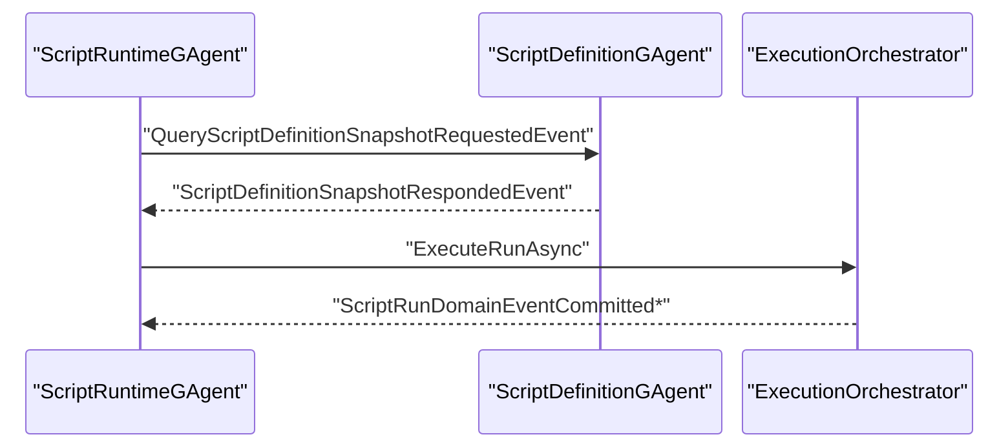
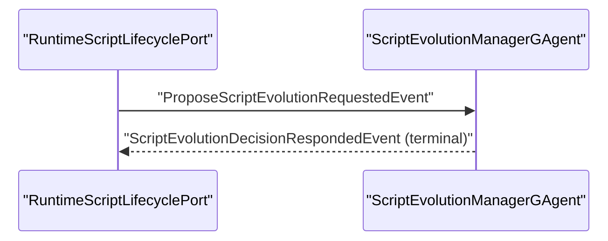

# Aevatar.Scripting 架构变更文档（2026-03-02 R3）

## 1. 变更范围

- 目标子系统：`Aevatar.Scripting.*`
- 影响边界：`Scripting` 与其 Hosting/Orleans 集成点
- 非目标：`Aevatar.Foundation.*`（本次无改动）

## 2. 变更动机

在 Orleans 3 集群场景中，旧链路存在两类阻塞风险：

1. Runtime 在事件处理路径中同步等待 Definition 查询响应，容易放大同激活队列等待。
2. Query Response 沿用原 `sourceEnvelope` 传播 publisher chain，可能被回路保护逻辑错误丢弃。

同时，旧文档仍保留“快照源接口强转读取”表述，与“纯事件通信”目标不一致。

## 3. 核心架构决策

### 决策 A：查询统一事件化

1. 在 proto 增加 Definition/Catalog/Evolution 三组 query request/response 事件。
2. Application 层新增对应 Query Adapter，统一封装 `EventEnvelope`。
3. Hosting 端口全部通过 `query -> reply stream -> response` 完成读取，不再依赖 Core 强转接口。

### 决策 B：响应链路去 `sourceEnvelope` 继承

1. Definition/Catalog/EvolutionManager 的 Query Response 统一使用 `sourceEnvelope: null` 发送。
2. 避免响应事件被 publisher chain 的回路过滤误判为重复链路。

### 决策 C：Runtime Orleans 路径改为“先查询后执行”

1. `ScriptRuntimeGAgent` 在 Orleans EventPublisher 下，不再直接调用同步 snapshot 端口。
2. 改为先发 `QueryScriptDefinitionSnapshotRequestedEvent`，把 run 请求放入 `_pendingRuns`。
3. 收到 `ScriptDefinitionSnapshotRespondedEvent` 后恢复执行。

### 决策 D：Spawn 与 Definition 查询解耦

1. `RuntimeScriptLifecyclePort.SpawnRuntimeAsync` 删除定义快照依赖。
2. Spawn 只负责 runtime actor id 生成与创建/复用。
3. Definition 正确性校验留在实际 run 阶段（Runtime Query + revision 对账）。

### 决策 E：演化决策改为推送式回传

1. `ProposeScriptEvolutionRequestedEvent` 新增 `decision_request_id/decision_reply_stream_id`。
2. `RuntimeScriptLifecyclePort` 在发起提案前订阅回传 stream，等待单次决策响应。
3. `ScriptEvolutionManagerGAgent` 在提案终态（promoted/rejected）直接推送 `ScriptEvolutionDecisionRespondedEvent`，移除轮询式决策探测。

### 决策 F：查询超时抽象化

1. 引入 `IScriptingPortTimeouts` 与 `DefaultScriptingPortTimeouts`。
2. `RuntimeScriptDefinitionSnapshotPort`、`RuntimeScriptLifecyclePort` 全部改用注入式超时策略，不再写死端口超时常量。

## 4. 变更前后对比

### 4.1 Definition 查询

- 变更前：Runtime/Port 同步等待，Orleans 路径易放大等待。
- 变更后：Orleans 路径事件化查询 + Actor 内恢复执行。

### 4.2 Catalog/Evolution 查询

- 变更前：存在响应链路丢包风险。
- 变更后：`sourceEnvelope: null` 统一规避 publisher chain 回路误杀。

### 4.3 Runtime Spawn

- 变更前：Spawn 阶段同步依赖 definition snapshot。
- 变更后：Spawn 与 snapshot 解耦，避免脚本执行链路再入同步等待。

## 5. 关键实现锚点

1. 协议扩展：`src/Aevatar.Scripting.Abstractions/script_host_messages.proto`
2. 查询适配器：
   - `src/Aevatar.Scripting.Application/Application/QueryScriptDefinitionSnapshotRequestAdapter.cs`
   - `src/Aevatar.Scripting.Application/Application/QueryScriptCatalogEntryRequestAdapter.cs`
3. Query Handler：
   - `src/Aevatar.Scripting.Core/ScriptDefinitionGAgent.cs`
   - `src/Aevatar.Scripting.Core/ScriptCatalogGAgent.cs`
   - `src/Aevatar.Scripting.Core/ScriptEvolutionManagerGAgent.cs`
4. Runtime Orleans 事件化执行：
   - `src/Aevatar.Scripting.Core/ScriptRuntimeGAgent.cs`
5. Spawn 解耦：
   - `src/Aevatar.Scripting.Infrastructure/Ports/RuntimeScriptLifecyclePort.cs`
6. Query 端口：
   - `src/Aevatar.Scripting.Infrastructure/Ports/RuntimeScriptDefinitionSnapshotPort.cs`
   - `src/Aevatar.Scripting.Infrastructure/Ports/RuntimeScriptLifecyclePort.cs`

## 6. 时序变化

### 6.1 运行时定义查询（Orleans 路径）

### 6.2 演化决策查询

## 7. 测试与验证

已验证命令（2026-03-02）：

1. `dotnet test test/Aevatar.Scripting.Core.Tests/Aevatar.Scripting.Core.Tests.csproj --nologo`：`58/58` 通过。
2. `dotnet test test/Aevatar.Integration.Tests/Aevatar.Integration.Tests.csproj --nologo --filter "FullyQualifiedName~ScriptAutonomousEvolutionE2ETests|FullyQualifiedName~ScriptAutonomousEvolutionComprehensiveE2ETests|FullyQualifiedName~ScriptAutonomousEvolutionOrleans3ClusterConsistencyTests"`：`6/6` 通过。
3. `bash tools/ci/test_stability_guards.sh`：通过。
4. `bash tools/ci/architecture_guards.sh`：通过。

## 8. 架构收益

1. Orleans 路径不再在脚本运行关键路径中形成二次同步等待。
2. Query/Response 统一协议化，三类查询行为一致。
3. 响应投递稳定性提升，避免 publisher chain 回路误判丢包。
4. Spawn 生命周期与 Definition 查询职责分离，降低耦合。

## 9. 剩余改进项

1. 运行模式判定已改为“显式配置优先 + Runtime 类型回退”策略：`Scripting:Runtime:UseEventDrivenDefinitionQuery` 未配置时，Orleans 运行时自动启用事件化定义查询；后续可继续升级为更细粒度策略提供器。
2. Query 超时策略已可注入，建议后续按环境（dev/staging/prod）提供不同实现并纳入配置治理。
