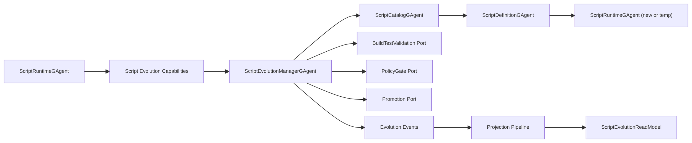
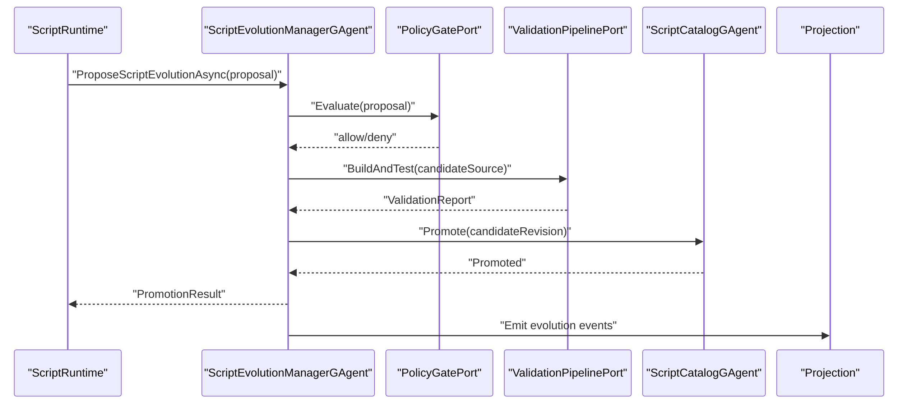
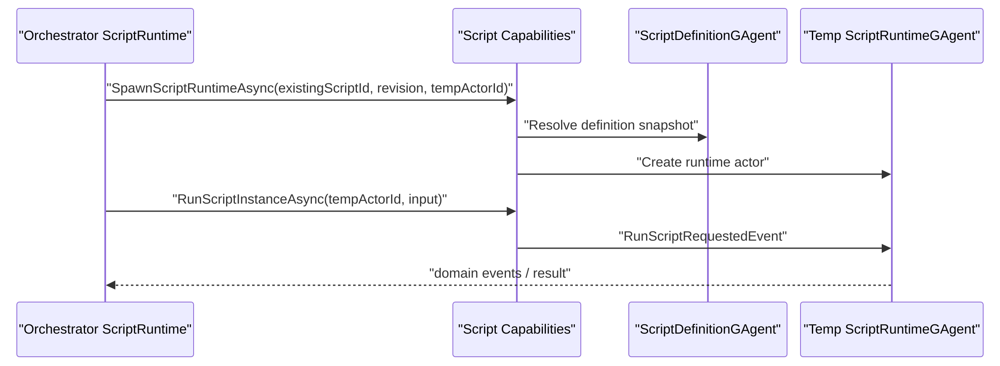
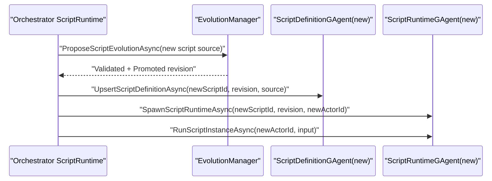

# Aevatar.Scripting 自治进化架构变更蓝图（2026-03-02）

## 1. 文档元信息

- 状态：`Draft -> Ready for Implementation`
- 版本：`v1`
- 日期：`2026-03-02`
- 范围：`Aevatar.Scripting.*` + 与 Runtime/CQRS/Hosting 的集成边界
- 目标：让 AI Agents 在脚本内完成“自升级代码 + 自改脚本 + 自创建更多脚本运行”，同时满足可控、安全、可回滚

## 2. 背景与关键决策

你提出的目标是：

1. Agent 能自己升级代码。
2. Agent 能自己改自己的代码。
3. Agent 能自己构建更多脚本运行。

关键决策：

1. 支持“自治进化”，但不支持“无治理自改写”。
2. 所有自修改必须事件化、可审计、可回滚。
3. 脚本内可发起变更，但最终生效必须经过策略门禁与自动验证。
4. 事实源只放在 Actor 持久态/分布式状态，不放进程内字典。

## 3. 变更目标

1. 将脚本能力从“执行型”升级为“执行 + 演化型”。
2. 新增脚本原生演化协议：提案、构建、验证、发布、回滚。
3. 支持脚本在运行中创建临时脚本 Agent 与新脚本 Agent。
4. 统一 `Command -> Event -> Projection -> ReadModel`，不增加旁路。
5. 全流程可自动化验证并受 CI 守卫约束。

## 3.1 Script-Only Iteration 终态定义（强制）

在“框架完全定义后”，系统进入 `Script-Only Iteration Mode`，满足以下约束：

1. 新脚本定义发布只能由脚本能力接口触发（`Propose -> Validate -> Promote`），禁止人工直写发布通道。
2. 运行中新增实例只能走脚本能力接口（`SpawnScriptRuntimeAsync` / `RunScriptInstanceAsync`）。
3. 主链路不允许“脚本外编排器”直接推进业务演化状态机。
4. 所有升级必须产生完整事件链与审计读模型记录。
5. 任一门禁失败必须自动拒绝或回滚，不允许“人工跳过继续上线”。

说明：

1. 人工运维仍可执行“停机/恢复/容量操作”，但不得绕过脚本演化协议直接改业务脚本事实版本。

## 4. 范围与非范围

范围内：

1. Scripting 抽象、Core、Application、Hosting、Projection 的自治演化能力。
2. 自治演化事件协议与状态机。
3. 脚本侧能力接口扩展与 E2E 测试体系。

范围外：

1. 直接开放脚本执行任意宿主 Shell/系统命令。
2. 绕过门禁直接改主分支源码。
3. 依赖人工内存状态完成升级流程。

## 5. 现状基线（代码事实）

当前已具备：

1. `ScriptDefinitionGAgent` + `ScriptRuntimeGAgent` 双 Actor 主链路。
2. 脚本可通过 `IScriptRuntimeCapabilities` 调用 AI、事件路由、Agent 生命周期端口。
3. 运行中可调用 `CreateAgentAsync`（测试已覆盖调用路径）。

当前缺口：

1. 缺少“脚本源码自升级”的正式协议与状态机。
2. 缺少“脚本生成新脚本定义并发布”的受控管道。
3. 缺少“从提案到发布”的审计读模型与回滚机制。
4. 现有动态创建覆盖偏向端口调用，缺少完整“创建后绑定定义并运行”的统一 E2E 套件。

## 6. 目标架构总览

## 7. 分层改造方案

### 7.1 Abstractions 改造

新增自治演化契约（建议放在 `Aevatar.Scripting.Abstractions`）：

1. `ScriptEvolutionProposal`（脚本提案：目标 scriptId、baseRevision、candidateSource、reason）。
2. `ScriptEvolutionValidationReport`（编译、静态规则、测试结果）。
3. `ScriptPromotionDecision`（批准/拒绝/回滚）。

新增事件：

1. `ScriptEvolutionProposedEvent`
2. `ScriptEvolutionBuildRequestedEvent`
3. `ScriptEvolutionValidatedEvent`
4. `ScriptEvolutionRejectedEvent`
5. `ScriptEvolutionPromotedEvent`
6. `ScriptEvolutionRollbackRequestedEvent`
7. `ScriptEvolutionRolledBackEvent`

扩展能力接口（脚本内原生）：

1. `ProposeScriptEvolutionAsync(...)`
2. `SpawnScriptRuntimeAsync(...)`
3. `UpsertScriptDefinitionAsync(...)`
4. `RunScriptInstanceAsync(...)`
5. `PromoteRevisionAsync(...)`
6. `RollbackRevisionAsync(...)`

说明：

1. 这些接口是“脚本语义能力”，不是裸露 Git/Shell 能力。
2. 内部实现可调用宿主端口，但对脚本保持语义抽象。

### 7.2 Core 改造

新增 Actor：

1. `ScriptEvolutionManagerGAgent`
2. `ScriptCatalogGAgent`

职责：

1. EvolutionManager 持有每个提案的生命周期状态。
2. Catalog 持有脚本版本目录、发布通道、回滚指针。
3. 所有状态转换必须通过事件处理推进。

Core 新端口：

1. `IScriptPolicyGatePort`
2. `IScriptValidationPipelinePort`
3. `IScriptPromotionPort`
4. `IScriptCatalogPort`

### 7.3 Application 改造

新增编排器：

1. `ScriptEvolutionOrchestrator`（提案到发布完整流程）。
2. `ScriptRuntimeProvisioningOrchestrator`（定义创建 + Runtime 创建 + 首次运行）。

新增命令适配：

1. `ProposeScriptEvolutionCommandAdapter`
2. `PromoteScriptRevisionCommandAdapter`
3. `RollbackScriptRevisionCommandAdapter`

### 7.4 Infrastructure 改造

新增能力实现：

1. `RoslynDiffAwareValidator`（编译 + AST 规则 + 变更风险检查）。
2. `ScriptTestRunner`（白名单测试集执行）。
3. `SignedArtifactStore`（候选脚本产物签名与溯源）。

安全增强：

1. Sandbox 规则从“禁止危险 API”扩展到“禁止危险升级路径”。
2. 增加 `self-rewrite` 限制：禁止脚本直接写本地文件系统源码。

### 7.5 Hosting 改造

`AddScriptCapability()` 增加：

1. 演化端口默认实现注册。
2. 策略门禁默认实现注册。
3. 审计事件发布器注册。

外部系统集成：

1. 可以接入 CI 服务，但通过 `IScriptValidationPipelinePort` 抽象，不向 Core 泄露细节。

### 7.6 Projection 改造

新增投影：

1. `ScriptEvolutionReadModelProjector`
2. `ScriptEvolutionTimelineReducer`

读模型字段建议：

1. `ProposalId`
2. `ScriptId`
3. `BaseRevision`
4. `CandidateRevision`
5. `ValidationStatus`
6. `PromotionStatus`
7. `RollbackStatus`
8. `FailureReason`
9. `UpdatedAt`

## 8. 三类核心场景目标形态

### 场景 A：多个自定义脚本 GAgent 协作

目标：

1. 一个 Orchestrator 脚本通过脚本能力编排多个子脚本 Runtime。
2. 子脚本之间通过事件通信，不通过进程内共享状态。

### 场景 B：运行中动态创建临时已定义脚本 Agent

目标：

1. 脚本在满足条件时创建临时 Runtime。
2. 临时 Runtime 绑定已有定义 revision。
3. 任务完成后可回收，生命周期有审计记录。

### 场景 C：运行中创建新的脚本 Agent（含新定义）

目标：

1. 脚本生成候选源码并发起演化提案。
2. 通过编译/测试/策略后自动发布新 revision。
3. 脚本创建并启动该新 revision 的 Runtime。

## 9. 关键时序

### 9.1 自治升级时序

### 9.2 运行中创建临时已定义脚本 Agent

### 9.3 运行中创建全新脚本 Agent

## 10. 安全与治理（强制）

1. 自治升级必须经过 `PolicyGate -> Validation -> Promotion` 三段式。
2. 禁止脚本直接写本地仓库源码文件。
3. 禁止脚本绕过事件链路直接调用非抽象实现。
4. 每次升级必须产生审计事件和可追踪 ProposalId。
5. 每次发布必须保留可回滚 revision 指针。
6. 发布失败自动回滚到上一个稳定 revision。

Script-Only 模式附加禁止项：

1. 禁止通过 Host/API 直接调用“发布某脚本 revision”为最终动作（必须经演化协议事件链）。
2. 禁止新增非脚本入口的业务升级 endpoint。
3. 禁止在 Application/Hosting 放置“临时人工开关”绕过策略门禁。

## 11. 数据与状态模型

事实源：

1. `ScriptEvolutionManagerGAgent.State`：提案生命周期。
2. `ScriptCatalogGAgent.State`：脚本版本目录与通道指针。
3. `ScriptDefinitionGAgent.State`：定义源码与 schema 信息。
4. `ScriptRuntimeGAgent.State`：运行态 payload 与最后事件。

禁止：

1. 在 Application/Hosting 中维护 `proposalId -> context` 进程内事实字典。
2. 通过 `actorId` 反查上下文模型作为事实源。

## 12. 迁移步骤（无兼容包袱）

### Phase 1：协议落地

1. 在 Abstractions 增加自治演化事件与能力接口。
2. 更新 proto 与契约测试。

### Phase 2：Core/Application 实现

1. 引入 EvolutionManager/Catalog Actor。
2. 实现演化编排器与命令适配。

### Phase 3：Infrastructure/Hosting

1. 增加策略门禁与验证流水线端口实现。
2. 加入发布、回滚、签名产物支持。

### Phase 4：Projection 与审计

1. 增加 Evolution 投影与读模型。
2. 打通查询接口与时间线展示。

### Phase 5：测试与守卫

1. 增加三类 E2E 场景。
2. 增加禁止绕过策略的架构守卫。

## 13. 测试矩阵

新增测试建议：

1. `ScriptAutonomousEvolutionE2ETests`：脚本提案升级并自动发布。
2. `ScriptAutonomousRollbackE2ETests`：验证失败触发自动回滚。
3. `ScriptTempRuntimeSpawnE2ETests`：运行时创建临时已定义 Runtime 并回收。
4. `ScriptNewAgentProvisionE2ETests`：脚本生成新定义并启动新 Runtime。
5. `ScriptPolicyGateDenialTests`：策略拒绝路径与审计事件校验。

当前已有可复用基础测试：

1. `ClaimComplexBusinessScenarioTests`（能力端口调用 + 动态创建请求）。
2. `ScriptGAgentFactoryLifecycleBoundaryTests`（真实 Runtime 生命周期）。
3. `ClaimLifecycleBoundaryTests`（Create/Destroy/Link/Unlink）。

## 14. CI 与守卫增强

新增守卫规则建议：

1. 禁止脚本能力接口暴露裸 `IServiceProvider`。
2. 禁止演化流程直接调用基础设施具体类。
3. 要求新增演化事件类型必须有对应 reducer 测试引用。
4. 要求升级流程必须写入 `ScriptEvolution*` 事件链。

继续保留现有守卫：

1. `tools/ci/architecture_guards.sh`
2. `tools/ci/projection_route_mapping_guard.sh`
3. `tools/ci/solution_split_guards.sh`
4. `tools/ci/solution_split_test_guards.sh`

## 15. 风险与对策

1. 风险：自治升级引入错误脚本。
   对策：强制验证流水线 + 灰度发布 + 自动回滚。
2. 风险：升级链路被滥用。
   对策：策略门禁与签名产物校验。
3. 风险：状态一致性丢失。
   对策：Actor 持久态作为唯一事实源，禁止中间层字典事实态。

## 16. 完成定义（DoD）

1. 三类场景全部具备 E2E 自动化测试并通过。
2. 演化流程具备可审计读模型与查询能力。
3. 失败路径可自动回滚且有事件证据。
4. 架构守卫覆盖新增规则并稳定通过。
5. 文档、代码、测试三者一致。
6. 达成 `Script-Only Iteration Mode`：无脚本外业务演化入口可绕过主链路。

## 17. 实施后验证命令

1. `dotnet build aevatar.slnx --nologo`
2. `dotnet test test/Aevatar.Scripting.Core.Tests/Aevatar.Scripting.Core.Tests.csproj --nologo`
3. `dotnet test test/Aevatar.Integration.Tests/Aevatar.Integration.Tests.csproj --nologo`
4. `bash tools/ci/architecture_guards.sh`
5. `bash tools/ci/projection_route_mapping_guard.sh`
6. `bash tools/ci/solution_split_guards.sh`
7. `bash tools/ci/solution_split_test_guards.sh`

## 18. 关键文件建议索引

1. `src/Aevatar.Scripting.Abstractions/script_host_messages.proto`
2. `src/Aevatar.Scripting.Core/ScriptDefinitionGAgent.cs`
3. `src/Aevatar.Scripting.Core/ScriptRuntimeGAgent.cs`
4. `src/Aevatar.Scripting.Application/Runtime/ScriptRuntimeExecutionOrchestrator.cs`
5. `src/Aevatar.Scripting.Hosting/DependencyInjection/ServiceCollectionExtensions.cs`
6. `src/Aevatar.Scripting.Projection/Projectors/ScriptExecutionReadModelProjector.cs`
7. `test/Aevatar.Integration.Tests/ClaimComplexBusinessScenarioTests.cs`
8. `test/Aevatar.Integration.Tests/ScriptGAgentFactoryLifecycleBoundaryTests.cs`
