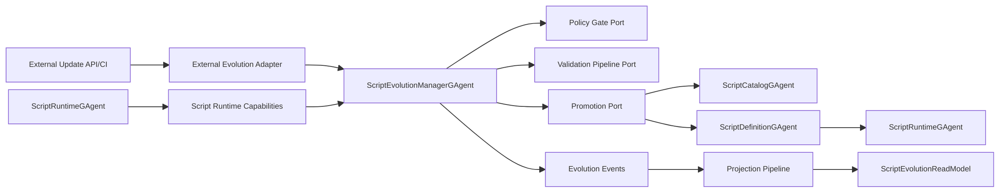
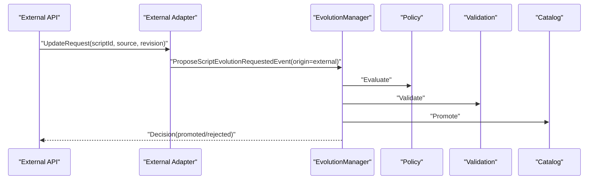
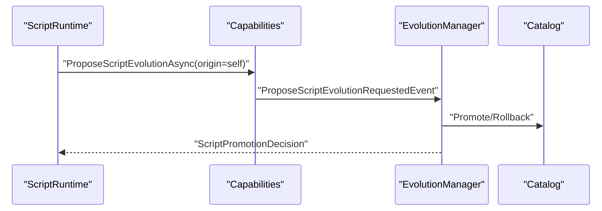

# Aevatar.Scripting 双通道演化架构变更蓝图（2026-03-01）

## 1. 文档元信息

- 状态：`Revised`
- 版本：`v2`
- 日期：`2026-03-01`
- 范围：`Aevatar.Scripting.*` + Runtime/CQRS/Hosting 集成边界
- 目标：同时支持“外部更新（Ops/API/CI）”与“脚本自我演化（AI Agent）”，并统一在同一治理主链路中生效

说明：

1. 本版替代上一版 `Script-Only Iteration` 终态定义。
2. 新终态要求“双通道可用，但单主链路治理”。

## 2. 背景与问题

当前诉求已明确为两件事同时成立：

1. 可以由外部系统对脚本进行更新与发布。
2. 脚本运行过程中也可以自我演化并发布新版本。

上一版问题：

1. 过度收紧为 `Script-Only`，外部入口被定义为禁止项。
2. 与实际运维/治理场景不匹配（人工、CI、批量治理需要外部入口）。

## 3. 关键决策

1. 采用“`双入口 + 单主链路`”模型。
2. 外部更新与自我演化都必须落入同一协议：`Propose -> Policy -> Validate -> Promote/Rollback`。
3. 任何入口都不得绕过 `ScriptEvolutionManagerGAgent` 与 `ScriptCatalogGAgent`。
4. 事实源仍由 Actor 持久态承载，禁止中间层进程内事实态映射。

## 4. 终态定义（Dual-Source Iteration Mode）

系统进入 `Dual-Source Iteration Mode` 后满足：

1. 外部入口可发起升级提案。
2. 脚本入口可发起升级提案。
3. 两条入口使用同一事件协议与状态机。
4. 发布结果都写入统一审计读模型。
5. 回滚策略对两条入口完全一致。
6. 禁止任何“直写定义+直接生效”的旁路发布。

## 5. 目标架构总览

## 6. 双入口设计

### 6.1 外部更新入口（External Channel）

入口形式：

1. Host/API 命令入口。
2. CI/CD 任务入口。
3. 运维批量发布入口。

入口职责：

1. 接收变更请求并规范化为 `ScriptEvolutionProposal`。
2. 发布 `ProposeScriptEvolutionRequestedEvent` 到 EvolutionManager。
3. 不直接调用 Definition/Catalog 做最终发布动作。

### 6.2 自我演化入口（Self-Evolution Channel）

入口形式：

1. 脚本通过 `IScriptRuntimeCapabilities.ProposeScriptEvolutionAsync(...)` 发起提案。

入口职责：

1. 与外部入口共用同一提案协议。
2. 可在运行中继续调用 `Spawn/Run` 能力执行验证型或新版本实例化流程。

## 7. 协议与抽象改造

### 7.1 Abstractions

保留并扩展：

1. `ScriptEvolutionProposal`
2. `ScriptEvolutionValidationReport`
3. `ScriptPromotionDecision`

新增建议字段：

1. `Origin`：`external | self`
2. `RequesterId`：调用者身份
3. `ChangeTicket`：外部治理单号（可选）
4. `ChannelMetadata`：可扩展审计字段

说明：

1. 外部入口和脚本入口必须都写 `Origin`，用于审计与策略分流。

### 7.2 Event 协议

继续使用统一演化事件链：

1. `ScriptEvolutionProposedEvent`
2. `ScriptEvolutionBuildRequestedEvent`
3. `ScriptEvolutionValidatedEvent`
4. `ScriptEvolutionRejectedEvent`
5. `ScriptEvolutionPromotedEvent`
6. `ScriptEvolutionRollbackRequestedEvent`
7. `ScriptEvolutionRolledBackEvent`

新增建议：

1. 在上述事件中补充 `Origin/RequesterId` 投影字段。

## 8. Core / Application / Hosting 分层职责

### 8.1 Core

1. `ScriptEvolutionManagerGAgent`：演化状态机与一致性推进。
2. `ScriptCatalogGAgent`：版本目录、激活指针、回滚指针。
3. Core 只依赖端口，不感知外部入口是 API 还是脚本。

### 8.2 Application

新增/调整：

1. 外部命令适配器（建议）：
   `ProposeExternalScriptEvolutionCommandAdapter`
2. 统一编排器：
   `ScriptEvolutionOrchestrator`（外部与脚本均调用）

### 8.3 Hosting

新增/调整：

1. 提供外部入口 endpoint/handler。
2. 外部入口只做鉴权、审计元数据补全、命令投递。
3. 禁止在 Hosting 直接“写 definition + 切 catalog”为最终发布动作。

## 9. 关键时序

### 9.1 外部更新时序

### 9.2 自我演化时序

## 10. 安全与治理

1. 两条入口统一执行 `Policy -> Validation -> Promotion`。
2. 两条入口统一写审计事件与投影。
3. 外部入口需鉴权与来源标记。
4. 自我演化入口需策略限流与沙箱限制。
5. 允许外部更新，但不允许外部“旁路发布”。
6. 允许自我演化，但不允许脚本直接操作宿主文件系统源码。

## 11. 测试矩阵（必须覆盖双入口）

新增/调整测试要求：

1. `ExternalEvolutionE2ETests`：外部入口提案到发布闭环。
2. `SelfEvolutionE2ETests`：脚本入口提案到发布闭环。
3. `DualSourceParityTests`：同一输入在 external/self 两入口输出一致状态机结果。
4. `BypassForbiddenTests`：验证外部入口不能绕过主链路直接发布。
5. `RollbackConsistencyTests`：双入口回滚行为一致。

## 12. 实施计划

### Phase 1：协议统一

1. 在 proposal/event/readmodel 增加 `Origin/RequesterId`。
2. 更新契约测试与投影测试。

### Phase 2：外部入口接入（已完成）

1. 增加外部命令适配器与 API handler。
2. 外部请求统一投递到 EvolutionManager。
3. 已落地文件：
   `src/Aevatar.Scripting.Hosting/CapabilityApi/ScriptCapabilityEndpoints.cs`
4. 已落地文件：
   `src/Aevatar.Scripting.Application/Application/ScriptEvolutionApplicationService.cs`

### Phase 3：一致性治理

1. 增加旁路发布守卫与测试。
2. 将外部与自我两条链路纳入统一审计面板。

## 13. 完成定义（DoD）

1. 外部更新与自我演化两条链路均可用。
2. 两条链路经过同一治理主链路，禁止旁路。
3. 统一投影能区分并查询 `Origin`。
4. 双入口 E2E 与一致性测试通过。
5. 架构守卫通过。

## 14. 关键文件索引（落地锚点）

1. `src/Aevatar.Scripting.Abstractions/script_host_messages.proto`
2. `src/Aevatar.Scripting.Abstractions/Definitions/IScriptRuntimeCapabilities.cs`
3. `src/Aevatar.Scripting.Core/ScriptEvolutionManagerGAgent.cs`
4. `src/Aevatar.Scripting.Core/ScriptCatalogGAgent.cs`
5. `src/Aevatar.Scripting.Hosting/DependencyInjection/ServiceCollectionExtensions.cs`
6. `src/Aevatar.Scripting.Projection/Projectors/ScriptEvolutionReadModelProjector.cs`
7. `src/Aevatar.Scripting.Hosting/CapabilityApi/ScriptCapabilityEndpoints.cs`
8. `test/Aevatar.Integration.Tests/ScriptAutonomousEvolutionE2ETests.cs`
9. `test/Aevatar.Integration.Tests/ScriptExternalEvolutionE2ETests.cs`
