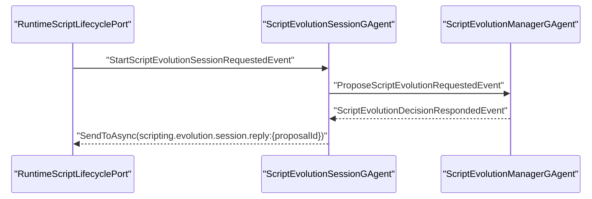
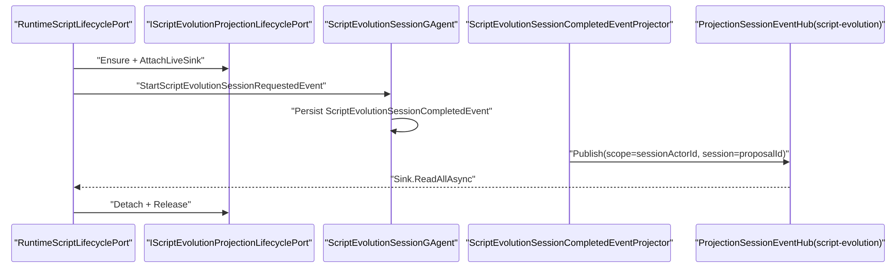

# Aevatar.Scripting 回推链路对齐 Workflow 架构变更文档（2026-03-04 R4）

## 1. 变更范围

- 目标子系统：`Aevatar.Scripting.*`
- 同步影响：`Aevatar.CQRS.Projection.Core`（释放兼容性）
- 非目标：`Workflow YAML` 语义、`Script` 领域规则、对外 API 路由

## 2. 变更动机

2026-03-04 之前，`scripting` 演化终态回推链路与 `workflow` 不一致：

1. `ScriptEvolutionSessionGAgent` 直接向固定 stream `scripting.evolution.session.reply:{proposalId}` 推送终态。
2. 缺少 `lease/sink` 生命周期编排，应用层无法与 `workflow` 复用统一 run 回推思路。
3. 回推与 projection 主链路割裂，难以落实“CQRS 与实时推送同输入链路”的治理目标。

本次目标是把 `scripting` 回推对齐到 `workflow` 的“Projection Session Pipeline”。

## 3. 核心架构决策

### 决策 A：终态回推统一走 Projection Session Event Hub

1. `ScriptEvolutionSessionGAgent` 只负责持久化 `ScriptEvolutionSessionCompletedEvent`，不再直接推流。
2. 新增 `ScriptEvolutionSessionCompletedEventProjector`，把同一事件发布到 `ProjectionSessionEventHub`。
3. 回推通道由 `script-evolution:{sessionActorId}:{proposalId}` 会话流承载。

### 决策 B：应用层编排对齐 Workflow 的 lease/sink 模式

1. 在 `RuntimeScriptLifecyclePort.ProposeAsync` 内采用：
   `ensure projection -> attach sink -> dispatch start -> wait sink -> detach -> release`。
2. 保留超时后 manager query fallback，作为跨节点抖动的兜底路径。

### 决策 C：抽离“会话回推投影上下文”避免读模型耦合

1. 新建 `ScriptEvolutionSessionProjectionContext` 仅用于终态回推 projector。
2. 演化读模型 projector 继续使用原 `ScriptEvolutionProjectionContext`。
3. 避免在仅使用 `AddScriptCapability()` 的场景中引入 read-model store binding 依赖。

### 决策 D：上移 scripting 回推契约到 Abstractions

1. 新增 `IScriptEvolutionProjectionLifecyclePort`、`IScriptEvolutionProjectionLease`。
2. 新增 `IScriptEvolutionEventSink` 与 `ScriptEvolutionEventChannel`。
3. 使 Application/Infrastructure 通过抽象编排，不绑定具体 projection 实现细节。

### 决策 E：CQRS Core 释放语义兼容同步容器

1. `ProjectionSubscriptionRegistry<TContext>` 增加 `IDisposable`。
2. `ActorStreamSubscriptionHub<TMessage>` 增加 `IDisposable`。
3. 解决 `using ServiceProvider` 场景下对 `IAsyncDisposable` 单例的同步释放异常。

## 4. 变更前后对比

### 4.1 旧链路（R3）

### 4.2 新链路（R4）

## 5. 关键实现锚点

1. 回推抽象契约：`src/Aevatar.Scripting.Abstractions/Evolution/ScriptEvolutionProjectionContracts.cs`
2. 应用编排入口：`src/Aevatar.Scripting.Infrastructure/Ports/RuntimeScriptLifecyclePort.cs`
3. 终态 projector：`src/Aevatar.Scripting.Projection/Projectors/ScriptEvolutionSessionCompletedEventProjector.cs`
4. projection 生命周期组件：
   - `src/Aevatar.Scripting.Projection/Orchestration/ScriptEvolutionProjectionLifecycleService.cs`
   - `src/Aevatar.Scripting.Projection/Orchestration/ScriptEvolutionProjectionActivationService.cs`
   - `src/Aevatar.Scripting.Projection/Orchestration/ScriptEvolutionProjectionReleaseService.cs`
   - `src/Aevatar.Scripting.Projection/Orchestration/ScriptEvolutionProjectionSinkSubscriptionManager.cs`
   - `src/Aevatar.Scripting.Projection/Orchestration/ScriptEvolutionProjectionLiveSinkForwarder.cs`
   - `src/Aevatar.Scripting.Projection/Orchestration/ScriptEvolutionSessionEventCodec.cs`
5. Session Actor 行为收敛：`src/Aevatar.Scripting.Core/ScriptEvolutionSessionGAgent.cs`
6. CQRS 核心兼容性：
   - `src/Aevatar.CQRS.Projection.Core/Orchestration/ProjectionSubscriptionRegistry.cs`
   - `src/Aevatar.CQRS.Projection.Core/Streaming/ActorStreamSubscriptionHub.cs`

## 6. 可下沉到 CQRS 框架的抽象清单

1. `ChannelEventSink<TEvent>` 通用化：当前 `WorkflowRunEventChannel` 与 `ScriptEvolutionEventChannel` 结构高度相似，可下沉至 `Aevatar.CQRS.Core`。
2. `SessionTerminalEventProjector<TContext, TEvent>` 模板化：当前 `WorkflowExecutionAGUIEventProjector` 与 `ScriptEvolutionSessionCompletedEventProjector` 都是“事件映射后发布到 SessionEventHub”的变体。
3. `Port-Orchestrated Wait` 助手：`ensure/attach/wait/detach/release` 编排可抽象为 CQRS 应用层 helper，减少能力侧重复。
4. `SinkFailurePolicy` 策略扩展点：workflow 已有较完整策略，scripting 目前是最小策略（detach）；可抽象统一策略接口并复用。
5. `AsyncDisposable Singleton Compatibility` 规范化：`IAsyncDisposable + IDisposable` 作为 CQRS Core 运行时组件的统一约束，可写入治理文档与门禁。

## 7. 兼容性与风险

1. 对外 API 合约不变：`POST /api/scripts/evolutions/proposals` 输入输出保持不变。
2. 行为变更：终态不再由 Session Actor 直接推固定 stream，而是由 projection 分支发布会话事件。
3. 风险控制：保留 manager query fallback，避免单次 sink 等待超时导致误失败。
4. 生命周期安全：统一在 `finally` 执行 `detach/release/sink dispose`，降低泄漏风险。

## 8. 验证记录（2026-03-04）

1. `dotnet build aevatar.slnx --nologo`：通过。
2. `dotnet test test/Aevatar.Scripting.Core.Tests/Aevatar.Scripting.Core.Tests.csproj --nologo`：`66/66` 通过。
3. `dotnet test test/Aevatar.Integration.Tests/Aevatar.Integration.Tests.csproj --nologo --filter "FullyQualifiedName~ScriptExternalEvolutionE2ETests|FullyQualifiedName~ScriptAutonomousEvolutionE2ETests|FullyQualifiedName~ScriptAutonomousEvolutionComprehensiveE2ETests"`：`6/6` 通过。
4. `dotnet test test/Aevatar.Hosting.Tests/Aevatar.Hosting.Tests.csproj --nologo --filter "FullyQualifiedName~ScriptCapabilityHostExtensionsTests"`：`3/3` 通过。
5. `dotnet test test/Aevatar.CQRS.Projection.Core.Tests/Aevatar.CQRS.Projection.Core.Tests.csproj --nologo`：`124` 通过（`1` skipped）。
6. `bash tools/ci/test_stability_guards.sh`：通过。

## 9. 结论

本次变更将 `scripting` 回推链路收敛到与 `workflow` 一致的 projection session 主干，消除了双轨回推实现，并明确了可进一步下沉到 CQRS 的共性抽象，为后续统一 run/event 推送框架打下了可演进基线。
