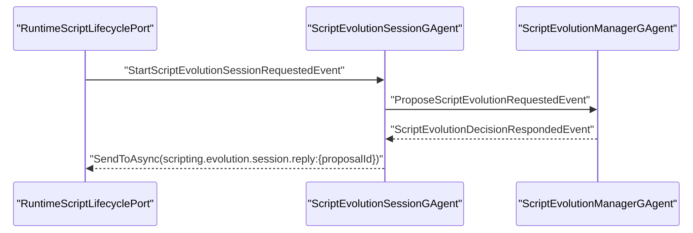
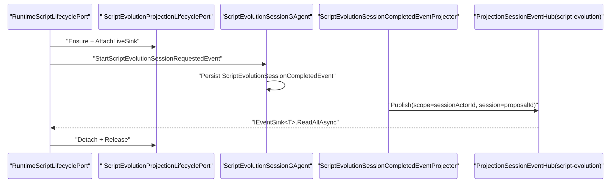

# Aevatar.Scripting 回推链路对齐 Workflow 架构变更文档（2026-03-04 R9）

## 1. 变更范围

- 目标子系统：`Aevatar.Scripting.*`
- 同步影响：`Aevatar.CQRS.Core.Abstractions`、`Aevatar.CQRS.Projection.Core`（释放兼容性）
- 非目标：`Workflow YAML` 语义、`Script` 领域规则、对外 API 路由

## 2. 变更动机

2026-03-04 之前，`scripting` 演化终态回推链路与 `workflow` 不一致：

1. `ScriptEvolutionSessionGAgent` 直接向固定 stream `scripting.evolution.session.reply:{proposalId}` 推送终态。
2. 缺少 `lease/sink` 生命周期编排，应用层无法与 `workflow` 复用统一 run 回推思路。
3. 回推与 projection 主链路割裂，难以落实“CQRS 与实时推送同输入链路”的治理目标。

本次目标是把 `scripting` 回推对齐到 `workflow` 的“Projection Session Pipeline”。

## 3. 核心架构决策

### 决策 A：终态回推统一走 Projection Session Event Hub

1. `ScriptEvolutionSessionGAgent` 只负责持久化 `ScriptEvolutionSessionCompletedEvent`，不再直接推流。
2. 新增 `ScriptEvolutionSessionCompletedEventProjector`，把同一事件发布到 `ProjectionSessionEventHub`。
3. 回推通道由 `script-evolution:{sessionActorId}:{proposalId}` 会话流承载。

### 决策 B：应用层编排对齐 Workflow 的 lease/sink 模式

1. 在 `RuntimeScriptLifecyclePort.ProposeAsync` 内采用：
   `ensure projection -> attach sink -> dispatch start -> wait sink -> detach -> release`。
2. 保留超时后 manager query fallback，作为跨节点抖动的兜底路径。

### 决策 C：抽离“会话回推投影上下文”避免读模型耦合

1. 新建 `ScriptEvolutionSessionProjectionContext` 仅用于终态回推 projector。
2. 演化读模型 projector 继续使用原 `ScriptEvolutionProjectionContext`。
3. 避免在仅使用 `AddScriptCapability()` 的场景中引入 read-model store binding 依赖。

### 决策 D：上移 scripting 回推契约到 Abstractions

1. 新增 `IScriptEvolutionProjectionLifecyclePort`、`IScriptEvolutionProjectionLease`。
2. lifecycle 端口直接使用 `IEventSink<ScriptEvolutionSessionCompletedEvent>` 契约。
3. 使 Application/Infrastructure 通过抽象编排，不绑定具体 projection 实现细节。

### 决策 E：CQRS Core 释放语义兼容同步容器

1. `ProjectionSubscriptionRegistry<TContext>` 增加 `IDisposable`。
2. `ActorStreamSubscriptionHub<TMessage>` 增加 `IDisposable`。
3. 解决 `using ServiceProvider` 场景下对 `IAsyncDisposable` 单例的同步释放异常。

### 决策 F：Workflow/Scripting 回推 sink/channel 抽象统一下沉到 CQRS Core

1. 在 `Aevatar.CQRS.Core.Abstractions.Streaming` 新增 `IEventSink<TEvent>`、`EventChannel<TEvent>`。
2. 统一异常语义为 `EventSinkBackpressureException` 与 `EventSinkCompletedException`。
3. `workflow` 与 `scripting` 两侧删除各自重复的 sink/channel/异常实现，直接依赖 CQRS 通用抽象。

### 决策 G：RuntimeLease 的 live-sink 运行态管理抽象下沉到 CQRS Projection Core

1. 新增 `ProjectionRuntimeLeaseBase<TSink>`，统一 `Attach/Detach/GetCount` 行为。
2. `WorkflowExecutionRuntimeLease` 与 `ScriptEvolutionRuntimeLease` 继承该基类，仅保留领域键（`ActorId/CommandId`、`ActorId/ProposalId`）语义。
3. 消除重复运行态容器实现，确保两条回推链路在中间层编排模型上完全同构。

### 决策 H：LiveSinkForwarder 与 SinkFailurePolicy 契约统一

1. 在 CQRS 投影抽象层新增 `IProjectionPortSinkFailurePolicy<TLease, TSink, TEvent>`。
2. 在 CQRS 投影核心新增 `EventSinkProjectionLiveForwarder<TLease, TEvent>`，统一 `push + exception dispatch + policy` 骨架。
3. workflow/scripting 仅保留各自 failure policy 语义实现，不再重复 forwarder 主逻辑。

### 决策 I：Session Event Projector 模板统一下沉

1. 在 CQRS 投影核心新增 `ProjectionSessionEventProjectorBase<TContext, TTopology, TEvent>`。
2. workflow AGUI projector 与 scripting session-completed projector 统一复用同一 envelope->session-event 发布骨架。
3. 能力侧仅保留映射逻辑，不再重复 `Initialize/Project/Complete` 空实现与 hub 发布循环。

### 决策 J：Sink Failure Policy 骨架统一下沉

1. 在 CQRS 投影核心新增 `EventSinkProjectionFailurePolicyBase<TLease, TEvent>`。
2. 统一 `backpressure/completed/invalid-operation` 的 `detach sink` 主流程。
3. workflow 仅通过 hook 扩展 run-error 遥测；scripting 直接复用默认策略。

### 决策 K：Port-Orchestrated Wait 会话编排下沉到 CQRS Core.Abstractions

1. 在 `Aevatar.CQRS.Core.Abstractions.Streaming` 新增 `EventSinkProjectionLeaseOrchestrator`。
2. 统一 `ensure+attach` 与 `detach+release+dispose` 生命周期骨架。
3. workflow 与 scripting 业务层仅保留 dispatch/wait/fallback 语义，去除重复资源清理样板代码。

### 决策 L：Activation/Release 模板化下沉到 CQRS Projection Core

1. 新增 `ProjectionActivationServiceBase<...>` 与 `ProjectionReleaseServiceBase<...>`。
2. workflow/scripting activation/release 统一走模板方法，差异通过 hook 注入（ownership、read model metadata 等）。
3. 两条链路的端口生命周期从“同构接口”进一步收敛为“同构实现骨架”。

### 决策 M：Fallback 策略与时间戳解析职责拆分

1. 新增 `IScriptEvolutionDecisionFallbackPort`，将 manager query fallback 从 `RuntimeScriptLifecyclePort` 拆出。
2. 新增 `ProjectionEnvelopeTimestampResolver`，统一 workflow/scripting projector 的 envelope 时间戳解析逻辑。
3. 降低业务端口类职责密度，提升可测试性与复用性。

### 决策 N：Lifecycle Port 共享能力上收为 CQRS 通用接口

1. 在 `Aevatar.CQRS.Core.Abstractions.Streaming` 新增 `IEventSinkProjectionLifecyclePort<TLease, TEvent>`。
2. workflow/scripting 的 lifecycle port 契约改为继承该接口，仅保留各自 `ensure` 语义差异。
3. 统一 attach/detach/release 能力边界，避免应用层重复定义同构方法签名。

### 决策 O：应用层编排调用统一为 Port 扩展方法

1. 新增 `EventSinkProjectionLifecyclePortExtensions`，封装 `EnsureAndAttachAsync` 与 `DetachReleaseAndDisposeAsync`。
2. `WorkflowRunContextFactory`、`WorkflowRunResourceFinalizer`、`RuntimeScriptLifecyclePort` 统一改为调用扩展方法，不再手写委托拼装。
3. 回推编排调用从“通用 orchestrator + 手写委托”收敛为“端口能力 + 语义化 API”。

### 决策 P：Projection Release 模板泛型降维与 EventSink 生命周期基类补齐

1. 新增 `IProjectionRuntimeLease`，把 release 判定仅依赖的 `GetLiveSinkSubscriptionCount()` 语义上收为契约。
2. `ProjectionReleaseServiceBase` 从 `<TRuntimeLease, TContext, TTopology, TEvent>` 降维到 `<TRuntimeLease, TContext, TTopology>`。
3. 新增 `EventSinkProjectionLifecyclePortServiceBase<TLeaseContract, TRuntimeLease, TEvent>`，统一 runtime lease 解析模板，删除 workflow/scripting service 内重复 cast override。

### 决策 Q：EventSink Lifecycle 基类直接实现 Port 接口

1. `EventSinkProjectionLifecyclePortServiceBase<...>` 直接实现 `IEventSinkProjectionLifecyclePort<TLease, TEvent>`。
2. workflow/scripting lifecycle service 删除 `ProjectionEnabled + attach/detach/release` pass-through 方法。
3. 生命周期服务收敛为仅保留 `EnsureActorProjectionAsync` 语义差异。

### 决策 R：删除 workflow/scripting 薄包装 sink 组件

1. 删除 `IWorkflowProjectionSinkSubscriptionManager/IWorkflowProjectionLiveSinkForwarder` 及对应实现类。
2. 删除 `IScriptEvolutionProjectionSinkSubscriptionManager/IScriptEvolutionProjectionLiveSinkForwarder` 及对应实现类。
3. DI 直接注册 CQRS 通用实现：`EventSinkProjectionSessionSubscriptionManager`、`EventSinkProjectionLiveForwarder`。

### 决策 S：RuntimeScriptLifecyclePort 按能力拆分为 Facade + 子服务

1. `RuntimeScriptLifecyclePort` 变为 facade，仅负责组合四个子服务。
2. 新增 `RuntimeScriptEvolutionLifecycleService`、`RuntimeScriptDefinitionLifecycleService`、`RuntimeScriptExecutionLifecycleService`、`RuntimeScriptCatalogLifecycleService`。
3. 新增 `RuntimeScriptActorAccessor` 统一 actor `get/create/exists` 访问模板，删除端口内聚合式大类逻辑。

### 决策 T：Default Sink Failure Policy 下沉并替换 scripting 空实现

1. 在 CQRS 投影核心新增 `DefaultEventSinkProjectionFailurePolicy<TLease, TEvent>`。
2. scripting 删除空扩展 `ScriptEvolutionProjectionSinkFailurePolicy`，直接使用默认策略。
3. workflow 保留自定义 failure policy（run-error 遥测）差异化逻辑。

### 决策 U：删除单行派生 ProjectorBase 空壳

1. 删除 `WorkflowRunSessionEventProjectorBase` 与 `ScriptEvolutionSessionEventProjectorBase`。
2. `WorkflowExecutionAGUIEventProjector`、`ScriptEvolutionSessionCompletedEventProjector` 直接继承 `ProjectionSessionEventProjectorBase<...>`。
3. 减少中间层无业务价值继承层级。

## 4. 变更前后对比

### 4.1 旧链路（R3）

### 4.2 新链路（R9）

## 5. 关键实现锚点（R9）

1. 通用 sink/channel 抽象：
   - `src/Aevatar.CQRS.Core.Abstractions/Streaming/EventSink.cs`
2. 通用 runtime lease 基类：
   - `src/Aevatar.CQRS.Projection.Core/Orchestration/ProjectionRuntimeLeaseBase.cs`
3. 通用 sink failure policy 抽象与 forwarder 骨架：
   - `src/Aevatar.CQRS.Projection.Core.Abstractions/Abstractions/Ports/IProjectionPortSinkFailurePolicy.cs`
   - `src/Aevatar.CQRS.Projection.Core/Orchestration/EventSinkProjectionFailurePolicyBase.cs`
   - `src/Aevatar.CQRS.Projection.Core/Orchestration/EventSinkProjectionLiveForwarder.cs`
4. 通用 session event projector 骨架：
   - `src/Aevatar.CQRS.Projection.Core/Orchestration/ProjectionSessionEventProjectorBase.cs`
5. 通用 projection lease/sink 编排器：
   - `src/Aevatar.CQRS.Core.Abstractions/Streaming/EventSinkProjectionLeaseOrchestrator.cs`
6. 通用 activation/release 模板：
   - `src/Aevatar.CQRS.Projection.Core/Orchestration/ProjectionActivationServiceBase.cs`
   - `src/Aevatar.CQRS.Projection.Core/Orchestration/ProjectionReleaseServiceBase.cs`
7. 通用 envelope 时间戳解析：
   - `src/Aevatar.CQRS.Projection.Core/Orchestration/ProjectionEnvelopeTimestampResolver.cs`
8. scripting fallback 端口：
   - `src/Aevatar.Scripting.Core/Ports/IScriptEvolutionDecisionFallbackPort.cs`
   - `src/Aevatar.Scripting.Infrastructure/Ports/RuntimeScriptEvolutionDecisionFallbackPort.cs`
9. scripting 回推抽象契约：
   - `src/Aevatar.Scripting.Abstractions/Evolution/ScriptEvolutionProjectionContracts.cs`
10. scripting 应用编排入口：
   - `src/Aevatar.Scripting.Infrastructure/Ports/RuntimeScriptLifecyclePort.cs`
11. scripting 终态 projector：
   - `src/Aevatar.Scripting.Projection/Projectors/ScriptEvolutionSessionCompletedEventProjector.cs`
12. scripting projection 生命周期组件：
   - `src/Aevatar.Scripting.Projection/Orchestration/ScriptEvolutionProjectionLifecycleService.cs`
   - `src/Aevatar.Scripting.Projection/Orchestration/ScriptEvolutionProjectionActivationService.cs`
   - `src/Aevatar.Scripting.Projection/Orchestration/ScriptEvolutionProjectionReleaseService.cs`
   - `src/Aevatar.CQRS.Projection.Core/Orchestration/EventSinkProjectionSessionSubscriptionManager.cs`
   - `src/Aevatar.CQRS.Projection.Core/Orchestration/DefaultEventSinkProjectionFailurePolicy.cs`
   - `src/Aevatar.CQRS.Projection.Core/Orchestration/EventSinkProjectionLiveForwarder.cs`
   - `src/Aevatar.Scripting.Projection/Orchestration/ScriptEvolutionSessionEventCodec.cs`
13. Session Actor 行为收敛：`src/Aevatar.Scripting.Core/ScriptEvolutionSessionGAgent.cs`
14. workflow/scripting lease 与 failure policy 对齐：
   - `src/workflow/Aevatar.Workflow.Projection/Orchestration/WorkflowExecutionRuntimeLease.cs`
   - `src/workflow/Aevatar.Workflow.Projection/Orchestration/WorkflowProjectionSinkFailurePolicy.cs`
   - `src/Aevatar.Scripting.Projection/Orchestration/ScriptEvolutionRuntimeLease.cs`
15. CQRS 核心兼容性：
   - `src/Aevatar.CQRS.Projection.Core/Orchestration/ProjectionSubscriptionRegistry.cs`
   - `src/Aevatar.CQRS.Projection.Core/Streaming/ActorStreamSubscriptionHub.cs`
16. 共享 lifecycle port 抽象与扩展：
   - `src/Aevatar.CQRS.Core.Abstractions/Streaming/IEventSinkProjectionLifecyclePort.cs`
   - `src/workflow/Aevatar.Workflow.Application.Abstractions/Projections/IWorkflowExecutionProjectionLifecyclePort.cs`
   - `src/Aevatar.Scripting.Abstractions/Evolution/ScriptEvolutionProjectionContracts.cs`
17. runtime lease 语义契约与 release 模板泛型降维：
   - `src/Aevatar.CQRS.Projection.Core.Abstractions/Abstractions/Ports/IProjectionRuntimeLease.cs`
   - `src/Aevatar.CQRS.Projection.Core/Orchestration/ProjectionReleaseServiceBase.cs`
   - `src/Aevatar.CQRS.Projection.Core/Orchestration/EventSinkProjectionLifecyclePortServiceBase.cs`
18. scripting actor 获取/创建模板化：
   - `src/Aevatar.Scripting.Infrastructure/Ports/RuntimeScriptLifecyclePort.cs`
19. scripting lifecycle facade + 子服务拆分：
   - `src/Aevatar.Scripting.Infrastructure/Ports/RuntimeScriptActorAccessor.cs`
   - `src/Aevatar.Scripting.Infrastructure/Ports/RuntimeScriptEvolutionLifecycleService.cs`
   - `src/Aevatar.Scripting.Infrastructure/Ports/RuntimeScriptDefinitionLifecycleService.cs`
   - `src/Aevatar.Scripting.Infrastructure/Ports/RuntimeScriptExecutionLifecycleService.cs`
   - `src/Aevatar.Scripting.Infrastructure/Ports/RuntimeScriptCatalogLifecycleService.cs`
20. 删除薄包装后的直接继承 projector：
   - `src/workflow/Aevatar.Workflow.Presentation.AGUIAdapter/WorkflowExecutionAGUIEventProjector.cs`
   - `src/Aevatar.Scripting.Projection/Projectors/ScriptEvolutionSessionCompletedEventProjector.cs`

## 6. CQRS 抽象下沉结果（R9）

1. 已完成：`IEventSink<TEvent>` + `EventChannel<TEvent>` + 通用异常下沉到 `Aevatar.CQRS.Core.Abstractions`。
2. 已完成：`ProjectionRuntimeLeaseBase<TSink>` 下沉到 `Aevatar.CQRS.Projection.Core`，workflow/scripting 复用同一 live-sink 运行态模型。
3. 已完成：workflow/scripting lifecycle port 统一以 `IEventSink<T>` 作为 attach/detach 契约。
4. 已完成：`IProjectionPortSinkFailurePolicy<TLease, TSink, TEvent>` + `EventSinkProjectionLiveForwarder<TLease, TEvent>`，两条链路复用同一 forwarder 骨架。
5. 已完成：`ProjectionSessionEventProjectorBase<TContext, TTopology, TEvent>`，AGUI 与 scripting terminal projector 已统一模板。
6. 已完成：`EventSinkProjectionFailurePolicyBase<TLease, TEvent>`，workflow/scripting sink 异常主干处理统一。
7. 已完成：`EventSinkProjectionLeaseOrchestrator`，workflow/scripting 共享 `ensure+attach` 与 `detach+release+dispose` 编排骨架。
8. 已完成：`ProjectionActivationServiceBase` + `ProjectionReleaseServiceBase`，activation/release 模板下沉。
9. 已完成：`ProjectionEnvelopeTimestampResolver`，projector 时间戳解析统一。
10. 已完成：`IEventSinkProjectionLifecyclePort<TLease, TEvent>`，workflow/scripting lifecycle port 共享 attach/detach/release 语义接口。
11. 已完成：`EventSinkProjectionLifecyclePortExtensions`，应用层 `Ensure+Attach`/`Detach+Release+Dispose` 调用不再重复委托样板。
12. 已完成：`IProjectionRuntimeLease`，`ProjectionReleaseServiceBase` 从四泛型降为三泛型，释放 `TEvent` 噪声。
13. 已完成：`EventSinkProjectionLifecyclePortServiceBase`，runtime lease 解析回收到 CQRS 模板基类。
14. 已完成：`EventSinkProjectionLifecyclePortServiceBase` 直接实现 `IEventSinkProjectionLifecyclePort`，业务 lifecycle service 仅保留 ensure 语义。
15. 已完成：`DefaultEventSinkProjectionFailurePolicy<TLease, TEvent>`，空策略能力统一下沉到 CQRS。
16. 已完成：workflow/scripting sink subscription/live-forwarder 直接复用 CQRS 通用实现，移除重复薄包装类型。

## 7. 兼容性与风险

1. 对外 API 合约不变：`POST /api/scripts/evolutions/proposals` 输入输出保持不变。
2. 行为变更：终态不再由 Session Actor 直接推固定 stream，而是由 projection 分支发布会话事件。
3. 风险控制：保留 manager query fallback，避免单次 sink 等待超时导致误失败。
4. 生命周期安全：统一在 `finally` 执行 `detach/release/sink dispose`，降低泄漏风险。

## 8. 验证记录（2026-03-04 R9）

1. `dotnet build aevatar.slnx --nologo`：通过。
2. `dotnet test test/Aevatar.Workflow.Host.Api.Tests/Aevatar.Workflow.Host.Api.Tests.csproj --nologo`：`222/222` 通过。
3. `dotnet test test/Aevatar.Scripting.Core.Tests/Aevatar.Scripting.Core.Tests.csproj --nologo`：`66/66` 通过。
4. `dotnet test test/Aevatar.CQRS.Projection.Core.Tests/Aevatar.CQRS.Projection.Core.Tests.csproj --nologo`：`123` 通过（`1` skipped）。
5. `dotnet test test/Aevatar.Workflow.Application.Tests/Aevatar.Workflow.Application.Tests.csproj --nologo`：`53/53` 通过。
6. `bash tools/ci/test_stability_guards.sh`：通过。
7. `dotnet test test/Aevatar.CQRS.Core.Tests/Aevatar.CQRS.Core.Tests.csproj --nologo`：`14/14` 通过。
8. `bash tools/ci/architecture_guards.sh`：通过。

## 9. 结论

本次 R9 变更在 R8 基础上完成了“删空壳 + 拆职责 + 继续下沉”：workflow/scripting 的 sink 运行链路已直接复用 CQRS 通用组件，scripting lifecycle 端口已拆分为 facade + 子服务，projector/lifecycle 的无业务价值薄层进一步移除。当前两条回推链路在抽象层、实现骨架、DI 组装三层均已高度同构。
