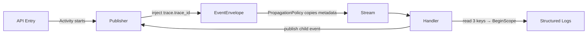

# Stream-First Tracing Design (Orleans + Local + API)

> Status: Partially implemented. See Section 14 for next evolution (event class-based enrichment and visibility).

## 1. Background

This design keeps a single implementation path:

- stream/event pipeline is the source of propagation truth
- tracing is built on `EventEnvelope` metadata + structured logs + API visibility

## 2. Goals

- Unify tracing behavior across Local runtime and Orleans runtime.
- Make trace keys visible in API responses and logs for fast debugging.
- Keep implementation minimal and low-risk.
- Avoid introducing in-memory global maps for tracing state.

## 3. Scope Boundary

- Stream-only tracing design. Any non-stream propagation path is out of scope.
- No protocol-level `traceparent/baggage` bridge as required infrastructure.
- No `ExecutionTraceStore` reintroduction.

## 4. Canonical 3-Key Model

Only these three keys are default and required:

1. `trace_id`
   - Source: `Activity.Current?.TraceId.ToString()` (injected by publisher at event creation)
   - Purpose: OpenTelemetry/Jaeger trace correlation

2. `correlation_id`
   - Source: `EventEnvelope.CorrelationId`
   - Writer: `DefaultCorrelationLinkPolicy` — inherits from inbound envelope when outbound is empty
   - Purpose: business-level request/run correlation

3. `causation_id`
   - Source: `EventEnvelope.Metadata["trace.causation_id"]`
   - Writer: `DefaultEnvelopePropagationPolicy` via `DefaultCorrelationLinkPolicy` — set to `inboundEnvelope.Id` (the direct upstream event ID)
   - Purpose: one-hop upstream cause tracking
   - Note: empty at API entry point (no upstream event exists)

Not default:

- `span_id` (optional extension only)

Current implementation note:

- `trace.span_id` is now written opportunistically when `Activity.Current` exists.
- It is used only to improve span parent-child hierarchy in tracing UI.
- Logging and correlation contracts still rely on the canonical 3 keys (`trace_id`, `correlation_id`, `causation_id`).

### 4.1 Why Three Keys — Orthogonality and Non-Redundancy

The three keys occupy orthogonal dimensions. No single key can replace another:

| Dimension | Key | Scope | Lifetime |
|-----------|-----|-------|----------|
| Infrastructure tracing | `trace_id` | One `Activity` / HTTP request | Ends when `Activity` completes |
| Business correlation | `correlation_id` | One business operation / run | Persists across trace boundaries |
| Event causation | `causation_id` | Single hop (direct parent event) | Per-event, forms a DAG |

**Concrete divergence scenarios:**

1. **Cross-trace boundary** — A timer/retry fires after the original HTTP `Activity` has ended.
   `trace_id` changes (new `Activity`), but `correlation_id` stays the same (same business run).
   Without `correlation_id`, events from the retry would appear as an unrelated trace in Jaeger.

2. **Fan-out** — Actor B emits two events to C and D from the same handler invocation.
   Both events share the same `trace_id` and `correlation_id`, but `causation_id` links them
   back to the specific upstream event (B's event ID). Without `causation_id`, the causal DAG
   collapses into a flat list — you cannot tell which upstream event triggered which downstream.

3. **Multi-run in one request** — A single API call triggers two independent workflow runs.
   They share `trace_id` (same HTTP request) but have different `correlation_id` values.
   Without separate `correlation_id`, you cannot isolate one run's events from another's.

| If you only keep… | You lose… |
|--------------------|-----------|
| `trace_id` | Business grouping across retries/timers; multi-run isolation |
| `correlation_id` | Jaeger span tree; OTel ecosystem integration |
| `trace_id` + `correlation_id` | Causal DAG reconstruction in fan-out/fan-in topologies |

### 4.2 Activity Origin

`Activity.Current` is expected to be started by hosting infrastructure (ASP.NET Core OTel middleware via `AddOpenTelemetry`). This design does **not** create new `Activity` instances — it only reads existing ones to extract `trace_id`.

## 5. Propagation Strategy (Stream-Only)

### Overview



### 5.1 Outbound Event Creation

At event publish time (`LocalActorPublisher`, `OrleansGrainEventPublisher`):

- Create `EventEnvelope`
- Apply `DefaultEnvelopePropagationPolicy` first:
  - Copies **all non-blocked metadata** from inbound envelope to outbound (including `trace.trace_id` already set by upstream hops)
  - Resolves `correlation_id` and `causation_id` via `DefaultCorrelationLinkPolicy`
- Then overwrite tracing metadata from current runtime `Activity` when available:
  - `metadata["trace.trace_id"]`
  - `metadata["trace.span_id"]`
  - `metadata["trace.flags"]` (hex)
- Write runtime metadata through one shared helper:
  - `source_actor_id` always
  - `route_target_count` when publish-time target cardinality is known
    - Local runtime: always known
    - Orleans runtime: `Self`/`Up`/direct-send known; stream fan-out (`Down`/`Both`) can be unknown at publish time

> Key insight: propagation preserves upstream context, but publisher-side overwrite is required to keep per-hop parent/child span relationships correct.

### 5.2 Inbound Event Handling

At event handle entry (`LocalActor.EnqueueAsync`, `RuntimeActorGrain.HandleEnvelopeAsync`):

- Read:
  - `trace_id` from `metadata["trace.trace_id"]` (fallback to `Activity.Current?.TraceId` — primarily useful in Local runtime; in Orleans stream handlers `Activity.Current` may be null, so envelope metadata is the authoritative source)
  - `correlation_id` from `EventEnvelope.CorrelationId`
  - `causation_id` from `metadata["trace.causation_id"]`
- Create one structured logging scope with these three keys
- Use same key names in Local and Orleans
- Missing values resolve to `""` (never throw)

### 5.3 Metadata Constants

Keep metadata keys centralized in `Aevatar.Foundation.Abstractions/Propagation/EnvelopeMetadataKeys.cs`:

- `EnvelopeMetadataKeys.TraceId = "trace.trace_id"`
- `EnvelopeMetadataKeys.TraceSpanId = "trace.span_id"`
- `EnvelopeMetadataKeys.TraceFlags = "trace.flags"`
- `EnvelopeMetadataKeys.TraceCausationId = "trace.causation_id"`
- `EnvelopeMetadataKeys.SourceActorId = "__source_actor_id"`
- `EnvelopeMetadataKeys.RouteTargetCount = "__route_target_count"`

## 6. API Visibility

Developers must see tracing keys at API boundary without opening internal runtime logs.

### 6.1 HTTP Headers

Recommended default response headers:

- `X-Correlation-Id` (required when available)
- `X-Trace-Id` (optional, empty when no active `Activity`)

> Note: `traceparent` header may already be set by ASP.NET Core OTel middleware. This design does not add custom `traceparent` management — it is a hosting-level concern, consistent with Section 3 Scope Boundary.

### 6.2 HTTP Body

For async accepted responses (`202`), include:

- `commandId`
- `correlationId`
- `traceId`

### 6.3 WebSocket Messages

`ack / event / error` messages should include:

- `correlationId`
- `traceId`

## 7. Logging Contract

All key logs use the same field names:

- `trace_id`
- `correlation_id`
- `causation_id`

Rules:

- Use structured scope (`BeginScope`) instead of per-line string interpolation.
- Missing values must be `""` (never throw).
- Scope must wrap both success and failure paths.

### 7.1 Scope Locations

| Layer | Entry Point | Scope Keys |
|-------|-------------|------------|
| Runtime (Local) | `LocalActor.EnqueueAsync` | `trace_id`, `correlation_id`, `causation_id` |
| Runtime (Orleans) | `RuntimeActorGrain.HandleEnvelopeAsync` | `trace_id`, `correlation_id`, `causation_id` |
| API (HTTP) | HTTP request handlers | `trace_id`, `correlation_id` (`causation_id` empty at entry) |
| API (WebSocket) | WebSocket handler | `trace_id`, `correlation_id` (`causation_id` empty at entry) |

## 8. Runtime Architecture Constraints

- No service-level dictionary keyed by actor/run/session as tracing fact store.
- No lock-based shared tracing state in middleware/services.
- Tracing state is derived from envelope + current activity only.
- Local and Orleans follow identical envelope/log schema.

## 9. Acceptance Criteria

1. Stream event chains preserve tracing keys in metadata across hops.
2. Local and Orleans runtime logs both contain three keys on success/failure paths.
3. API responses expose `correlationId` quickly to developers.
4. Jaeger traces can be correlated with logs by `trace_id`.
5. Stream path alone is sufficient to satisfy 1-4.

## 10. Test Plan

### 10.1 Unit / Component

- Publisher injects `trace.trace_id` when `Activity.Current` exists.
- Publisher rewrites trace metadata (`trace.trace_id` / `trace.span_id` / `trace.flags`) from current `Activity` when available.
- Log scope state contains 3 keys with expected fallback behavior.

### 10.2 API Host Tests

- `/api/chat` response header includes `X-Correlation-Id`.
- `202 Accepted` body includes `correlationId` and `traceId`.
- WebSocket ack/event/error include `correlationId` and `traceId`.

### 10.3 Integration

- Stream-based event flow (Local and Orleans runtime) preserves keys end-to-end.
- Error-path handling still logs all three keys.

### 10.4 Jaeger Validation

- Use `docs/architecture/jaeger-stream-tracing-validation.md` for local OTLP + Jaeger verification.
- Validate API `X-Trace-Id` matches Jaeger trace id and runtime log `trace_id`.

## 11. Implementation Steps (Minimal Path)

1. Add tracing metadata keys (`trace.trace_id`, `trace.span_id`, `trace.flags`) to `EnvelopeMetadataKeys`.
2. Add runtime tracing helper (`Aevatar.Foundation.Runtime/Observability/TracingContextHelpers.cs`):
   - `PopulateTraceId(envelope)` — write `trace_id`/`span_id`/`flags` from current `Activity`
   - `CreateLogScopeState(envelope)` — build 3-key dictionary for `BeginScope`
3. Add publish-context helper (`Aevatar.Foundation.Runtime/Propagation/EnvelopePublishContextHelpers.cs`):
   - `ApplyOutboundPublishContext(...)` — shared publish-time logic for propagation + trace overwrite + runtime metadata
4. Wire shared publish-context helper into `LocalActorPublisher` and `OrleansGrainEventPublisher`:
   - call propagation first, then tracing overwrite
   - write `route_target_count` only when publish-time count is known
5. Wire `TracingContextHelpers.CreateLogScopeState` into `LocalActor.EnqueueAsync` and `RuntimeActorGrain.HandleEnvelopeAsync` as `BeginScope`.
6. Add API trace helper (`Aevatar.Workflow.Infrastructure/CapabilityApi/CapabilityTraceContext.cs`):
   - Trace header injection (`X-Trace-Id`, `X-Correlation-Id`)
   - Accepted payload with `traceId`/`correlationId`
   - WebSocket envelope fields
   - API log scope state
7. Wire API helper into `ChatEndpoints` HTTP/WS handlers.
8. Add tests from Section 10.
9. Run build and targeted test suites.

## 12. Rollback Plan

If any production risk appears:

- keep existing propagation policy behavior unchanged
- disable API trace headers/body extension first
- keep logging fields but allow empty values
- avoid changing event schema beyond additive metadata keys

## 13. Open Decisions

1. Should we require OTel instrumentation to guarantee `Activity` always exists at API entry, or accept empty `trace_id` as valid?
2. Do we cap `trace_id`/`correlation_id`/`causation_id` length at runtime write points?

---

If approved, implementation should start from a clean `feature/*` branch off `dev`.

---

## 14. Next Evolution: Full Chain Visibility with Event Type Enrichment

> Status: Design approved, not yet implemented.

### 14.1 Root Cause Diagnosis (Revised)

The original motivation to filter high-frequency events was based on a misdiagnosis: events looked identical in Jaeger not because there were too many of them, but because **the event type was invisible or truncated in the Jaeger span list view**.

The current span name format is:

```
HandleEvent {agentId} {eventTypeName}
```

When `agentId` is a long GUID or composite key, Jaeger's list view truncates the name before `eventTypeName` is visible. All spans appear as `HandleEvent xxxxx-xxxx-...` — indistinguishable.

**Filtering events hides true chain topology. The correct fix is to make event type the primary, untruncated identifier of each span.** No events should be suppressed.

### 14.2 Correct Design: Event Type as Primary Span Identity

All events in the chain get a span. The span name places the event type first so it is always readable in any Jaeger view width:

```
HandleEvent:{EventTypeName}
```

Agent context moves to tags, not the span name.

```mermaid
%%{init: {"maxTextSize": 100000, "flowchart": {"useMaxWidth": false, "nodeSpacing": 10, "rankSpacing": 50}, "themeVariables": {"fontSize": "10px"}}}%%
flowchart LR
    A["Publisher injects trace.event_class tag"]
    B["Stream → EventEnvelope"]
    C["StartHandleEvent creates span"]
    D["span name: HandleEvent:TextMessageContentEvent"]
    E["tags: aevatar.agent.id, aevatar.event.type, trace.event_class"]
    F["Jaeger: full chain, every event type distinguishable"]

    A --> B --> C --> D --> E --> F
```



### 14.3 Span Name and Tag Contract

**Span name (revised format):**

```
HandleEvent:{EventTypeName}
```

Examples:
- `HandleEvent:ChatRequestEvent`
- `HandleEvent:TextMessageContentEvent`
- `HandleEvent:ProjectionCompensationTriggerReplayEvent`

No agentId in the span name. Jaeger list view shows all event types cleanly.

**Required tags on every HandleEvent span:**

| Tag | Value | Notes |
|-----|-------|-------|
| `aevatar.agent.id` | full agent id | for Jaeger search/filter |
| `aevatar.event.id` | `envelope.Id` | for exact event lookup |
| `aevatar.event.type` | full `typeUrl` | for deep inspection |
| `trace.event_class` | `Business / StreamChunk / Control / Internal` | for Jaeger tag filter |

### 14.4 Event Class: Enrichment Tag, Not Suppression Gate

`TraceEventClass` is used to **enrich spans for filtering in Jaeger UI**, not to suppress span creation. Every event still gets a span.

**`TraceEventClass` (Abstractions layer)**

```csharp
public enum TraceEventClass
{
    Business,     // user-visible business signals — primary chain nodes
    StreamChunk,  // high-frequency streaming fragments — all recorded, filterable
    Control,      // internal control/coordination events
    Internal,     // projection/outbox infrastructure noise
}
```

**`IEventTraceClassifier` (Abstractions layer)**

```csharp
public interface IEventTraceClassifier
{
    TraceEventClass Classify(string typeUrl);
}
```

**`EnvelopeMetadataKeys.EventClass = "trace.event_class"`** — written by publisher, propagated by `DefaultEnvelopePropagationPolicy`, read by the handler to set the tag.

### 14.5 Runtime: Publisher Injects Class, Handler Tags Span

**Publisher side** — after envelope creation, before `_propagationPolicy.Apply()`:

```csharp
var eventClass = _classifier.Classify(envelope.Payload?.TypeUrl ?? string.Empty);
envelope.Metadata[EnvelopeMetadataKeys.EventClass] = eventClass.ToString();
```

**Handler side** — `AevatarActivitySource.StartHandleEvent` reads `trace.event_class` from envelope metadata and sets it as a tag. No suppression logic.

**Default classifier (Runtime layer)** — only knows Runtime-owned concepts:

```csharp
public TraceEventClass Classify(string typeUrl)
{
    if (IsProjectionOrOutbox(typeUrl)) return TraceEventClass.Internal;
    return TraceEventClass.Business;
}
```

### 14.6 Workflow/AI Layer: Domain Classification Without Runtime Coupling

`WorkflowEventTraceClassifier` is registered in the Workflow Host:

```csharp
public TraceEventClass Classify(string typeUrl)
{
    var name = ExtractTypeName(typeUrl);
    return name switch
    {
        "TextMessageStartEvent"   => TraceEventClass.StreamChunk,
        "TextMessageContentEvent" => TraceEventClass.StreamChunk,
        "TextMessageEndEvent"     => TraceEventClass.StreamChunk,
        _                         => _fallback.Classify(typeUrl),
    };
}
```

In Jaeger, filter `trace.event_class = StreamChunk` to focus on streaming noise, or `Business` to read the primary chain. All hops are present in both views.

### 14.7 Sampling Policy Simplification

`IHandleEventTracingSamplingPolicy` and `DefaultHandleEventTracingSamplingPolicy` are **removed** entirely.

`AevatarObservabilityOptions` retains only:
- `EnableSensitiveData`

No `HighFrequencyEventTypeNames`. No name-list maintenance.

### 14.8 Dependency Flow

```
Abstractions:   TraceEventClass  IEventTraceClassifier  EnvelopeMetadataKeys.EventClass
                        ↑                  ↑
Runtime:        DefaultEventTraceClassifier (only knows projection/outbox)
                Publisher (injects trace.event_class into envelope)
                StartHandleEvent (reads class, tags span — never suppresses)
                        ↑
Workflow/AI:    WorkflowEventTraceClassifier (classifies StreamChunk events)
                Registered via DI → replaces DefaultEventTraceClassifier
```

### 14.9 Implementation Checklist

- [ ] Fix `StartHandleEvent` span name: change to `HandleEvent:{EventTypeName}` format
- [ ] Add `trace.event_class` tag to every HandleEvent span (read from envelope metadata)
- [ ] Add `TraceEventClass` enum to `Aevatar.Foundation.Abstractions`
- [ ] Add `IEventTraceClassifier` interface to `Aevatar.Foundation.Abstractions`
- [ ] Add `EnvelopeMetadataKeys.EventClass` constant
- [ ] Add `DefaultEventTraceClassifier` to `Aevatar.Foundation.Runtime`
- [ ] Register `IEventTraceClassifier` → `DefaultEventTraceClassifier` in `AddAevatarRuntime()`
- [ ] Inject `IEventTraceClassifier` into `LocalActorPublisher` and `OrleansGrainEventPublisher`; write `trace.event_class` at publish time
- [ ] Remove `IHandleEventTracingSamplingPolicy` and `DefaultHandleEventTracingSamplingPolicy`
- [ ] Remove `HighFrequencyEventTypeNames` and `FilterHighFrequencyEventTypes` from `AevatarObservabilityOptions`
- [ ] Add `WorkflowEventTraceClassifier` to `Aevatar.Workflow.Infrastructure`
- [ ] Register `WorkflowEventTraceClassifier` in Workflow Host DI
- [ ] Update `AevatarActivitySourceTests` to remove sampling policy tests; add tag enrichment tests
