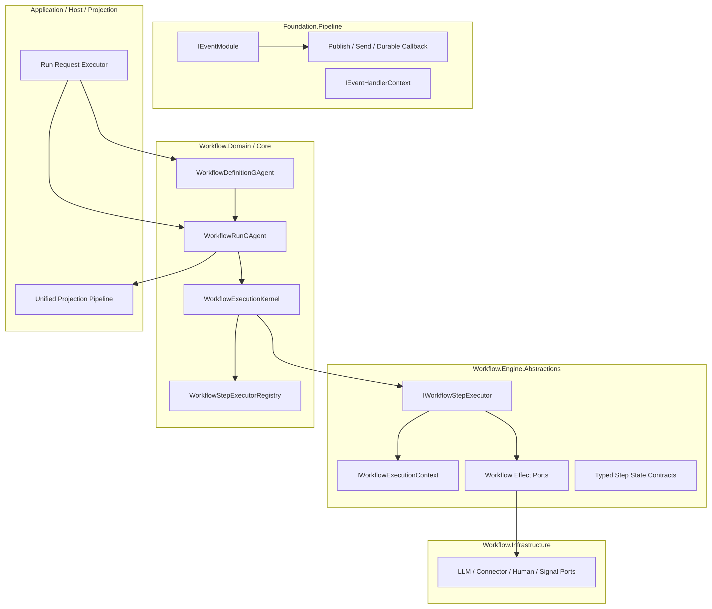

# Workflow Foundation / Workflow Engine 边界重构计划（2026-03-08）

## 1. 文档元信息

- 状态：R2 Implemented, R3 Planned
- 版本：R3
- 日期：2026-03-09
- 目标分支：`refactor/workflow-run-actorized-state-boundary-20260308`
- 关联文档：
  - `docs/architecture/workflow-run-actorized-state-boundary-blueprint-2026-03-08.md`
  - `docs/architecture/workflow-run-actorized-target-architecture-2026-03-08.md`
  - `docs/architecture/workflow-actor-binding-read-boundary-refactor-plan-2026-03-09.md`
  - `docs/FOUNDATION.md`
  - `docs/WORKFLOW.md`
- 文档定位：
  - 本文定义 `Foundation` 事件管线抽象与 `Workflow` 有状态执行抽象的最终边界
  - 本文记录 2026-03-08 的最终决议与已落地重构
  - 本文默认“不保留兼容层”，以清晰正确为第一目标

## 1.1 R2 最终决议

本轮重构的最终抽象不是新增 `IWorkflowStepExecutor`，而是统一收敛为一套泛型模块机制：

1. `Foundation` 只保留一个根接口：`IEventModule<TContext>`。
2. `TContext` 统一约束到 `IEventContext`。
3. `IEventHandlerContext : IEventContext` 继续服务 Foundation pipeline。
4. `IWorkflowExecutionContext : IEventContext` 承载 workflow 的 `run / durable state / callback` 语义。
5. workflow step 模块统一实现 `IEventModule<IWorkflowExecutionContext>`。
6. `WorkflowExecutionBridgeModule` 负责把 workflow 模块桥接到 `GAgentBase` 的 `IEventModule<IEventHandlerContext>` 管线。
7. `WorkflowExecutionKernel` 取代 `WorkflowLoopModule`，成为 run actor 内的推进内核。

下文中早期出现的 `IWorkflowStepExecutor` 方案视为历史备选；如与本节冲突，以本节为准。

## 1.2 R3 后续边界收敛决议

R2 完成后，`workflow` 主链路里出现了一个不应固化为长期方案的抽象：`IActorStateProbe / ActorStateSnapshot`。

R3 的明确决议如下：

1. `Foundation` 不应向 workflow command path 暴露 generic actor raw-state 读取能力。
2. workflow binding 读取必须是 workflow 专用窄契约，而不是 `actorId -> protobuf payload`。
3. command path 读取当前权威 binding 时，应走 actor-owned workflow query/reply 协议。
4. query/read 场景应由 projection/read model 提供 binding index。
5. generic actor raw-state probe 已从 workflow 主链路和 Foundation runtime 注册面移除，不再保留为正式能力。

## 2. 问题定义

当前代码已经完成 `run actor` 化，但抽象层次仍然混叠：

1. `IEventModule` 定义在 `Foundation`，语义上是通用事件管线插件。
2. `Workflow` 中的大量 step 实现仍通过 `IEventModule` 承载 workflow runtime 语义。
3. 模块状态访问通过 `WorkflowRunModuleStateAccess -> ctx.Agent as IWorkflowRunModuleStateHost` 侧向注入。
4. `WorkflowRunModuleStateUpsertedEvent` 仍以 `module_name + state_json` 表达状态写入。
5. 状态作用域仍偏向 “module bucket”，而不是 “run -> step -> protobuf state”。
6. tactical 修复路径引入了 generic actor state probing，给业务层留下了绕过 read side 直接读取 write-side 原始状态的可能。

这会导致以下架构问题：

- 框架抽象看似通用，实际隐含依赖 workflow run 宿主。
- `Foundation` 不知道状态能力，`Workflow` 却偷偷从框架上下文里强转取状态。
- `IEventModule` 既像跨领域插件，又像 workflow 专用 step executor，语义不纯。
- `module state json` 是存储导向接口，不是领域语义接口。
- Protobuf 已经是主事件协议，但模块持久态仍残留 JSON。
- workflow binding inspection 若继续依赖 generic raw-state read，会削弱 CQRS 和 actor 边界。

## 3. 重构目标

### 3.1 必达目标

1. `Foundation` 与 `Workflow` 的抽象边界彻底解耦。
2. `IEventModule` 只保留为框架级事件管线扩展点，不再承载 workflow 状态执行语义。
3. `Workflow` 引入自己的执行抽象，显式表达 `run / step / state / effect / completion`。
4. 所有运行态持久化和内部序列化统一改为 `Protobuf`。
5. 删除 `module_name + state_json` 模式，改为 `run -> step -> typed protobuf state`。
6. `WorkflowLoopModule` 这类内核推进逻辑从模块体系退出，收敛到 workflow engine kernel。
7. 新增 Actor 只按事实源边界，不按模块数量切分。
8. workflow command path 不再依赖 Foundation generic actor raw-state read。

### 3.2 非目标

- 不重做 YAML DSL 语法本身。
- 不改写统一 Projection Pipeline 主链路。
- 不把所有 wait/signal/human 对象都立即拆成独立 Actor。
- 不在本轮引入第二套 workflow 执行系统。

## 4. 设计原则

1. 通用管线与领域执行分层。
2. 状态访问显式化，禁止 helper + cast 侧向注入。
3. 领域状态优先按 `step_id` 作用域建模，而不是按 `module_name` 作用域建模。
4. 领域事件优先表达业务语义，而不是表达底层存储动作。
5. 所有持久态、内部消息、状态快照统一采用 `Protobuf`。
6. Workflow 内核负责推进，executor 负责单步语义，port 负责外部能力。
7. 删除优于兼容，不保留双轨抽象。
8. 读写边界优先于短期便捷性，禁止把 write-side 原始状态导出当成业务契约。

## 5. 目标分层



### 5.1 `Foundation.Pipeline`

职责：

- 通用事件路由
- 通用事件模块扩展
- durable callback 调度
- agent 间消息发布/发送

禁止知道：

- `RunId`
- `StepId`
- workflow variables
- step state
- human approval / signal wait / LLM correlation 这类 workflow 语义

### 5.2 `Workflow.Engine.Abstractions`

这是本次必须新增的一层，用于承载 workflow 专有执行语义。

职责：

- 定义 step executor 合同
- 定义 workflow execution context
- 定义 workflow effect ports
- 定义 typed step state 与 lifecycle contract

这一层向下不依赖 `Infrastructure`，向上不暴露 `ctx.Agent` 这种框架细节。

### 5.3 `Workflow.Domain / Core`

职责：

- workflow definition fact source
- workflow run fact source
- step lifecycle 推进
- control-flow 编排
- run 内状态迁移
- semantic domain event 产生

### 5.4 `Workflow.Infrastructure`

职责：

- 实现 LLM / connector / signal / human / timer 等外部 port
- 适配具体 runtime 与外部系统

### 5.5 `Application / Host / Projection`

职责：

- 请求入站、鉴权、组装
- run actor 解析与创建
- 统一投影与查询

禁止：

- 直接读写 run state
- 用中间层字典持有事实状态

## 6. 目标抽象

### 6.1 保留：框架级 `IEventModule`

`IEventModule` 继续存在，但只允许两类用途：

1. 框架级 cross-cutting pipeline module
2. 与 workflow 无关的通用事件变换器

例如：

- tracing / metrics / audit
- envelope validation
- 通用路由增强

禁止 workflow 执行器继续直接实现这一层来承载 durable state。

### 6.2 新增：`IWorkflowStepExecutor`

建议新增到 `src/workflow/Aevatar.Workflow.Abstractions/Execution/`。

```csharp
public interface IWorkflowStepExecutor
{
    string StepType { get; }

    Task ExecuteAsync(
        WorkflowStepDescriptor step,
        IWorkflowExecutionContext context,
        CancellationToken ct);
}
```

特征：

- 一种 step type 一个 executor 主语义
- executor 只关注该 step 的业务含义
- 不再自行决定事件路由过滤
- 不再通过 `EventEnvelope` 直接推导 workflow 语义

### 6.3 新增：`IWorkflowExecutionContext`

建议新增到 `src/workflow/Aevatar.Workflow.Abstractions/Execution/`。

```csharp
public interface IWorkflowExecutionContext
{
    string RunId { get; }
    string StepId { get; }
    WorkflowDefinition Definition { get; }
    WorkflowStepFrame CurrentFrame { get; }

    Task<TState> LoadStateAsync<TState>(CancellationToken ct = default)
        where TState : class, IMessage<TState>, new();

    Task SaveStateAsync<TState>(TState state, CancellationToken ct = default)
        where TState : class, IMessage<TState>;

    Task ClearStateAsync<TState>(CancellationToken ct = default)
        where TState : class, IMessage<TState>, new();

    Task DispatchToRoleAsync(
        string roleName,
        StepDispatchRequest request,
        CancellationToken ct = default);

    Task PublishAsync<TEvent>(TEvent evt, CancellationToken ct = default)
        where TEvent : IMessage<TEvent>;

    Task CompleteStepAsync(
        StepCompletion completion,
        CancellationToken ct = default);

    Task FailStepAsync(
        StepFailure failure,
        CancellationToken ct = default);

    Task<RuntimeCallbackLease> ScheduleTimeoutAsync(
        string callbackId,
        TimeSpan dueTime,
        IMessage evt,
        IReadOnlyDictionary<string, string>? metadata = null,
        CancellationToken ct = default);
}
```

这层显式提供 workflow 所需能力，禁止再暴露 `IAgent Agent` 给 executor 自行强转。

### 6.4 新增：effect ports

建议按能力拆 port，而不是让 executor 直接依赖具体实现。

最少需要：

- `IWorkflowRoleDispatchPort`
- `IWorkflowSignalPort`
- `IWorkflowHumanTaskPort`
- `IWorkflowLLMCallPort`
- `IWorkflowSubWorkflowPort`

作用：

- executor 只表达意图
- infrastructure 负责外部调用细节
- 便于单测与 actor 内对账

### 6.5 新增：`WorkflowExecutionKernel`

职责：

- 选择 executor
- 维护 control-flow 主循环
- 统一 step lifecycle
- 统一完成/失败/重试/超时处理
- 收口 `WorkflowLoopModule` 这类内核逻辑

结论：

- `WorkflowLoopModule` 不应继续作为普通 module 存在
- 它应被内聚进 engine kernel

## 7. 状态模型重构

### 7.1 删除项

以下对象应删除，不保留兼容层：

- `WorkflowRunModuleStateAccess`
- `IWorkflowRunModuleStateHost`
- `WorkflowRunModuleStateUpsertedEvent`
- `WorkflowRunModuleStateClearedEvent`
- `WorkflowRunState.ModuleStateJson`
- 所有 `moduleName -> state` 持久化路径

### 7.2 新状态边界

状态事实源按以下方式表达：

- `WorkflowDefinitionGAgent.State`
  - 只保留 definition facts
- `WorkflowRunGAgent.State`
  - 保留单次 run 的全部执行事实
- `WorkflowRunState.StepStates`
  - 按 `step_id` 作用域保存 protobuf typed state

### 7.3 新状态结构建议

建议在 `workflow_state.proto` 中引入：

```proto
message WorkflowRunStateModel {
  string run_id = 1;
  string definition_actor_id = 2;
  string workflow_name = 3;
  string status = 4;
  map<string, string> variables = 5;
  map<string, WorkflowStepRuntimeState> steps = 6;
  map<string, google.protobuf.Any> step_states = 7;
}

message WorkflowStepRuntimeState {
  string step_id = 1;
  string step_type = 2;
  string status = 3;
  int32 attempt = 4;
  string output = 5;
  string error = 6;
  string target_role = 7;
  string callback_lease_id = 8;
}
```

说明：

- `step_states` 的 key 是 `step_id`
- value 是 `google.protobuf.Any`
- 所有 state payload 必须是 protobuf message
- 不允许再序列化成 JSON 字符串后放进 state

### 7.4 状态作用域规则

1. 与某一步骤绑定的运行态，必须以 `step_id` 为主键。
2. 与某次 run 绑定的聚合态，必须进入 `WorkflowRunState` 顶层字段。
3. 跨 run 独立存在的事实，才允许拆独立 Actor。
4. 不允许继续使用 `module_name` 作为 durable state 作用域主键。

## 8. 事件模型重构

### 8.1 删除存储导向事件

以下风格禁止继续扩展：

- `XxxStateUpserted`
- `XxxStateCleared`
- `module_name + payload`

原因：

- 这是存储动作，不是领域事实
- 会把领域事件退化成 KV 持久化日志

### 8.2 采用语义事件

每类有状态 step 应定义语义事件。例如：

- `DelayScheduledEvent`
- `DelayElapsedEvent`
- `SignalWaitRegisteredEvent`
- `SignalMatchedEvent`
- `HumanInputRequestedEvent`
- `HumanInputReceivedEvent`
- `HumanApprovalRequestedEvent`
- `HumanApprovalResolvedEvent`
- `LLMCallRequestedEvent`
- `LLMCallCompletedEvent`
- `LLMCallTimedOutEvent`

控制流内核保留统一 lifecycle 事件。例如：

- `WorkflowRunStartedEvent`
- `WorkflowStepDispatchedEvent`
- `WorkflowStepCompletedEvent`
- `WorkflowStepFailedEvent`
- `WorkflowStepRetriedEvent`
- `WorkflowRunCompletedEvent`

### 8.3 事件与状态关系

- 领域事件表达事实
- `WorkflowRunState` 通过 apply/reducer 演化
- Protobuf 仅用于事件与状态载荷编码
- 不允许事件直接退化成“写一段 state blob”

## 9. 执行器分类与去向

### 9.1 保留为 step executor

这些适合保留为 `IWorkflowStepExecutor`：

- `Assign`
- `Transform`
- `Emit`
- `Guard`
- `Switch`
- `Conditional`
- `Delay`
- `WaitSignal`
- `HumanInput`
- `HumanApproval`
- `LLMCall`
- `Reflect`
- `Evaluate`
- `While`
- `ForEach`
- `ParallelFanOut`
- `MapReduce`
- `Race`
- `WorkflowCall`

### 9.2 收回到 engine kernel

这些不应继续是普通 executor/module：

- `WorkflowLoopModule`
- 共通 `retry / timeout / next-step selection / completion aggregation`

### 9.3 保留为 `IEventModule`

只保留真正框架级插件：

- tracing
- metrics
- audit
- policy enforcement

## 10. Actor 边界决策矩阵

| 场景 | 最佳归属 | 说明 |
|---|---|---|
| 单步运行态 | `WorkflowRunState.StepStates` | 默认选项 |
| run 级变量与聚合态 | `WorkflowRunState` | 默认选项 |
| 独立 approval ticket，需外部直接寻址 | 新 Actor | 具备独立生命周期 |
| signal wait 仅服务当前 run | `WorkflowRunState` | 不要为每个 waiter 拆 Actor |
| sub-workflow invocation | 先记入 `WorkflowRunState`，必要时再引独立协调 Actor | 视生命周期复杂度决定 |
| projection ownership | 独立 Actor | 已是独立事实源 |

决策规则只有一句：

不是“模块有没有关系”，而是“这个事实是否需要独立身份和生命周期”。

## 11. 项目与目录调整计划

### 11.1 新增目录

- `src/workflow/Aevatar.Workflow.Abstractions/Execution/`
- `src/workflow/Aevatar.Workflow.Core/Execution/`
- `src/workflow/Aevatar.Workflow.Core/Effects/`
- `src/workflow/Aevatar.Workflow.Core/State/`

### 11.2 重命名建议

无兼容约束下，建议执行：

- `WorkflowGAgent` -> `WorkflowDefinitionGAgent`
- `StartWorkflowEvent` -> `WorkflowRunStartRequestedEvent`
- `StepCompletedEvent` 与通用事件命名按 run 语义统一整理

### 11.3 删除目录/文件

目标删除：

- `src/workflow/Aevatar.Workflow.Core/Runtime/WorkflowRunModuleStateAccess.cs`
- `src/workflow/Aevatar.Workflow.Core/Runtime/IWorkflowRunModuleStateHost.cs`
- 依赖上述接口的测试替身与 helper

## 12. 分阶段实施计划

### 阶段 0：门禁先行

输出：

- 新增架构守卫，禁止 `Workflow` executor 依赖 `IEventHandlerContext.Agent` 强转取状态
- 新增架构守卫，禁止 `Workflow` 出现 `StateJson`
- 新增架构守卫，禁止 `WorkflowRunState` 再出现 `ModuleStateJson`

验收：

- 门禁先红后绿

### 阶段 1：引入 workflow engine 抽象

输出：

- `IWorkflowStepExecutor`
- `IWorkflowExecutionContext`
- effect port 抽象
- `WorkflowStepExecutorRegistry`

验收：

- 新旧实现可并存一小段时间，但所有新代码只写新接口

### 阶段 2：Protobuf 状态模型落地

输出：

- 新的 `workflow_state.proto`
- step-scoped protobuf state contracts
- 删除所有 JSON state codec

验收：

- `rg -n "StateJson|System.Text.Json|JsonSerializer" src/workflow` 不再命中 workflow runtime state 路径

### 阶段 3：建立 `WorkflowExecutionKernel`

输出：

- 从 `WorkflowLoopModule` 中抽出主循环
- run actor 内统一 step dispatch / timeout / retry / completion

验收：

- `WorkflowLoopModule` 删除
- run lifecycle 测试全部转到 kernel 驱动

### 阶段 4：迁移无状态 executors

对象：

- `Assign`
- `Transform`
- `Emit`
- `Guard`
- `Switch`
- `Conditional`

验收：

- 这些 executor 不再依赖 framework event envelope 语义

### 阶段 5：迁移有状态 executors

对象：

- `Delay`
- `WaitSignal`
- `HumanInput`
- `HumanApproval`
- `LLMCall`
- `Reflect`
- `Evaluate`
- `While`
- `ForEach`
- `ParallelFanOut`
- `MapReduce`
- `Race`

验收：

- 所有状态通过 `LoadStateAsync<TProto> / SaveStateAsync<TProto>` 访问
- 不再存在 `moduleName` 状态桶

### 阶段 6：清理 Application / Projection / Host

输出：

- 对外 run 请求仍走 run actor 主链路
- query / projection / capability 文档同步 rename

验收：

- 无旧抽象残留引用

### 阶段 7：强制删除遗留路径

输出：

- 删除旧 interfaces、旧 tests doubles、旧 helper、旧 proto event

验收：

- `rg -n "IWorkflowRunModuleStateHost|WorkflowRunModuleStateAccess|ModuleStateJson|StateJson"` 全仓零命中

## 13. 测试计划

### 13.1 单元测试

- `WorkflowExecutionKernelTests`
- `WorkflowExecutionContextTests`
- 每个 executor 各自的 `*ExecutorTests`
- protobuf state codec tests

### 13.2 集成测试

- run replay 后恢复 step state
- durable timeout fired 后 actor 内正确对账
- signal / human / llm correlation 跨激活恢复
- parallel / race / foreach / map_reduce 在重试与失败后仍正确收敛

### 13.3 架构门禁

- 禁止 workflow runtime state 使用 JSON
- 禁止 workflow executor 依赖 `IEventModule`
- 禁止 workflow executor 直接消费 `EventEnvelope`
- 禁止 workflow runtime 继续出现 `module_name + state`

## 14. 风险与缓解

| 风险 | 影响 | 缓解 |
|---|---|---|
| 一次性迁移范围大 | 编译面和测试面都大 | 严格按阶段切，每阶段先补门禁 |
| control-flow 从 module 提升到 kernel 后逻辑回归 | 运行正确性下降 | 建立 replay / retry / timeout 集成回归集 |
| protobuf state 契约设计过粗 | 后续扩展困难 | step state 以 `step_id + Any` 扩展，语义事件单独定义 |
| rename 影响大 | 引用面广 | 以分阶段 rename 和全仓 rg 校验收口 |

## 15. 完成定义

满足以下条件才算完成：

1. Workflow step 执行不再依赖 `IEventModule`。
2. `Foundation` 不再为 workflow state 提供隐式后门。
3. 全部 workflow runtime state 使用 protobuf typed contracts。
4. `WorkflowLoopModule` 被 engine kernel 替代。
5. `WorkflowRunModuleStateAccess` 和 `IWorkflowRunModuleStateHost` 已删除。
6. `module state json` 及相关 proto 事件已删除。
7. 文档、测试、架构门禁同步更新并通过。

## 16. 首批实施清单

第一批建议直接落地以下最小闭环：

1. 新建 `IWorkflowStepExecutor`、`IWorkflowExecutionContext`、effect ports。
2. 删除 `WorkflowRunModuleStateAccess` 和 `IWorkflowRunModuleStateHost`。
3. 为 `Delay / WaitSignal / HumanInput / HumanApproval / LLMCall` 定义 protobuf state。
4. 抽出 `WorkflowExecutionKernel`，吞并 `WorkflowLoopModule`。
5. 建立禁止 JSON state 和禁止 `ctx.Agent` 强转的架构守卫。

这五项完成后，边界就会真正转正，后续迁移只是批量把 executor 接到新骨架上。
