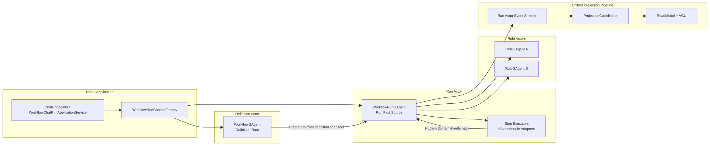
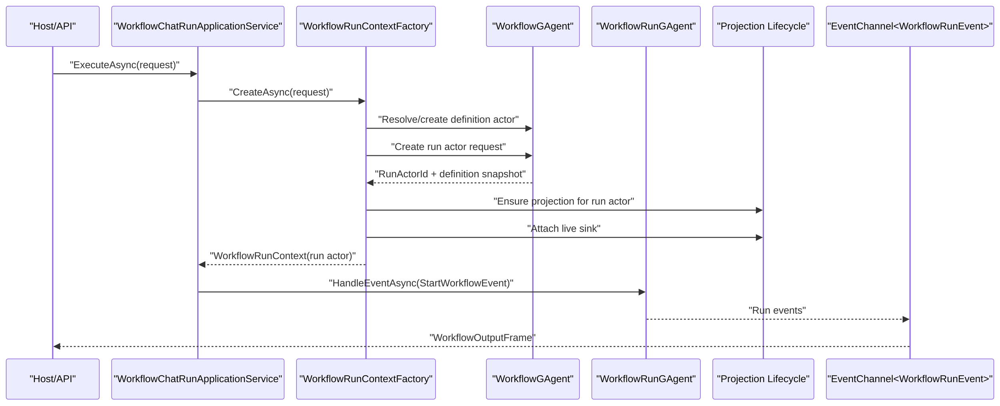

# Aevatar.Workflow Run Actor 化与 EventModule 状态边界重构蓝图（2026-03-08）

## 1. 文档元信息

- 状态：Implemented with Follow-up Hardening Planned
- 版本：R2
- 日期：2026-03-09
- 目标分支：`refactor/workflow-run-actorized-state-boundary-20260308`
- 适用范围：
  - `src/workflow/Aevatar.Workflow.Core`
  - `src/workflow/Aevatar.Workflow.Application`
  - `src/workflow/Aevatar.Workflow.Infrastructure`
  - `src/workflow/Aevatar.Workflow.Projection`
  - `docs/FOUNDATION.md`
  - `src/workflow/README.md`
- 非目标：
  - 重新设计外部 Chat API 协议
  - 改写 Projection 主链路
  - 在本轮引入第二套 workflow 执行体系
- 文档定位：本文保留本轮重构的设计决策与迁移蓝图，同时记录最终已落地的实现状态。

## 1.1 实施状态（2026-03-08）

以下设计已经落地到主代码路径：

- `WorkflowGAgent` 已收敛为 definition actor。
- `WorkflowRunGAgent` 已成为单次 run 的执行 actor。
- `WorkflowLoopModule` 以及主要 stateful modules 已迁移到 actor-owned module state。
- `WorkflowRunActorResolver / WorkflowRunActorPort` 已切到 definition binding -> run actor 创建路径。
- Projection read model 已切到 `RunIsolated` 语义。
- README 与 capability endpoint 语义已同步到 run actor 模型。

说明：

- 下文第 6 节到第 8 节保留的是本轮重构启动前的基线分析，用于解释为何要做本次调整；这些段落不是当前实现现状。

## 1.2 后续边界收敛（2026-03-09）

本轮落地后，出现了一个需要继续收敛的边界问题：

- 为修复 Orleans 下的 existing actor inspection，当前实现引入了 generic actor state probing。
- 这条路径能解决当前 bug，但不是目标架构。
- 下一阶段必须把 workflow binding 读取收敛成 workflow 专用窄契约，并从 workflow command path 移除 generic raw-state 依赖。

后续计划见：

- `docs/architecture/workflow-actor-binding-read-boundary-refactor-plan-2026-03-09.md`

## 2. 背景与关键决策（统一认知）

当前 `workflow` 子系统已经具备统一的事件执行与投影主链路，但运行事实边界仍然不清晰：

1. 一个 `WorkflowGAgent` 同时承载 workflow 定义、角色树、多个 run 的推进与完成汇总。
2. 多个 `IEventModule` 通过私有 `Dictionary/HashSet/List` 持有 `run/step/session` 运行态。
3. `Application` 与 `Projection` 将 run 视为“共享在 workflow actor 上的一次 command”，而不是一等运行实体。
4. callback/timeout 虽然已经事件化，但相关关联事实仍然保留在模块进程内字段中。

本次重构采用以下关键决策：

### 决策 A：保留 `IEventModule`，但降回“事件处理插件”语义

- `IEventModule` 保留为统一 pipeline 中的扩展点。
- 不再允许 `IEventModule` 持有 durable / authoritative runtime state。
- 模块只负责：
  - 过滤事件
  - 调用外部能力
  - 发布后续领域事件
  - 执行无状态或短生命周期计算

### 决策 B：新增 `WorkflowRunGAgent`，一 run 一 actor

- 每次 run 创建独立 `WorkflowRunGAgent`。
- `WorkflowRunGAgent` 成为该 run 的唯一写侧事实源。
- run 级状态、超时、重试、挂起、关联关系全部进入 `WorkflowRunState`。

### 决策 C：`WorkflowGAgent` 收敛为“定义/模板 Actor”

- 当前 `WorkflowGAgent` 在迁移期继续保留类型名，职责收敛为：
  - 绑定 workflow YAML
  - 持有编译结果与 role 模板
  - 解析 sub-workflow 定义绑定
  - 接收 run 创建请求并派生 run actor
- 中期可按影响面评估是否重命名为 `WorkflowDefinitionGAgent`。

### 决策 D：新增 Actor 只按“事实源边界”，不按“模块数量”

- 不是一个 `EventModule` 一个 Actor。
- 只有在运行对象具备独立身份、独立生命周期、独立寻址或独立查询/取消语义时，才拆成独立 Actor。
- 例如：
  - `run`：必须独立 Actor
  - `projection ownership`：已是独立 Actor
  - `human approval ticket`：按是否需要独立生命周期再决定
  - `delay module`：不是 Actor，只是 run actor 内的一类状态与事件处理逻辑

### 决策 E：内部推进统一事件化，并由 run actor 内对账

- 所有 `delay/timeout/retry/watchdog` 仅允许“异步等待 -> 发布内部事件 -> run actor 内消费并对账”。
- callback 线程不得直接修改运行态，不得直接推进业务分支。
- 内部事件必须携带最小充分相关键：`run_id + step_id (+ session_id / callback_id)`。

### 决策 F：Projection 保持单一输入主链路，执行作用域转向 run actor

- 不新增第二套 run read model 管线。
- 继续复用现有 `ProjectionCoordinator` / `ReadModelProjector` / `AGUIEventProjector`。
- 变化点是：
  - 投影输入流从“workflow definition actor 事件流”转向“workflow run actor 事件流”
  - 查询与实时输出默认以 run actor 为执行作用域

### 决策 G：外部 API 尽量兼容，内部 actor 语义先重构

- `POST /api/chat`、`/api/ws/chat`、signal/resume 外部语义尽量保持。
- 宿主和应用层优先适配新的 actor 边界，必要时通过兼容查询层保留旧入口。

## 3. 重构目标

本次重构的可验收目标如下：

1. workflow run 拥有唯一 Actor 级事实源，跨激活可恢复，跨节点语义明确。
2. `IEventModule` 不再承载 run/step/session 权威状态。
3. workflow 定义与 workflow 执行的职责边界清晰分离。
4. 所有超时、重试、等待信号、人工输入、外部调用关联均由 Actor 状态承载。
5. Projection 与 AGUI 继续复用同一输入事件流，不新增第二执行主链路。
6. Host 仍只做协议适配与组合，不侵入核心编排。
7. 架构边界具备可验证门禁、测试与文档闭环。

## 4. 范围与非范围

### 4.1 范围

- 新增 run actor 执行模型
- 收敛 `WorkflowGAgent` 职责
- 迁移 `workflow_loop`、`delay`、`wait_signal`、`human_*`、`parallel*`、`map_reduce`、`reflect`、`evaluate`、`llm_call` 等模块中的运行态
- 调整 `Application` run context 建立流程
- 调整 workflow projection 的作用域与查询语义
- 增补架构门禁、测试与文档

### 4.2 非范围

- 不重做 YAML DSL 语义
- 不在本轮变更 connector 协议模型
- 不在本轮引入全新的 role framework
- 不强制在本轮把所有 wait/signal/human 会话再进一步拆成独立 Actor

## 5. 架构硬约束（必须满足）

1. 必须保持严格分层：`Domain / Application / Infrastructure / Host`。
2. 必须保持 CQRS 与 AGUI 共用同一 Projection Pipeline。
3. 必须保证 run 级运行事实只有一个权威事实源。
4. 禁止在中间层或模块字段中维护 `runId/stepId/sessionId` 到事实状态的长期进程内映射。
5. 禁止 callback 线程直接推进 workflow 分支。
6. 必须通过 domain event 驱动状态迁移，不允许 Application/Infrastructure 直接篡改 Actor 状态。
7. 新增 Actor 的理由必须是“独立事实源”，不能仅因为代码分类不同。
8. Host 只能组合协议、认证、序列化与流式输出，不承载 run 编排。
9. 迁移后仍必须支持 `build/test` 与架构门禁验证。
10. 文档、门禁、测试必须与实现同步演进。

## 6. 历史基线（重构前代码事实）

说明：

- 本节保留的是重构启动前的基线事实，用于解释问题来源。
- 当前实现已不再满足下表中的旧约束，现状以第 7 节和第 16 节为准。

| 事实 | 代码证据 | 结论 |
|---|---|---|
| 一个 workflow actor 同时承载定义与执行 | `src/workflow/README.md`、`src/workflow/Aevatar.Workflow.Core/WorkflowGAgent.cs` | 定义生命周期与 run 生命周期耦合 |
| `WorkflowRunActorPort` 直接创建 `WorkflowGAgent` | `src/workflow/Aevatar.Workflow.Infrastructure/Runs/WorkflowRunActorPort.cs` | Application 侧没有 run actor 抽象 |
| run context 以 workflow actor 为 projection 作用域 | `src/workflow/Aevatar.Workflow.Application/Runs/WorkflowRunContextFactory.cs` | run 被建模为 actor 上的一次 command |
| `WorkflowLoopModule` 用私有字段维护并发 run、当前 step、变量、重试、超时 | `src/workflow/Aevatar.Workflow.Core/Modules/WorkflowLoopModule.cs` | 关键运行事实不在 Actor `State` |
| `DelayModule`、`WaitSignalModule` 等维护私有 `_pending` 字典 | `src/workflow/Aevatar.Workflow.Core/Modules/DelayModule.cs`、`WaitSignalModule.cs` | callback 关联事实无法随 Actor replay 恢复 |
| `LLMCallModule`、`EvaluateModule`、`ReflectModule` 等维护请求/响应关联状态 | `src/workflow/Aevatar.Workflow.Core/Modules/LLMCallModule.cs` 等 | 外部 effect correlation 仍在模块字段中 |
| Projection ReadModel 当前仅声明 `ActorShared` | `src/workflow/Aevatar.Workflow.Projection/ReadModels/WorkflowExecutionReadModel.cs` | 读侧仍以 workflow actor 为共享作用域 |
| Query Abstractions 已预留 `RunIsolated` | `src/workflow/Aevatar.Workflow.Application.Abstractions/Queries/WorkflowExecutionQueryModels.cs` | 读侧契约具备向 run 隔离演进的空间 |

## 7. 需求分解与状态矩阵

| ID | 需求 | 验收标准 | 当前状态 | 证据 | 差距 |
|---|---|---|---|---|---|
| WR-01 | run 必须有唯一 Actor 事实源 | 一个 run 一个 `WorkflowRunGAgent`，所有 run 状态在 `WorkflowRunState` | 已实现 | `WorkflowRunGAgent.cs`、`workflow_state.proto`、`WorkflowRunActorPort.cs` | 无 |
| WR-02 | `IEventModule` 不得持有权威状态 | 所有 run/step/session 事实从模块字段迁出 | 已实现 | `WorkflowExecutionKernel.cs`、`WorkflowExecutionContextAdapter.cs`、`DelayModule.cs`、`WaitSignalModule.cs`、`LLMCallModule.cs` 等 | 无 |
| WR-03 | 定义与执行分离 | definition actor 只管模板和 run 派生 | 已实现 | `WorkflowGAgent.cs`、`WorkflowRunGAgent.cs` | 无 |
| WR-04 | timeout/retry/wait 全事件化 | 所有异步触发只发布内部事件，由 run actor 对账 | 已实现 | `DelayModule.cs`、`WaitSignalModule.cs`、`WorkflowLoopModule.cs`、`RuntimeCallbackEventizationTests.cs` | 无 |
| WR-05 | Projection 继续单链路 | run actor 事件继续进入统一 projection | 已实现 | `WorkflowExecutionReadModel.cs`、`WorkflowExecutionReadModelProjector.cs`、`WorkflowExecutionQueryApplicationService.cs` | 无 |
| WR-06 | Application 不直接操作状态 | 只做 `resolve/create actor + attach sink + dispatch` | 已实现 | `WorkflowRunActorResolver.cs`、`WorkflowRunContextFactory.cs` | 无 |
| WR-07 | API 尽量兼容 | 现有 `/api/chat`、WS、signal/resume 可继续工作 | 已实现 | `ChatEndpoints.cs`、`ChatCapabilityModels.cs`、`ChatRunStartErrorMapper.cs` | 无 |
| WR-08 | 架构可验证 | build/test/guards 全通过，并有文档与测试覆盖 | 已实现 | `WorkflowGAgentCoverageTests.cs`、`architecture_guards.sh`、workflow README / architecture docs | 无 |

## 8. 差距详解

### 8.1 定义语义与执行语义耦合

当前 `WorkflowGAgent` 同时承担：

- workflow YAML 绑定与编译
- role actor 树管理
- run 启动
- step loop 推进
- workflow 完成聚合

这导致“定义对象”和“执行对象”的生命周期混在一起，带来两个问题：

1. 同一个 actor 需要同时承载长期定义状态与短期 run 状态。
2. 一次 run 无法成为一等事实源，只能靠 `run_id` 在多个模块私有字典中做关联。

### 8.2 模块运行态散落在 `IEventModule` 私有字段

当前实现中，多个模块通过私有集合维护运行事实：

- `WorkflowLoopModule`：并发 run、当前 step、变量、重试、超时
- `DelayModule`：pending delay lease
- `WaitSignalModule`：pending signal waiters
- `HumanInput/HumanApproval`：pending request
- `LLMCall/Evaluate/Reflect`：外部调用关联与 watchdog
- `ParallelFanOut/ForEach/MapReduce/Race`：聚合中间态

这类状态虽然在 actor 线程内串行访问，但仍然存在以下问题：

- 不可 replay
- 不可持久化
- 重激活后无法可靠恢复
- 语义上不受 event sourcing 约束

### 8.3 callback 已事件化，但事实边界尚未闭环

当前系统已经引入多种 `*TimeoutFiredEvent`：

- `WaitSignalTimeoutFiredEvent`
- `WorkflowStepTimeoutFiredEvent`
- `WorkflowStepRetryBackoffFiredEvent`
- `DelayStepTimeoutFiredEvent`
- `LlmCallWatchdogTimeoutFiredEvent`

这说明“回调只发信号”的方向已经部分建立。问题在于：

- fired 事件到来后，对账所需的关联状态仍放在模块字段中。
- 一旦 actor 重新激活或跨节点迁移，fired 事件可能失去对账依据。

### 8.4 Projection 仍把 run 建模为 workflow actor 上的 command

当前 `WorkflowRunContextFactory` 以 workflow actor id 建立 projection lease 与 live sink，run 更多通过 `commandId` 区分，而不是通过独立 actor 区分。  
这种建模在“一个 actor 多次 run”场景下可工作，但会放大以下复杂度：

- 一个 actor 的读模型需要同时承载多个 run 语义
- query 侧需要通过 `actorId + commandId` 才能准确定位一次执行
- run 事实源并不等于事件流 owner

## 9. 目标架构

### 9.1 总体结构

### 9.2 Actor 职责划分

#### `WorkflowGAgent`（迁移期保留类型名）

职责：

- 绑定 workflow YAML 与 inline definitions
- 编译并缓存 `WorkflowDefinition`
- 持有 role 模板、sub-workflow 定义绑定
- 校验 workflow 是否可运行
- 接收“创建 run”请求并派生 `WorkflowRunGAgent`

不再负责：

- run step 推进
- run timeout/retry/wait
- 外部 effect correlation
- run 完成后的中间态维护

#### `WorkflowRunGAgent`

职责：

- 记录 run 开始、推进、挂起、恢复、完成
- 维护 step runtime、变量、重试、超时、关联关系
- 作为所有 step executor 的宿主与唯一写侧事实源
- 接收外部 callback / timeout fired / signal / resume 事件并对账
- 发布 run 领域事件供 projection 消费

建议状态结构：

- `RunId`
- `DefinitionActorId`
- `WorkflowName`
- `Status`
- `Input`
- `CurrentStepId`
- `Variables`
- `Steps`
- `PendingSignals`
- `PendingHumanInteractions`
- `ScheduledTimeouts`
- `RetryAttempts`
- `ExternalCallCorrelations`
- `SubWorkflowInvocations`
- `CompletedAtUtc`

#### `RoleGAgent`

建议目标：

- 优先按 run actor 派生 run-scoped role actors，避免跨 run 共享运行上下文。
- 若迁移阶段成本过高，可短期复用现有 role actor 寻址策略，但 run 关联状态仍必须只存在于 run actor。

### 9.3 Step Executor 模型

本次重构已经确定保留统一的 `IEventModule<TContext>` 机制：

1. `Foundation` 使用 `IEventModule<IEventHandlerContext>`。
2. workflow step 使用 `IEventModule<IWorkflowExecutionContext>`。
3. 两者通过共享的 `IEventContext` 根抽象统一，而不是再引入第二套 executor 接口。

各类 executor 的边界如下：

| 类型 | 是否应独立 Actor | 目标形态 |
|---|---|---|
| `assign/transform/emit/guard/conditional/switch` | 否 | 无状态 executor |
| `delay/wait_signal/human_input/human_approval` | 默认否 | 状态留在 `WorkflowRunState`，executor 只处理事件 |
| `llm_call/tool_call/connector_call/evaluate/reflect` | 否 | executor 发请求，correlation 在 run state |
| `parallel/foreach/map_reduce/race` | 否 | 聚合态放 `WorkflowRunState` |
| 独立审批单 / 独立所有权 / 独立会话实体 | 是 | 独立 Actor |

### 9.4 命令侧主链路

### 9.5 Projection 与查询调整

重构后的 projection 原则：

1. 输入仍然是 actor event stream。
2. 只不过 actor 从 definition actor 切换为 run actor。
3. `ReadModelProjector` 与 `AGUIProjector` 继续共用同一输入流。

建议读模型调整：

- `WorkflowExecutionReport` 增加 `RunActorId`
- `WorkflowExecutionReport` 增加 `DefinitionActorId`
- `ProjectionScope` 从单一 `ActorShared` 扩展为支持 `RunIsolated`
- 查询 API 默认优先按 `runActorId` 查询
- 兼容阶段保留 `definitionActorId + commandId` 查询映射

### 9.6 事件模型调整

尽量复用现有事件而非大规模改名：

- 保留：
  - `StartWorkflowEvent`
  - `StepRequestEvent`
  - `StepCompletedEvent`
  - `WorkflowCompletedEvent`
  - `WorkflowSuspendedEvent`
  - `WorkflowResumedEvent`
  - 各类 `*TimeoutFiredEvent`
- 新增仅限于现有事件无法表达的边界：
  - definition -> run 的创建/派生事件
  - run actor 内部状态迁移所需但当前 payload 不足的事件

原则：

- 能通过现有事件 + 更清晰状态边界解决的，不新增事件类型。
- 只有在“当前事件字段无法支持 Actor 内确定性对账”时才新增字段或新事件。

## 10. 重构工作包（WBS）

### WP1：引入 run actor 基础骨架

- 目标：新增 `WorkflowRunGAgent`、`WorkflowRunState`、基础事件迁移模板。
- 范围：`Core`
- 产物：
  - `WorkflowRunGAgent`
  - `WorkflowRunState`
  - 基础 state transition/applier
  - run actor id 命名规范
- DoD：
  - 能创建 run actor
  - 能接收 `StartWorkflowEvent`
  - 能记录 run started/completed 基础状态
- 优先级：P0
- 状态：Pending

### WP2：收敛 definition actor 职责

- 目标：把 `WorkflowGAgent` 从执行 Actor 收敛为定义 Actor。
- 范围：`Core / Infrastructure / Application`
- 产物：
  - run 派生入口
  - definition snapshot 传递机制
  - `WorkflowRunActorPort` 拆分或重构
- DoD：
  - `WorkflowGAgent` 不再直接推进 run step
  - Application 侧通过 definition actor 创建 run actor
- 优先级：P0
- 状态：Pending

### WP3：迁移 loop/suspend/timeout/retry 运行态

- 目标：把 `workflow_loop`、`delay`、`wait_signal`、`human_*` 运行态迁到 `WorkflowRunState`。
- 范围：`Core`
- 产物：
  - pending/runtime state 数据结构
  - timeout/retry fired 对账逻辑
  - 旧模块字段删除
- DoD：
  - 对应模块不再保留权威 `_pending/_states/_variables...`
  - 重激活后可以基于 state 恢复
- 优先级：P0
- 状态：Pending

### WP4：迁移外部 effect correlation

- 目标：把 `LLMCall/Evaluate/Reflect/Tool/Connector` 的请求-响应关联迁到 run state。
- 范围：`Core`
- 产物：
  - external call correlation state
  - watchdog timeout reconciliation
  - callback 归口到 run actor
- DoD：
  - 模块字段中不再保留请求关联事实
  - 失败/超时/成功都由 run actor 完成状态迁移
- 优先级：P1
- 状态：Pending

### WP5：Projection / Query 作用域切换

- 目标：把 run read model 与 live sink 切到 run actor 作用域。
- 范围：`Projection / Application / Infrastructure`
- 产物：
  - run actor scoped projection context
  - 查询兼容层
  - read model schema 调整
- DoD：
  - 同一 run 的读模型可单独查询
  - AGUI 与 CQRS 继续共用同一输入事件流
- 优先级：P1
- 状态：Pending

### WP6：兼容与清理

- 目标：清理旧语义、删除空壳、补充门禁与文档。
- 范围：全链路
- 产物：
  - 兼容策略与迁移说明
  - 旧模块私有状态删除
  - docs/guards/tests 更新
- DoD：
  - 无重复执行主链路
  - 无中间层事实态字典回流
  - 文档与 CI 守卫同步
- 优先级：P1
- 状态：Pending

## 11. 里程碑与依赖

| 里程碑 | 目标 | 依赖 | 交付件 |
|---|---|---|---|
| M1 | run actor 基础骨架可编译 | 无 | `WorkflowRunGAgent` + state + tests |
| M2 | definition actor 与 run actor 成功解耦 | M1 | 新的 actor creation path |
| M3 | loop/suspend/callback 状态迁移完成 | M2 | 删除模块关键私有字典 |
| M4 | projection/query 运行于 run actor 作用域 | M2, M3 | read model/query compatibility |
| M5 | 清理与收口 | M1-M4 | guards/tests/docs 完整闭环 |

依赖关系：

- `Projection` 作用域切换依赖 run actor 稳定输出事件。
- callback 对账迁移依赖 run state 已具备关联数据结构。
- API 兼容层依赖 Application 先具备 definition -> run 创建语义。

## 12. 验证矩阵（需求 -> 命令 -> 通过标准）

| 需求 | 命令 | 通过标准 |
|---|---|---|
| 基础编译通过 | `dotnet build aevatar.slnx --nologo` | 0 failed |
| 全量测试通过 | `dotnet test aevatar.slnx --nologo` | 0 failed |
| 架构守卫通过 | `bash tools/ci/architecture_guards.sh` | 无违反分层、无中间层事实态字典、无反向依赖 |
| 投影路由守卫通过 | `bash tools/ci/projection_route_mapping_guard.sh` | reducer 路由完整且精确 |
| 分片构建通过 | `bash tools/ci/solution_split_guards.sh` | 各子解可独立通过 |
| 分片测试通过 | `bash tools/ci/solution_split_test_guards.sh` | Foundation/CQRS/Workflow 分片测试通过 |
| 测试稳定性通过 | `bash tools/ci/test_stability_guards.sh` | 无未备案轮询等待 |
| run actor 回放正确 | 新增集成测试 | 重激活后 run state 与终态一致 |
| callback 对账正确 | 新增集成测试 | 超时/重试/信号恢复均由 Actor 状态驱动 |
| projection 兼容正确 | 新增 API/Projection 集成测试 | 查询与 AGUI 均可基于 run actor 正常工作 |

## 13. 完成定义（Final DoD）

当以下条件全部满足时，视为本次重构完成：

1. `WorkflowRunGAgent` 已成为 run 事实的唯一写侧来源。
2. `WorkflowGAgent` 不再直接承载 run 推进逻辑。
3. 所有关键模块的权威状态均已从私有字段迁出。
4. timeout/retry/wait/human/external-call correlation 全部由 Actor 状态驱动。
5. Projection 与 AGUI 继续共用同一输入事件流。
6. 文档、测试、门禁全部同步更新。
7. `build/test/guards` 全通过。

## 14. 风险与应对

| 风险 | 说明 | 应对 |
|---|---|---|
| actor 数量上升 | 一 run 一 actor 会提升实例数量 | 先按 run actor 粒度评估，再决定是否拆更细会话 actor |
| role actor 生命周期变化 | run-scoped role actors 可能增加初始化成本 | 分阶段推进，先保留兼容策略，再评估完全 run-scoped 化 |
| query 模型兼容压力 | 现有查询多基于 workflow actor | 增加 `RunActorId/DefinitionActorId`，保留兼容查询入口 |
| 迁移期间双语义并存 | definition actor 与 run actor 可能短期同时输出类似事件 | 明确阶段边界，禁止两条主执行链并行长期存在 |
| callback 事件旧字段不足 | 部分 fired event 可能无法唯一对账 | 仅在必要时补字段或新增内部事件 |
| 文档先行、实现滞后 | 蓝图若不绑定验证会失效 | 每阶段必须同步测试、守卫与执行快照 |

## 15. 执行清单（可勾选）

- [x] 新增 `WorkflowRunGAgent` 与 `WorkflowRunState`
- [x] 将 `WorkflowGAgent` 收敛为 definition actor
- [x] 重构 `WorkflowRunActorPort` / actor resolver
- [x] 将 `workflow_loop` 运行态迁入 run state
- [x] 将 `delay` / `wait_signal` / `human_*` 运行态迁入 run state
- [x] 将 `llm_call` / `evaluate` / `reflect` correlation 迁入 run state
- [x] 调整 projection context 到 run actor 作用域
- [x] 补充 query 兼容层
- [x] 删除旧模块私有事实态字段
- [x] 补充 architecture guards / tests / docs
- [x] 完成 build/test/guards 验证

## 16. 当前执行快照（2026-03-08）

### 已完成

- `WorkflowGAgent` 已降为 definition actor；`WorkflowRunGAgent` 已成为 run 的唯一写侧事实源。
- `workflow_loop / delay / wait_signal / human_* / parallel* / map_reduce / race / cache / llm_call / evaluate / reflect / while / foreach` 等运行态已迁入 run actor module state。
- `Application / Infrastructure / Projection / Capability API` 已全部切换到 definition-binding -> run actor 执行路径。
- workflow README、architecture docs、API 语义、projection scope 文档已同步为 run actor 模型。

### 已完成验证

- `dotnet build aevatar.slnx --nologo`
- `dotnet build test/Aevatar.Integration.Tests/Aevatar.Integration.Tests.csproj --nologo`
- `dotnet test test/Aevatar.Integration.Tests/Aevatar.Integration.Tests.csproj --nologo --filter FullyQualifiedName~WorkflowGAgentCoverageTests`
- `dotnet test test/Aevatar.Integration.Tests/Aevatar.Integration.Tests.csproj --nologo --filter FullyQualifiedName~WorkflowTuringCompletenessTests`
- `dotnet test test/Aevatar.Workflow.Core.Tests/Aevatar.Workflow.Core.Tests.csproj --nologo --filter "FullyQualifiedName~RuntimeCallbackEventizationTests|FullyQualifiedName~WorkflowLoopModuleExpressionEvaluationTests"`
- `dotnet test test/Aevatar.Workflow.Host.Api.Tests/Aevatar.Workflow.Host.Api.Tests.csproj --nologo --filter FullyQualifiedName~WorkflowExecutionProjectionServiceTests`
- `bash tools/ci/architecture_guards.sh`
- `bash tools/ci/test_stability_guards.sh`
- `bash tools/ci/solution_split_guards.sh`

### 当前阻塞项

- 无外部阻塞；可直接进入 WP1。

## 17. 变更纪律

1. 每个工作包必须先改状态边界，再补语义细节，禁止先堆兼容层掩盖事实源问题。
2. 不允许在迁移过程中引入第二套 workflow 主执行引擎。
3. 新增抽象前先判断是否仅为旧实现搬家；无业务价值的空层直接删除。
4. 若新增事件或读模型字段，必须同步更新 projection reducer、查询模型与文档。
5. 任何新的 `Dictionary/ConcurrentDictionary/HashSet` 服务级事实态字段都必须先回答“为什么不是 Actor State”。
6. 每完成一个里程碑，都必须更新本文件的状态矩阵、执行清单与执行快照。
