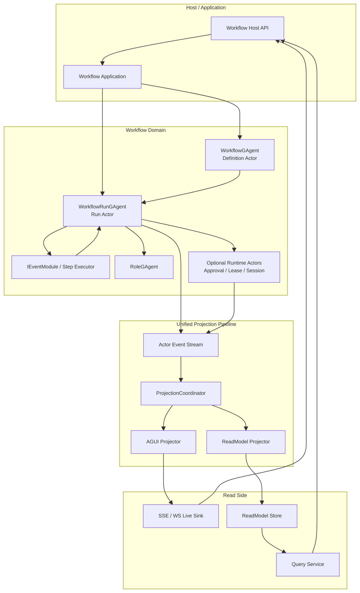
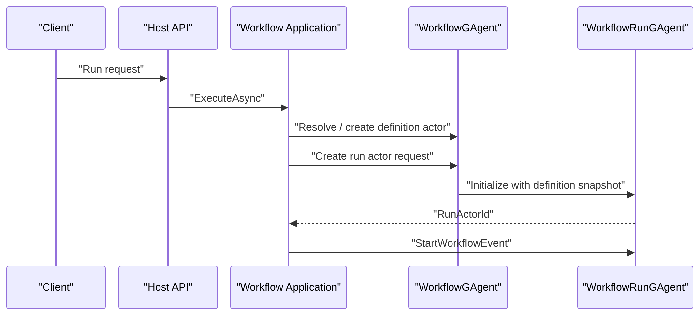
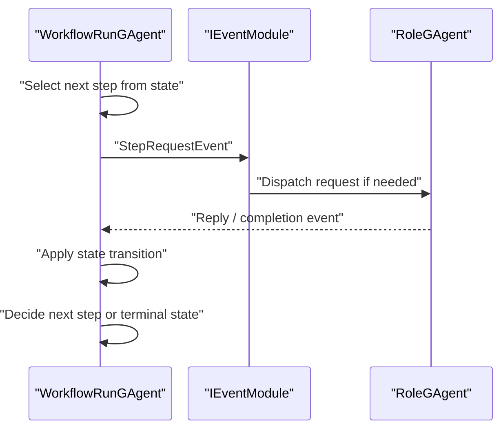
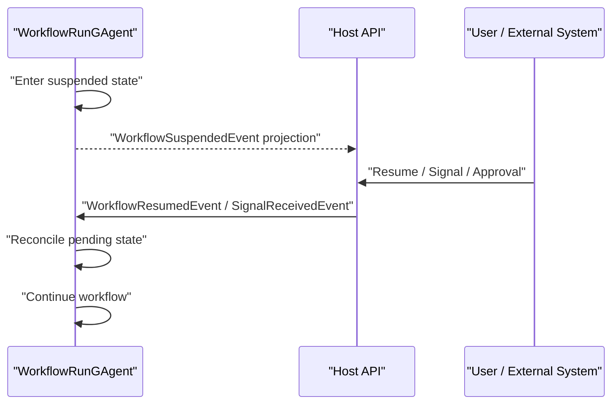

# Aevatar.Workflow Run Actor 化目标架构文档（2026-03-08）

## 1. 文档元信息

- 状态：Proposed
- 版本：R1
- 日期：2026-03-08
- 目标分支：`refactor/workflow-run-actorized-state-boundary-20260308`
- 关联蓝图：
  - `docs/architecture/workflow-run-actorized-state-boundary-blueprint-2026-03-08.md`
- 文档定位：
  - 本文描述 `workflow` 子系统重构完成后的目标架构形态
  - 本文关注“最终职责边界与主链路”
  - 本文不展开分阶段迁移细节，迁移计划见关联蓝图

## 2. 目标与设计原则

本次目标架构以以下原则为核心：

1. 一个 run 一个权威事实源。
2. `IEventModule` 只做事件处理，不做权威状态宿主。
3. workflow 定义与 workflow 执行彻底分离。
4. 所有推进逻辑都在 Actor 事件处理线程内完成。
5. Projection 与 AGUI 继续复用同一输入事件流。
6. Host 不承载业务编排，只做协议适配与组合。
7. 新增 Actor 只按“事实源边界”，不按“代码模块数量”。

一句话概括目标形态：

`WorkflowGAgent` 负责定义与 run 派生，`WorkflowRunGAgent` 负责单次运行的全部事实状态与推进，`IEventModule` 退回为无状态或短生命周期 step executor。

## 3. 目标系统总览



## 4. 核心组件与职责

### 4.1 `WorkflowGAgent`：Definition Actor

`WorkflowGAgent` 在目标架构中承担“定义宿主”职责，而非“执行宿主”职责。

职责：

- 绑定 `workflow_yaml`
- 维护编译结果与版本
- 维护 inline workflow definitions
- 管理 role 模板与 definition 级 runtime 配置
- 管理 sub-workflow 定义绑定
- 校验 workflow 是否可执行
- 派生 `WorkflowRunGAgent`

不再承担：

- step loop 推进
- run 变量存储
- run timeout/retry 状态
- signal wait / human wait / approval wait
- 外部调用请求关联
- run 终态聚合事实

definition actor 的状态只表达“定义事实”，不表达“执行事实”。

### 4.2 `WorkflowRunGAgent`：Run Actor

`WorkflowRunGAgent` 是目标架构的核心。每次 workflow run 对应一个独立 actor。

职责：

- 接收 run 启动事件
- 推进 step lifecycle
- 管理 run 变量、step runtime、挂起状态、超时、重试
- 管理外部调用 correlation
- 管理 signal / human input / approval / watchdog 等运行事实
- 管理 sub-workflow invocation runtime
- 记录终态并发布 run domain events

特征：

- 一个 run 一个 actor
- 一个 run 一个权威状态对象
- 所有业务推进只在 actor 事件处理中完成
- 所有内部 callback 都转成内部事件后再由 actor 对账

### 4.3 `IEventModule`：Step Executor / Effect Adapter

`IEventModule` 在目标架构中仍保留，但语义收敛为：

- pipeline 中的 step executor
- 外部 effect adapter
- 无状态计算节点
- 短生命周期的参数解析与事件转换器

允许：

- 读取当前 event payload
- 读取 definition snapshot 或 run state 的只读视图
- 调用外部能力
- 发布后续事件

禁止：

- 持有 run/step/session durable facts
- 使用私有 `Dictionary/HashSet` 长期承载业务事实
- 在 callback 线程直接推进业务分支

### 4.4 `RoleGAgent`

`RoleGAgent` 仍承担 AI role 的对话与工具交互能力，但在目标架构中应接受 run actor 的明确调度。

建议方向：

- 优先演进为 run-scoped role actor，确保一次 run 的 role 上下文与其他 run 隔离。
- 若短期保留 definition-scoped role actor，run 级 correlation 事实仍必须只保留在 run actor。

### 4.5 Optional Runtime Actors

只有当运行对象具备独立事实源语义时，才拆成专门 Actor。典型示例：

- projection ownership coordinator
- 独立 approval ticket
- 独立 lease/session owner
- 独立 sub-workflow invocation coordinator

这类 Actor 必须满足至少一条：

- 需要独立寻址
- 需要跨 run 复用或裁决
- 需要独立查询
- 需要独立取消/释放/过期语义

## 5. 状态归属模型

### 5.1 Definition State

建议 `WorkflowGAgent.State` 只保留以下内容：

- `WorkflowName`
- `WorkflowYaml`
- `Compiled`
- `CompilationError`
- `Version`
- `InlineWorkflowYamls`
- `RoleDefinitions`
- `SubWorkflowBindings`
- `DefinitionRuntimeConfiguration`

这些状态具备“长期定义事实”属性。

### 5.2 Run State

建议 `WorkflowRunState` 成为单次执行的唯一事实源。建议最少包含：

- `RunId`
- `DefinitionActorId`
- `WorkflowName`
- `Status`
- `Input`
- `StartedAtUtc`
- `CompletedAtUtc`
- `FinalOutput`
- `FinalError`
- `CurrentStepId`
- `Variables`
- `Steps`
- `PendingTimeouts`
- `RetryAttempts`
- `PendingSignals`
- `PendingHumanInteractions`
- `PendingApprovals`
- `ExternalCallCorrelations`
- `SubWorkflowInvocations`
- `RoleDispatches`
- `TelemetryMarkers`

### 5.3 Step State

建议每个 step 的运行态进入 `WorkflowRunState.Steps`：

- `StepId`
- `StepType`
- `TargetRole`
- `RequestedAtUtc`
- `CompletedAtUtc`
- `Status`
- `Input`
- `Output`
- `Error`
- `Attempt`
- `TimeoutLease`
- `RetryLease`
- `CompletionMetadata`

### 5.4 状态边界规则

- definition actor 只保留 definition facts
- run actor 只保留 run facts
- role actor 只保留 role 自身会话/配置 facts
- projection state 只保留 projection lifecycle facts
- 中间层不保留事实态
- `IEventModule` 不保留事实态

## 6. 事件模型

### 6.1 事件分类

目标架构下，workflow 事件分为五类：

1. definition lifecycle events
2. run lifecycle events
3. step lifecycle events
4. effect correlation events
5. internal trigger events

### 6.2 Definition Lifecycle Events

用于描述 definition actor 事实变化：

- `BindWorkflowDefinitionEvent`
- definition 版本更新事件
- sub-workflow binding 变更事件

### 6.3 Run Lifecycle Events

用于描述 run actor 整体推进：

- `StartWorkflowEvent`
- run started
- run suspended
- run resumed
- `WorkflowCompletedEvent`

### 6.4 Step Lifecycle Events

用于描述 step 请求与完成：

- `StepRequestEvent`
- `StepCompletedEvent`
- step failed
- step cancelled

### 6.5 Effect Correlation Events

用于描述对外部能力的请求/响应关联：

- LLM call dispatched
- tool call dispatched
- connector call dispatched
- external reply received
- watchdog timeout fired

### 6.6 Internal Trigger Events

用于描述只作为内部推进信号的事件：

- `DelayStepTimeoutFiredEvent`
- `WaitSignalTimeoutFiredEvent`
- `WorkflowStepTimeoutFiredEvent`
- `WorkflowStepRetryBackoffFiredEvent`
- `LlmCallWatchdogTimeoutFiredEvent`

这类事件的规则是：

- 只负责发信号
- 不直接表达最终业务结论
- 必须由 run actor 查 state 对账后再决定后续分支

## 7. 命令侧执行链路

### 7.1 Run 创建链路



### 7.2 Step 执行链路



### 7.3 挂起与恢复链路



## 8. Effect Execution Model

### 8.1 无状态执行器

以下步骤应实现为无状态或近无状态 executor：

- `assign`
- `transform`
- `emit`
- `guard`
- `conditional`
- `switch`
- `checkpoint`
- `workflow_yaml_validate`

### 8.2 有外部副作用的执行器

以下步骤可能发出外部请求，但关联事实必须放在 run actor：

- `llm_call`
- `tool_call`
- `connector_call`
- `evaluate`
- `reflect`
- `workflow_call`

建议模式：

1. executor 解析参数
2. executor 发布“request dispatched”事件
3. run actor 写入 correlation state
4. 外部 reply 回到 run actor
5. run actor 完成对账并推进 step

### 8.3 聚合类执行器

以下步骤存在 fan-out/fan-in 聚合中间态，但该中间态属于 run actor：

- `parallel`
- `foreach`
- `map_reduce`
- `race`
- maker recursive variants

聚合规则：

- child dispatch 列表在 run state
- expected/completed counters 在 run state
- parent-child 关联表在 run state
- executor 只负责生成和解释事件

### 8.4 等待类执行器

以下步骤属于“等待 + 事件触发”模式：

- `delay`
- `wait_signal`
- `human_input`
- `human_approval`

这些步骤的等待对象、lease、timeout、resume correlation 必须都进入 run state。

## 9. Projection 与读侧目标架构

### 9.1 基本原则

- 继续只有一条 Projection Pipeline
- 输入依然是 actor event stream
- run actor 事件成为 run read model 的输入
- AGUI 与 CQRS 共用同一输入事件

### 9.2 读模型作用域

建议 `WorkflowExecutionReport` 调整为 run-scoped：

- `RootActorId`：run actor id
- `DefinitionActorId`
- `WorkflowName`
- `RunId`
- `CommandId`
- `StateVersion`
- `LastEventId`
- `Timeline`
- `Steps`
- `Summary`

兼容阶段可额外保留：

- `DefinitionRootActorId`
- `LegacyActorSharedLookupKeys`

### 9.3 查询模型

建议查询能力分为两层：

- definition 查询
  - workflow 定义元信息
  - role topology
  - definition 版本
- run 查询
  - run snapshot
  - run timeline
  - step traces
  - role replies
  - final status

### 9.4 AGUI 事件模型

AGUI 输出原则不变：

- 仍然从投影分支生成
- 仍然不直接读取 Actor State 推前端
- 仍然与 CQRS 读模型共用同一输入事件流

变化点：

- 默认 thread/run scope 从 definition actor 迁到 run actor
- correlation/command 只作为会话或 stream key 的补充，而不是事实源

## 10. Application / Infrastructure / Host 边界

### 10.1 Application

Application 负责：

- 解析外部请求
- 选择或创建 definition actor
- 请求 definition actor 派生 run actor
- 为 run actor 建立 projection lease 和 live sink
- 向 run actor 派发开始事件
- 等待 projection 输出

Application 不负责：

- 维护 run 状态
- 做 step 推进决策
- 维护 pending correlation

### 10.2 Infrastructure

Infrastructure 负责：

- actor runtime 访问
- durable callback scheduler
- connector/tool provider 适配
- read model store 适配
- host capability wiring

Infrastructure 不负责：

- 执行业务状态迁移
- 维护业务事实缓存

### 10.3 Host

Host 负责：

- HTTP / SSE / WebSocket 协议适配
- 请求序列化与响应流式输出
- 认证、限流、配置装配

Host 不负责：

- run 创建逻辑细节
- workflow 分支推进
- 状态聚合

## 11. 目录与模块目标落点

建议目标目录结构：

```text
src/workflow/
  Aevatar.Workflow.Core/
    WorkflowGAgent.cs                    # Definition actor
    WorkflowRunGAgent.cs                 # Run actor
    States/
      WorkflowState.cs                   # Definition state
      WorkflowRunState.cs                # Run state
    Events/
      WorkflowRunDomainEvents.cs
    Modules/
      WorkflowLoopModule.cs              # 转为 run executor / adapter
      DelayModule.cs
      WaitSignalModule.cs
      ...
    Runtime/
      WorkflowRunStateTransitions.cs
      WorkflowRunStateQueries.cs
      WorkflowRunCorrelationResolver.cs

  Aevatar.Workflow.Application/
    Runs/
      WorkflowRunContextFactory.cs
      WorkflowRunActorResolver.cs
      WorkflowRunExecutionEngine.cs

  Aevatar.Workflow.Infrastructure/
    Runs/
      WorkflowDefinitionActorPort.cs
      WorkflowRunActorPort.cs

  Aevatar.Workflow.Projection/
    Orchestration/
      WorkflowExecutionProjectionLifecycleService.cs
    ReadModels/
      WorkflowExecutionReadModel.cs
```

说明：

- `WorkflowGAgent` 与 `WorkflowRunGAgent` 必须位于同一领域核心下，避免执行主链路跨层漂移。
- run state transition 逻辑应集中，不能散落回模块私有字段。

## 12. 并发、恢复与一致性语义

### 12.1 并发语义

- 同一 run actor 内所有状态变更必须串行
- callback 线程只能发内部事件
- 外部 reply 必须带足够 correlation key

### 12.2 恢复语义

- actor 重新激活后，run state 应可由 event sourcing 恢复
- fired timeout event 到来后，必须能凭 state 完成对账
- 不依赖模块实例字段恢复运行事实

### 12.3 分布式一致性语义

- 跨节点事实只承认 actor state
- 不承认模块实例内存为事实源
- 不承认中间层单例缓存为事实源

## 13. 可观测性与治理

目标架构下必须具备以下观测能力：

- definition actor id
- run actor id
- workflow name
- run id
- current step id
- effect correlation id
- callback id / lease id
- projection scope
- final completion status

建议日志与 tracing 最小标签：

- `workflow.definition_actor_id`
- `workflow.run_actor_id`
- `workflow.run_id`
- `workflow.step_id`
- `workflow.step_type`
- `workflow.effect_kind`
- `workflow.correlation_id`

## 14. 兼容与演进策略

### 14.1 外部 API 兼容

- 继续支持现有 chat/run/signal/resume API
- 外部不强制感知内部从 definition actor 切到 run actor
- 必要时通过 query compatibility 层保留旧 lookup 方式

### 14.2 文档与测试同步

目标架构落地时，必须同步更新：

- `docs/FOUNDATION.md`
- `src/workflow/README.md`
- `docs/architecture/AEVATAR_MAINNET_ARCHITECTURE.md`
- architecture guards
- integration tests
- projection tests

### 14.3 延后事项

以下议题可以在 run actor 主边界稳定后再做：

- 是否将 `WorkflowGAgent` 重命名为 `WorkflowDefinitionGAgent`
- 是否全面采用 run-scoped role actors
- 是否将 approval/signal/human 会话进一步拆为专门 Actor
- 是否将 `IEventModule` 收敛为更语义化的 `IWorkflowStepExecutor`

## 15. 目标态判定标准

满足以下条件时，可认定目标架构已基本达成：

1. 一个 run 一个 `WorkflowRunGAgent`
2. `WorkflowGAgent` 不再推进 run
3. 所有关键运行事实都在 actor state 中
4. `IEventModule` 不再保留权威 `_pending/_states/_variables` 字段
5. 所有内部 trigger 都由 run actor 对账
6. Projection 与 AGUI 仍然共用同一输入事件流
7. Host 未侵入核心编排

## 16. 与蓝图文档的关系

本文回答“最终架构应该长什么样”。  
关联蓝图回答“如何从当前代码走到那里”。

建议使用方式：

1. 先以本文作为目标态基线。
2. 再按蓝图中的工作包推进实现。
3. 每完成一个工作包，回查本文确认没有偏离目标边界。
