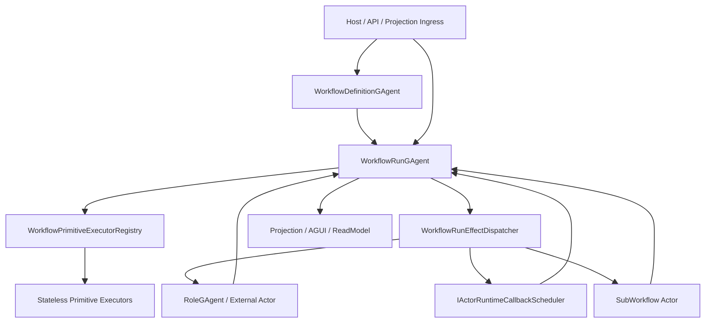

# Workflow Runtime Actorized-Run Persistent-State 重构蓝图（v1, Breaking Change）

## 1. 文档元信息

1. 状态：`Delivered`
2. 版本：`v1`
3. 日期：`2026-03-07`
4. 决策级别：`Architecture Breaking Change`
5. 适用范围：
   - `src/workflow/Aevatar.Workflow.Abstractions`
   - `src/workflow/Aevatar.Workflow.Core`
   - `src/workflow/Aevatar.Workflow.Application`
   - `src/workflow/Aevatar.Workflow.Host.Api`
   - `test/Aevatar.Workflow.*`
   - `test/Aevatar.Integration.Tests` 中 Workflow 相关场景
6. 非范围：
   - `Aevatar.CQRS.*` 主干协议
   - `RoleGAgent` 业务语义本身
   - 非 Workflow 子系统的 Foundation 事件模块机制
7. 本版结论：
   - 当前 `Workflow` 的核心问题不是“某几个 callback 没持久化”，而是“run 级事实状态被分散到 activation-local event modules 中”。
   - 彻底修复的唯一正确方向是：`一个 workflow run = 一个持久化 Actor 事实源`。
   - `event module` 不应继续承担跨事件运行态；本次交付将 Workflow 主执行链收敛为“`WorkflowGAgent(Definition Actor) + WorkflowRunGAgent + Persisted Run Facts`”。

补充说明：

1. 第 8~11 节保留了完整设计推演，其中包含若干比当前实现更激进的抽象化设想。
2. 当设计推演与当前代码不一致时，以第 6 / 7 / 12 / 15 / 16 节的交付状态为准。

## 2. 背景与关键决策（统一认知）

### 2.1 当前问题不是局部缺陷，而是模型错位

当前 `Workflow` 运行时已出现系统性现象：

1. 大量 in-flight 事实只存在于模块内存字典。
2. `WorkflowGAgent` 同时承担 definition owner、run orchestrator、child tree manager、sub-workflow runtime coordination 多重职责。
3. `IEventModule` 只有 `CanHandle/HandleAsync`，没有自己的持久化状态协议。
4. 为了让某些能力跨 reactivation 存活，只能把状态“硬塞”进 root actor state 或额外旁路协调器。

这导致当前代码满足“单节点内短期可跑”，但不满足：

1. 已接收 run 的最终收敛。
2. reactivation / restart 后的确定性恢复。
3. 运行态与业务事实的边界清晰。
4. 扩展点与状态源的职责分离。

### 2.2 本次重构的不可妥协决策

1. 删除优于兼容：不保留旧 `WorkflowLoopModule` 驱动模型的兼容壳。
2. 一个 run 的所有业务事实只允许由 `WorkflowRunGAgent` 持久状态承载。
3. `Workflow` 主执行链正确性不再依赖 `IEventModule` 承担 runtime state。
4. `StepRequestEvent / StepCompletedEvent` 可以暂时保留为 run actor 内部适配协议，但不允许再背靠 activation-local volatile state。
5. callback / timeout / retry / wait / fanout / map-reduce / sub-workflow pending 都必须有对应持久事实。
6. `RuntimeCallbackLease`、Orleans backend 细节、activation-local 句柄不得进入 `WorkflowRunState`。
7. 外部 signal / human input / approval 必须命中明确 run actor，且必须携带精确相关键，不能再靠模糊广播反查。

## 3. 重构目标

1. 已被接收的 workflow run 必须在 reactivation / restart 后继续收敛为 `completed / failed / cancelled`。
2. Workflow runtime 中禁止 event module 以进程内字典持有跨事件事实态。
3. `WorkflowGAgent` 职责收窄到 definition 与 definition-scope 资源管理。
4. 引入 `WorkflowRunGAgent` 作为 run 级唯一事实源。
5. 所有原语执行逻辑都必须服从 `WorkflowRunState` 驱动；可通过内建 handler 或无状态处理器实现，但不得回退为私有内存状态机。
6. callback、wait、human gate、external call、fanout 聚合、sub-workflow invocation 均具备持久恢复语义。
7. 测试从“依赖内存时序”改为“基于持久事实 + fired event reconcile”的确定性验证。
8. 为 Workflow 子系统补齐静态门禁，禁止旧 volatile 模式回流。

## 4. 范围与非范围

### 4.1 范围内

1. `WorkflowGAgent` 拆分与命名重构。
2. 新增 `WorkflowRunGAgent` 与 `WorkflowRunState`。
3. Workflow 内部事件/命令协议重构。
4. 原有 `Workflow.*Module` 向 stateless executor 体系迁移。
5. Host / Application 层的 run ingress、signal ingress、human gate ingress 路由调整。
6. sub-workflow pending 模型下沉到 run actor。
7. timeout/retry/wait callback 恢复机制重做。
8. 文档、测试、门禁同步。

### 4.2 非范围

1. 不改变 Workflow YAML 语法本身。
2. 不改变 AGUI / Projection 主链协议。
3. 不引入第二套中间层 registry 来替代现有 module 字典。
4. 不保留“旧 module 模式 + 新 run actor 模式”双轨共存。

## 5. 架构硬约束（必须满足）

1. `WorkflowRunState` 是 run 级唯一权威事实源。
2. `WorkflowDefinitionState` 只保存 definition-scope 事实，不保存 run-scope pending。
3. `Primitive Executor` 必须无状态；允许依赖端口，但禁止持有跨事件 runtime fields。
4. 所有 callback fired event 必须至少携带：
   - `run_id`
   - `step_id`
   - `operation_id`
   - `semantic_generation`
5. 回调取消是 best-effort，正确性基于 state 内语义代际对账，不基于物理取消是否成功。
6. 所有 external response 必须通过显式 correlation id 命中 run actor 中的 pending fact。
7. 流程推进顺序固定为：`Handle ingress -> Plan domain events -> Persist -> Dispatch effects -> Receive response -> Reconcile`。
8. `Workflow` 子系统禁止再通过 `SetModules/RegisterModule` 构建主执行链。
9. `Projection` / `API` 只读 `WorkflowRunCompleted*`、`WorkflowRunSuspended*` 等结果事件，不拼装中间态。

## 6. 当前基线（2026-03-07 交付后代码事实）

### 6.1 definition actor 与 run actor 已拆分

1. `WorkflowGAgent` 已收窄为 definition actor，负责：
   - workflow binding / validation
   - definition-scope execution counters
   - 创建并绑定 `WorkflowRunGAgent`
2. `WorkflowRunGAgent` 已成为单 run 持久事实源，负责：
   - run 生命周期推进
   - callback / signal / human gate / sub-workflow completion 对账
   - reactivation 后恢复编译缓存、重装无状态原语处理器、重发 suspended facts
3. Application / Host / Projection 已统一围绕 `runActorId` 工作，definition actor 不再承载 run projection 会话。

### 6.2 state ownership 已重划

1. `src/workflow/Aevatar.Workflow.Core/workflow_state.proto` 现在只保存 definition facts 与 counters：
   - `workflow_yaml / workflow_name / version / compiled / compilation_error`
   - `total_executions / successful_executions / failed_executions`
   - `inline_workflow_yamls`
2. `src/workflow/Aevatar.Workflow.Core/workflow_run_state.proto` 现在持久化 run facts：
   - `run_id / status / active_step_id / final_output / final_error`
   - `variables / step_executions / retry_attempts`
   - `pending_timeouts / pending_retry_backoffs / pending_delays`
   - `pending_signal_waits / pending_human_gates`
   - `pending_llm_calls / pending_evaluations / pending_reflections`
   - `pending_parallel_steps / pending_foreach_steps / pending_map_reduce_steps / pending_race_steps / pending_while_steps`
   - `pending_sub_workflows / pending_child_run_ids_by_parent_run_id / cache_entries / pending_cache_calls`

### 6.3 activation-local 组件不再作为事实源

1. `GAgentBase` 的 `_modules` 仍然存在，但 correctness 不再依赖 module 内存字典。
2. callback 正确性由 `WorkflowRunState` 中的 pending fact + semantic generation 对账保证。
3. reactivation 后由 run actor 根据持久态重建等待与挂起视图，而不是依赖旧 activation 的 callback lease。

### 6.4 tokenized ingress 已端到端落地

1. `WaitingForSignalEvent.wait_token` / `SignalReceivedEvent.wait_token` 已贯通 proto、Host API、Projection、AGUI。
2. `WorkflowSuspendedEvent.resume_token` / `WorkflowResumedEvent.resume_token` 已贯通 proto、Host API、Projection、AGUI。
3. `/resume` 与 `/signal` 现在要求 `runActorId + token`，不再依赖模糊 waiter 匹配。

### 6.5 legacy volatile 旁路已移除

1. `SubWorkflowOrchestrator` 已删除。
2. definition actor state 不再持有 `pending_sub_workflow_invocations` / `sub_workflow_bindings` 这类 run-scope facts。
3. `workflow_call` child-run correlation 现在归属 `WorkflowRunState`，并由测试与 `workflow_closed_world_guards.sh` 明确守护。
4. `IWorkflowModuleDependencyExpander` / `IWorkflowModuleConfigurator` 已删除。
5. `WorkflowCoreModulePack` / 扩展 pack 只保留 `Modules` 注册面；旧组合扩展点不再存在。
6. 旧 stateful runtime module 文件已删除，当前仅保留无状态原语模块与 `WorkflowRunGAgent` 内建 run-owned 原语语义。

## 7. 需求分解与状态矩阵

| ID | 需求 | 验收标准 | 当前状态 | 差距结论 |
|---|---|---|---|---|
| R1 | run 接收后可跨 reactivation 收敛 | restart 后仍能完成/失败 | 已满足 | `WorkflowRunGAgent + WorkflowRunState` 已交付 |
| R2 | workflow 主链无 runtime volatile facts | 无 module dictionary 承担事实态 | 已满足 | run-scope facts 已下沉到 `WorkflowRunState` |
| R3 | callback 恢复不依赖内存 lease | fired event 仅靠 state 对账 | 已满足 | pending fact + semantic generation 已落地 |
| R4 | signal/human gate 精确命中 waiter | 不允许 run+signal 模糊匹配 | 已满足 | `wait_token / resume_token` 已贯通 |
| R5 | retry 保留原始输入与 attempt | 任意重试都复用原输入 | 已满足 | `step_executions + retry_attempts_by_step_id` 已持久化 |
| R6 | fanout/map_reduce/foreach/race/while 可恢复 | 聚合中断后可继续收敛 | 已满足 | 聚合 pending state 已进入 `WorkflowRunState` |
| R7 | sub-workflow pending 属于 run actor | root definition actor 无 run pending | 已满足 | `pending_sub_workflows + pending_child_run_ids_by_parent_run_id` 已下沉 |
| R8 | workflow 扩展点仍可插拔 | executor 可注册、可测试 | 部分满足 | 当前保留 `WorkflowModulePack` 作为无状态原语注册面，未再单拆 executor registry |
| R9 | 读写分离清晰 | counters / result 走 projection，运行事实走 run actor | 已满足 | Host / Projection 统一以 `runActorId` 为主键 |
| R10 | 有自动化门禁防回流 | 新增 guard + tests | 已满足 | `architecture_guards.sh` / `workflow_closed_world_guards.sh` / 回归测试已更新 |

## 8. 差距详解（重构前根因拆解）

### 8.1 缺失“run 级一等模型”

重构前系统只有 definition actor，没有 run actor。结果是：

1. 并发 run 被塞进一个 actor 的多个字典。
2. 任何 run-specific pending 都不是顶层事实。
3. module 必须自己实现小型易失状态机。

### 8.2 执行协议过于宽泛

`StepRequestEvent / StepCompletedEvent` 只适合表达“开始一步/结束一步”，不适合表达：

1. 等待外部 signal
2. 等待 human input / approval
3. callback timeout 已注册但尚未 fired
4. external request 已发出但尚未响应
5. fanout / map_reduce 的聚合过程
6. sub-workflow invocation 的 lifecycle

结果是：这些事实只能旁路到 module 内存里。

### 8.3 event module 同时承担“扩展点 + 状态机”

`event module` 作为扩展点本身没问题；问题是它还在承担：

1. 运行事实持有者
2. 状态迁移器
3. 异步响应对账器
4. callback lease keeper

这四个职责必须回归 actor state machine，不能继续放在插件实例上。

### 8.4 callback 语义只事件化了一半

当前 callback 已经做到“fired 后发 self event”，但还缺：

1. 注册事实持久化
2. activation 后重建
3. stale fired event 对账
4. 取消失败后的幂等兜底

### 8.5 definition actor 被污染了 run-scope 事实

`pending_sub_workflow_invocations` 之类字段已经说明：

1. root actor state 在承担 run-scope runtime facts
2. 这破坏了 definition actor 的单一职责
3. 后续继续往 `WorkflowState` 塞 wait/delay/llm pending 只会让 root actor 继续膨胀

## 9. 目标架构

### 9.1 Actor 拆分

#### 9.1.1 WorkflowDefinitionGAgent（逻辑角色，当前由 `WorkflowGAgent` 承担）

职责：

1. 持有 workflow YAML / compiled definition revision
2. 校验与绑定 definition
3. 管理 definition-scope role topology
4. 处理“创建 run actor”的 ingress
5. 管理 definition-scope singleton sub-workflow binding（若仍保留该能力）

禁止职责：

1. 不再推进 step
2. 不再持有 run pending
3. 不再处理 signal / wait / retry / timeout / fanout 聚合

当前实现说明：

1. 代码保留 `WorkflowGAgent` 命名，以避免无价值的大规模重命名。
2. 其职责已经等同于本文中的 `WorkflowDefinitionGAgent`。
3. `WorkflowState` 也保留现名，但语义已收窄为 definition-only state。

#### 9.1.2 WorkflowRunGAgent

职责：

1. 每个 `run_id` 一个 actor
2. 持有 `WorkflowRunState`
3. 处理 run 生命周期：
   - accepted
   - active
   - suspended
   - waiting
   - completed
   - failed
   - cancelled
4. 对账 callback fired / signal / human input / external response
5. 维护 run variables、execution frames、aggregation states、pending async ops
6. 负责最终发布 `WorkflowRunCompletedEvent`

#### 9.1.3 Stateless Primitive Executor Registry（后续可选进一步抽象）

当前实现说明：

1. 本次没有再引入独立 `executor registry` 类型层。
2. 当前由 `WorkflowRunGAgent` 内建分发 + `WorkflowModulePack` 注册无状态原语处理器完成原语接线。
3. 若后续继续拆 registry，只允许抽出 planning/dispatch 抽象，不能回退到 stateful module model。

### 9.2 目标总览图



### 9.3 新协议分层

#### 9.3.1 外部 ingress 协议

保留或新增：

1. `StartWorkflowRunRequestedEvent`
2. `SignalWorkflowRunRequestedEvent`
3. `ResumeWorkflowRunRequestedEvent`
4. `CancelWorkflowRunRequestedEvent`

规则：

1. 这些是 definition actor / host 接收的入口协议。
2. definition actor 负责路由到目标 run actor。
3. host 不再把 signal 广播回 definition actor 再交给 module 试探匹配。

#### 9.3.2 run actor 内部 domain events

建议新增：

1. `WorkflowRunAcceptedEvent`
2. `WorkflowFrameActivatedEvent`
3. `WorkflowVariableUpsertedEvent`
4. `WorkflowAsyncOperationRegisteredEvent`
5. `WorkflowAsyncOperationCompletedEvent`
6. `WorkflowAsyncOperationTimedOutEvent`
7. `WorkflowExternalInteractionDispatchedEvent`
8. `WorkflowExternalInteractionResolvedEvent`
9. `WorkflowAggregationUpdatedEvent`
10. `WorkflowRunSuspendedEvent`
11. `WorkflowRunCompletedEvent`
12. `WorkflowRunFailedEvent`
13. `WorkflowRunCancelledEvent`

原则：

1. `StepRequestEvent / StepCompletedEvent` 可以保留为 adapter boundary，但不再作为 engine 主内部协议。
2. run actor 的 `TransitionState(...)` 必须能仅依靠 domain events 还原运行态。

### 9.4 WorkflowRunState 结构草案

建议新增 proto：`src/workflow/Aevatar.Workflow.Core/workflow_run_state.proto`

```proto
syntax = "proto3";
package aevatar.workflow;
option csharp_namespace = "Aevatar.Workflow.Core";

message WorkflowRunState {
  string workflow_name = 1;
  string run_id = 2;
  string definition_version = 3;
  string status = 4;
  string final_output = 5;
  string final_error = 6;

  map<string, string> variables = 10;
  repeated WorkflowExecutionFrame frames = 11;
  repeated PendingAsyncOperation pending_async_operations = 12;
  repeated WorkflowStepRecord step_history = 13;
}

message WorkflowExecutionFrame {
  string frame_id = 1;
  string parent_frame_id = 2;
  string step_id = 3;
  string frame_type = 4;
  int32 program_counter = 5;
  int32 attempt = 6;
  string input = 7;
  string last_output = 8;
  bool completed = 9;
  map<string, string> locals = 10;
  repeated string child_frame_ids = 11;
}

message PendingAsyncOperation {
  string operation_id = 1;
  string frame_id = 2;
  string step_id = 3;
  int32 semantic_generation = 4;
  int64 due_at_unix_time_ms = 5;

  oneof detail {
    PendingDelay delay = 10;
    PendingSignalWait signal_wait = 11;
    PendingHumanInputWait human_input_wait = 12;
    PendingHumanApprovalWait human_approval_wait = 13;
    PendingRoleCall role_call = 14;
    PendingConnectorCall connector_call = 15;
    PendingToolCall tool_call = 16;
    PendingLlmCall llm_call = 17;
    PendingSubWorkflowInvocation sub_workflow = 18;
    PendingAggregation aggregation = 19;
  }
}
```

约束：

1. 不持久化 `RuntimeCallbackLease`
2. 不持久化 Orleans backend / timer / reminder 细节
3. 只持久化业务相关键与语义代际

### 9.5 Callback / timeout / retry 模型

#### 9.5.1 统一规则

1. register timeout/backoff/delay 时，先 persist 语义事实，再 schedule callback
2. callback id 采用稳定 key：
   - `workflow:{run_id}:step:{step_id}:op:{operation_id}`
3. fired event 必须带 `operation_id + semantic_generation`
4. activation 后 run actor 遍历 `pending_async_operations` 重建 callback
5. cancel 仅作为优化；正确性基于 state 中 pending 是否仍 active

#### 9.5.2 为什么不持久化 lease

1. lease 是 runtime adapter 细节，不是业务事实
2. 物理取消失败时，stale fired event 仍应被 state 兜底拒绝
3. run actor 只需要知道“这次等待是否仍然有效”，不需要知道某个 backend lease 是否还活着

### 9.6 signal / human gate 模型

#### 9.6.1 wait_signal

1. 注册等待时生成 `wait_token`
2. `WaitingForSignalEvent` 对外必须包含：
   - `run_id`
   - `step_id`
   - `signal_name`
   - `wait_token`
3. 外部 signal ingress 必须携带 `run_id + wait_token`
4. 不再允许“只有 run_id + signal_name，再在 actor 内猜哪个 waiter 命中”

#### 9.6.2 human_input / human_approval

1. 统一归入 `HumanGate` 家族
2. 注册时生成 `resume_token`
3. 宿主/API 只通过 `run_id + resume_token` 恢复
4. 若需要 UI 展示，投影端只读取 `WorkflowRunSuspendedEvent`

### 9.7 external interaction 模型

#### 9.7.1 LLM / connector / tool / evaluate / reflect

统一做法：

1. executor 产出 `ExternalInteractionPlanned`
2. run actor persist `WorkflowExternalInteractionDispatchedEvent`
3. effect dispatcher 发真实请求
4. response 以带 `interaction_id` 的事件回到 run actor
5. run actor 根据 pending fact 对账并推进

收益：

1. 原始输入、attempt、watchdog timeout、target role 都可持久化
2. retry 不再依赖 module 私有字典
3. response 晚到可精确 no-op

### 9.8 聚合原语模型

以下原语统一通过 `frame + aggregation fact` 实现，而不是模块字典：

1. `parallel`
2. `foreach`
3. `map_reduce`
4. `race`
5. `while`

统一规则：

1. 父 frame 持有 child frame ids
2. child completion 更新 aggregation fact
3. 当聚合条件满足时，persist `WorkflowAggregationUpdatedEvent`
4. 是否发 reduce / vote / next iteration 由 run actor 根据 state 决定

### 9.9 sub-workflow 模型

1. `SubWorkflowInvocationRegisteredEvent`、`SubWorkflowInvocationCompletedEvent` 从 definition state 移到 run state
2. `SubWorkflowOrchestrator` 不再作为旁路持久化器存在
3. 子 workflow completion 直接回 parent run actor
4. definition actor 只负责：
   - 解析可用 workflow definition
   - 管理 definition-scope singleton child binding（如果保留）

### 9.10 Executor 契约（替代 event module）

建议新增：

```csharp
public interface IWorkflowPrimitiveExecutor
{
    string StepType { get; }

    ValueTask<WorkflowPlanningResult> PlanAsync(
        WorkflowPrimitivePlanningRequest request,
        CancellationToken ct);
}
```

`WorkflowPlanningResult` 只允许返回：

1. domain events
2. side effects
3. validation failure

禁止：

1. executor 内保留 `_pending/_states/_cache` 等字段
2. executor 直接调用 `PersistDomainEventAsync`
3. executor 直接修改 actor state

### 9.11 旧模块到新模型映射

| 旧组件 | 问题 | 新归属 | 处理方式 |
|---|---|---|---|
| `WorkflowLoopModule` | 主循环状态在内存 | `WorkflowRunGAgent` | 删除模块，改为 run actor core reducer |
| `DelayModule` | `_pending` 内存等待态 | `PendingDelay` | 改为 delay executor |
| `WaitSignalModule` | `_pending` + 模糊匹配 | `PendingSignalWait` | 改为 wait executor，必须使用 `wait_token` |
| `HumanInputModule` | `_pending` 内存恢复态 | `PendingHumanInputWait` | 改为 human gate executor |
| `HumanApprovalModule` | `_pending` 内存恢复态 | `PendingHumanApprovalWait` | 改为 human gate executor |
| `LLMCallModule` | `_pending` / attempts / watchdog lease | `PendingLlmCall` | 改为 external interaction executor |
| `EvaluateModule` | `_pending` / attempts | `PendingEvaluateCall` | 改为 external interaction executor |
| `ConnectorCallModule` | pending 与分支在内存 | `PendingConnectorCall` | 改为 external interaction executor |
| `ToolCallModule` | external interaction 无统一 pending 模型 | `PendingToolCall` | 改为 external interaction executor |
| `CacheModule` | child-to-cache key volatile | `PendingCacheInteraction` | 改为 explicit cache interaction fact |
| `ParallelFanOutModule` | `_expected/_collected` volatile | `AggregationFrame` | 改为 frame 聚合 |
| `ForEachModule` | `_expected/_collected` volatile | `AggregationFrame` | 改为 frame 聚合 |
| `MapReduceModule` | `_states/_reduceToParent` volatile | `AggregationFrame` | 改为 frame 聚合 |
| `RaceModule` | `_races` volatile | `AggregationFrame` | 改为 frame 聚合 |
| `WhileModule` | `_states` volatile | `LoopFrame` | 改为 frame 聚合 |
| `ReflectModule` | `_pendingLLM` volatile | `PendingReflectCall` | 改为 external interaction executor |
| `WorkflowCallModule` | run pending 不在 run state | `PendingSubWorkflowInvocation` | 改为 sub-workflow executor |
| `SubWorkflowOrchestrator` | 旁路持久化补丁 | `WorkflowRunGAgent` | 删除旁路编排器 |
| `Assign/Transform/Switch/Conditional/Guard/Emit/Checkpoint/WorkflowYamlValidate` | 本质可纯函数 | Stateless executors | 保留语义，改 executor |

## 10. 重构工作包（WBS）

### WP1：状态模型与协议冻结

1. 产物：
   - `WorkflowState` / `WorkflowRunState` proto
   - 新 run ingress / internal domain events proto
2. DoD：
   - definition-scope 与 run-scope 字段边界明确
   - `WorkflowState` 中不再保留 run pending 字段

### WP2：Actor 拆分

1. 产物：
   - `WorkflowGAgent`（definition actor）
   - `WorkflowRunGAgent`
2. DoD：
   - `ChatRequestEvent` / start request 创建 run actor
   - 旧 root actor 不再推进 step

### WP3：Reducer + Effect 边界内聚

1. 产物：
   - `WorkflowRunGAgent` 内聚 reducer / effect 边界
2. DoD：
   - run actor 使用 `PersistDomainEventAsync(...)` 驱动 state
   - side effects 不再散落在旧 module 中

### WP4：Primitive Executor Registry（可选增强）

1. 产物：
   - 可选的 `IWorkflowPrimitiveExecutor`
   - 可选的 `IWorkflowPrimitivePack`
   - 可选的 executor registry
2. DoD：
   - 即使不拆 registry，workflow 主链 correctness 也不能依赖 `IEventModule` 内存态
   - 若引入 executors，则 executors 全部无状态

### WP5：等待类原语迁移

覆盖：

1. `delay`
2. `wait_signal`
3. `human_input`
4. `human_approval`
5. step timeout / retry backoff

DoD：

1. restart 后可恢复
2. late callback / late signal 正确 no-op

### WP6：外部交互原语迁移

覆盖：

1. `llm_call`
2. `connector_call`
3. `tool_call`
4. `evaluate`
5. `reflect`
6. `cache`

DoD：

1. pending external interaction 全部进 run state
2. retry 与 watchdog 基于 persisted facts

### WP7：聚合原语迁移

覆盖：

1. `parallel`
2. `foreach`
3. `map_reduce`
4. `race`
5. `while`

DoD：

1. aggregation state 不再存在 module 字段
2. parent/child frame 关系可回放恢复

### WP8：sub-workflow 与 definition 分层清理

1. 下沉 sub-workflow pending 到 run actor
2. slim `WorkflowDefinitionState`
3. 删除 `SubWorkflowOrchestrator`

### WP9：Host / Application / Projection 适配

1. Host 入口改为 run-aware routing
2. UI / AGUI 读取 suspended/completed projection
3. human gate / signal API 改为 token 模式

### WP10：旧代码删除、门禁、文档、回归

1. 删除旧旁路持久化器与 definition-side run facts
2. 新增或并入 guard scripts
3. 同步文档和测试

## 11. 里程碑与依赖

### M1：协议与 state 冻结

依赖：无

完成后才能开始并行开发：

1. run actor
2. host adapters
3. 如有必要再并行抽出 executors

### M2：run actor 最小主链可跑

完成标准：

1. start run
2. sync primitive
3. run completion

### M3：等待类与 external interaction 闭环

完成标准：

1. delay / wait_signal / human gate / llm_call / connector_call 可恢复

### M4：聚合原语与 sub-workflow 闭环

完成标准：

1. foreach / parallel / map_reduce / while / race / workflow_call 可恢复

### M5：删除旧模型

完成标准：

1. workflow runtime correctness 不再依赖 `IEventModule`
2. 旧旁路持久化器与 definition-side run facts 已删除；剩余 modules 仅可作为无状态原语处理器

## 12. 验证矩阵（需求 -> 命令 -> 通过标准）

| 需求 | 验证命令 | 通过标准 |
|---|---|---|
| 构建通过 | `dotnet build aevatar.slnx --nologo` | 0 error |
| Workflow Core 回归 | `dotnet test test/Aevatar.Workflow.Core.Tests/Aevatar.Workflow.Core.Tests.csproj --nologo` | 全通过 |
| Workflow Application 回归 | `dotnet test test/Aevatar.Workflow.Application.Tests/Aevatar.Workflow.Application.Tests.csproj --nologo` | 全通过 |
| Workflow Host API 回归 | `dotnet test test/Aevatar.Workflow.Host.Api.Tests/Aevatar.Workflow.Host.Api.Tests.csproj --nologo` | 全通过 |
| Integration Workflow 回归 | `dotnet test test/Aevatar.Integration.Tests/Aevatar.Integration.Tests.csproj --nologo --filter "FullyQualifiedName~Workflow"` | 全通过 |
| 架构门禁 | `bash tools/ci/architecture_guards.sh` | 通过 |
| 测试稳定性门禁 | `bash tools/ci/test_stability_guards.sh` | 通过 |
| Workflow Runtime State 门禁 | `bash tools/ci/architecture_guards.sh` | `workflow runtime state guards passed` |

建议新增的门禁规则：

1. 禁止 `src/workflow/Aevatar.Workflow.Core/**` 的 workflow runtime 使用 `IEventModule` 作为主执行链。
2. 禁止 `src/workflow/Aevatar.Workflow.Core/**` 中出现 run-scope `Dictionary<>` 事实态字段。
3. 禁止 `WorkflowDefinitionState` 包含 `pending_*run*`、`wait*`、`retry*`、`timeout*`、`aggregation*` 等 run 字段。
4. 要求 callback fired event 包含 `operation_id + semantic_generation`。
5. 要求 `WaitingForSignalEvent` / human gate projection 携带 token。

## 13. 完成定义（Final DoD）

1. `WorkflowGAgent`（definition actor）与 `WorkflowRunGAgent` 完成拆分。
2. workflow 主执行链不再依赖 stateful event modules。
3. 已接收 run 在 reactivation / restart 后仍能继续推进。
4. `wait_signal / delay / retry / llm watchdog / human gate / sub-workflow / fanout` 全部具备持久恢复语义。
5. definition actor state 不含 run pending。
6. 旧的旁路状态持有者（如 `SubWorkflowOrchestrator`）已删除，剩余 modules 仅允许作为无状态原语处理器存在。
7. 全量文档、测试、门禁更新完成并通过。

## 14. 风险与应对

### 风险 1：重构范围大，短期内会打断现有开发节奏

应对：

1. 先冻结 protocol/state
2. 再按 `等待类 -> external interaction -> aggregation` 分批落地
3. 但不保留双轨运行时

### 风险 2：旧 run 无法平滑迁移

应对：

1. 明确 breaking change
2. 发布前 drain 旧 run 或接受旧 run 失效
3. 不为旧内存态设计迁移器

### 风险 3：executor 过度抽象，反而引入第二套复杂系统

应对：

1. executor 只做 planning，不做 state ownership
2. reducer / effect dispatcher / executor 三层边界固定
3. 不引入 runtime registry/dictionary 作为事实源

### 风险 4：signal / human gate token 改造波及 Host/API

应对：

1. token 作为唯一恢复句柄一次切换完成
2. projection 统一输出 token
3. API 层只做透传，不再推断 waiter

## 15. 执行清单（可勾选）

- [x] 冻结 `WorkflowState` / `WorkflowRunState` proto 边界
- [x] 将 `WorkflowGAgent` 收窄为 definition actor
- [x] 引入 `WorkflowRunGAgent`
- [x] 将等待类 / external interaction / aggregation / sub-workflow pending 下沉到 `WorkflowRunState`
- [x] 打通 `wait_token / resume_token` 到 Host / Projection / AGUI
- [x] 删除 `SubWorkflowOrchestrator`
- [x] 更新 Application / Infrastructure / Host 的 `definitionActorId` / `runActorId` 路由
- [x] 补齐回归与 reactivation tests
- [x] 更新 Workflow 架构文档与 Host/API 文档
- [x] 将 workflow runtime state guard 并入 `architecture_guards.sh`
- [ ] 如需进一步抽象，再评估是否拆出独立 `IWorkflowPrimitiveExecutor` registry（非本次 correctness 交付阻塞项）

## 16. 当前执行快照（2026-03-07）

1. 已交付：
   - `WorkflowGAgent` 只承担 definition actor 职责
   - `WorkflowRunGAgent` 成为 run 级唯一事实源
   - `WorkflowRunState` 持久化等待、回调、聚合、sub-workflow child-run correlation 等 run facts
2. 已贯通：
   - `definitionActorId` 用于 definition binding source
   - `runActorId` 用于 accepted run 的后续 resume / signal / query / live projection
   - `wait_token / resume_token` 贯通 Host / Projection / AGUI
3. 已验证：
   - `dotnet build aevatar.slnx --nologo`
   - `dotnet test test/Aevatar.Workflow.Application.Tests/Aevatar.Workflow.Application.Tests.csproj --nologo`
   - `dotnet test test/Aevatar.Workflow.Core.Tests/Aevatar.Workflow.Core.Tests.csproj --nologo`
   - `dotnet test test/Aevatar.Workflow.Host.Api.Tests/Aevatar.Workflow.Host.Api.Tests.csproj --nologo`
   - `dotnet test test/Aevatar.Integration.Tests/Aevatar.Integration.Tests.csproj --nologo --filter "FullyQualifiedName~Workflow|FullyQualifiedName~AgentYamlLoaderAndWorkflowStateCoverageTests"`
   - `bash tools/ci/architecture_guards.sh`
   - `bash tools/ci/test_stability_guards.sh`

## 17. 变更纪律

1. 每完成一个工作包，必须同步更新本文件的状态矩阵、清单和快照。
2. 不允许在实施过程中重新向 `WorkflowDefinitionState` 塞 run-scope 字段。
3. 不允许为了“先跑起来”继续新增 stateful workflow event modules。
4. 不允许以 host/process 内 registry 替代 run actor state。
5. 若新增 primitive，必须以 stateless executor + run state fact 的方式接入。
6. 所有架构结论以代码、测试、门禁三者一致为准。
