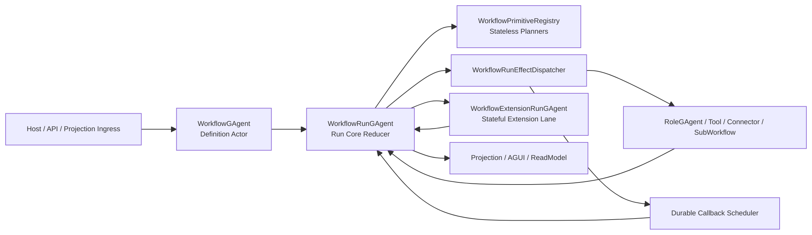

# Workflow Runtime Phase-2 Full-Decoupling 重构蓝图（v1, Breaking Change）

## 1. 文档元信息

1. 状态：`Implemented (historical design record)`
2. 版本：`v1`
3. 日期：`2026-03-07`
4. 决策级别：`Architecture Breaking Change`
5. 适用范围：
   - `src/workflow/Aevatar.Workflow.Abstractions`
   - `src/workflow/Aevatar.Workflow.Core`
   - `src/workflow/Aevatar.Workflow.Application`
   - `src/workflow/Aevatar.Workflow.Infrastructure`
   - `src/workflow/extensions/*`
   - `test/Aevatar.Workflow.*`
   - `test/Aevatar.Integration.Tests` 中 Workflow 相关场景
6. 非范围：
   - `Aevatar.CQRS.*` 主投影协议
   - `RoleGAgent` 业务语义本身
   - 非 Workflow 子系统的 Foundation 通用事件模块机制
7. 本版结论：
   - 本蓝图中的 phase-2 breaking change 已于 `2026-03-07` 落地。
   - 当前实现已经删除 `WorkflowRunStateUpdatedEvent`、`ReplaceWorkflowDefinitionAndExecuteEvent`、`MakerRecursiveModule`，并把 Workflow 主执行链收敛为 `WorkflowPrimitiveRegistry + WorkflowRunStatePatchedEvent + WorkflowRunEffectDispatcher`。
   - 下文的 P1-P6 保留为重构前问题陈述和设计审计记录，不再代表当前代码状态。

## 2. 背景与问题陈述

### 2.1 第一阶段已经解决的问题

截至 `2026-03-07`，以下目标已完成：

1. `WorkflowGAgent` 已收窄为 definition actor。
2. `WorkflowRunGAgent` 已成为单 run 持久事实源。
3. `wait_token / resume_token` 已贯通 Host / Projection / Actor。
4. 旧 `WorkflowLoopModule / DelayModule / WaitSignalModule / SubWorkflowOrchestrator` 已从主链移除。

对应文档：`docs/architecture/workflow-runtime-actorized-run-persistent-state-refactor-blueprint-2026-03-07.md`。

### 2.2 第二阶段仍然存在的结构性问题

#### P1. `WorkflowRunGAgent` 已成为新的单体 orchestrator

当前文件 [src/workflow/Aevatar.Workflow.Core/WorkflowRunGAgent.cs](/Users/auric/aevatar/src/workflow/Aevatar.Workflow.Core/WorkflowRunGAgent.cs) 已达到约 `2980` 行，且同时承担：

1. run 生命周期 reducer
2. step dispatch
3. callback / retry / timeout 对账
4. external interaction correlation
5. sub-workflow 管理
6. aggregation / loop / cache 语义
7. module 装配与 workflow 编译缓存

直接证据：

1. `StateOwnedModuleNames` 与模块装配仍内嵌在 [WorkflowRunGAgent.cs:34](/Users/auric/aevatar/src/workflow/Aevatar.Workflow.Core/WorkflowRunGAgent.cs#L34) 和 [WorkflowRunGAgent.cs:2396](/Users/auric/aevatar/src/workflow/Aevatar.Workflow.Core/WorkflowRunGAgent.cs#L2396)。
2. 大量 `Handle*StepRequestAsync / TryHandle*CompletionAsync / Handle*FiredAsync` 同时存在于一个类中，见 [WorkflowRunGAgent.cs:626](/Users/auric/aevatar/src/workflow/Aevatar.Workflow.Core/WorkflowRunGAgent.cs#L626) 到 [WorkflowRunGAgent.cs:2948](/Users/auric/aevatar/src/workflow/Aevatar.Workflow.Core/WorkflowRunGAgent.cs#L2948)。

#### P2. 事件溯源仍是“整份状态快照事件”

当前 `WorkflowRunState` 通过 [workflow_run_state.proto:43](/Users/auric/aevatar/src/workflow/Aevatar.Workflow.Core/workflow_run_state.proto#L43) 的 `WorkflowRunStateUpdatedEvent` 整体持久化，而 [WorkflowRunGAgent.cs:2353](/Users/auric/aevatar/src/workflow/Aevatar.Workflow.Core/WorkflowRunGAgent.cs#L2353) 每次都写 `State = next.Clone()`。

这会带来：

1. event stream 缺乏业务语义颗粒度
2. 回放成本与状态大小线性耦合
3. 调试时看不到“发生了什么”，只能看到“状态变成了什么”
4. 后续一旦 `WorkflowRunState` 继续增长，事件日志将越来越重

#### P3. 状态型扩展已经重新从插件侧回流

`maker_recursive` 仍然是一个 stateful `IEventModule`，在 [MakerRecursiveModule.cs:17](/Users/auric/aevatar/src/workflow/extensions/Aevatar.Workflow.Extensions.Maker/Modules/MakerRecursiveModule.cs#L17) 保存：

1. `_nodes`
2. `_internalStages`
3. `_childToParent`

这类字段是典型跨事件运行态。只要 reactivation，就会丢失递归分解中的中间事实。它没有违反“当前代码能跑”，但已经违反“Actor 化执行哲学”和“中间层状态约束”。

#### P4. Workflow 扩展面仍然依赖过宽的 `IEventModule`

Foundation 的 [IEventModule.cs:11](/Users/auric/aevatar/src/Aevatar.Foundation.Abstractions/EventModules/IEventModule.cs#L11) 只有：

1. `Name`
2. `Priority`
3. `CanHandle`
4. `HandleAsync`

它不表达：

1. planner 还是 executor
2. 是否允许持有 runtime state
3. 是否允许直接发副作用
4. 是否必须纯 planning

当前文档声称 workflow module 必须无状态，但代码并没有用类型系统强制这一点。比如 [ToolCallModule.cs:18](/Users/auric/aevatar/src/workflow/Aevatar.Workflow.Core/Modules/ToolCallModule.cs#L18) 仍然有 `_toolIndex`、`SemaphoreSlim` 和懒加载缓存。

#### P5. `dynamic_workflow` 仍然在“当前 run 内换 definition”

[DynamicWorkflowModule.cs:14](/Users/auric/aevatar/src/workflow/Aevatar.Workflow.Core/Modules/DynamicWorkflowModule.cs#L14) 会发布 `ReplaceWorkflowDefinitionAndExecuteEvent`，而 [WorkflowRunGAgent.cs:559](/Users/auric/aevatar/src/workflow/Aevatar.Workflow.Core/WorkflowRunGAgent.cs#L559) 直接修改：

1. `workflow_name`
2. `workflow_yaml`
3. `compiled`
4. run runtime state

这意味着：

1. 同一个 `run_id` 中途改变 definition 身份
2. projection / read model / audit log 的语义会变脏
3. 父 run 与 derived workflow 的边界不清晰
4. 这与“definition immutable, run immutable binding”原则冲突

#### P6. 文档已经出现新旧语义漂移

例如 [workflow-vs-n8n-comparison.md:22](/Users/auric/aevatar/docs/architecture/workflow-vs-n8n-comparison.md#L22) 和 [workflow-vs-n8n-comparison.md:34](/Users/auric/aevatar/docs/architecture/workflow-vs-n8n-comparison.md#L34) 仍写着“run 入口是向 `WorkflowGAgent` 发 `ChatRequestEvent`”，这与当前双 actor 模型不一致。

如果不及时收口，文档会再次把错误语义写回代码。

## 3. 本次彻底重构的目标

1. `WorkflowRunGAgent` 不再承担所有 runtime concerns 的具体实现细节，只保留 run reducer / orchestration boundary。
2. `WorkflowRunStateUpdatedEvent` 全量快照事件被删除，改为细粒度 domain events + snapshot。
3. Workflow runtime 扩展面从泛化 `IEventModule` 收紧为：
   - `Stateless Primitive Planner`
   - `Stateful Extension Actor`
4. `maker_recursive` 这类状态型扩展迁出 module，改为独立的 run-scoped persistent actor。
5. `dynamic_workflow` 不再修改当前 run 的 definition，而是转为“派生 definition + 新 run / child run”模型。
6. 文档、测试和门禁统一对齐到新的完整模型。

## 4. 不可妥协的架构决策

1. 删除优于兼容：不保留 `WorkflowRunStateUpdatedEvent` 与“旧 module 工厂 + 新 planner”双轨并存。
2. 一个 run 的核心流程事实只能由 `WorkflowRunGAgent` 持久化事件驱动。
3. 任意需要跨事件、跨 reactivation 保存内部语义的扩展，都不能继续留在 `IEventModule` 私有字段里。
4. `dynamic_workflow` 不允许在原 run 中途切换 definition 身份。
5. `Workflow` 子系统不再使用 `IEventModuleFactory` 作为主执行抽象；若仍保留兼容桥接，只能处于非主链适配层。
6. callback / timeout / retry / external response 的正确性统一基于持久化 `operation_id + semantic_generation` 对账，不基于某个内存 lease 是否还活着。
7. 任何 runtime cache 都不能成为事实源；可重建 cache 必须显式归类为 adapter/cache，而不是 workflow runtime state。

## 5. 目标架构概览



### 5.1 组件职责

#### WorkflowGAgent

只负责：

1. definition binding / validation
2. definition-level counters
3. run creation ingress
4. definition-level derived workflow registration

不再负责：

1. run execution
2. step dispatch
3. dynamic workflow in-place mutate

#### WorkflowRunGAgent

只负责：

1. 接收 run ingress
2. 维护 run domain state
3. 基于 planner 结果生成 domain events
4. 通过 effect dispatcher 发副作用
5. 对账 async response / callback fired / extension result
6. 发布 completion / suspension / error domain events

#### WorkflowPrimitiveRegistry

负责：

1. 按 `step_type` 解析 planner
2. 只返回 planning 结果
3. 不保存跨事件 runtime state

#### WorkflowExtensionRunGAgent

负责：

1. 承担状态型扩展的独立持久语义
2. 以 `parent_run_id + extension_instance_id` 明确归属
3. 通过显式 extension events 向 parent run actor 回报结果

它是唯一允许承载“扩展内部复杂运行态”的地方。

## 6. 新的执行模型

### 6.1 Core Loop

Workflow run 的单次推进统一改成五段式：

1. `Ingress`
   - 收到 `StartRun / Resume / Signal / CallbackFired / ExternalResponse / ExtensionResolved`
2. `Plan`
   - reducer 根据当前 state 和输入事件决定：
     - 新 domain events
     - 新 side effects
3. `Persist`
   - 先持久化 domain events
4. `Dispatch`
   - 再执行 side effects
5. `Reconcile`
   - side effect 的结果只通过新事件再次进入 reducer

任何外部 IO、回调注册、连接器调用、工具调用，都不能直接修改状态。

### 6.2 事件分层

#### 外部 ingress 事件

1. `StartWorkflowRunRequestedEvent`
2. `SignalWorkflowRunRequestedEvent`
3. `ResumeWorkflowRunRequestedEvent`
4. `CancelWorkflowRunRequestedEvent`

#### 核心 domain events

1. `WorkflowRunAcceptedEvent`
2. `WorkflowFrameStartedEvent`
3. `WorkflowVariableSetEvent`
4. `WorkflowAsyncOperationRegisteredEvent`
5. `WorkflowAsyncOperationResolvedEvent`
6. `WorkflowAsyncOperationTimedOutEvent`
7. `WorkflowExternalInteractionDispatchedEvent`
8. `WorkflowExternalInteractionResolvedEvent`
9. `WorkflowAggregationAdvancedEvent`
10. `WorkflowExtensionInvocationRegisteredEvent`
11. `WorkflowExtensionInvocationResolvedEvent`
12. `WorkflowRunSuspendedEvent`
13. `WorkflowRunCompletedEvent`
14. `WorkflowRunFailedEvent`
15. `WorkflowRunCancelledEvent`

#### effect-only commands

1. `DispatchRoleCallCommand`
2. `DispatchConnectorCallCommand`
3. `DispatchToolCallCommand`
4. `ScheduleWorkflowCallbackCommand`
5. `CreateExtensionRunActorCommand`
6. `CreateDerivedWorkflowRunCommand`

规则：

1. domain events 是事实
2. commands 只是副作用意图
3. projection 只消费 domain events，不消费 commands

## 7. 状态模型重做

### 7.1 删除全量快照事件

当前：

1. `WorkflowRunStateUpdatedEvent` 持整份 state

目标：

1. `WorkflowRunStateUpdatedEvent` 删除
2. `WorkflowRunState` 只作为 replay 后的聚合结果
3. 持久化内容改为细粒度 domain events
4. 需要时增加 snapshot event，例如：
   - `WorkflowRunSnapshotCapturedEvent`

### 7.2 新的 run state 结构

建议将当前“按原语类型分散 map”收敛为统一的运行结构：

```proto
syntax = "proto3";
package aevatar.workflow;
option csharp_namespace = "Aevatar.Workflow.Core";

message WorkflowRunState {
  string workflow_name = 1;
  string definition_revision = 2;
  string run_id = 3;
  string status = 4;
  string active_frame_id = 5;
  string final_output = 6;
  string final_error = 7;

  map<string, string> variables = 10;
  map<string, WorkflowFrameState> frames = 11;
  map<string, WorkflowAsyncOperationState> async_operations = 12;
  map<string, WorkflowExtensionInvocationState> extension_invocations = 13;
  map<string, WorkflowSubRunState> child_runs = 14;
}
```

### 7.3 为什么要从“按原语分 map”切到“统一 frame / operation / extension”

因为当前 `pending_delays / pending_signal_waits / pending_llm_calls / pending_parallel_steps ...` 的问题不是“不能持久化”，而是：

1. 状态结构已经等于执行实现结构
2. 每新增一种原语，`WorkflowRunState` 就再膨胀一层
3. 扩展能力无法纳入统一模型

统一成 `frame + async_operation + extension_invocation + child_run` 后：

1. core engine 更稳定
2. 新增原语更多落在 planner / reducer 规则，而不是继续涨 proto 表面积
3. 对状态型扩展有合法归宿

## 8. 扩展模型重做

### 8.1 Stateless Primitive Planner

新增抽象：

```csharp
public interface IWorkflowPrimitivePlanner
{
    string StepType { get; }

    ValueTask<WorkflowPlanningResult> PlanAsync(
        WorkflowPrimitivePlanningRequest request,
        CancellationToken ct);
}
```

`WorkflowPlanningResult` 只允许返回：

1. `DomainEvents`
2. `EffectCommands`
3. `ValidationErrors`

禁止：

1. planner 内保存 `_pending/_states/_cache`
2. planner 直接访问 `PersistDomainEventAsync`
3. planner 直接发网络请求
4. planner 直接调用 callback scheduler

### 8.2 Stateful Extension Actor

新增抽象：

```csharp
public interface IWorkflowStatefulExtension
{
    string ExtensionType { get; }
}

public interface IWorkflowStatefulExtensionFactory
{
    bool TryCreate(string extensionType, out Type actorType);
}
```

使用规则：

1. 如果一个扩展需要跨事件保存内部图结构、递归树、复杂聚合、内部阶段映射，就必须实现为 `WorkflowExtensionRunGAgent`。
2. parent `WorkflowRunGAgent` 只保存：
   - `extension_invocation_id`
   - `extension_type`
   - `child_actor_id`
   - `status`
   - correlation keys
3. extension actor 的内部状态由它自己持久化和回放。

### 8.3 `maker_recursive` 的归宿

当前 `MakerRecursiveModule` 不应再保留在 module lane。

目标做法：

1. 删除 `MakerRecursiveModule : IEventModule`
2. 新增 `MakerRecursiveRunGAgent : GAgentBase<MakerRecursiveState>`
3. parent run actor 在遇到 `maker_recursive` 时：
   - 注册 `WorkflowExtensionInvocationRegisteredEvent`
   - 创建 maker extension actor
   - 把输入和 correlation key 发送给该 actor
4. maker extension actor 完成后发布 `WorkflowExtensionInvocationResolvedEvent`
5. parent run actor 根据结果继续推进

这样能彻底解决：

1. `_nodes/_internalStages/_childToParent` 易失
2. 扩展内部复杂状态继续污染 run core
3. 扩展状态被误塞回 `WorkflowRunState`

## 9. `dynamic_workflow` 重做

### 9.1 删除当前语义

删除：

1. `ReplaceWorkflowDefinitionAndExecuteEvent`
2. “原 run 中途替换 workflow_yaml / workflow_name”语义

### 9.2 新语义：Derived Workflow Run

`dynamic_workflow` 重命名并收敛为：

1. `derived_workflow_call`
2. 或 `spawn_workflow`

推荐语义：

1. planner 从输入中提取 YAML
2. definition actor 负责：
   - 校验 YAML
   - 生成新的 derived definition identity
3. parent run actor 注册 `child_run`
4. 新建 child run actor 执行该 derived workflow
5. child run 完成后把结果回传 parent run actor

### 9.3 收益

1. `run_id` 与 definition identity 不再中途漂移
2. projection / audit / timeline 语义清晰
3. derived workflow 变成显式子流程
4. cancellation / retry / timeout 都可按 child run 建模

## 10. `ToolCallModule` / connector registry 一类适配器问题如何收口

### 10.1 `ToolCallModule`

当前 [ToolCallModule.cs:18](/Users/auric/aevatar/src/workflow/Aevatar.Workflow.Core/Modules/ToolCallModule.cs#L18) 的 `_toolIndex + SemaphoreSlim` 不是业务事实态，但也不该继续留在 workflow primitive 本体里。

重构目标：

1. `ToolCallPlanner` 只负责解析参数和生成 `DispatchToolCallCommand`
2. tool discovery/cache 下沉到 infrastructure adapter，例如：
   - `IAgentToolCatalog`
   - `CachedAgentToolCatalog`
3. workflow core 不再感知 `SemaphoreSlim` 和 discovery cache

### 10.2 `InMemoryConnectorRegistry`

[InMemoryConnectorRegistry.cs:11](/Users/auric/aevatar/src/workflow/Aevatar.Workflow.Core/Connectors/InMemoryConnectorRegistry.cs#L11) 的 `lock + Dictionary` 不是本次最严重问题，但它也说明 connector registry 当前还在 Core。

目标做法：

1. `IConnectorRegistry` 抽象保留
2. 默认 `InMemoryConnectorRegistry` 下沉到 Infrastructure
3. Workflow Core 仅依赖接口，不持有具体 registry 的并发细节

## 11. 目标目录结构

```text
src/workflow/Aevatar.Workflow.Core/
├── WorkflowGAgent.cs
├── WorkflowRunGAgent.cs
├── Runtime/
│   ├── Reducers/
│   ├── Effects/
│   ├── Planning/
│   ├── State/
│   └── Extensions/
├── Contracts/
│   ├── workflow_run_domain_events.proto
│   ├── workflow_run_commands.proto
│   └── workflow_run_state.proto
├── Primitives/
│   ├── Planners/
│   └── Validation/
└── Abstractions/
    ├── IWorkflowPrimitivePlanner.cs
    ├── IWorkflowPrimitiveRegistry.cs
    ├── IWorkflowStatefulExtensionFactory.cs
    └── IWorkflowRunEffectDispatcher.cs
```

扩展目录：

```text
src/workflow/extensions/Aevatar.Workflow.Extensions.Maker/
├── MakerModulePack.cs
├── MakerRecursiveRunGAgent.cs
├── maker_recursive_state.proto
└── Makers/
```

## 12. 分阶段工作分解（WBS）

### WP1. Run Domain Event Model

目标：

1. 删除 `WorkflowRunStateUpdatedEvent`
2. 定义 `workflow_run_domain_events.proto`
3. 将 `WorkflowRunGAgent.TransitionState(...)` 改为 domain-event reducer

交付件：

1. `workflow_run_domain_events.proto`
2. `WorkflowRunStateReducer`
3. `WorkflowRunSnapshotPolicy`

退出标准：

1. 任意 run 回放不依赖全量状态事件
2. replay 后状态与现有行为一致

### WP2. Run Core 拆分

目标：

1. 从 `WorkflowRunGAgent` 拆出：
   - `WorkflowRunPlanner`
   - `WorkflowRunEffectDispatcher`
   - `WorkflowAsyncOperationReconciler`
   - `WorkflowChildRunCoordinator`

退出标准：

1. `WorkflowRunGAgent.cs` 控制在 `1200` 行以内
2. 任何 step-specific 实现不再直接写在 actor 主类中

### WP3. Primitive Registry 替代 `IEventModuleFactory`

目标：

1. Workflow 主链不再依赖 `IEventModuleFactory`
2. 引入 `IWorkflowPrimitivePlanner`
3. `WorkflowCoreModulePack` 重命名或收敛为 planner pack

退出标准：

1. Workflow runtime 主链上不存在 `SetModules(...)`
2. `StateOwnedModuleNames` 删除

### WP4. Stateful Extension Lane

目标：

1. 引入 `WorkflowExtensionRunGAgent`
2. `maker_recursive` 迁移为 extension actor
3. 为扩展提供统一 correlation / completion 协议

退出标准：

1. `src/workflow/extensions/**/Modules` 下不存在跨事件事实态字段
2. maker 相关重激活测试通过

### WP5. Derived Workflow Run

目标：

1. 删除 `ReplaceWorkflowDefinitionAndExecuteEvent`
2. `dynamic_workflow` 改为 `derived_workflow_call` / `spawn_workflow`
3. parent-child run correlation 完整落地

退出标准：

1. run 不会在中途更换 definition identity
2. projection 能正确展示 parent run 与 derived child run

### WP6. 文档、测试、门禁

目标：

1. 文档完全对齐新模型
2. 引入反回流 guard
3. 改造集成测试和 contract tests

退出标准：

1. 文档不再出现“WorkflowGAgent 执行 run”口径
2. CI 能自动拒绝旧模式回流

## 13. 迁移映射

| 当前组件 | 处理 | 新归属 |
|---|---|---|
| `WorkflowRunStateUpdatedEvent` | 删除 | `workflow_run_domain_events.proto` |
| `StateOwnedModuleNames` | 删除 | planner registry + extension actor lane |
| `WorkflowModuleFactory` | 退场出主链 | `WorkflowPrimitiveRegistry` |
| `ToolCallModule` | 改为 planner | `ToolCallPlanner + IAgentToolCatalog` |
| `ConnectorCallModule` | 改为 planner | `ConnectorCallPlanner + effect dispatcher` |
| `DynamicWorkflowModule` | 重做语义 | `DerivedWorkflowPlanner` |
| `MakerRecursiveModule` | 删除 | `MakerRecursiveRunGAgent` |
| `pending_*` 按原语分 map | 收敛 | `frame + async_operation + extension_invocation + child_run` |

## 14. 门禁与测试设计

### 14.1 新增静态门禁

1. 禁止 `src/workflow/Aevatar.Workflow.Core/**` 持久化 `WorkflowRunStateUpdatedEvent`
2. 禁止 `src/workflow/Aevatar.Workflow.Core/**` 出现 `StateOwnedModuleNames`
3. 禁止 `src/workflow/extensions/**/Modules/**` 出现：
   - `private readonly Dictionary<`
   - `private readonly ConcurrentDictionary<`
   - `private readonly HashSet<`
   - `SemaphoreSlim`
   - `lock (`
4. 禁止文档继续出现：
   - “向 `WorkflowGAgent` 触发 run”
   - “一个 workflow 对应一个 actor 且直接承载执行实例”
5. 禁止 `ReplaceWorkflowDefinitionAndExecuteEvent` 回流

### 14.2 必须新增的合同测试

1. run replay contract test
   - 细粒度 domain event replay 后状态与 live run 一致
2. late callback no-op test
   - stale `operation_id + semantic_generation` 被拒绝
3. maker extension recovery test
   - extension actor reactivation 后递归状态不丢
4. derived workflow parent-child test
   - parent run 与 child run timeline 清晰分离
5. duplicate external response test
   - 晚到响应不会重复完成步骤
6. projection semantic test
   - read model 正确展示 definition identity、run identity、parent run identity

## 15. 风险与缓解

### 风险 1：一次性改动面过大

缓解：

1. 先做 domain event model，再拆 planner / effect dispatcher
2. 保持 Host / Projection 对外 API 尽量稳定，只改内部实现

### 风险 2：过度抽象导致交付停滞

缓解：

1. 只抽稳定边界：
   - reducer
   - planner
   - effect dispatcher
   - extension actor factory
2. 不为“可能有一天会用到”的 pattern 再造层

### 风险 3：state 模型切换引发回放不兼容

缓解：

1. 这是明确的 breaking change
2. 不保留旧 event schema 兼容壳
3. 迁移通过新分支和完整测试矩阵完成

## 16. Definition of Done

必须同时满足：

1. `WorkflowRunGAgent` 不再持整份状态快照事件化。
2. `WorkflowRunGAgent` 不再通过 `SetModules(...)` 安装 workflow 主执行链。
3. `maker_recursive` 不再是 stateful module。
4. `dynamic_workflow` 不再修改当前 run 的 definition identity。
5. `src/workflow/extensions/**` 不再通过 module 字段持有跨事件事实态。
6. 文档中不再存在 `WorkflowGAgent` 直接执行 run 的表述。
7. `dotnet build aevatar.slnx --nologo` 通过。
8. `dotnet test aevatar.slnx --nologo` 通过。
9. `bash tools/ci/architecture_guards.sh` 通过。
10. 新增 workflow 专项门禁通过。

## 17. 推荐实施顺序

1. `WP1 Run Domain Event Model`
2. `WP2 Run Core 拆分`
3. `WP3 Primitive Registry`
4. `WP4 Stateful Extension Lane`
5. `WP5 Derived Workflow Run`
6. `WP6 文档/测试/门禁`

原因：

1. 不先删全量快照事件，后面所有拆分都会继续建立在错误事件模型上。
2. 不先建立 stateful extension lane，`maker_recursive` 只能继续在错误归宿里摇摆。
3. 不先重做 `dynamic_workflow`，run identity 污染会继续扩散到 projection 和 audit。

## 18. 最终结论

第一阶段已经证明：`workflow run` 必须 actor 化、持久化，这个方向是正确的。  
第二阶段要解决的，不再是“哪些 pending 还没持久化”，而是“哪些抽象还允许错误模式回流”。

因此，这次彻底重构的真正目标是：

1. 让 `WorkflowRunGAgent` 只做 run core，而不是继续长成新 monolith。
2. 让 Workflow 扩展面显式分裂为“无状态 planner”和“有状态 extension actor”，不再用宽泛 `IEventModule` 混装。
3. 让 derived workflow 成为显式 child run，而不是中途篡改当前 run identity。
4. 让事件流重新具备业务语义，而不是继续依赖全量 state clone。

只有这样，当前这套 workflow runtime 才算真正完成从“能跑”到“可长期演进”的架构收口。
