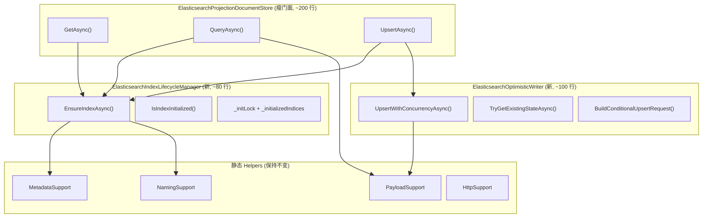

# CQRS 框架 CRITICAL 发现重构计划

**关联审计**: `docs/audit-scorecard/2026-03-18-cqrs-framework-software-engineering-audit.md`
**日期**: 2026-03-18
**范围**: 审计中 3 项 CRITICAL 发现（C-1, C-2, C-3）的详细重构方案

---

## 目录

1. [重构总览与优先级](#1-重构总览与优先级)
2. [C-1: ProjectionScopeGAgentBase 职责拆分](#2-c-1-projectionscopegagentbase-职责拆分)
3. [C-2: ElasticsearchProjectionDocumentStore 职责分解](#3-c-2-elasticsearchprojectiondocumentstore-职责分解)
4. [C-3: Provider 查询行为一致性修复](#4-c-3-provider-查询行为一致性修复)
5. [实施顺序与依赖关系](#5-实施顺序与依赖关系)
6. [验证清单](#6-验证清单)

---

## 1. 重构总览与优先级

| ID | 发现 | 影响 | 建议实施顺序 | 预估改动量 |
|----|------|------|-------------|-----------|
| **C-3** | InMemory vs ES 查询行为不一致 (LSP) | 开发环境通过/生产静默失败 | **第一优先** | 小（~20 行删除 + 测试补充） |
| **C-1** | `ProjectionScopeGAgentBase` 7 职责 God Class | 维护困难、测试复杂、变更风险高 | **第二优先** | 大（拆分 5 个组件，~400 行重组） |
| **C-2** | ES Document Store 6+ 职责混合 | 类过大、职责耦合 | **第三优先** | 中（提取 2-3 个协作者） |

**理由**: C-3 改动量最小但风险最高（生产静默错误），应最先修复。C-1 是最大的结构性问题但需要仔细设计。C-2 已有 partial class 缓解，紧迫性最低。

---

## 2. C-1: ProjectionScopeGAgentBase 职责拆分

### 2.1 现状分析

**文件**: `src/Aevatar.CQRS.Projection.Core/Orchestration/ProjectionScopeGAgentBase.cs` (421 行)

**当前承担的 7 项职责**:

```
ProjectionScopeGAgentBase<TContext> (421 行)
├── 1. Actor 生命周期管理        → OnActivateAsync(), OnDeactivateAsync()              [21-35]
├── 2. Scope 命令处理           → HandleEnsureAsync(), HandleReleaseAsync()            [37-80]
├── 3. 失败重放命令处理          → HandleReplayAsync()                                 [82-123]
├── 4. 观察信号处理 + 分发编排    → HandleObservationAsync(), DispatchObservationAsync()  [125-193]
├── 5. Stream 订阅管理          → EnsureObservationAttachedAsync(),
│                                DetachObservationAsync(), ForwardObservationAsync()   [195-260]
├── 6. 状态迁移 (6 种事件)       → ApplyStarted/Attachment/Released/Watermark/
│                                DispatchFailed/FailureReplayed                       [262-348]
└── 7. 失败记录 + 告警          → RecordDispatchFailureAsync()                         [350-421]
```

**关键字段**:
```csharp
private IAsyncDisposable? _observationSubscription;        // 订阅句柄
private readonly SemaphoreSlim _subscriptionGate = new(1, 1); // 订阅锁
private ILogger _logger = NullLogger.Instance;
```

**子类** (仅差异化 ~18 行逻辑):
- `ProjectionMaterializationScopeGAgentBase.cs` (67 行) → `ExecuteMaterializersAsync()`
- `ProjectionSessionScopeGAgentBase.cs` (56 行) → `ExecuteProjectorsAsync()`

**Proto 状态**: `ProjectionScopeState` (11 字段，含 `repeated ProjectionScopeFailure failures` 最多 64 条，每条含完整 `EventEnvelope`)

**测试状态**: 无专门的 `ProjectionScopeGAgentBase` 单元测试。仅通过集成测试间接覆盖。

### 2.2 约束条件

1. **Actor 模型约束**: Actor 是唯一的消息入口和状态拥有者，不能将状态分散到外部服务
2. **事件溯源约束**: 所有状态变更必须通过 `PersistDomainEventAsync()` → `TransitionState()` 链路
3. **GAgentBase 约束**: 事件处理器通过 `[EventHandler]` 注解绑定，必须是实例方法
4. **向后兼容**: 已持久化的 `ProjectionScopeState` proto 必须保持 wire 兼容

### 2.3 重构方案：Actor 内组合模式

**核心思路**: Actor 仍是唯一消息入口和状态拥有者，但将内部逻辑委托给**无状态**的职责组件。组件不持有状态，只接收当前状态并返回事件或结果。

#### 目标架构



```mermaid
%%{init: {"maxTextSize": 100000, "flowchart": {"useMaxWidth": false, "nodeSpacing": 10, "rankSpacing": 50}, "themeVariables": {"fontSize": "10px"}}}%%
flowchart TB
    subgraph "ProjectionScopeGAgentBase (瘦协调器, ~150 行)"
        A1["[EventHandler] HandleEnsureAsync()"]
        A2["[EventHandler] HandleReleaseAsync()"]
        A3["[EventHandler] HandleReplayAsync()"]
        A4["[EventHandler] HandleObservationAsync()"]
        A5["OnActivateAsync() / OnDeactivateAsync()"]
        A6["TransitionState()"]
    end

    subgraph "ProjectionObservationSubscriber (新, ~80 行)"
        B1["EnsureAttachedAsync()"]
        B2["DetachAsync()"]
        B3["ForwardToSelf callback"]
    end

    subgraph "ProjectionScopeFailureLog (新, ~60 行)"
        C1["RecordFailure() → event"]
        C2["GetPendingFailures()"]
        C3["MarkReplayed() → event"]
    end

    subgraph "ProjectionScopeStateApplier (新, ~70 行)"
        D1["ApplyStarted()"]
        D2["ApplyAttachmentUpdated()"]
        D3["ApplyReleased()"]
        D4["ApplyWatermarkAdvanced()"]
        D5["ApplyDispatchFailed()"]
        D6["ApplyFailureReplayed()"]
    end

    subgraph "IProjectionObservationProcessor (已有模式)"
        E1["DurableMaterializationProcessor"]
        E2["SessionObservationProcessor"]
    end

    A1 --> B1
    A2 --> B2
    A3 --> C2
    A3 --> E1
    A4 --> E1
    A5 --> B1
    A5 --> B2
    A6 --> D1
    A6 --> D2
    A6 --> D3
    A6 --> D4
    A6 --> D5
    A6 --> D6
    A4 --> C1
```

### 2.4 分步实施计划

#### Phase 1: 提取 `ProjectionScopeStateApplier` (纯函数，零风险)

**目标**: 将 6 个 `Apply*` 静态方法提取为独立的 static class。

**新文件**: `src/Aevatar.CQRS.Projection.Core/Orchestration/ProjectionScopeStateApplier.cs`

```csharp
internal static class ProjectionScopeStateApplier
{
    public static ProjectionScopeState ApplyStarted(
        ProjectionScopeState state,
        ProjectionScopeStartedEvent evt) { ... }

    public static ProjectionScopeState ApplyAttachmentUpdated(
        ProjectionScopeState state,
        ProjectionObservationAttachmentUpdatedEvent evt) { ... }

    public static ProjectionScopeState ApplyReleased(
        ProjectionScopeState state,
        ProjectionScopeReleasedEvent evt) { ... }

    public static ProjectionScopeState ApplyWatermarkAdvanced(
        ProjectionScopeState state,
        ProjectionScopeWatermarkAdvancedEvent evt) { ... }

    public static ProjectionScopeState ApplyDispatchFailed(
        ProjectionScopeState state,
        ProjectionScopeDispatchFailedEvent evt) { ... }

    public static ProjectionScopeState ApplyFailureReplayed(
        ProjectionScopeState state,
        ProjectionScopeFailureReplayedEvent evt) { ... }
}
```

**基类变更**: `TransitionState()` 委托到 `ProjectionScopeStateApplier`：

```csharp
protected override ProjectionScopeState TransitionState(ProjectionScopeState state, object evt)
{
    return evt switch
    {
        ProjectionScopeStartedEvent e => ProjectionScopeStateApplier.ApplyStarted(state, e),
        ProjectionObservationAttachmentUpdatedEvent e => ProjectionScopeStateApplier.ApplyAttachmentUpdated(state, e),
        ProjectionScopeReleasedEvent e => ProjectionScopeStateApplier.ApplyReleased(state, e),
        ProjectionScopeWatermarkAdvancedEvent e => ProjectionScopeStateApplier.ApplyWatermarkAdvanced(state, e),
        ProjectionScopeDispatchFailedEvent e => ProjectionScopeStateApplier.ApplyDispatchFailed(state, e),
        ProjectionScopeFailureReplayedEvent e => ProjectionScopeStateApplier.ApplyFailureReplayed(state, e),
        _ => state,
    };
}
```

**改动量**: ~90 行移出，基类减少 ~80 行。
**风险**: 极低 — 纯机械提取，方法签名不变。
**测试**: 可以为 `ProjectionScopeStateApplier` 编写纯函数单元测试，每个 Apply 方法独立验证。

---

#### Phase 2: 提取 `ProjectionObservationSubscriber` (隔离订阅管理)

**目标**: 将 Stream 订阅的 attach/detach/forward 逻辑提取为独立组件，消除基类中的 `SemaphoreSlim`。

**新文件**: `src/Aevatar.CQRS.Projection.Core/Orchestration/ProjectionObservationSubscriber.cs`

```csharp
internal sealed class ProjectionObservationSubscriber : IAsyncDisposable
{
    private IAsyncDisposable? _subscription;
    private readonly SemaphoreSlim _gate = new(1, 1);

    /// <summary>
    /// 确保订阅已附着。若已附着则幂等返回。
    /// </summary>
    public async Task<bool> EnsureAttachedAsync(
        IStreamProvider streamProvider,
        string rootActorId,
        Func<EventEnvelope, Task> onObservation,
        CancellationToken ct)
    {
        await _gate.WaitAsync(ct);
        try
        {
            if (_subscription != null)
                return false; // 已附着，无变更

            var stream = streamProvider.GetStream(rootActorId);
            _subscription = await stream.SubscribeAsync<EventEnvelope>(
                async (envelope, _) => await onObservation(envelope));
            return true; // 新附着
        }
        finally
        {
            _gate.Release();
        }
    }

    /// <summary>
    /// 分离订阅。若未附着则幂等返回。
    /// </summary>
    public async Task<bool> DetachAsync(CancellationToken ct)
    {
        await _gate.WaitAsync(ct);
        try
        {
            if (_subscription == null)
                return false;

            await _subscription.DisposeAsync();
            _subscription = null;
            return true;
        }
        finally
        {
            _gate.Release();
        }
    }

    public bool IsAttached => _subscription != null;

    public async ValueTask DisposeAsync()
    {
        await DetachAsync(CancellationToken.None);
        _gate.Dispose();
    }
}
```

**基类变更**:

```csharp
// 字段替换
- private IAsyncDisposable? _observationSubscription;
- private readonly SemaphoreSlim _subscriptionGate = new(1, 1);
+ private readonly ProjectionObservationSubscriber _subscriber = new();

// OnActivateAsync
- return EnsureObservationAttachedAsync(persistState: false, ct);
+ var streamProvider = Services.GetRequiredService<IStreamProvider>();
+ await _subscriber.EnsureAttachedAsync(streamProvider, State.RootActorId, ForwardObservationAsync, ct);

// OnDeactivateAsync
- await DetachObservationAsync(CancellationToken.None);
+ await _subscriber.DetachAsync(CancellationToken.None);

// HandleEnsureAsync 内
- await EnsureObservationAttachedAsync(persistState: !State.ObservationAttached, ct);
+ var attached = await _subscriber.EnsureAttachedAsync(streamProvider, State.RootActorId, ForwardObservationAsync, ct);
+ if (attached && !State.ObservationAttached)
+     await PersistDomainEventAsync(new ProjectionObservationAttachmentUpdatedEvent { Attached = true, ... });

// 删除方法: EnsureObservationAttachedAsync(), DetachObservationAsync()
```

**改动量**: ~70 行移出，基类减少 ~60 行。
**风险**: 中 — 需要验证 semaphore 语义不变、OnActivate 时序正确。
**测试**: 可以为 `ProjectionObservationSubscriber` 编写独立单元测试，mock `IStreamProvider`。

---

#### Phase 3: 提取 `ProjectionScopeFailureLog` (隔离失败跟踪)

**目标**: 将失败记录、重放判定、告警发布逻辑提取为独立组件。

**新文件**: `src/Aevatar.CQRS.Projection.Core/Orchestration/ProjectionScopeFailureLog.cs`

```csharp
internal sealed class ProjectionScopeFailureLog
{
    /// <summary>
    /// 构建失败记录事件。不直接修改状态。
    /// </summary>
    public ProjectionScopeDispatchFailedEvent BuildFailureEvent(
        string stage,
        string eventId,
        string eventType,
        long sourceVersion,
        string reason,
        EventEnvelope envelope)
    {
        return new ProjectionScopeDispatchFailedEvent
        {
            FailureId = $"{eventId}:{stage}:{Guid.NewGuid():N}",
            Stage = stage,
            EventId = eventId,
            EventType = eventType,
            SourceVersion = sourceVersion,
            Reason = reason.Length > 512 ? reason[..512] : reason,
            Envelope = envelope.Clone(),
            OccurredAtUtc = Timestamp.FromDateTimeOffset(DateTimeOffset.UtcNow),
        };
    }

    /// <summary>
    /// 获取待重放的失败记录（FIFO 顺序）。
    /// </summary>
    public IReadOnlyList<ProjectionScopeFailure> GetPendingFailures(
        ProjectionScopeState state,
        int maxItems)
    {
        return state.Failures
            .OrderBy(f => f.OccurredAtUtc)
            .Take(Math.Min(maxItems, ProjectionFailureRetentionPolicy.DefaultMaxRetainedFailures))
            .ToList();
    }

    /// <summary>
    /// 构建重放结果事件。
    /// </summary>
    public ProjectionScopeFailureReplayedEvent BuildReplayResultEvent(
        string failureId,
        bool succeeded,
        string? reason = null)
    {
        return new ProjectionScopeFailureReplayedEvent
        {
            FailureId = failureId,
            Succeeded = succeeded,
            Reason = reason ?? string.Empty,
            ReplayedAtUtc = Timestamp.FromDateTimeOffset(DateTimeOffset.UtcNow),
        };
    }
}
```

**基类变更**:

```csharp
+ private readonly ProjectionScopeFailureLog _failureLog = new();

// RecordDispatchFailureAsync 简化:
protected async ValueTask RecordDispatchFailureAsync(...)
{
    var evt = _failureLog.BuildFailureEvent(stage, eventId, eventType, sourceVersion, reason, envelope);
    await PersistDomainEventAsync(evt);

    // 告警保持在基类（属于 Actor 对外通信）
    var alertSink = Services.GetService<IProjectionFailureAlertSink>();
    if (alertSink != null)
    {
        try { await alertSink.PublishAsync(...); }
        catch (Exception ex) { _logger.LogWarning(ex, "..."); }
    }
}

// HandleReplayAsync 简化:
public async Task HandleReplayAsync(ReplayProjectionFailuresCommand command)
{
    var failures = _failureLog.GetPendingFailures(State, command.MaxItems);
    foreach (var failure in failures)
    {
        try
        {
            var result = await DispatchObservationAsync(failure.Envelope, CancellationToken.None);
            var evt = _failureLog.BuildReplayResultEvent(failure.FailureId, result.Handled);
            await PersistDomainEventAsync(evt);
        }
        catch (Exception ex)
        {
            var evt = _failureLog.BuildReplayResultEvent(failure.FailureId, false, ex.Message);
            await PersistDomainEventAsync(evt);
        }
    }
}
```

**改动量**: ~60 行移出，基类减少 ~50 行。
**风险**: 低 — 纯事件构建逻辑，不涉及状态修改。
**测试**: 可以为 `ProjectionScopeFailureLog` 编写纯函数单元测试。

---

#### Phase 4: 统一子类分发逻辑 (消除子类重复)

**目标**: `ProjectionMaterializationScopeGAgentBase` 和 `ProjectionSessionScopeGAgentBase` 仅差异 ~18 行，提取为策略接口。

**新接口**: `src/Aevatar.CQRS.Projection.Core.Abstractions/Abstractions/Pipeline/IProjectionObservationProcessor.cs`

```csharp
/// <summary>
/// 处理单个观察事件的策略接口。
/// DurableMaterialization 和 SessionObservation 各有一个实现。
/// </summary>
public interface IProjectionObservationProcessor<in TContext>
    where TContext : class, IProjectionMaterializationContext
{
    ProjectionRuntimeMode Mode { get; }

    ValueTask<ProjectionScopeDispatchResult> ProcessAsync(
        TContext context,
        EventEnvelope envelope,
        IServiceProvider services,
        CancellationToken ct);
}
```

**两个实现**:

`src/Aevatar.CQRS.Projection.Core/Orchestration/DurableMaterializationProcessor.cs`:
```csharp
internal sealed class DurableMaterializationProcessor<TContext>
    : IProjectionObservationProcessor<TContext>
    where TContext : class, IProjectionMaterializationContext
{
    public ProjectionRuntimeMode Mode => ProjectionRuntimeMode.DurableMaterialization;

    public async ValueTask<ProjectionScopeDispatchResult> ProcessAsync(
        TContext context,
        EventEnvelope envelope,
        IServiceProvider services,
        CancellationToken ct)
    {
        if (!ProjectionDispatchRouteFilter.ShouldDispatch(envelope))
            return ProjectionScopeDispatchResult.Skip("route-filtered", 0, "");

        if (!CommittedStateEventEnvelope.TryUnpack(envelope, out var published) ||
            published?.StateEvent == null)
            return ProjectionScopeDispatchResult.Skip("no-state-event", 0, "");

        var materializers = services.GetServices<IProjectionMaterializer<TContext>>();
        await ProjectionScopeDispatchExecutor.ExecuteMaterializersAsync(
            materializers, context, envelope, ct);

        return ProjectionScopeDispatchResult.Success(
            published.StateEvent.Version,
            published.StateEvent.Version,
            published.StateEvent.EventData?.TypeUrl ?? "");
    }
}
```

`src/Aevatar.CQRS.Projection.Core/Orchestration/SessionObservationProcessor.cs`:
```csharp
internal sealed class SessionObservationProcessor<TContext>
    : IProjectionObservationProcessor<TContext>
    where TContext : class, IProjectionSessionContext
{
    public ProjectionRuntimeMode Mode => ProjectionRuntimeMode.SessionObservation;

    public async ValueTask<ProjectionScopeDispatchResult> ProcessAsync(
        TContext context,
        EventEnvelope envelope,
        IServiceProvider services,
        CancellationToken ct)
    {
        if (!ProjectionDispatchRouteFilter.ShouldDispatch(envelope))
            return ProjectionScopeDispatchResult.Skip("route-filtered", 0, "");

        if (!CommittedStateEventEnvelope.TryGetObservedPayload(
                envelope, out _, out var eventId, out var stateVersion))
            return ProjectionScopeDispatchResult.Skip("no-payload", 0, "");

        var projectors = services.GetServices<IProjectionProjector<TContext>>();
        await ProjectionScopeDispatchExecutor.ExecuteProjectorsAsync(
            projectors, context, envelope, ct);

        return ProjectionScopeDispatchResult.Success(
            stateVersion, stateVersion, eventId);
    }
}
```

**基类变更**:

```csharp
// 删除 abstract 方法
- protected abstract ProjectionRuntimeMode RuntimeMode { get; }
- protected abstract ValueTask<ProjectionScopeDispatchResult> ProcessObservationCoreAsync(...);

// 改为注入 processor
+ private IProjectionObservationProcessor<TContext>? _processor;
+
+ private IProjectionObservationProcessor<TContext> ResolveProcessor()
+     => _processor ??= Services.GetRequiredService<IProjectionObservationProcessor<TContext>>();
+
+ protected ProjectionRuntimeMode RuntimeMode => ResolveProcessor().Mode;
```

**子类可删除**: `ProjectionMaterializationScopeGAgentBase.cs` 和 `ProjectionSessionScopeGAgentBase.cs` 可以简化为仅设置泛型约束的空壳，或直接删除改为通过 DI 注册 processor 实现切换。

**改动量**: 删除 ~120 行子类代码，新增 2 个 ~40 行的 processor 实现。
**风险**: 中 — 需要验证 DI 注册链路正确、子类删除不影响 Actor identity。
**测试**: 可以为每个 Processor 编写独立单元测试。

---

### 2.5 重构后预期结果

| 指标 | 重构前 | 重构后 |
|------|--------|--------|
| 基类行数 | 421 | ~150-180 |
| 基类职责数 | 7 | 3（生命周期 + 命令路由 + 状态持久化） |
| 子类行数 | 67 + 56 = 123 | 0-20（或删除） |
| SemaphoreSlim 位置 | 基类 | `ProjectionObservationSubscriber` |
| 可独立测试的组件 | 0 | 4 |
| Apply 方法可测试性 | 需要 Actor 运行时 | 纯函数测试 |

### 2.6 不变量

- `ProjectionScopeState` proto 不修改（wire 兼容）
- `[EventHandler]` 注解的方法签名不变
- `PersistDomainEventAsync()` → `TransitionState()` 链路不变
- 命令/事件 proto 定义不变
- 外部 API（`EnsureProjectionScopeCommand` 等）不变

---

## 3. C-2: ElasticsearchProjectionDocumentStore 职责分解

### 3.1 现状分析

**主文件**: `src/Aevatar.CQRS.Projection.Providers.Elasticsearch/Stores/ElasticsearchProjectionDocumentStore.cs` (494 行)
**Partial 文件**: 5 个，共 573 行
**总计**: 1067 行

**当前职责分布**:

| 职责 | 位置 | 行数 |
|------|------|------|
| HTTP 传输 | `HttpSupport.cs` + 主文件内 HttpClient 管理 | ~50 |
| ES 查询 DSL 构建 | `PayloadSupport.cs` | 305 |
| 乐观并发 (seq_no/primary_term) | 主文件 `UpsertCoreAsync()` | ~80 |
| 索引生命周期 | `Indexing.cs` + 主文件内 `_initializedIndices` | ~80 |
| Protobuf JSON 序列化 | 主文件内 `_formatter`/`_parser` | ~30 |
| 元数据规范化 | `MetadataSupport.cs` | 138 |
| 索引命名 | `NamingSupport.cs` | 52 |
| 配置 + 构造 | 主文件构造函数 | ~60 |
| Key 解析 + 格式化 | 主文件 `ResolveReadModelKey()` 等 | ~20 |
| 动态索引路由 | 主文件 `ResolveIndexTarget()` | ~30 |
| 类型注册表构建 | 主文件 `BuildDefaultTypeRegistry()` | ~40 |

**已有的正面拆分**: PayloadSupport / MetadataSupport / NamingSupport / HttpSupport 已是独立 static class。这些不需要进一步拆分。

**测试状态**: `ElasticsearchProjectionDocumentStoreBehaviorTests.cs` (328 行) 通过 `ScriptedHttpMessageHandler` 模拟 HTTP 响应，覆盖了核心读写和索引初始化。

### 3.2 约束条件

1. **DI 注册**: 当前通过 `AddElasticsearchDocumentProjectionStore<TReadModel, TKey>()` 注册为单例
2. **HttpClient 生命周期**: 当前由 Store 自身创建和管理
3. **测试模式**: 通过构造函数注入 `HttpMessageHandler` 实现 HTTP 模拟
4. **泛型约束**: `<TReadModel, TKey>` 贯穿整个类

### 3.3 重构方案：提取协作者

#### 目标架构



### 3.4 分步实施计划

#### Phase 1: 提取 `ElasticsearchIndexLifecycleManager`

**目标**: 将索引初始化的 SemaphoreSlim + HashSet + 创建逻辑提取为独立组件。

**新文件**: `src/Aevatar.CQRS.Projection.Providers.Elasticsearch/Stores/ElasticsearchIndexLifecycleManager.cs`

```csharp
internal sealed class ElasticsearchIndexLifecycleManager : IDisposable
{
    private readonly SemaphoreSlim _initLock = new(1, 1);
    private readonly Lock _stateGate = new();
    private readonly HashSet<string> _initializedIndices = new(StringComparer.Ordinal);
    private readonly HttpClient _httpClient;
    private readonly bool _autoCreate;
    private readonly ILogger _logger;

    public ElasticsearchIndexLifecycleManager(
        HttpClient httpClient,
        bool autoCreate,
        ILogger logger) { ... }

    /// <summary>
    /// 确保索引存在。幂等操作。
    /// </summary>
    public async Task EnsureIndexAsync(
        string indexName,
        DocumentIndexMetadata metadata,
        CancellationToken ct)
    {
        if (!_autoCreate) return;

        lock (_stateGate)
        {
            if (_initializedIndices.Contains(indexName))
                return;
        }

        await _initLock.WaitAsync(ct);
        try
        {
            lock (_stateGate)
            {
                if (_initializedIndices.Contains(indexName))
                    return;
            }

            // HTTP PUT /{indexName} with metadata payload
            var payload = ElasticsearchProjectionDocumentStorePayloadSupport
                .BuildIndexInitializationPayload(metadata);
            // ... HTTP logic ...

            lock (_stateGate)
            {
                _initializedIndices.Add(indexName);
            }
        }
        finally
        {
            _initLock.Release();
        }
    }

    public void Dispose()
    {
        _initLock.Dispose();
    }
}
```

**Store 变更**:

```csharp
// 删除
- private readonly SemaphoreSlim _indexInitializationLock = new(1, 1);
- private readonly Lock _dynamicIndexStateGate = new();
- private readonly HashSet<string> _initializedIndices = new(StringComparer.Ordinal);

// 新增
+ private readonly ElasticsearchIndexLifecycleManager _indexManager;

// 构造函数中
+ _indexManager = new ElasticsearchIndexLifecycleManager(_httpClient, _autoCreateIndex, logger);

// 使用处
- await EnsureIndexExistsAsync(indexName, metadata, ct);
+ await _indexManager.EnsureIndexAsync(indexName, metadata, ct);
```

**改动量**: ~60 行移出（`Indexing.cs` 整个文件可删除）。
**风险**: 低 — 逻辑等价提取，HTTP 行为不变。

---

#### Phase 2: 提取 `ElasticsearchOptimisticWriter`

**目标**: 将乐观并发写入循环提取为独立组件。

**新文件**: `src/Aevatar.CQRS.Projection.Providers.Elasticsearch/Stores/ElasticsearchOptimisticWriter.cs`

```csharp
internal sealed class ElasticsearchOptimisticWriter<TReadModel>
    where TReadModel : class, IProjectionReadModel<TReadModel>, new()
{
    private readonly HttpClient _httpClient;
    private readonly JsonFormatter _formatter;
    private readonly JsonParser _parser;
    private readonly ILogger _logger;

    private const int MaxRetryAttempts = 3;

    public ElasticsearchOptimisticWriter(
        HttpClient httpClient,
        JsonFormatter formatter,
        JsonParser parser,
        ILogger logger) { ... }

    /// <summary>
    /// 使用乐观并发执行 upsert。最多重试 MaxRetryAttempts 次。
    /// </summary>
    public async Task<ProjectionWriteResult> UpsertAsync(
        string indexName,
        string key,
        TReadModel readModel,
        CancellationToken ct)
    {
        var json = _formatter.Format(readModel);

        for (var attempt = 0; attempt < MaxRetryAttempts; attempt++)
        {
            var existing = await TryGetExistingStateAsync(indexName, key, ct);

            var writeResult = ProjectionWriteResultEvaluator.Evaluate(
                existing?.ReadModel, readModel);
            if (!writeResult.IsApplied)
                return writeResult;

            var request = BuildConditionalUpsertRequest(
                indexName, key, json, existing?.SeqNo, existing?.PrimaryTerm);

            var response = await _httpClient.SendAsync(request, ct);

            if (response.IsSuccessStatusCode)
                return ProjectionWriteResult.Applied();

            if (response.StatusCode == System.Net.HttpStatusCode.Conflict)
                continue; // 重试

            await ElasticsearchProjectionDocumentStoreHttpSupport
                .EnsureSuccessAsync(response, "upsert", ct);
        }

        // 最后一次检查
        var finalExisting = await TryGetExistingStateAsync(indexName, key, ct);
        var finalResult = ProjectionWriteResultEvaluator.Evaluate(
            finalExisting?.ReadModel, readModel);
        if (!finalResult.IsApplied)
            return finalResult;

        throw new InvalidOperationException(
            $"Failed to upsert document after {MaxRetryAttempts} attempts");
    }

    private async Task<ExistingReadModelState?> TryGetExistingStateAsync(...) { ... }

    private static HttpRequestMessage BuildConditionalUpsertRequest(...) { ... }

    internal sealed record ExistingReadModelState(
        TReadModel? ReadModel,
        long? SeqNo,
        long? PrimaryTerm);
}
```

**Store 变更**:

```csharp
+ private readonly ElasticsearchOptimisticWriter<TReadModel> _writer;

// 构造函数中
+ _writer = new ElasticsearchOptimisticWriter<TReadModel>(_httpClient, _formatter, _parser, logger);

// UpsertAsync 简化为:
public async Task<ProjectionWriteResult> UpsertAsync(TReadModel readModel, CancellationToken ct)
{
    var target = ResolveIndexTarget(readModel);
    await _indexManager.EnsureIndexAsync(target.IndexName, target.Metadata, ct);
    var key = FormatKey(ResolveReadModelKey(readModel));
    return await _writer.UpsertAsync(target.IndexName, key, readModel, ct);
}
```

**改动量**: ~100 行移出，Store 的 `UpsertAsync` 缩减为 ~5 行路由。
**风险**: 中 — 乐观并发逻辑复杂，需要现有测试覆盖（已有 `UpsertAsync_WhenExistingDocumentPresent_ShouldUseOptimisticConcurrencyTokens` 测试）。

---

### 3.5 不实施的拆分（过度工程）

以下拆分**不建议**实施：

| 候选拆分 | 不实施理由 |
|----------|-----------|
| 提取 HttpClient 为接口 | HttpClient 本身已是可测试的（通过 HttpMessageHandler 注入），包装接口增加无价值间接层 |
| 提取序列化为接口 | Protobuf JsonFormatter/Parser 是单例安全的，无需额外抽象 |
| 提取 Key 解析为接口 | ~20 行代码，提取后反而增加间接调用开销 |
| 将 PayloadSupport 改为实例类 | 已是无状态 static class，无需实例化 |

### 3.6 重构后预期结果

| 指标 | 重构前 | 重构后 |
|------|--------|--------|
| 主类行数 | 494 | ~250-280 |
| Partial 文件数 | 5 | 3 (删除 Indexing.cs, 可选合并 HttpSupport) |
| 总项目行数 | 1067 | ~1067 (重组，不减少总量) |
| 主类职责 | 6+ | 3 (读/查询路由 + key 解析 + 动态索引路由) |
| 可独立测试组件 | 0 | 2 (IndexManager, OptimisticWriter) |

---

## 4. C-3: Provider 查询行为一致性修复

### 4.1 现状分析

**违反**: `InMemoryProjectionDocumentStore` 的字段路径解析使用 `OrdinalIgnoreCase` 回退，而 `ElasticsearchProjectionDocumentStore` 严格 case-sensitive。同一 `ProjectionDocumentQuery` 在不同 Provider 可能返回不同结果。

**受影响代码位置**:

`src/Aevatar.CQRS.Projection.Providers.InMemory/Stores/InMemoryProjectionDocumentStore.cs`:

| 行号 | 代码 | 问题 |
|------|------|------|
| 318 | `BindingFlags.Instance \| BindingFlags.Public \| BindingFlags.IgnoreCase` | 属性反射忽略大小写 |
| 338 | `string.Equals(pair.Key, key, StringComparison.OrdinalIgnoreCase)` | 泛型 Dictionary 回退 |
| 357 | `string.Equals(stringKey, key, StringComparison.OrdinalIgnoreCase)` | 非泛型 IDictionary 回退 |

### 4.2 修复方案

#### 4.2.1 移除 InMemory 的 case-insensitive 回退

**文件**: `src/Aevatar.CQRS.Projection.Providers.InMemory/Stores/InMemoryProjectionDocumentStore.cs`

**变更 1 — 行 318**: 移除 `BindingFlags.IgnoreCase`

```csharp
// 变更前:
var property = current.GetType().GetProperty(
    segment,
    BindingFlags.Instance | BindingFlags.Public | BindingFlags.IgnoreCase);

// 变更后:
var property = current.GetType().GetProperty(
    segment,
    BindingFlags.Instance | BindingFlags.Public);
```

**变更 2 — 行 328-347**: 移除 `TryGetDictionaryValue` 泛型重载的 fallback

```csharp
// 变更前:
private static bool TryGetDictionaryValue(
    IDictionary<string, object?> dictionary,
    string key,
    out object? value)
{
    if (dictionary.TryGetValue(key, out value))
        return true;

    foreach (var pair in dictionary)
    {
        if (string.Equals(pair.Key, key, StringComparison.OrdinalIgnoreCase))
        {
            value = pair.Value;
            return true;
        }
    }

    value = null;
    return false;
}

// 变更后:
private static bool TryGetDictionaryValue(
    IDictionary<string, object?> dictionary,
    string key,
    out object? value)
{
    return dictionary.TryGetValue(key, out value);
}
```

**变更 3 — 行 349-366**: 移除 `TryGetDictionaryValue` 非泛型重载的 IgnoreCase

```csharp
// 变更前:
private static bool TryGetDictionaryValue(
    IDictionary dictionary,
    string key,
    out object? value)
{
    foreach (DictionaryEntry entry in dictionary)
    {
        if (entry.Key is string stringKey &&
            string.Equals(stringKey, key, StringComparison.OrdinalIgnoreCase))
        {
            value = entry.Value;
            return true;
        }
    }

    value = null;
    return false;
}

// 变更后:
private static bool TryGetDictionaryValue(
    IDictionary dictionary,
    string key,
    out object? value)
{
    if (dictionary.Contains(key))
    {
        value = dictionary[key];
        return true;
    }

    value = null;
    return false;
}
```

#### 4.2.2 添加契约文档

**文件**: `src/Aevatar.CQRS.Projection.Stores.Abstractions/Abstractions/ReadModels/ProjectionDocumentFilter.cs`

```csharp
public sealed class ProjectionDocumentFilter
{
    /// <summary>
    /// Dot-separated property path for nested field access.
    /// Field names are CASE-SENSITIVE and must exactly match the ReadModel
    /// property names or Elasticsearch mapping field names.
    /// Example: "actorId", "state.name", "metadata.createdBy"
    /// </summary>
    public string FieldPath { get; init; } = "";

    public ProjectionDocumentFilterOperator Operator { get; init; }

    public ProjectionDocumentValue Value { get; init; } = ProjectionDocumentValue.Empty;
}
```

同样为 `ProjectionDocumentSort.FieldPath` 添加相同文档。

#### 4.2.3 添加跨 Provider 行为一致性测试

**新文件**: `test/Aevatar.CQRS.Projection.Core.Tests/ProjectionDocumentStoreFieldPathConsistencyTests.cs`

```csharp
public sealed class ProjectionDocumentStoreFieldPathConsistencyTests
{
    [Fact]
    public async Task QueryAsync_ExactCaseFieldPath_ShouldMatch()
    {
        // 使用正确大小写的 FieldPath，InMemory 应匹配
        var store = CreateInMemoryStore();
        await store.UpsertAsync(new TestReadModel { Id = "1", ActorId = "a1", StateVersion = 1, ... });

        var query = new ProjectionDocumentQuery
        {
            Filters = [new ProjectionDocumentFilter
            {
                FieldPath = "ActorId",  // PascalCase — 与属性名一致
                Operator = ProjectionDocumentFilterOperator.Eq,
                Value = ProjectionDocumentValue.FromString("a1")
            }]
        };

        var result = await store.QueryAsync(query);
        result.Items.Should().HaveCount(1);
    }

    [Fact]
    public async Task QueryAsync_WrongCaseFieldPath_ShouldNotMatch()
    {
        // 使用错误大小写的 FieldPath，InMemory 应不匹配（与 ES 行为一致）
        var store = CreateInMemoryStore();
        await store.UpsertAsync(new TestReadModel { Id = "1", ActorId = "a1", StateVersion = 1, ... });

        var query = new ProjectionDocumentQuery
        {
            Filters = [new ProjectionDocumentFilter
            {
                FieldPath = "actorid",  // 全小写 — 与属性名不匹配
                Operator = ProjectionDocumentFilterOperator.Eq,
                Value = ProjectionDocumentValue.FromString("a1")
            }]
        };

        var result = await store.QueryAsync(query);
        result.Items.Should().BeEmpty();
    }

    [Fact]
    public async Task QueryAsync_SortWithWrongCaseFieldPath_ShouldIgnoreSort()
    {
        // 排序字段大小写错误时，不应崩溃
        // ...
    }
}
```

### 4.3 风险评估

| 风险 | 严重度 | 缓解措施 |
|------|--------|---------|
| 现有测试因 FieldPath 大小写错误而失败 | 中 | 这正是期望效果 — 修正测试中的 FieldPath 拼写 |
| 现有消费者代码使用错误大小写 | 低 | 已确认领域消费者（如 `ServiceCatalogQueryReader`）使用 `nameof()` 获取属性名 |
| InMemory Protobuf ReadModel 属性名与 ES 不同 | 低 | Protobuf 生成的 C# 属性名是 PascalCase，ES JSON 字段名通过 `preserve_proto_field_names` 控制 |

### 4.4 Protobuf 字段名映射验证

需要确认 InMemory 的属性反射路径和 ES 的 JSON 字段路径是否对齐：

- Protobuf C# 属性: `ActorId` (PascalCase)
- Protobuf JSON (默认): `actorId` (camelCase)
- Protobuf JSON (`preserve_proto_field_names`): `actor_id` (snake_case)
- ES 映射: 取决于序列化配置

**关键检查**: 确认 ES Store 的 `_formatter` 配置了什么 naming policy，确保 InMemory 的属性名与 ES 的字段名一致。

如果 ES 使用 `camelCase` 但 InMemory 属性名是 `PascalCase`，则在移除 IgnoreCase 后，**所有** FieldPath 都需要使用 ES 的 `camelCase` 命名。这时需要在 InMemory 的反射路径上做一次规范化转换（而不是忽略大小写的回退）。

**建议**: 在实施 C-3 之前，先运行全量测试确认当前 FieldPath 使用情况：

```bash
dotnet test aevatar.slnx --nologo
```

---

## 5. 实施顺序与依赖关系

```mermaid
%%{init: {"maxTextSize": 100000, "flowchart": {"useMaxWidth": false, "nodeSpacing": 10, "rankSpacing": 50}, "themeVariables": {"fontSize": "10px"}}}%%
flowchart LR
    C3["C-3: LSP 修复<br/>(InMemory case-sensitive)"] --> T1["全量测试验证"]
    T1 --> C1P1["C-1 Phase 1:<br/>提取 StateApplier"]
    C1P1 --> C1P2["C-1 Phase 2:<br/>提取 ObservationSubscriber"]
    C1P2 --> C1P3["C-1 Phase 3:<br/>提取 FailureLog"]
    C1P3 --> C1P4["C-1 Phase 4:<br/>统一 Processor"]
    C1P4 --> T2["全量测试验证"]
    T2 --> C2P1["C-2 Phase 1:<br/>提取 IndexManager"]
    C2P1 --> C2P2["C-2 Phase 2:<br/>提取 OptimisticWriter"]
    C2P2 --> T3["全量测试验证"]
```



**每步提交规范**:
- 每个 Phase 独立提交
- 提交前执行: `dotnet build aevatar.slnx --nologo && dotnet test aevatar.slnx --nologo`
- 涉及 projection 变更额外执行: `bash tools/ci/architecture_guards.sh`

---

## 6. 验证清单

### 6.1 C-3 (LSP 修复) 验证

- [ ] 移除 `BindingFlags.IgnoreCase` (`InMemoryProjectionDocumentStore.cs:318`)
- [ ] 移除 `TryGetDictionaryValue` 的 OrdinalIgnoreCase 回退 (`:328-366`)
- [ ] 添加 `ProjectionDocumentFilter.FieldPath` XML 文档
- [ ] 添加跨 Provider 一致性测试
- [ ] `dotnet test aevatar.slnx --nologo` 全部通过
- [ ] 确认领域消费者 FieldPath 使用正确大小写

### 6.2 C-1 (God Class 拆分) 验证

**Phase 1**:
- [ ] 创建 `ProjectionScopeStateApplier.cs`
- [ ] 6 个 Apply 方法签名不变，仅移动位置
- [ ] `TransitionState()` 委托到 `ProjectionScopeStateApplier`
- [ ] 添加 `ProjectionScopeStateApplier` 纯函数单元测试
- [ ] `dotnet test aevatar.slnx --nologo` 全部通过

**Phase 2**:
- [ ] 创建 `ProjectionObservationSubscriber.cs`
- [ ] 从基类移除 `_observationSubscription` 和 `_subscriptionGate`
- [ ] `EnsureAttachedAsync()` / `DetachAsync()` 语义等价
- [ ] 添加 `ProjectionObservationSubscriber` 单元测试（mock IStreamProvider）
- [ ] `dotnet test aevatar.slnx --nologo` 全部通过

**Phase 3**:
- [ ] 创建 `ProjectionScopeFailureLog.cs`
- [ ] `RecordDispatchFailureAsync()` 委托到 FailureLog
- [ ] `HandleReplayAsync()` 使用 FailureLog 的 `GetPendingFailures()`
- [ ] 添加 `ProjectionScopeFailureLog` 单元测试
- [ ] `dotnet test aevatar.slnx --nologo` 全部通过

**Phase 4**:
- [ ] 创建 `IProjectionObservationProcessor<TContext>` 接口
- [ ] 创建 `DurableMaterializationProcessor` 和 `SessionObservationProcessor`
- [ ] 注册 processor 到 DI
- [ ] 验证子类删除或简化后 Actor identity 不受影响
- [ ] `dotnet test aevatar.slnx --nologo` 全部通过

### 6.3 C-2 (ES Store 拆分) 验证

**Phase 1**:
- [ ] 创建 `ElasticsearchIndexLifecycleManager.cs`
- [ ] 删除 `ElasticsearchProjectionDocumentStore.Indexing.cs`
- [ ] Store 构造函数创建 IndexManager
- [ ] 现有 `ElasticsearchProjectionDocumentStoreBehaviorTests` 全部通过
- [ ] `dotnet test aevatar.slnx --nologo` 全部通过

**Phase 2**:
- [ ] 创建 `ElasticsearchOptimisticWriter.cs`
- [ ] `UpsertCoreAsync()` 逻辑移入 Writer
- [ ] Store 的 `UpsertAsync()` 简化为路由
- [ ] 乐观并发测试 (`WhenExistingDocumentPresent`) 通过
- [ ] `dotnet test aevatar.slnx --nologo` 全部通过

### 6.4 整体验证

- [ ] `bash tools/ci/architecture_guards.sh` 通过
- [ ] `bash tools/ci/projection_route_mapping_guard.sh` 通过
- [ ] `bash tools/ci/projection_state_version_guard.sh` 通过
- [ ] `bash tools/ci/solution_split_guards.sh` 通过
- [ ] 无新增 `Dictionary<actorId, ...>` 中间层事实态
- [ ] 无跨层反向依赖
- [ ] 审计文档已更新

---

## 附录: 文件变更清单

### 新增文件

| 文件 | 所属 Phase |
|------|-----------|
| `src/Aevatar.CQRS.Projection.Core/Orchestration/ProjectionScopeStateApplier.cs` | C-1 P1 |
| `src/Aevatar.CQRS.Projection.Core/Orchestration/ProjectionObservationSubscriber.cs` | C-1 P2 |
| `src/Aevatar.CQRS.Projection.Core/Orchestration/ProjectionScopeFailureLog.cs` | C-1 P3 |
| `src/Aevatar.CQRS.Projection.Core.Abstractions/Abstractions/Pipeline/IProjectionObservationProcessor.cs` | C-1 P4 |
| `src/Aevatar.CQRS.Projection.Core/Orchestration/DurableMaterializationProcessor.cs` | C-1 P4 |
| `src/Aevatar.CQRS.Projection.Core/Orchestration/SessionObservationProcessor.cs` | C-1 P4 |
| `src/Aevatar.CQRS.Projection.Providers.Elasticsearch/Stores/ElasticsearchIndexLifecycleManager.cs` | C-2 P1 |
| `src/Aevatar.CQRS.Projection.Providers.Elasticsearch/Stores/ElasticsearchOptimisticWriter.cs` | C-2 P2 |
| `test/Aevatar.CQRS.Projection.Core.Tests/ProjectionDocumentStoreFieldPathConsistencyTests.cs` | C-3 |
| `test/Aevatar.CQRS.Projection.Core.Tests/ProjectionScopeStateApplierTests.cs` | C-1 P1 |
| `test/Aevatar.CQRS.Projection.Core.Tests/ProjectionObservationSubscriberTests.cs` | C-1 P2 |
| `test/Aevatar.CQRS.Projection.Core.Tests/ProjectionScopeFailureLogTests.cs` | C-1 P3 |

### 修改文件

| 文件 | 变更类型 | 所属 Phase |
|------|---------|-----------|
| `src/.../InMemoryProjectionDocumentStore.cs` | 移除 IgnoreCase 回退 | C-3 |
| `src/.../ProjectionDocumentFilter.cs` | 添加 XML 文档 | C-3 |
| `src/.../ProjectionDocumentSort.cs` | 添加 XML 文档 | C-3 |
| `src/.../ProjectionScopeGAgentBase.cs` | 职责委托到组件 | C-1 P1-P4 |
| `src/.../ProjectionMaterializationScopeGAgentBase.cs` | 简化或删除 | C-1 P4 |
| `src/.../ProjectionSessionScopeGAgentBase.cs` | 简化或删除 | C-1 P4 |
| `src/.../ElasticsearchProjectionDocumentStore.cs` | 委托到 Manager/Writer | C-2 P1-P2 |

### 删除文件

| 文件 | 所属 Phase |
|------|-----------|
| `src/.../ElasticsearchProjectionDocumentStore.Indexing.cs` | C-2 P1 |
