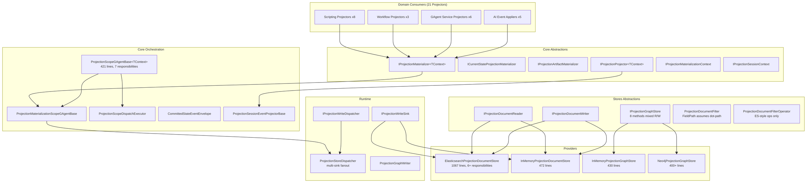
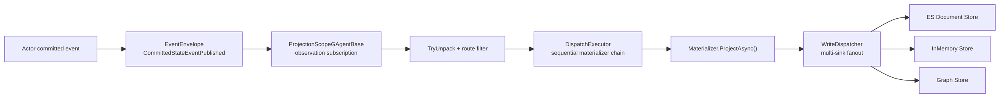

# CQRS 框架软件工程原则审计

**审计日期**: 2026-03-18
**审计范围**: CQRS Projection 框架全栈（8 个框架层 + 3 个 Provider + 6 个领域消费者域）
**审计方法**: 静态代码分析 + SOLID/DRY/抽象泄漏原则逐项对照
**审计类型**: 软件工程原则专项（非 CLAUDE.md 架构守卫审计）

---

## 1. 审计范围与方法论

### 1.1 审计对象

本审计覆盖 CQRS Projection 框架全部 15 个项目：

**框架层（8 个项目）**

| 层次 | 项目 | 职责 |
|------|------|------|
| Core Abstractions | `Aevatar.CQRS.Projection.Core.Abstractions` | Pipeline 接口、Context 契约、Materializer 分类 |
| Core | `Aevatar.CQRS.Projection.Core` | Scope Actor 编排、Dispatch Executor、Event Envelope 解包 |
| Runtime Abstractions | `Aevatar.CQRS.Projection.Runtime.Abstractions` | Write Dispatcher / Write Sink 抽象 |
| Runtime | `Aevatar.CQRS.Projection.Runtime` | Store Dispatcher 多目标分发、Graph Writer |
| Stores Abstractions | `Aevatar.CQRS.Projection.Stores.Abstractions` | Document Reader/Writer、Graph Store、Filter/Query DSL |
| Provider: Elasticsearch | `Aevatar.CQRS.Projection.Providers.Elasticsearch` | ES HTTP REST 实现（1067 行，6 个 partial 文件） |
| Provider: InMemory | `Aevatar.CQRS.Projection.Providers.InMemory` | 内存 Document + Graph Store 实现 |
| Provider: Neo4j | `Aevatar.CQRS.Projection.Providers.Neo4j` | Neo4j Cypher 图存储实现 |

**领域消费者（6 个项目）**

| 域 | 项目 | Projector 数量 |
|----|------|---------------|
| Foundation | `Aevatar.Foundation.Projection` | 基础设施投影 |
| Scripting | `Aevatar.Scripting.Projection` | 8 个 Projector |
| Workflow | `Aevatar.Workflow.Projection` | 3 个 Projector |
| Workflow AGUI | `Aevatar.Workflow.Presentation.AGUIAdapter` | 1 个 Session Projector |
| GAgent Service | `Aevatar.GAgentService.Projection` | 6 个 Projector |
| GAgent Governance | `Aevatar.GAgentService.Governance.Projection` | 1 个 Projector |
| AI | `Aevatar.AI.Projection` | 5 个 Event Applier |

### 1.2 审计原则

| 原则 | 检查重点 |
|------|---------|
| **SRP** (Single Responsibility) | 类/接口是否只有一个变化原因 |
| **OCP** (Open/Closed) | 是否对扩展开放、对修改封闭 |
| **LSP** (Liskov Substitution) | 子类型是否可安全替换基类型 |
| **ISP** (Interface Segregation) | 客户端是否被迫依赖不需要的方法 |
| **DIP** (Dependency Inversion) | 是否依赖抽象而非实现 |
| **DRY** (Don't Repeat Yourself) | 知识是否只有唯一表达 |
| **抽象泄漏** | 抽象是否暴露了底层实现细节 |

---

## 2. 架构总览

### 2.1 框架层次结构



### 2.2 投影数据流



---

## 3. 逐原则分析

### 3.1 SRP (Single Responsibility Principle)

#### CRITICAL: `ProjectionScopeGAgentBase` 承担 7 项职责

**文件**: `src/Aevatar.CQRS.Projection.Core/Orchestration/ProjectionScopeGAgentBase.cs` (421 行)

该类是整个投影编排的 Actor 基类，同时承担以下 7 项独立变化维度的职责：

| # | 职责 | 方法/区域 | 行号 |
|---|------|----------|------|
| 1 | Actor 生命周期管理 | `OnActivateAsync()`, `OnDeactivateAsync()` | 21-30 |
| 2 | Stream 订阅管理 | `EnsureObservationAttachedAsync()`, `DetachObservationAsync()`, `ForwardObservationAsync()` | 195-260 |
| 3 | 事件分发编排 | `DispatchObservationAsync()`, `ProcessObservationCoreAsync()` | 171-190 |
| 4 | 失败跟踪与记录 | `RecordDispatchFailureAsync()` | 350-400 |
| 5 | 失败重放 | `HandleReplayAsync()` | 83-125 |
| 6 | 状态迁移 (6 种事件) | `TransitionState()`, `ApplyStarted()` 等 | 148-170 |
| 7 | Scope 命令处理 | `HandleEnsureAsync()`, `HandleReleaseAsync()` | 38-82 |

**影响**: 任何一项职责的变更（如切换订阅传输、修改重放策略、调整失败记录格式）都可能影响其他职责。421 行的 God Class 增加了理解成本和测试复杂度。

**建议拆分方向**:
- 订阅管理 → `ProjectionObservationSubscriptionManager`
- 失败跟踪 + 重放 → `ProjectionFailureTracker` (已部分存在 `ProjectionFailureReplayService`)
- 状态迁移 → `ProjectionScopeStateTransition`

#### CRITICAL: `ElasticsearchProjectionDocumentStore` 混合 6+ 项职责

**文件**: `src/Aevatar.CQRS.Projection.Providers.Elasticsearch/Stores/ElasticsearchProjectionDocumentStore.cs` (主文件 493 行，含 partial 共 1067 行)

| # | 职责 | Partial 文件 |
|---|------|-------------|
| 1 | HTTP 传输 | `ElasticsearchProjectionDocumentStoreHttpSupport.cs` (22 行) |
| 2 | ES 查询 DSL 构建 | `ElasticsearchProjectionDocumentStorePayloadSupport.cs` (304 行) |
| 3 | 乐观并发 (seq_no/primary_term) | 主文件 `UpsertCoreAsync()` (197-280 行) |
| 4 | 索引生命周期管理 | `ElasticsearchProjectionDocumentStore.Indexing.cs` (60 行) |
| 5 | JSON / Protobuf 序列化 | 主文件 `DeserializeOrNull()`, `_formatter`, `_parser` |
| 6 | 元数据规范化 | `ElasticsearchProjectionDocumentStoreMetadataSupport.cs` (137 行) |
| 7 | 索引命名 | `ElasticsearchProjectionDocumentStoreNamingSupport.cs` (51 行) |

**缓解因素**: 已通过 partial class 将辅助逻辑分离到独立文件，降低了单文件认知负担。但这些 partial 仍共享同一类的所有字段和状态，本质上仍是单一类承担多职责。

#### GOOD: Materializer / Projector 类职责清晰

所有 21 个领域 Projector 均遵循单一职责：
- 每个 Projector 只处理一种 ReadModel 的物化
- 每个 Event Applier 只处理一种事件类型
- 示例: `ScriptReadModelProjector` 仅负责 `ScriptReadModelDocument` 的物化

---

### 3.2 OCP (Open/Closed Principle)

#### MEDIUM: Materializer 事件路由依赖运行时 TryUnpack

**文件**: `src/Aevatar.CQRS.Projection.Core/Orchestration/CommittedStateEventEnvelope.cs`

当前事件路由模式：

```csharp
// 每个 Materializer 内部自行判断是否处理
if (!CommittedStateEventEnvelope.TryUnpackState<ScriptCatalogState>(
        envelope, out _, out var stateEvent, out var state) ||
    stateEvent?.EventData == null || state == null ||
    !IsCatalogMutation(stateEvent.EventData))  // 运行时类型检查
{
    return;
}
```

**问题**: 每个 Materializer 都需要在 `ProjectAsync()` 入口做运行时类型过滤。框架层的 `ProjectionScopeDispatchExecutor` 将所有 envelope 广播给所有 materializer，由各自在运行时决定是否处理。

**影响**:
- 新增 Materializer 不需要修改框架代码（OCP 合规）
- 但每个 envelope 都会触发所有 materializer 的 `TryUnpack` 尝试（性能浪费）
- 无法在注册时静态声明"我只处理哪些事件类型"

**对比**: 理想模式是注册时声明 `EventTypeUrl` 过滤，由 Executor 做前置路由：

```csharp
// 理想: 静态声明式路由
[HandlesEventType("type.googleapis.com/ScriptCatalogRevisionPromotedEvent")]
public sealed class ScriptCatalogEntryProjector { ... }
```

**缓解因素**: 当前 `TryUnpack` 模式在功能上正确，且 `ProjectionDispatchRouteFilter.ShouldDispatch()` 已在 Scope 层做了第一级过滤。性能影响取决于每个 Scope 注册的 materializer 数量（通常 2-5 个），实际开销可控。

#### GOOD: Provider 扩展机制合规

新增 Provider 只需实现 `IProjectionDocumentReader/Writer` 或 `IProjectionGraphStore`，无需修改框架代码。DI 注册通过 `ProjectionMaterializerRegistration` 扩展方法完成。

---

### 3.3 LSP (Liskov Substitution Principle)

#### CRITICAL: InMemory vs Elasticsearch 查询行为不一致

**InMemory** (`src/Aevatar.CQRS.Projection.Providers.InMemory/Stores/InMemoryProjectionDocumentStore.cs`):
- 字段路径解析使用 **OrdinalIgnoreCase 回退** (行 318, 338, 357)
- 属性反射使用 `BindingFlags.IgnoreCase`
- Dictionary 查找先尝试精确匹配，再尝试 `StringComparison.OrdinalIgnoreCase`

**Elasticsearch** (`src/Aevatar.CQRS.Projection.Providers.Elasticsearch/Stores/ElasticsearchProjectionDocumentStorePayloadSupport.cs`):
- 字段路径 **直接传递给 ES**，完全 **case-sensitive**
- ES 的 `term` 查询默认精确匹配

**具体场景**:

```csharp
var filter = new ProjectionDocumentFilter
{
    FieldPath = "actorId",  // 小写
    Operator = ProjectionDocumentFilterOperator.Eq,
    Value = ProjectionDocumentValue.FromString("abc")
};
```

- InMemory: 即使 ReadModel 属性名为 `ActorId`（大写 A），也能匹配 ✓
- Elasticsearch: 字段名必须精确匹配 ES mapping 中的字段名，若 mapping 中为 `actorId` 则匹配 ✓，若为 `ActorId` 则匹配 ✗

**影响**: 开发环境 (InMemory) 通过的查询，在生产环境 (Elasticsearch) 可能返回空结果。这违反了 LSP——调用方无法安全地用 InMemory 替换 Elasticsearch 而保持相同行为。

**建议**: 统一为 case-sensitive（移除 InMemory 的 IgnoreCase 回退），或在抽象层显式声明大小写策略。

#### GOOD: `ProjectionWriteResult` 语义一致

所有 Provider 的 `UpsertAsync` 返回相同的 `ProjectionWriteResult` 语义（Applied/Duplicate/Stale/Gap/Conflict），消费方可安全替换。

---

### 3.4 ISP (Interface Segregation Principle)

#### MEDIUM: `IProjectionGraphStore` 8 个方法混合读/写/遍历

**文件**: `src/Aevatar.CQRS.Projection.Stores.Abstractions/Abstractions/Graphs/IProjectionGraphStore.cs`

```csharp
public interface IProjectionGraphStore
{
    // 写操作 (3)
    Task ReplaceOwnerGraphAsync(ProjectionOwnedGraph graph, CancellationToken ct = default);
    Task UpsertNodeAsync(ProjectionGraphNode node, CancellationToken ct = default);
    Task UpsertEdgeAsync(ProjectionGraphEdge edge, CancellationToken ct = default);

    // 删除操作 (2)
    Task DeleteNodeAsync(string scope, string nodeId, CancellationToken ct = default);
    Task DeleteEdgeAsync(string scope, string edgeId, CancellationToken ct = default);

    // 查询操作 (2)
    Task<IReadOnlyList<ProjectionGraphNode>> ListNodesByOwnerAsync(...);
    Task<IReadOnlyList<ProjectionGraphEdge>> ListEdgesByOwnerAsync(...);

    // 遍历操作 (2 - 含子图)
    Task<IReadOnlyList<ProjectionGraphEdge>> GetNeighborsAsync(ProjectionGraphQuery query, ...);
    Task<ProjectionGraphSubgraph> GetSubgraphAsync(ProjectionGraphQuery query, ...);
}
```

**问题**: Materializer 通常只需要写操作（`UpsertNode/Edge`、`ReplaceOwnerGraph`），但被迫依赖整个接口含读和遍历方法。查询端口只需要读和遍历，但被迫看到写方法。

**对比**: Document Store 已正确分离为 `IProjectionDocumentReader<TReadModel, TKey>` 和 `IProjectionDocumentWriter<TReadModel>` 两个窄接口。

**缓解因素**: 当前只有 2 个 Graph Store 实现（InMemory + Neo4j），接口膨胀的实际影响有限。但如果未来新增只读图查询客户端或只写图物化器，将暴露此问题。

**建议**: 参照 Document Store 模式，拆分为：
- `IProjectionGraphWriter` — 写/删除
- `IProjectionGraphReader` — 查询/遍历

注意：Runtime 层已存在 `IProjectionGraphWriter<TReadModel>` 作为泛型写入抽象，但 Stores.Abstractions 层的 `IProjectionGraphStore` 仍未拆分。

#### GOOD: Document Store 读写分离

`IProjectionDocumentReader<TReadModel, TKey>` (2 个方法) 和 `IProjectionDocumentWriter<TReadModel>` (1 个方法) 分离清晰，符合 ISP。

---

### 3.5 DIP (Dependency Inversion Principle)

#### GOOD: 全框架正确依赖反转

**所有 21 个领域 Projector 均通过构造函数注入抽象**，无一例外：

```csharp
// 典型模式（ServiceCatalogProjector）
public sealed class ServiceCatalogProjector
    : IProjectionArtifactMaterializer<ServiceCatalogProjectionContext>
{
    private readonly IProjectionWriteDispatcher<ServiceCatalogReadModel> _storeDispatcher;
    private readonly IProjectionDocumentReader<ServiceCatalogReadModel, string> _documentReader;
    private readonly IProjectionClock _clock;
    // 全部依赖抽象接口，无具体实现引用
}
```

**依赖链路验证**:

```
Projector → IProjectionWriteDispatcher (Runtime.Abstractions)
         → IProjectionDocumentReader (Stores.Abstractions)
         → IProjectionClock (Core.Abstractions)
         ↓
ProjectionStoreDispatcher → IProjectionWriteSink (Runtime.Abstractions)
                          ↓
ElasticsearchProjectionDocumentStore (Provider 实现)
InMemoryProjectionDocumentStore (Provider 实现)
```

每一层都只依赖上层抽象，Provider 实现在最外层通过 DI 注册。

**DI 注册模式** (`ProjectionMaterializerRegistration`):

```csharp
services.TryAddEnumerable(
    ServiceDescriptor.Singleton<
        IProjectionMaterializer<TContext>, TMaterializer>());
```

使用 `TryAddEnumerable` 确保多个 Materializer 可并行注册且不冲突。

---

### 3.6 DRY (Don't Repeat Yourself)

#### MEDIUM: 索引/Schema 初始化模式在 Provider 间重复

**Elasticsearch** (`ElasticsearchProjectionDocumentStore.Indexing.cs:8-60`):

```csharp
private readonly SemaphoreSlim _indexInitializationLock = new(1, 1);
private readonly HashSet<string> _initializedIndices = new(StringComparer.Ordinal);

// SemaphoreSlim → 检查 _initializedIndices → HTTP PUT → 记录 → 释放
```

**Neo4j** (`Neo4jProjectionGraphStore.Infrastructure.cs:35-58`):

```csharp
private readonly SemaphoreSlim _schemaLock = new(1, 1);
private bool _schemaInitialized;

// SemaphoreSlim → 检查 _schemaInitialized → CREATE CONSTRAINT → 标记 → 释放
```

两者共享相同的"SemaphoreSlim + double-checked locking + 幂等初始化"骨架，但各自实现。

**影响**: 中等。模式相同但细节不同（一个跟踪多个索引，一个只跟踪单个 flag），完全泛化可能过度抽象。

#### MEDIUM: 元数据规范化逻辑分散

**Elasticsearch** (`ElasticsearchProjectionDocumentStoreNamingSupport.cs:30-41`):
- `NormalizeToken()`: 小写 + 非字母数字替换为 `-`

**Neo4j** (`Neo4jProjectionGraphStoreNormalizationSupport.cs`):
- `NormalizeLabel()`: 非字母数字替换为 `_`，数字开头加前缀
- `NormalizeToken()`: 仅 trim

**InMemory**:
- 无特殊规范化

三个 Provider 各自发明了 token 规范化规则，且规则互不兼容。

#### LOW: 写入守卫 / 版本单调性检查

各 Provider 的 `UpsertAsync` 都包含版本检查逻辑，但实现方式不同：
- Elasticsearch: HTTP 409 + seq_no/primary_term 乐观并发
- InMemory: 锁内 `StateVersion` 比较
- 逻辑等价但实现路径完全不同，难以提取公共基类

**缓解因素**: 这类差异是 Provider 实现天然分歧，强行提取公共基类可能引入不必要的耦合。

---

### 3.7 抽象泄漏 (Leaky Abstraction)

#### HIGH: `ProjectionDocumentFilter.FieldPath` 假设对象属性点号路径

**文件**: `src/Aevatar.CQRS.Projection.Stores.Abstractions/Abstractions/ReadModels/ProjectionDocumentFilter.cs:5`

```csharp
public string FieldPath { get; init; } = "";
```

`FieldPath` 使用字符串表示嵌套字段路径（如 `"state.name"`），这隐含假设：
1. 底层存储支持点号分隔的嵌套路径语义
2. 字段名与存储中的字段名一一对应

**Provider 行为差异**:
- **Elasticsearch**: 点号路径直接映射到 ES 嵌套字段，这是 ES 原生语义
- **InMemory**: 通过反射递归解析属性（`ResolveFieldValue` 方法，行 289-326），用 `.` 分割后逐级反射
- **Graph Store**: 不使用此 Filter 模型（Graph 有自己的 `ProjectionGraphQuery`）

**影响**: 抽象层的 `FieldPath` 实质上是 Elasticsearch 查询 DSL 的语义泄漏。如果未来添加 SQL-based Provider，字段路径语义将与 SQL 列名映射产生冲突。

#### HIGH: `ProjectionDocumentFilterOperator` 仅支持 ES 风格算子

**文件**: `src/Aevatar.CQRS.Projection.Stores.Abstractions/Abstractions/ReadModels/ProjectionDocumentFilterOperator.cs`

```csharp
public enum ProjectionDocumentFilterOperator
{
    Eq = 0, In = 1, Exists = 2,
    Gt = 3, Gte = 4, Lt = 5, Lte = 6,
}
```

**缺失的常见查询能力**:
- `NotEq` / `NotIn` — 否定匹配
- `Contains` / `StartsWith` / `EndsWith` — 文本部分匹配
- `IsNull` / `IsNotNull` — 空值判定（`Exists` 只检查字段存在性，不等价于非空）
- `Between` — 范围查询语法糖

**影响**: 当前算子集合恰好是 Elasticsearch `term`/`range`/`exists` 查询的直接映射。InMemory Provider 虽然能实现更丰富的算子，但受限于抽象层定义。

**缓解因素**: 当前 21 个 Projector 的查询需求在此算子集合内已满足。但若领域消费者需要全文搜索或否定匹配，将无法通过现有 Filter DSL 表达。

#### GOOD: `ProjectionDocumentValue` 使用强类型工厂方法

**文件**: `src/Aevatar.CQRS.Projection.Stores.Abstractions/Abstractions/ReadModels/ProjectionDocumentValue.cs`

```csharp
public static ProjectionDocumentValue FromString(string? value);
public static ProjectionDocumentValue FromInt64(long value);
public static ProjectionDocumentValue FromDouble(double value);
public static ProjectionDocumentValue FromBool(bool value);
public static ProjectionDocumentValue FromDateTime(DateTime value);
// + 对应的 collection 版本
```

工厂方法 + `ProjectionDocumentValueKind` 枚举的组合确保了类型安全，避免了 `object` 装箱的歧义。这是抽象层的正面范例。

#### GOOD: Actor 边界无中间层进程内状态映射

全框架无 `Dictionary<actorId, context>` 或类似的中间层事实态字典。投影 Scope 的生命周期完全由 `ProjectionScopeGAgentBase` Actor 自身管理，状态通过 `ProjectionScopeState` 持久化。

---

## 4. 按严重度排序的发现清单

### 4.1 CRITICAL (建议优先修复)

| ID | 原则 | 发现 | 文件 | 行号 |
|----|------|------|------|------|
| C-1 | SRP | `ProjectionScopeGAgentBase` 承担 7 项职责（生命周期、订阅、分发、失败跟踪、重放、状态迁移、命令处理），421 行 God Class | `src/Aevatar.CQRS.Projection.Core/Orchestration/ProjectionScopeGAgentBase.cs` | 1-421 |
| C-2 | SRP | `ElasticsearchProjectionDocumentStore` 混合 HTTP 传输、ES 查询 DSL、乐观并发、索引管理、序列化、元数据规范化，跨 6 文件共 1067 行 | `src/Aevatar.CQRS.Projection.Providers.Elasticsearch/Stores/ElasticsearchProjectionDocumentStore*.cs` | 全部 |
| C-3 | LSP | InMemory 使用 `OrdinalIgnoreCase` 回退解析字段路径，Elasticsearch 严格 case-sensitive；同一查询不同 Provider 可能返回不同结果 | InMemory: `InMemoryProjectionDocumentStore.cs:318,338,357`; ES: `PayloadSupport.cs` 全部 | — |

### 4.2 HIGH (建议近期修复)

| ID | 原则 | 发现 | 文件 | 行号 |
|----|------|------|------|------|
| H-1 | 抽象泄漏 | `ProjectionDocumentFilter.FieldPath` 假设 ES 风格的点号嵌套路径语义 | `Stores.Abstractions/ReadModels/ProjectionDocumentFilter.cs` | 5 |
| H-2 | 抽象泄漏 | `ProjectionDocumentFilterOperator` 仅支持 ES 风格算子（7 个），缺少 NotEq/Contains/StartsWith 等通用能力 | `Stores.Abstractions/ReadModels/ProjectionDocumentFilterOperator.cs` | 1-12 |

### 4.3 MEDIUM (建议后续迭代修复)

| ID | 原则 | 发现 | 文件 | 行号 |
|----|------|------|------|------|
| M-1 | ISP | `IProjectionGraphStore` 8 方法混合读/写/遍历，Materializer 只需写但被迫依赖全接口 | `Stores.Abstractions/Graphs/IProjectionGraphStore.cs` | 1-38 |
| M-2 | OCP | Materializer 事件路由通过运行时 `TryUnpack` 广播过滤，无静态路由声明 | `Core/Orchestration/CommittedStateEventEnvelope.cs` + 各 Projector | — |
| M-3 | DRY | 索引/schema 初始化模式（SemaphoreSlim + double-checked lock）在 ES 和 Neo4j 重复 | ES: `Indexing.cs:8-60`; Neo4j: `Infrastructure.cs:35-58` | — |
| M-4 | DRY | Token 规范化规则在 3 个 Provider 各自发明且互不兼容 | ES: `NamingSupport.cs:30-41`; Neo4j: `NormalizationSupport.cs`; InMemory: 无 | — |

### 4.4 GOOD (无违反)

| ID | 原则 | 发现 | 证据 |
|----|------|------|------|
| G-1 | DIP | 全框架正确依赖反转，21 个 Projector 均通过构造函数注入抽象 | 所有 Projector 构造函数 |
| G-2 | SRP | 领域 Materializer/Projector 均单一职责 | 每个 Projector 仅处理一种 ReadModel |
| G-3 | 命名 | `ProjectionDocumentValue` 强类型工厂方法，`ProjectionWriteResult` 语义清晰 | `ProjectionDocumentValue.cs`, `ProjectionWriteResult.cs` |
| G-4 | Actor 边界 | 无中间层进程内状态映射，Scope 生命周期由 Actor 自身管理 | 全框架无 `Dictionary<actorId, ...>` 事实态 |
| G-5 | ISP | Document Store 读写分离为 `IProjectionDocumentReader` + `IProjectionDocumentWriter` | `Stores.Abstractions/ReadModels/` |
| G-6 | OCP | Provider 扩展机制合规，新增 Provider 只需实现接口 + DI 注册 | `ProjectionMaterializerRegistration.cs` |

---

## 5. 改进建议与优先级

### P1 — 建议近期修复

#### 5.1 统一 Provider 查询行为 (修复 C-3)

**目标**: 确保 InMemory 和 Elasticsearch 对同一 `ProjectionDocumentFilter` 返回一致结果。

**方案 A (推荐)**: 移除 InMemory 的 `OrdinalIgnoreCase` 回退，统一为 case-sensitive
- 改动量小，对齐生产行为
- 风险：可能暴露测试中隐藏的 FieldPath 大小写错误（这恰好是期望效果）

**方案 B**: 在抽象层显式定义 `CaseSensitivity` 策略
- 增加 API 复杂度，但提供更大灵活性

**验证**: 修改后运行全量测试 `dotnet test aevatar.slnx`，确认无因大小写导致的测试失败。

#### 5.2 拆分 `IProjectionGraphStore` (修复 M-1)

**目标**: 参照 Document Store 模式，将 Graph Store 拆分为读写两个窄接口。

```csharp
// 写接口 (Stores.Abstractions)
public interface IProjectionGraphStoreWriter
{
    Task ReplaceOwnerGraphAsync(ProjectionOwnedGraph graph, CancellationToken ct = default);
    Task UpsertNodeAsync(ProjectionGraphNode node, CancellationToken ct = default);
    Task UpsertEdgeAsync(ProjectionGraphEdge edge, CancellationToken ct = default);
    Task DeleteNodeAsync(string scope, string nodeId, CancellationToken ct = default);
    Task DeleteEdgeAsync(string scope, string edgeId, CancellationToken ct = default);
}

// 读接口 (Stores.Abstractions)
public interface IProjectionGraphStoreReader
{
    Task<IReadOnlyList<ProjectionGraphNode>> ListNodesByOwnerAsync(...);
    Task<IReadOnlyList<ProjectionGraphEdge>> ListEdgesByOwnerAsync(...);
    Task<IReadOnlyList<ProjectionGraphEdge>> GetNeighborsAsync(ProjectionGraphQuery query, ...);
    Task<ProjectionGraphSubgraph> GetSubgraphAsync(ProjectionGraphQuery query, ...);
}
```

### P2 — 建议中期改进

#### 5.3 拆分 `ProjectionScopeGAgentBase` (修复 C-1)

**约束**: 由于 Actor 模型要求状态内聚，不能简单地将职责移到外部服务。建议采用**组合模式**：

```
ProjectionScopeGAgentBase (瘦协调器)
  ├── IProjectionObservationManager (订阅管理)
  ├── IProjectionFailureTracker (失败跟踪)
  └── IProjectionScopeStateTransition (状态迁移)
```

Actor 仍然是唯一入口，但内部逻辑委托给职责清晰的组件。

#### 5.4 收敛 ES Provider 为更窄的职责边界 (修复 C-2)

已有 partial class 拆分是正确方向。进一步建议：
- 将 `UpsertCoreAsync` 的乐观并发逻辑提取为 `ElasticsearchOptimisticWriteStrategy`
- 将查询 DSL 构建提取为 `ElasticsearchQueryBuilder` (当前 `PayloadSupport` 已接近)

#### 5.5 扩展 Filter 算子集 (修复 H-2)

当有领域消费者实际需要 `NotEq`/`Contains` 等算子时，按需扩展 `ProjectionDocumentFilterOperator` 枚举，并在各 Provider 同步实现。不建议提前添加无消费场景的算子。

#### 5.6 考虑静态事件路由声明 (修复 M-2)

如果 Materializer 数量持续增长（当前 21 个，分布在 5-6 个 Scope 中），可引入声明式路由：

```csharp
public interface IProjectionMaterializer<in TContext>
{
    // 现有
    ValueTask ProjectAsync(TContext context, EventEnvelope envelope, CancellationToken ct = default);

    // 可选: 静态路由声明
    static virtual IReadOnlySet<string> HandledEventTypeUrls => ImmutableHashSet<string>.Empty;
}
```

由 `ProjectionScopeDispatchExecutor` 在初始化时构建路由表，减少运行时 TryUnpack 开销。

---

## 6. 评分汇总表

### 6.1 逐原则评分

| 原则 | 满分 | 得分 | 扣分明细 |
|------|-----:|-----:|----------|
| **SRP** | 20 | 12 | C-1: -4 (God Class 421 行 7 职责), C-2: -4 (ES Store 1067 行 6+ 职责) |
| **OCP** | 15 | 13 | M-2: -2 (运行时广播路由，无静态声明) |
| **LSP** | 15 | 10 | C-3: -5 (Provider 查询行为不一致，开发环境通过/生产失败风险) |
| **ISP** | 10 | 8 | M-1: -2 (GraphStore 读写未分离) |
| **DIP** | 15 | 15 | 无违反 |
| **DRY** | 10 | 7 | M-3: -1.5 (初始化模式重复), M-4: -1.5 (规范化规则分散) |
| **抽象泄漏** | 15 | 11 | H-1: -2 (FieldPath 泄漏), H-2: -2 (算子集泄漏) |
| **总计** | **100** | **76** | |

### 6.2 等级

| 分数 | 等级 | 说明 |
|-----:|------|------|
| **76** | **B** | 框架核心抽象和依赖反转设计优秀，但存在 God Class、Provider 行为不一致和抽象泄漏问题需要改进 |

### 6.3 分模块评分

| 模块 | 得分 | 一句话结论 |
|------|-----:|----------|
| Core Abstractions | 92 | 接口设计优秀，Materializer 分类清晰，DIP 全合规；Filter DSL 有 ES 语义泄漏 |
| Core Orchestration | 68 | 功能完备但 `ProjectionScopeGAgentBase` 职责过重，事件路由缺少静态声明 |
| Runtime | 88 | `ProjectionStoreDispatcher` 多目标分发设计合理，`IProjectionWriteSink` 抽象干净 |
| Stores Abstractions | 78 | Document 读写分离良好；Graph Store 未分离；Filter 算子集受限 |
| Provider: Elasticsearch | 65 | 功能完善但类过大（1067 行）；partial 分文件缓解了阅读负担但未解决职责耦合 |
| Provider: InMemory | 72 | 实现正确但字段匹配行为与 ES 不一致，违反 LSP |
| Provider: Neo4j | 82 | Cypher 生成与行映射分离清晰，schema 初始化模式可与 ES 共享 |
| 领域消费者 (21 Projectors) | 95 | 全部遵循 SRP + DIP，无例外；事件路由模式统一 |

---

## 7. 附录

### 7.1 术语表

| 术语 | 含义 |
|------|------|
| Materializer | 将 committed 事件转换为持久化 ReadModel 的处理器 |
| Projector | Materializer 的领域特化实现 |
| Event Applier | 处理单一事件类型并更新 ReadModel 的细粒度处理器 |
| Scope Actor | 管理一个 actor 投影 pipeline 生命周期的编排 Actor |
| Write Dispatcher | 将 ReadModel 分发到一个或多个 Write Sink 的中间层 |
| Write Sink | Provider 级写入端点（ES、InMemory、Neo4j） |

### 7.2 项目文件索引

| 文件 | 引用 ID |
|------|---------|
| `src/Aevatar.CQRS.Projection.Core/Orchestration/ProjectionScopeGAgentBase.cs` | C-1 |
| `src/Aevatar.CQRS.Projection.Providers.Elasticsearch/Stores/ElasticsearchProjectionDocumentStore*.cs` | C-2 |
| `src/Aevatar.CQRS.Projection.Providers.InMemory/Stores/InMemoryProjectionDocumentStore.cs` | C-3 |
| `src/Aevatar.CQRS.Projection.Stores.Abstractions/Abstractions/ReadModels/ProjectionDocumentFilter.cs` | H-1 |
| `src/Aevatar.CQRS.Projection.Stores.Abstractions/Abstractions/ReadModels/ProjectionDocumentFilterOperator.cs` | H-2 |
| `src/Aevatar.CQRS.Projection.Stores.Abstractions/Abstractions/Graphs/IProjectionGraphStore.cs` | M-1 |
| `src/Aevatar.CQRS.Projection.Core/Orchestration/CommittedStateEventEnvelope.cs` | M-2 |
| `src/Aevatar.CQRS.Projection.Providers.Elasticsearch/Stores/ElasticsearchProjectionDocumentStore.Indexing.cs` | M-3 |
| `src/Aevatar.CQRS.Projection.Providers.Neo4j/Stores/Neo4jProjectionGraphStore.Infrastructure.cs` | M-3 |
