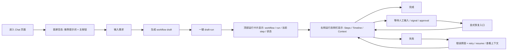
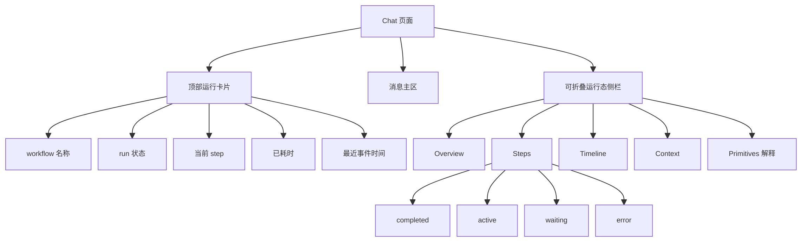
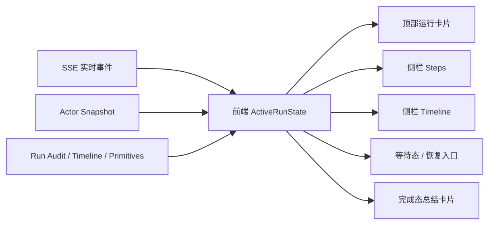

# 2026-04-08 Chat Visibility First Execution Plan

## 1. 本周决策

本周两条重点统一收敛为一条主线：

`外部开发者第一次进入 Chat -> 发起第一个 workflow -> 清楚知道当前执行到哪里 -> 在卡住或报错时能继续往下走`

本周不把重点放在“能力越多越好”，而是放在“执行位置必须可见”：

- 用户必须随时知道当前属于哪个 workflow / run。
- 用户必须随时知道当前 step、当前阶段、当前是在运行中还是等待中。
- 用户必须在等待人工输入、等待 signal、失败时看到明确恢复入口。

## 2. 北极星目标

### 2.1 用户目标

- 第一次使用 Chat 的外部开发者，可以在没有口头讲解的前提下完成首个 workflow 发起。
- 外部开发者可以仅通过页面判断 workflow 当前执行位置，而不是靠工程师解释事件流。
- 外部开发者在异常或等待态下，能明确知道下一步该做什么。

### 2.2 量化目标

| 指标 | 本周目标 |
|---|---|
| 首个 workflow 发起耗时 | 可记录、可回放 |
| 首个 workflow 完成耗时 | 可记录、可回放 |
| 异常恢复成功率 | 至少记录 1 轮真实试用结果 |
| 当前执行状态判断准确率 | 至少记录 1 轮真实试用结果 |
| 当前执行状态判断耗时 | 至少记录 1 轮真实试用结果 |

### 2.3 非目标

- 本周不做完整工作流 IDE。
- 本周不新增第二套 workflow 执行链路。
- 本周不优先扩大量低频配置能力。

## 3. Visibility First 目标图

### 3.1 首次使用主路径

### 3.2 页面结构目标

### 3.3 运行态事实来源

## 4. 方案总览

本周推荐实现策略：

1. 先把 Chat 页面里的运行态从“消息气泡附带信息”提升为独立的 `ActiveRunState`。
2. 再把所有可视化组件都绑定到这一个状态源上。
3. 运行中优先消费实时 SSE，运行结束后再用 audit / timeline / snapshot 对账，避免页面只依赖临时事件。
4. 把“等待态”和“恢复动作”当成一级 UI，而不是错误分支。

## 5. P0 / P1 / P2

## P0

> 定义：不做完这些，本周的“执行位置可见”目标不成立。

| 编号 | 交付项 | 具体动作 | 主要落点 | 验收标准 |
|---|---|---|---|---|
| P0-1 | 建立运行态单一事实源 | 抽离 `ActiveRunState`，统一保存 `actorId / runId / workflowName / commandId / currentStep / stage / waitingReason / error / elapsed`；不再只把 step 和 tool call 挂在消息对象上 | `tools/Aevatar.Tools.Cli/Frontend/src/runtime/ScopePage.tsx`、`tools/Aevatar.Tools.Cli/Frontend/src/runtime/chatTypes.ts`、推荐新增 `tools/Aevatar.Tools.Cli/Frontend/src/runtime/runState.ts` | 任意一次 workflow run 都能在页面上拿到唯一 active run |
| P0-2 | 补齐运行态事件归一化 | 统一解析 `RUN_*`、`STEP_*`、`aevatar.run.context`、`aevatar.step.request`、`aevatar.step.completed`、`aevatar.human_input.request`、`aevatar.workflow.waiting_signal`，并更新 `ActiveRunState` | `tools/Aevatar.Tools.Cli/Frontend/src/runtime/sseUtils.ts`、`tools/Aevatar.Tools.Cli/Frontend/src/runtime/ScopePage.tsx` | 页面能稳定知道“当前 step 是谁、现在在等什么” |
| P0-3 | 顶部运行卡片 | 在 Chat 主区顶部新增固定运行卡片，显示 `workflow`、`run`、`当前节点`、`总状态`、`已耗时`、`最近事件时间`，并提供“展开侧栏”和“停止/恢复”入口 | 推荐新增 `tools/Aevatar.Tools.Cli/Frontend/src/runtime/RunStatusBanner.tsx`，接入 `ScopePage.tsx` | 用户 5 秒内能说出当前执行位置 |
| P0-4 | 可折叠运行态侧栏 | 侧栏最小版本固定做 `Overview / Steps / Timeline / Context` 四块；`Steps` 明确区分 `completed / active / waiting / error`；当前 step 自动高亮 | 推荐新增 `tools/Aevatar.Tools.Cli/Frontend/src/runtime/WorkflowRuntimeSidebar.tsx`，接入 `ScopePage.tsx` | 用户能从侧栏判断“已经走过哪些节点、当前停在哪个节点” |
| P0-5 | 等待态显式化 | `human_input`、`waiting_signal`、`tool approval`、`run_error` 分别做独立状态块和明确 CTA；不能只显示一段文本 | `tools/Aevatar.Tools.Cli/Frontend/src/runtime/ScopePage.tsx` | 等待态下用户知道“系统在等我做什么” |
| P0-6 | 首次发起 workflow 主路径可见化 | 首屏空态只服务一个主路径：`输入需求 -> 生成 workflow draft -> draft-run -> 看运行态`；把 starter prompts、主按钮和下一步提示做出来 | `tools/Aevatar.Tools.Cli/Frontend/src/runtime/ScopePage.tsx`、`tools/Aevatar.Tools.Cli/Frontend/src/api.ts`、已有 `assistant.authorWorkflow` / `scope.streamDraftRun` 能力 | 外部开发者第一次进入页面时，不需要解释就能开始跑第一条 workflow |
| P0-7 | 基础埋点与试用记录 | 至少记录 `chat_opened_at`、`first_prompt_sent_at`、`workflow_started_at`、`workflow_completed_at`、`recovery_attempted`、`recovery_succeeded`；若暂时没有正式埋点，就先落试用记录模板 | 推荐新增 `docs/audit-scorecard/2026-04-08-chat-visibility-first-trial-template.md` 或前端本地记录结构 | 至少 1 轮外部试用有数据可回看 |

### P0 建议实现顺序

1. 先做 `ActiveRunState` 与事件归一化。
2. 再做顶部运行卡片。
3. 再做运行态侧栏。
4. 再补等待态与恢复入口。
5. 最后做首屏主路径和试用记录。

## P1

> 定义：做完后，用户不仅知道“现在在哪”，还能更好理解“为什么在这里”。

| 编号 | 交付项 | 具体动作 | 主要落点 | 验收标准 |
|---|---|---|---|---|
| P1-1 | Primitives 解释层 | 从现有 primitives 能力读取 step type 描述，在侧栏中对当前 step 做“这一步在干什么”的自然语言解释 | `tools/Aevatar.Tools.Cli/Frontend/src/api.ts`，推荐新增 `tools/Aevatar.Tools.Cli/Frontend/src/runtime/primitiveDescriptions.ts` | 外部开发者不懂 `workflow_call / wait_signal / assign` 也能看懂当前行为 |
| P1-2 | 运行结束总结卡片 | run 完成后输出“走过哪些关键节点、哪一步最耗时、是否经过等待态、是否发生恢复”的总结卡片 | `tools/Aevatar.Tools.Cli/Frontend/src/runtime/ScopePage.tsx` | 页面在结束后自动形成可演示总结 |
| P1-3 | Query/Audit 对账 | run 结束后主动拉取 snapshot / timeline / audit，用 committed 读模型校正前端临时状态 | `tools/Aevatar.Tools.Cli/Frontend/src/api.ts`、`tools/Aevatar.Tools.Cli/Frontend/src/runtime/ScopePage.tsx` | 页面刷新后仍能恢复并展示正确执行状态 |
| P1-4 | Workflow 定义上下文 | 侧栏可查看当前 workflow 的定义摘要、step 列表、核心 edges，帮助用户把运行态映射回定义 | `tools/Aevatar.Tools.Cli/Frontend/src/api.ts`，可复用现有 workflow 查询端点 | 用户能从“当前 step”回到“整个 workflow 结构” |

## P2

> 定义：增强演示效果和调试效率，但不阻塞本周核心目标。

| 编号 | 交付项 | 具体动作 | 主要落点 | 验收标准 |
|---|---|---|---|---|
| P2-1 | 图形化路径视图 | 把 step progression 做成轻量节点图或分阶段路径图，而不只是线性列表 | 推荐新增 `tools/Aevatar.Tools.Cli/Frontend/src/runtime/WorkflowRunMiniGraph.tsx` | 演示时一眼能看出执行流向 |
| P2-2 | Shareable 调试快照 | 导出当前 run 的 `summary + timeline + context + error`，便于外部试用后回收反馈 | `tools/Aevatar.Tools.Cli/Frontend/src/runtime/ScopePage.tsx` | 每轮试用结束后可沉淀调试证据 |
| P2-3 | Live 与 Committed 对比 | 显示“实时事件视图”和“最终 committed audit”是否一致，用于内部调试投影链路 | 前端 debug panel | 内部联调时能快速发现投影或状态漂移问题 |

## 6. 需要接入的现有能力

优先复用现有接口，不新造第二套后端语义：

| 用途 | 现有能力 |
|---|---|
| 生成 workflow draft | 前端已存在 `assistant.authorWorkflow` |
| inline draft run | `/api/scopes/{scopeId}/workflow/draft-run`，前端已存在 `scope.streamDraftRun` |
| actor 当前状态 | `/api/actors/{actorId}`，前端已存在 `getActorSnapshot` |
| actor timeline | `/api/actors/{actorId}/timeline`，前端已存在 `getActorTimeline` |
| service run audit | `/api/scopes/{scopeId}/services/{serviceId}/runs/{runId}/audit`，前端未接，建议本周补齐 |
| default run audit | `/api/scopes/{scopeId}/runs/{runId}/audit`，前端未接，建议本周补齐 |
| primitives 查询 | `/api/primitives`，前端未接，建议本周补齐 |
| workflow catalog / detail | `/api/workflow-catalog`、`/api/workflows/{workflowName}`，前端未接，建议本周补齐 |

## 7. 推荐文件拆分

为避免 `ScopePage.tsx` 继续膨胀，本周建议顺手把运行态相关结构拆出来：

| 文件 | 责任 |
|---|---|
| `tools/Aevatar.Tools.Cli/Frontend/src/runtime/runState.ts` | `ActiveRunState`、状态更新器、selector |
| `tools/Aevatar.Tools.Cli/Frontend/src/runtime/RunStatusBanner.tsx` | 顶部运行卡片 |
| `tools/Aevatar.Tools.Cli/Frontend/src/runtime/WorkflowRuntimeSidebar.tsx` | 运行态侧栏 |
| `tools/Aevatar.Tools.Cli/Frontend/src/runtime/sseUtils.ts` | 事件归一化与 custom payload helper |
| `tools/Aevatar.Tools.Cli/Frontend/src/api.ts` | run audit / primitives / workflow detail API |
| `tools/Aevatar.Tools.Cli/Frontend/src/runtime/ScopePage.tsx` | 组装页与交互编排 |

## 8. 一周执行节奏

| 天 | 目标 | 结果 |
|---|---|---|
| Day 1 | 建 `ActiveRunState` 和事件归一化 | 页面能稳定拿到当前 run / step / state |
| Day 2 | 做顶部运行卡片和侧栏骨架 | 用户第一次能看到“当前执行到哪里” |
| Day 3 | 做等待态、恢复入口、错误态 | 用户知道卡住时该怎么继续 |
| Day 4 | 接 primitives / audit / workflow detail | 用户知道“这一步为什么在这里” |
| Day 5 | 做外部试用、录屏、修关键问题 | 形成 demo 版本和试用数据 |

## 9. 外部试用脚本

建议至少招募 1 位不了解内部实现的外部开发者，按下面脚本试用：

1. 打开 Chat 页面，不给任何口头解释。
2. 让对方完成“发起一个简单 workflow”。
3. 在运行过程中暂停提问：
   当前执行到哪个位置了？
4. 当系统进入等待态时提问：
   现在是在等系统自己继续，还是在等你？
5. 当发生一次人为制造的异常或中断后提问：
   你觉得现在应该点哪里恢复？

试用记录至少包含：

- 首个 workflow 发起耗时
- 首个 workflow 完成耗时
- 当前状态判断是否正确
- 当前状态判断耗时
- 是否成功完成恢复
- 主要卡点前三名

## 10. 本周完成定义

满足以下条件才算本周目标完成：

- Chat 页面存在清晰的“首个 workflow 发起”主路径。
- 页面顶部或侧边栏中，始终存在显式的执行位置展示。
- 用户能区分 `running / waiting / error / completed` 四种状态。
- 至少 1 条真实 workflow 完成联调演示。
- 至少 1 轮外部试用完成并形成记录。

