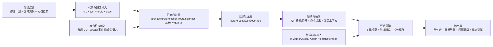
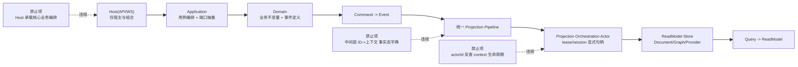

# 架构审计评分规范（Standard Scorecard Spec）

本文档定义 `docs/audit-scorecard` 目录下评分卡的统一规则、证据链要求和评分方法，避免不同审计批次使用不同口径。

## 1. 目标与适用范围

### 1.1 目标

1. 统一“整体分 + 分模块分”的评分模型。
2. 统一证据标准（必须可定位到代码、门禁脚本或命令结果）。
3. 统一扣分与不扣分边界，避免把“阶段性选型”误判为架构缺陷。
4. 让评分结果可复查、可复现、可在 CI 门禁中持续执行。

### 1.2 适用范围

1. `aevatar.slnx` 全量审计。
2. 子系统审计（Foundation、CQRS、Workflow、Maker、Host、AI、Distributed）。
3. PR 定向审计（例如单 PR 严格审计报告）。

## 2. 审计治理架构图

### 2.1 评分治理全景图

### 2.2 业务主链路审计对象图

## 3. 基线口径（强制，不扣分）

以下三项属于当前阶段基线，不作为扣分项：

1. 仅有 InMemory 实现（含 Runtime provider、ReadModel store、state/event/manifest 存储）。  
前提：文档明确环境定位（dev/test 或阶段默认实现）且可替换。
2. Actor Runtime 仅 Local 实现（尚未分布式 Actor）。  
前提：分层与接口边界稳定，不将“未分布式化”误判为设计缺陷。
3. 当前阶段保留 `ProjectReference`（尚未切换 `PackageReference`）。  
前提：模块边界清晰，分片构建/测试门禁可复现通过，依赖关系受 guard 约束。

说明：

1. 分布式能力是后续演进目标，可列为增量项，不作为当前扣分项。
2. 包管理形态演进（`ProjectReference -> PackageReference`）属于发布治理项，不作为当前扣分项。
3. 历史评分卡与本规范冲突时，以本规范为准并在新审计中修正。

## 4. 标准化评分模型（100 分）

### 4.1 维度与权重

| 维度 | 权重 | 核心检查点 |
|---|---:|---|
| 分层与依赖反转 | 20 | Domain/Application/Infrastructure/Host 边界清晰，依赖方向正确 |
| CQRS 与统一投影链路 | 20 | `Command -> Event`、`Query -> ReadModel`、单一 Projection Pipeline |
| Projection 编排与状态约束 | 20 | Actor 化编排、显式 lease/session 句柄、禁止中间层事实态字典 |
| 读写分离与会话语义 | 15 | 命令与查询职责分离，异步收敛语义清晰 |
| 命名语义与冗余清理 | 10 | 项目名/命名空间/目录语义一致，删除无效壳层 |
| 可验证性（门禁/构建/测试） | 15 | guards/build/test 可复现通过，关键回归路径有测试 |

### 4.2 计分规则

1. 总分 = 六个维度得分之和（满分 100）。
2. 每个维度先给满分，再按“已落地问题”扣分。
3. 每个扣分点必须绑定证据：`文件路径:行号` 或命令输出。
4. 规划中但未落地的问题不扣分，仅列入“后续风险/建议”。
5. 同一事实不重复扣分；若跨维度影响，主维度扣分，副维度只记录影响说明。

### 4.3 推荐扣分粒度

1. 阻断级（Blocking）：单项建议扣 `5-10` 分，必须给出“合并前修复条件”。
2. 主要级（Major）：单项建议扣 `3-5` 分，要求明确修复窗口。
3. 一般级（Medium）：单项建议扣 `1-2` 分，纳入后续迭代。

### 4.4 等级映射

| 分数区间 | 等级 |
|---|---|
| 95-100 | A+ |
| 90-94 | A |
| 85-89 | A- |
| 80-84 | B+ |
| 70-79 | B |
| <70 | C |

## 5. 可扣分项与非扣分项清单

### 5.1 可扣分（需证据）

1. Host 承载业务编排或出现跨层反向依赖。
2. CQRS 出现双轨实现，导致读写链路语义不一致。
3. 中间层维护 `actor/entity/run/session` 事实态映射（服务级内存字典等）。
4. 通过 `actorId -> context` 反查替代显式 lease/session 句柄。
5. 关键架构门禁、构建或测试无法稳定通过。
6. 新增非抽象 `Reducer` 未被测试引用，或事件到 reducer 路由不满足 guard 约束。

### 5.2 非扣分（本规范强制）

1. 仅 InMemory 实现（满足可替换与定位清晰前提）。
2. Actor 仅 Local 实现（分布式 Actor 未实现）。
3. 当前阶段保留 `ProjectReference`（边界与门禁满足前提）。

## 6. 分模块评分规范

1. 每个模块独立给出 `0-100` 分与一句结论。
2. 模块评分必须可追溯到同一套六维模型，不得使用隐含私有标准。
3. 推荐模块：
`Foundation+Runtime`、`CQRS`、`Workflow`、`Maker`、`Host`、`AI`、`Docs+Guards`。
4. 整体分与分模块分允许不完全线性一致，但必须说明差异原因。

## 7. 证据标准与引用规范

1. 代码证据：必须给出 `文件路径:行号`，且能直接对应结论。
2. 脚本证据：给出脚本路径与关键匹配规则位置（如 guard 中的检测语句）。
3. 命令证据：记录完整命令和结果摘要（通过/失败、核心计数、关键错误）。
4. 反例证据：如判定“无问题”，应给出“为何无问题”的对照证据。
5. 同一结论至少需要一条直接证据，涉及阻断问题建议两条以上证据交叉验证。

## 8. 审计执行流程（标准步骤）

### 8.1 必跑命令（全量审计）

1. `bash tools/ci/architecture_guards.sh`
2. `bash tools/ci/projection_route_mapping_guard.sh`
3. `bash tools/ci/solution_split_guards.sh`
4. `bash tools/ci/solution_split_test_guards.sh`
5. `dotnet build aevatar.slnx --nologo`
6. `dotnet test aevatar.slnx --nologo`

说明：

1. 若涉及测试新增/修改，必须补跑 `bash tools/ci/test_stability_guards.sh`。
2. 若是子系统审计，可在报告中注明“分片命令替换为对应 slnf/csproj”。

### 8.2 执行顺序

1. 执行客观验证命令并记录结果。
2. 收集结构证据（关键依赖、核心编排路径、投影路由、API 边界）。
3. 按六维模型评分，先列证据再给扣分。
4. 输出“整体 + 分模块 + 问题分级 + 修复准入标准”。
5. 需要时同步更新架构文档与本评分规范版本记录。

## 9. 评分卡输出模板（建议）

1. 审计范围与方法。
2. 客观验证结果（命令 + 结果）。
3. 整体评分（总分 + 六维表）。
4. 分模块评分（模块分 + 一句话结论）。
5. 关键证据（加分项）。
6. 主要扣分项（必须给证据与影响说明）。
7. 阻断项修复准入标准（若存在 Blocking）。
8. 改进优先级建议（P1/P2）。
9. 非扣分观察项（与基线口径对应）。

## 10. 治理要求

1. 新增评分卡必须遵循本规范。
2. 架构调整需要同步更新 `docs/` 对应架构文档。
3. 本规范变更必须追加版本记录，说明原因与影响范围。

## 11. 版本记录

1. `2026-02-20`：初版生效，定义统一 100 分模型与基线口径。
2. `2026-02-25`：扩展为详细版，新增治理架构图、业务主链路审计图、证据规范与必跑命令清单。
