# Aevatar CQRS 子解决方案评分卡（2026-02-21）

## 1. 审计范围与方法

1. 审计对象：`aevatar.cqrs.slnf`（单一子解决方案）。
2. 评分规范：`docs/audit-scorecard/README.md`（100 分模型，6 维度）。
3. 证据类型：`.slnf`、`csproj`、核心源码、测试源码、CI guard 脚本、本地命令结果。

## 2. 子解决方案组成

`aevatar.cqrs.slnf` 包含 7 个项目（4 个 CQRS 项目 + 1 个 Foundation 投影项目 + 2 个测试项目）：

1. `src/Aevatar.CQRS.Core.Abstractions/Aevatar.CQRS.Core.Abstractions.csproj`
2. `src/Aevatar.CQRS.Core/Aevatar.CQRS.Core.csproj`
3. `src/Aevatar.CQRS.Projection.Abstractions/Aevatar.CQRS.Projection.Abstractions.csproj`
4. `src/Aevatar.CQRS.Projection.Core/Aevatar.CQRS.Projection.Core.csproj`
5. `src/Aevatar.Foundation.Projection/Aevatar.Foundation.Projection.csproj`
6. `test/Aevatar.CQRS.Core.Tests/Aevatar.CQRS.Core.Tests.csproj`
7. `test/Aevatar.CQRS.Projection.Core.Tests/Aevatar.CQRS.Projection.Core.Tests.csproj`

证据：`aevatar.cqrs.slnf:4`。

## 3. 相关源码架构分析

### 3.1 分层与依赖反转

1. `Abstractions` 与 `Core` 分离清晰，`Core` 主要依赖抽象项目，而非业务实现。
2. `Aevatar.CQRS.Core` 依赖 `Aevatar.CQRS.Core.Abstractions` 与 `Aevatar.Foundation.Abstractions`，依赖方向向下。
3. `Aevatar.CQRS.Projection.Core` 依赖 `Aevatar.CQRS.Projection.Abstractions`、`Aevatar.Foundation.Abstractions`、`Aevatar.Foundation.Core`，未出现 Host/API 反向依赖。

证据：`src/Aevatar.CQRS.Core/Aevatar.CQRS.Core.csproj:10`、`src/Aevatar.CQRS.Core/Aevatar.CQRS.Core.csproj:11`、`src/Aevatar.CQRS.Projection.Core/Aevatar.CQRS.Projection.Core.csproj:10`、`src/Aevatar.CQRS.Projection.Core/Aevatar.CQRS.Projection.Core.csproj:12`。

### 3.2 CQRS 与统一投影链路

1. 命令执行路径保持 `Command -> Envelope(Event) -> Actor`：`DefaultCommandExecutor` 使用 `ICommandEnvelopeFactory` 构造 envelope 后调用 `HandleEventAsync`。
2. 投影生命周期统一入口为 `ProjectionLifecycleService`，启动、投影、停止、完成都通过同一编排对象。
3. 投影分发链路为 `SubscriptionRegistry -> Dispatcher -> Coordinator -> Projectors`，满足“一入口、多 projector 分发”。
4. `ProjectionCoordinator` 已落地“一对多全分支尝试 + 聚合异常”语义：单个 projector 失败不会中断同事件其余 projector 执行，最终统一抛出 `ProjectionDispatchAggregateException`（包含 projector 顺序）。

证据：`src/Aevatar.CQRS.Core/Commands/DefaultCommandExecutor.cs:22`、`src/Aevatar.CQRS.Core/Commands/DefaultCommandExecutor.cs:23`、`src/Aevatar.CQRS.Projection.Core/Orchestration/ProjectionLifecycleService.cs:24`、`src/Aevatar.CQRS.Projection.Core/Orchestration/ProjectionLifecycleService.cs:30`、`src/Aevatar.CQRS.Projection.Core/Orchestration/ProjectionSubscriptionRegistry.cs:36`、`src/Aevatar.CQRS.Projection.Core/Orchestration/ProjectionDispatcher.cs:14`、`src/Aevatar.CQRS.Projection.Core/Orchestration/ProjectionCoordinator.cs:21`、`src/Aevatar.CQRS.Projection.Core/Orchestration/ProjectionDispatchAggregateException.cs:6`、`test/Aevatar.CQRS.Projection.Core.Tests/ProjectionCoreBehaviorTests.cs:64`。

### 3.3 Projection 编排与状态约束

1. 所有权裁决 Actor 化：`ActorProjectionOwnershipCoordinator` 通过 `IActorRuntime` 解析/创建 `ProjectionOwnershipCoordinatorGAgent`，由 Actor 状态承载所有权事实。
2. 会话生命周期通过 lease 显式传递：`IProjectionStreamSubscriptionContext.StreamSubscriptionLease` 与 `ProjectionSubscriptionRegistry` 的注册/退订流程一致。
3. 架构守卫显式禁止中间层使用 `Dictionary/ConcurrentDictionary` 保存 `actor/entity/run/session` 事实态映射。
4. 订阅分发异常在 registry 层会触发失败上报，且上报使用 `CancellationToken.None`，避免取消竞态导致失败信号被吞掉。

证据：`src/Aevatar.CQRS.Projection.Core/Orchestration/ActorProjectionOwnershipCoordinator.cs:52`、`src/Aevatar.CQRS.Projection.Core/Orchestration/ProjectionOwnershipCoordinatorGAgent.cs:11`、`src/Aevatar.CQRS.Projection.Abstractions/Abstractions/IProjectionStreamSubscriptionContext.cs:9`、`src/Aevatar.CQRS.Projection.Core/Orchestration/ProjectionSubscriptionRegistry.cs:60`、`src/Aevatar.CQRS.Projection.Core/Orchestration/ProjectionSubscriptionRegistry.cs:103`、`test/Aevatar.CQRS.Projection.Core.Tests/ProjectionCoreBehaviorTests.cs:177`、`tools/ci/architecture_guards.sh:243`、`tools/ci/architecture_guards.sh:285`。

### 3.4 子解内部架构图（抽象到实现）

```mermaid
%%{init: {"maxTextSize": 100000, "flowchart": {"useMaxWidth": false, "nodeSpacing": 10, "rankSpacing": 50}, "themeVariables": {"fontSize": "10px"}}}%%
flowchart LR
    A1["Command"]
    A2["DefaultCommandExecutor"]
    A3["Actor.HandleEventAsync"]
    A4["EventEnvelope"]
    B1["ProjectionSubscriptionRegistry"]
    B2["ProjectionDispatcher"]
    B3["ProjectionCoordinator"]
    B4["IProjectionProjector[]"]
    C1["ActorProjectionOwnershipCoordinator"]
    C2["ProjectionOwnershipCoordinatorGAgent(State)"]

    A1 --> A2
    A2 --> A4
    A4 --> A3
    A3 --> B1
    B1 --> B2
    B2 --> B3
    B3 --> B4
    C1 --> C2
    C2 --> B1
```

## 4. 客观验证结果

| 检查项 | 命令 | 结果 |
|---|---|---|
| 子解构建 | `dotnet build aevatar.cqrs.slnf --nologo --no-restore --tl:off -m:1 -p:UseSharedCompilation=false -p:NuGetAudit=false` | 通过（0 warning / 0 error） |
| 子解测试 | `dotnet test aevatar.cqrs.slnf --nologo --tl:off -m:1 -p:UseSharedCompilation=false -p:NuGetAudit=false --no-restore` | 通过（`28 passed / 0 failed`） |
| 投影路由守卫 | `bash tools/ci/projection_route_mapping_guard.sh` | 通过 |
| 架构守卫 | `bash tools/ci/architecture_guards.sh` | 通过（diff mode: worktree） |
| 覆盖率采集 | `dotnet test aevatar.cqrs.slnf ... --collect:"XPlat Code Coverage"` | 行覆盖率 20.67%，分支覆盖率 10.42% |

覆盖率证据：`test/Aevatar.CQRS.Core.Tests/TestResults/5a3af45e-b2eb-4481-a6c1-93f6985072a6/coverage.cobertura.xml:2`、`test/Aevatar.CQRS.Projection.Core.Tests/TestResults/06e44950-675e-4b85-b9c4-2dba95728aee/coverage.cobertura.xml:2`。

## 5. 评分结果（100 分制）

**总分：99 / 100（A+）**

| 维度 | 权重 | 得分 | 说明 |
|---|---:|---:|---|
| 分层与依赖反转 | 20 | 20 | `Abstractions -> Core` 边界清晰，无 Host/API 反向耦合。 |
| CQRS 与统一投影链路 | 20 | 20 | 命令到事件、事件到投影链路统一，且已落地“全分支尝试 + 聚合异常”语义。 |
| Projection 编排与状态约束 | 20 | 20 | Actor 化与 lease/session 约束稳定，分发失败已避免取消竞态导致的静默丢失。 |
| 读写分离与会话语义 | 15 | 15 | 命令/查询职责清晰，订阅分发取消语义已与会话生命周期对齐。 |
| 命名语义与冗余清理 | 10 | 10 | 项目名、命名空间、目录语义一致，无空壳层。 |
| 可验证性（门禁/构建/测试） | 15 | 14 | 构建/测试/守卫全绿，关键编排测试进一步补齐；整体覆盖率仍偏低。 |

## 6. 主要扣分项（按影响度）

### P1

1. 暂无 P1 阻断项。

### P2

1. `Aevatar.CQRS.Core` 覆盖率仍偏低（行 6.97%，分支 3.82%），需要补齐命令执行服务等关键路径测试。  
证据：`test/Aevatar.CQRS.Core.Tests/TestResults/5a3af45e-b2eb-4481-a6c1-93f6985072a6/coverage.cobertura.xml:2`。

## 7. 改进建议（优先级）

1. P2：持续补齐 `Aevatar.CQRS.Core` 的命令执行与错误路径测试，抬升核心覆盖率。
2. P2：为 CQRS 子解增加最小覆盖率阈值门禁，防止后续回落。
3. P2：为 `ProjectionDispatchAggregateException` 增加端到端日志/告警维度统计，支撑批量失败可观测性。
