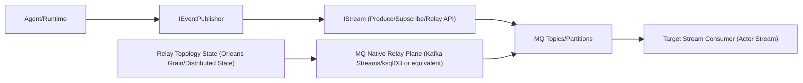

# Aevatar 消息队列原生分发与 Relay 重构计划（2026-02-22）

## 1. 背景与目标

当前分布式链路中，`Down/Both` 方向的转发仍有显著 C# 运行时参与，不符合“消息队列负责分发与 relay，Runtime 仅生产/消费业务事件”的目标。

本次重构目标：

1. 将 relay 执行面从 Runtime C# 代码下沉到消息队列层。
2. 让 `IStream` 成为统一能力入口（生产、订阅、relay 规则管理）。
3. 保持 `Domain/Application/Infrastructure/Host` 分层和依赖反转不被破坏。
4. 保持“跨节点事实态唯一来源”原则：relay 拓扑事实态仍由分布式持久态承载。

## 2. 当前实现现状（审计结论）

### 2.1 已有能力

1. 存在 `IStreamForwardingBinding` 与 `TransitOnly/HandleThenForward` 语义。  
证据：`src/Aevatar.Foundation.Abstractions/Streaming/IStreamForwardingRegistry.cs:6`
2. Orleans 拓扑事实态已由 `StreamTopologyGrain` 持久化。  
证据：`src/Aevatar.Foundation.Runtime.Implementations.Orleans.Streaming/Streaming/Topology/StreamTopologyGrain.cs:6`

### 2.2 主要缺口

1. `IStream` 仅有 Produce/Subscribe，无 relay 能力。  
证据：`src/Aevatar.Foundation.Abstractions/IStream.cs:20`
2. Orleans `Down/Both` relay 在 `OrleansGrainEventPublisher` 中以 C# BFS 执行。  
证据：`src/Aevatar.Foundation.Runtime.Implementations.Orleans/Actors/OrleansGrainEventPublisher.cs:101`
3. InMemory relay 在 `InMemoryStreamForwardingEngine` 执行。  
证据：`src/Aevatar.Foundation.Runtime/Streaming/InMemoryStreamForwardingEngine.cs:22`
4. MassTransit/Kafka 仅做消息传输，不执行拓扑 relay。  
证据：`src/Aevatar.Foundation.Runtime.Streaming.Implementations.MassTransit/Streaming/MassTransitStream.cs:36`、`src/Aevatar.Foundation.Runtime.Transport.Implementations.MassTransitKafka/Transport/MassTransitKafkaEnvelopeTransport.cs:27`

## 3. 重构原则（强约束）

1. Runtime 不再计算 relay 图，不再执行多跳转发循环。
2. `IStream` 承担 relay 能力入口，不再由 Runtime 直接依赖独立 forwarding registry 进行分发决策。
3. 分布式事实态唯一来源保持为 Actor 持久态/分布式状态；禁止中间层事实态字典。
4. `InMemory` 可保留开发期实现，但必须显式标注“开发测试语义”且不得作为生产分布式语义。
5. 重构以删除为先：删除无效中间层逻辑，避免长期双轨。

## 4. 目标架构



说明：

1. Runtime 仅向源 stream produce，不再做 downlink BFS/多跳 relay。
2. relay 图由分布式状态驱动 MQ relay plane 执行。
3. `IStream` 统一承载业务调用入口，底层具体实现可为 MassTransit+Kafka。

## 5. 设计变更清单

### 5.1 抽象层（Abstractions）

1. 升级 `IStream`，新增 relay 管理能力（建议直接进入主接口，避免长期并行接口）。  
目标文件：`src/Aevatar.Foundation.Abstractions/IStream.cs`
2. 迁移/收敛 `IStreamForwardingRegistry` 到 `IStream` 能力域，最终删除外露的运行时分发依赖。  
目标文件：`src/Aevatar.Foundation.Abstractions/Streaming/IStreamForwardingRegistry.cs`

建议 API（示意）：

```csharp
Task UpsertRelayAsync(StreamForwardingBinding binding, CancellationToken ct = default);
Task RemoveRelayAsync(string targetStreamId, CancellationToken ct = default);
Task<IReadOnlyList<StreamForwardingBinding>> ListRelaysAsync(CancellationToken ct = default);
```

### 5.2 Runtime 层

1. 删除 Orleans publisher 的 `DispatchDownAsync` 图遍历与 relay 分发逻辑。  
目标文件：`src/Aevatar.Foundation.Runtime.Implementations.Orleans/Actors/OrleansGrainEventPublisher.cs`
2. `LinkAsync/UnlinkAsync` 从“操作 forwarding registry”改为“调用 source stream relay API”。  
目标文件：`src/Aevatar.Foundation.Runtime.Implementations.Orleans/Actors/OrleansActorRuntime.cs`、`src/Aevatar.Foundation.Runtime/Actor/LocalActorRuntime.cs`
3. 删除/下沉 InMemory forwarding engine 在生产路径中的职责。  
目标文件：`src/Aevatar.Foundation.Runtime/Streaming/InMemoryStreamForwardingEngine.cs`

### 5.3 Infrastructure 层（MQ）

1. 新增 MQ 原生 relay plane（Kafka Streams/ksqlDB 或等价能力），按 relay 拓扑执行分发。
2. relay plane 订阅拓扑变更流并增量更新本地状态，不依赖 Runtime 进程内状态。
3. 对 `TransitOnly/HandleThenForward`、`DirectionFilter`、`EventTypeFilter` 语义做一对一映射。

### 5.4 Hosting 层

1. 新增配置开关：`ActorRuntime:RelayExecutionMode=QueueNative`（默认即 QueueNative）。
2. 删除长期兼容双轨，仅保留极短迁移窗口（一个发布周期）。

## 6. 分阶段实施计划

### Phase 0：冻结与基线（0.5 天）

1. 冻结当前 relay 语义并形成 ADR（含 `TransitOnly` 边界）。
2. 补充现状用例快照，作为回归基线。
3. 输出：`ADR + 基线测试清单`。

### Phase 1：接口收敛（1 天）

1. 扩展 `IStream` relay API。
2. 让现有实现先编译通过（可临时 `NotSupportedException`，但仅限未接入后端）。
3. 调整调用方依赖：`Link/Unlink` 改为 stream 入口。

验收：

1. 全仓构建通过。
2. 不新增跨层依赖。

### Phase 2：MQ Relay Plane 接入（2-3 天）

1. 落地 Queue-native relay plane。
2. 与拓扑状态建立同步机制。
3. 支持按 streamId/key 分区策略保持同 key 顺序。

验收：

1. 单跳/多跳/环路/TransitOnly 场景通过。
2. Runtime 日志中不再出现 relay 图遍历链路。

### Phase 3：删除 Runtime Relay 代码（1 天）

1. 删除 `OrleansGrainEventPublisher` 的 relay BFS。
2. 删除不再需要的 forwarding engine / 中间路由分支。
3. 清理多余测试桩与兼容代码。

验收：

1. 关键文件中不再存在 relay 图遍历逻辑。
2. 架构守卫与分片守卫通过。

### Phase 4：门禁与文档收口（0.5 天）

1. 新增“禁止 Runtime relay BFS”静态守卫。
2. CI 常态执行 Kafka 集成链路验证。
3. 更新架构文档与运行手册。

## 7. 验收标准（Definition of Done）

1. `IStream` 具备生产、订阅、relay 管理统一入口。
2. 分布式路径中 `Down/Both` relay 不再由 Runtime C# 代码执行。
3. `Link/Unlink` 仅负责声明拓扑，不负责执行分发图遍历。
4. 以下命令全部通过：
   `bash tools/ci/architecture_guards.sh`
   `bash tools/ci/solution_split_guards.sh`
   `bash tools/ci/solution_split_test_guards.sh`
   `bash tools/ci/test_stability_guards.sh`
   `bash tools/ci/coverage_quality_guard.sh`
5. Kafka 集成测试在 CI 默认执行，不依赖人工注入环境。

## 8. 风险与应对

1. 风险：MQ relay plane 与当前 metadata 语义不一致。  
应对：先锁定 `StreamForwardingEnvelopeMetadata` 兼容契约，增加契约测试。
2. 风险：分区策略错误导致乱序。  
应对：以 `streamId` 作为稳定 key，增加顺序回归测试。
3. 风险：迁移窗口产生双投递。  
应对：迁移期强制单执行面（先灰度小流量，再全量切换）。

## 9. 里程碑与交付物

1. M1（Phase 1 完成）：抽象完成，编译通过，调用入口收敛到 `IStream`。
2. M2（Phase 2 完成）：Queue-native relay 在测试环境可跑通全链路。
3. M3（Phase 3 完成）：Runtime relay 代码删除，双轨结束。
4. M4（Phase 4 完成）：CI 门禁与文档收口，进入稳定迭代。

## 10. 本次计划涉及的核心文件（预期改动）

1. `src/Aevatar.Foundation.Abstractions/IStream.cs`
2. `src/Aevatar.Foundation.Abstractions/Streaming/IStreamForwardingRegistry.cs`
3. `src/Aevatar.Foundation.Runtime.Implementations.Orleans/Actors/OrleansGrainEventPublisher.cs`
4. `src/Aevatar.Foundation.Runtime.Implementations.Orleans/Actors/OrleansActorRuntime.cs`
5. `src/Aevatar.Foundation.Runtime/Actor/LocalActorRuntime.cs`
6. `src/Aevatar.Foundation.Runtime/Streaming/InMemoryStreamForwardingEngine.cs`
7. `src/Aevatar.Foundation.Runtime.Streaming.Implementations.MassTransit/Streaming/MassTransitStream.cs`
8. `src/Aevatar.Foundation.Runtime.Transport.Implementations.MassTransitKafka/*`
9. `tools/ci/*`（新增/调整守卫）
10. `docs/*`（架构与运行文档）
