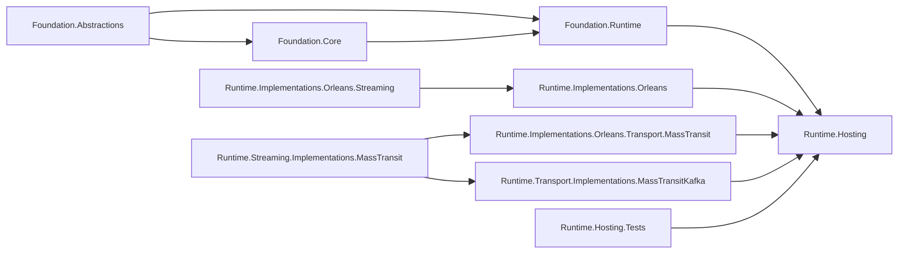

# Aevatar Distributed 子解决方案评分卡（2026-02-22）

## 1. 审计范围与方法

1. 审计对象：`aevatar.distributed.slnf`（分布式运行时子解决方案）。
2. 评分规范：`docs/audit-scorecard/README.md`（100 分模型，6 维度）。
3. 证据来源：`slnf/csproj` 依赖、分布式 runtime 源码、测试源码、CI guard、本地命令结果。

## 2. 子解决方案组成

`aevatar.distributed.slnf` 当前包含 10 个项目（9 个生产项目 + 1 个测试项目）：

1. `src/Aevatar.Foundation.Abstractions/Aevatar.Foundation.Abstractions.csproj`
2. `src/Aevatar.Foundation.Core/Aevatar.Foundation.Core.csproj`
3. `src/Aevatar.Foundation.Runtime/Aevatar.Foundation.Runtime.csproj`
4. `src/Aevatar.Foundation.Runtime.Implementations.Orleans/Aevatar.Foundation.Runtime.Implementations.Orleans.csproj`
5. `src/Aevatar.Foundation.Runtime.Implementations.Orleans.Streaming/Aevatar.Foundation.Runtime.Implementations.Orleans.Streaming.csproj`
6. `src/Aevatar.Foundation.Runtime.Implementations.Orleans.Transport.MassTransit/Aevatar.Foundation.Runtime.Implementations.Orleans.Transport.MassTransit.csproj`
7. `src/Aevatar.Foundation.Runtime.Streaming.Implementations.MassTransit/Aevatar.Foundation.Runtime.Streaming.Implementations.MassTransit.csproj`
8. `src/Aevatar.Foundation.Runtime.Transport.Implementations.MassTransitKafka/Aevatar.Foundation.Runtime.Transport.Implementations.MassTransitKafka.csproj`
9. `src/Aevatar.Foundation.Runtime.Hosting/Aevatar.Foundation.Runtime.Hosting.csproj`
10. `test/Aevatar.Foundation.Runtime.Hosting.Tests/Aevatar.Foundation.Runtime.Hosting.Tests.csproj`

证据：`aevatar.distributed.slnf:5`、`aevatar.distributed.slnf:14`。

## 3. 相关源码架构分析

### 3.1 分层与依赖反转

1. 依赖方向维持 `Abstractions -> Core -> Runtime -> Implementations/Hosting`，未出现 `Hosting/Core` 反向依赖。  
证据：`src/Aevatar.Foundation.Core/Aevatar.Foundation.Core.csproj:10`、`src/Aevatar.Foundation.Runtime/Aevatar.Foundation.Runtime.csproj:10`、`src/Aevatar.Foundation.Runtime.Hosting/Aevatar.Foundation.Runtime.Hosting.csproj:10`。
2. Orleans、MassTransit、Kafka 等具体技术仅落在实现层/宿主装配层，不反向污染抽象层。  
证据：`src/Aevatar.Foundation.Runtime.Implementations.Orleans/Aevatar.Foundation.Runtime.Implementations.Orleans.csproj:16`、`src/Aevatar.Foundation.Runtime.Transport.Implementations.MassTransitKafka/Aevatar.Foundation.Runtime.Transport.Implementations.MassTransitKafka.csproj:13`。
3. 宿主组合通过统一扩展 `AddAevatarActorRuntime` 实现 provider 选择，避免业务层直接耦合特定实现。  
证据：`src/Aevatar.Bootstrap/ServiceCollectionExtensions.cs:17`、`src/Aevatar.Foundation.Runtime.Hosting/DependencyInjection/ServiceCollectionExtensions.cs:14`。

### 3.2 CQRS 与统一投影链路（Distributed Runtime 侧）

1. 分布式与本地 provider 共用同一抽象入口 `IActorRuntime/IStreamProvider`，属于单主链路的实现替换而非双轨。  
证据：`src/Aevatar.Foundation.Runtime.Hosting/DependencyInjection/ServiceCollectionExtensions.cs:51`、`src/Aevatar.Foundation.Runtime.Hosting/DependencyInjection/ServiceCollectionExtensions.cs:65`。
2. Orleans stream backend 支持 `InMemory` 与 `MassTransitAdapter`，并有非法后端 fail-fast 校验。  
证据：`src/Aevatar.Foundation.Runtime.Implementations.Orleans/DependencyInjection/ServiceCollectionExtensions.cs:38`、`src/Aevatar.Foundation.Runtime.Implementations.Orleans/DependencyInjection/ServiceCollectionExtensions.cs:41`、`src/Aevatar.Foundation.Runtime.Implementations.Orleans/DependencyInjection/ServiceCollectionExtensions.cs:70`。
3. Kafka 传输经 `IMassTransitEnvelopeTransport` 统一发布，避免业务层直接操作 MQ SDK。  
证据：`src/Aevatar.Foundation.Runtime.Transport.Implementations.MassTransitKafka/DependencyInjection/ServiceCollectionExtensions.cs:49`、`src/Aevatar.Foundation.Runtime.Transport.Implementations.MassTransitKafka/DependencyInjection/ServiceCollectionExtensions.cs:35`。

### 3.3 Projection 编排与状态约束（分布式运行态）

1. 跨节点 stream 拓扑事实态由 `IStreamTopologyGrain` 持久化，未在中间层使用进程内字典作为事实源。  
证据：`src/Aevatar.Foundation.Runtime.Implementations.Orleans.Streaming/Streaming/OrleansDistributedStreamForwardingRegistry.cs:14`、`src/Aevatar.Foundation.Runtime.Implementations.Orleans.Streaming/Streaming/Topology/StreamTopologyGrain.cs:7`、`src/Aevatar.Foundation.Runtime.Implementations.Orleans.Streaming/Streaming/Topology/StreamTopologyGrainState.cs:9`。
2. Actor 亲缘关系（`ParentId/Children`）保存在 grain 持久态，不依赖宿主层 registry。  
证据：`src/Aevatar.Foundation.Runtime.Implementations.Orleans/Grains/RuntimeActorGrainState.cs:13`、`src/Aevatar.Foundation.Runtime.Implementations.Orleans/Grains/RuntimeActorGrainState.cs:16`、`src/Aevatar.Foundation.Runtime.Implementations.Orleans/Grains/RuntimeActorGrain.cs:111`。
3. 本轮架构守卫通过，未触发中间层 `actor/entity/run/session` 字典事实态违规。  
证据：`tools/ci/architecture_guards.sh:256`、`tools/ci/architecture_guards.sh:286`。

### 3.4 读写分离与会话语义

1. 链接/解链语义由 `OrleansActorRuntime` 显式执行（`AddChild/SetParent/Remove`），会话关系清晰。  
证据：`src/Aevatar.Foundation.Runtime.Implementations.Orleans/Actors/OrleansActorRuntime.cs:99`、`src/Aevatar.Foundation.Runtime.Implementations.Orleans/Actors/OrleansActorRuntime.cs:109`、`src/Aevatar.Foundation.Runtime.Implementations.Orleans/Actors/OrleansActorRuntime.cs:126`。
2. 事件处理路径包含去重与传播链路保护，避免跨节点重复消费与环路传播。  
证据：`src/Aevatar.Foundation.Runtime.Implementations.Orleans/Grains/RuntimeActorGrain.cs:89`、`src/Aevatar.Foundation.Runtime.Implementations.Orleans/Grains/RuntimeActorGrain.cs:96`、`src/Aevatar.Foundation.Runtime.Implementations.Orleans/Grains/RuntimeActorGrain.cs:99`。
3. 销毁路径包含 parent/child 拓扑解绑与 stream 清理，避免会话残留。  
证据：`src/Aevatar.Foundation.Runtime.Implementations.Orleans/Actors/OrleansActorRuntime.cs:64`、`src/Aevatar.Foundation.Runtime.Implementations.Orleans/Actors/OrleansActorRuntime.cs:72`、`src/Aevatar.Foundation.Runtime.Implementations.Orleans/Actors/OrleansActorRuntime.cs:82`。

### 3.5 命名语义与冗余清理

1. 项目名与命名空间语义一致，分层语义明确（`Implementations.Orleans`、`Transport.MassTransitKafka`、`Runtime.Hosting`）。  
证据：`src/Aevatar.Foundation.Runtime.Implementations.Orleans/Aevatar.Foundation.Runtime.Implementations.Orleans.csproj:6`、`src/Aevatar.Foundation.Runtime.Transport.Implementations.MassTransitKafka/Aevatar.Foundation.Runtime.Transport.Implementations.MassTransitKafka.csproj:6`、`src/Aevatar.Foundation.Runtime.Hosting/Aevatar.Foundation.Runtime.Hosting.csproj:6`。
2. 分布式能力按插件化分层展开，未出现重复“第二体系”命名。

### 3.6 子解结构图

## 4. 客观验证结果

| 检查项 | 命令 | 结果 |
|---|---|---|
| 架构门禁 | `bash tools/ci/architecture_guards.sh` | 通过（含 projection route-mapping guard） |
| 子解构建 | `dotnet build aevatar.distributed.slnf --nologo --tl:off -v:minimal -m:1 -p:UseSharedCompilation=false -p:NuGetAudit=false` | 通过（0 warning / 0 error） |
| 子解测试 | `dotnet test aevatar.distributed.slnf --nologo --tl:off -m:1 -p:UseSharedCompilation=false -p:NuGetAudit=false` | 通过（`36 passed / 0 failed / 1 skipped`） |

## 5. 评分结果（100 分制）

**总分：98 / 100（A+）**

| 维度 | 权重 | 得分 | 说明 |
|---|---:|---:|---|
| 分层与依赖反转 | 20 | 20 | 依赖方向清晰，宿主层通过统一扩展完成 provider 组合。 |
| CQRS 与统一投影链路 | 20 | 20 | 分布式 provider 走统一抽象主链路，无并行双轨。 |
| Projection 编排与状态约束 | 20 | 20 | 跨节点事实态由 grain 持久化承载，未见中间层事实态字典。 |
| 读写分离与会话语义 | 15 | 15 | link/unlink/destroy 与事件传播语义明确且可追踪。 |
| 命名语义与冗余清理 | 10 | 10 | 项目命名、命名空间与目录语义一致。 |
| 可验证性（门禁/构建/测试） | 15 | 13 | 构建/测试/架构门禁通过，但分布式专项门禁与 Kafka 集成验证仍有覆盖缺口。 |

## 6. 主要扣分项（按影响度）

### P1

1. 本轮无 P1 阻断项。

### P2

1. `aevatar.distributed.slnf` 尚未纳入分片构建/测试守卫列表，分布式子解缺少专项门禁。  
证据：`tools/ci/solution_split_guards.sh:8`、`tools/ci/solution_split_test_guards.sh:8`。  
扣分：-1（可验证性）。
2. Orleans + Kafka 集成测试默认按环境变量跳过，CI 常态下无法持续验证真实 Kafka 传输链路。  
证据：`test/Aevatar.Foundation.Runtime.Hosting.Tests/KafkaIntegrationFactAttribute.cs:8`、`test/Aevatar.Foundation.Runtime.Hosting.Tests/OrleansMassTransitRuntimeIntegrationTests.cs:22`。  
扣分：-1（可验证性）。

## 7. 非扣分观察项（按统一规范）

1. Orleans 注册默认使用内存 grain storage，当前阶段按基线口径不扣分。  
证据：`src/Aevatar.Foundation.Runtime.Implementations.Orleans/DependencyInjection/ServiceCollectionExtensions.cs:55`。
2. Orleans stream backend 默认 `InMemory`，仍可通过配置切换 `MassTransitAdapter`，按基线口径不扣分。  
证据：`src/Aevatar.Foundation.Runtime.Implementations.Orleans.Streaming/AevatarOrleansRuntimeOptions.cs:8`、`src/Aevatar.Foundation.Runtime.Hosting/DependencyInjection/ServiceCollectionExtensions.cs:78`。
3. `ProjectReference` 形态保持不扣分（边界清晰且可构建/可测试）。

## 8. 改进建议（优先级）

1. P1：将 `aevatar.distributed.slnf` 纳入 `tools/ci/solution_split_guards.sh` 与 `tools/ci/solution_split_test_guards.sh` 的 `filters`，建立分布式专项门禁。
2. P1：在 CI 增加带 Kafka 服务容器的集成测试作业，使 `OrleansMassTransitRuntimeIntegrationTests` 常态执行而非默认跳过。
3. P2：为 Orleans storage 引入可配置持久化 provider（如外部存储适配），在不改变抽象边界前提下提升生产可迁移性。
