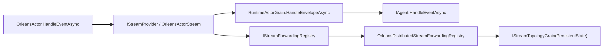

# Aevatar Distributed 子解决方案评分卡（2026-02-22）

## 1. 审计范围与方法

1. 审计对象：`aevatar.distributed.slnf`（分布式运行时子解决方案）。
2. 评分规范：`docs/audit-scorecard/README.md`（100 分模型，6 维度）。
3. 证据来源：`.slnf`、`csproj`、运行时与流式编排源码、测试源码、CI guard 脚本、本地命令结果。

## 2. 子解决方案组成

`aevatar.distributed.slnf` 当前包含 10 个项目（9 个生产项目 + 1 个测试项目）：

1. `src/Aevatar.Foundation.Abstractions/Aevatar.Foundation.Abstractions.csproj`
2. `src/Aevatar.Foundation.Core/Aevatar.Foundation.Core.csproj`
3. `src/Aevatar.Foundation.Runtime/Aevatar.Foundation.Runtime.csproj`
4. `src/Aevatar.Foundation.Runtime.Implementations.Orleans/Aevatar.Foundation.Runtime.Implementations.Orleans.csproj`
5. `src/Aevatar.Foundation.Runtime.Implementations.Orleans.Streaming/Aevatar.Foundation.Runtime.Implementations.Orleans.Streaming.csproj`
6. `src/Aevatar.Foundation.Runtime.Implementations.Orleans.Transport.MassTransit/Aevatar.Foundation.Runtime.Implementations.Orleans.Transport.MassTransit.csproj`
7. `src/Aevatar.Foundation.Runtime.Streaming.Implementations.MassTransit/Aevatar.Foundation.Runtime.Streaming.Implementations.MassTransit.csproj`
8. `src/Aevatar.Foundation.Runtime.Transport.Implementations.MassTransitKafka/Aevatar.Foundation.Runtime.Transport.Implementations.MassTransitKafka.csproj`
9. `src/Aevatar.Foundation.Runtime.Hosting/Aevatar.Foundation.Runtime.Hosting.csproj`
10. `test/Aevatar.Foundation.Runtime.Hosting.Tests/Aevatar.Foundation.Runtime.Hosting.Tests.csproj`

证据：`aevatar.distributed.slnf:4`。

## 3. 相关源码架构分析

### 3.1 分层与依赖反转

1. `Aevatar.Foundation.Runtime` 仅依赖 Foundation 抽象与核心层，未反向耦合 Host/API。
证据：`src/Aevatar.Foundation.Runtime/Aevatar.Foundation.Runtime.csproj:10`、`src/Aevatar.Foundation.Runtime/Aevatar.Foundation.Runtime.csproj:11`。
2. Orleans 实现层依赖 Runtime 与 Streaming 插件层，保持“抽象主干 + 实现扩展”结构。
证据：`src/Aevatar.Foundation.Runtime.Implementations.Orleans/Aevatar.Foundation.Runtime.Implementations.Orleans.csproj:12`、`src/Aevatar.Foundation.Runtime.Implementations.Orleans/Aevatar.Foundation.Runtime.Implementations.Orleans.csproj:13`。
3. `Aevatar.Foundation.Runtime.Hosting` 作为组合入口，仅负责 Provider/Backend 组装，不承载业务编排。
证据：`src/Aevatar.Foundation.Runtime.Hosting/DependencyInjection/ServiceCollectionExtensions.cs:14`、`src/Aevatar.Foundation.Runtime.Hosting/DependencyInjection/ServiceCollectionExtensions.cs:65`、`src/Aevatar.Foundation.Runtime.Hosting/Aevatar.Foundation.Runtime.Hosting.csproj:10`。

### 3.2 CQRS 与统一投影链路（分布式运行时语境）

1. 该子解不直接承载 CQRS 应用层命令/查询编排，而是提供统一的事件信封与流转运行时底座；未出现双轨投影实现。
2. `AddAevatarActorRuntime` 在 InMemory/MassTransit/Orleans 分支中均走同一入口，按配置切换实现而非并行维护多条主链路。
证据：`src/Aevatar.Foundation.Runtime.Hosting/DependencyInjection/ServiceCollectionExtensions.cs:51`、`src/Aevatar.Foundation.Runtime.Hosting/DependencyInjection/ServiceCollectionExtensions.cs:57`、`src/Aevatar.Foundation.Runtime.Hosting/DependencyInjection/ServiceCollectionExtensions.cs:65`。
3. Orleans actor 事件流转统一通过 `IStreamProvider`，`OrleansActor` 写流，`RuntimeActorGrain` 消费并分发给 `IAgent`。
证据：`src/Aevatar.Foundation.Runtime.Implementations.Orleans/Actors/OrleansActor.cs:33`、`src/Aevatar.Foundation.Runtime.Implementations.Orleans/Grains/RuntimeActorGrain.cs:301`、`src/Aevatar.Foundation.Runtime.Implementations.Orleans/Grains/RuntimeActorGrain.cs:122`。

### 3.3 Projection 编排与状态约束

1. 转发绑定模型显式包含 `LeaseId`，会话语义通过句柄字段透传。
证据：`src/Aevatar.Foundation.Abstractions/Streaming/IStreamForwardingRegistry.cs:33`。
2. Orleans 模式下转发注册表替换为 `OrleansDistributedStreamForwardingRegistry`，并委托到 `IStreamTopologyGrain`，避免中间层事实态字典。
证据：`src/Aevatar.Foundation.Runtime.Implementations.Orleans.Streaming/DependencyInjection/ServiceCollectionExtensions.cs:15`、`src/Aevatar.Foundation.Runtime.Implementations.Orleans.Streaming/Streaming/OrleansDistributedStreamForwardingRegistry.cs:14`。
3. 转发拓扑事实存储在 Grain 持久态（`IPersistentState<StreamTopologyGrainState>`），并在变更时写入状态。
证据：`src/Aevatar.Foundation.Runtime.Implementations.Orleans.Streaming/Streaming/Topology/StreamTopologyGrain.cs:7`、`src/Aevatar.Foundation.Runtime.Implementations.Orleans.Streaming/Streaming/Topology/StreamTopologyGrain.cs:25`。
4. 运行态父子关系事实存储在 `RuntimeActorGrainState` 并通过 Grain 写入，满足“Actor/分布式状态作为事实源”。
证据：`src/Aevatar.Foundation.Runtime.Implementations.Orleans/Grains/RuntimeActorGrainState.cs:13`、`src/Aevatar.Foundation.Runtime.Implementations.Orleans/Grains/RuntimeActorGrain.cs:132`、`src/Aevatar.Foundation.Runtime.Implementations.Orleans/Grains/RuntimeActorGrain.cs:148`。
5. 门禁对“中间层 ID 映射事实态字典”“context 反查”“运行时 Actor 层执行 relay 图遍历”有显式禁止。
证据：`tools/ci/architecture_guards.sh:214`、`tools/ci/architecture_guards.sh:243`、`tools/ci/architecture_guards.sh:289`。

### 3.4 运行时链路示意

## 4. 客观验证结果

| 检查项 | 命令 | 结果 |
|---|---|---|
| 依赖还原 | `dotnet restore aevatar.distributed.slnf --nologo` | 通过 |
| 子解构建 | `dotnet build aevatar.distributed.slnf --nologo --no-restore --tl:off -m:1 -p:UseSharedCompilation=false -p:NuGetAudit=false` | 通过（0 warning / 0 error） |
| 子解测试 | `dotnet test aevatar.distributed.slnf --nologo --no-build --no-restore --tl:off -m:1 -p:UseSharedCompilation=false -p:NuGetAudit=false` | 通过（`51 passed / 0 failed / 1 skipped`） |
| 架构门禁 | `bash tools/ci/architecture_guards.sh` | 通过（含 projection route-mapping guard） |
| 分片构建门禁 | `bash tools/ci/solution_split_guards.sh` | 通过（含 `aevatar.distributed.slnf`） |
| 分片测试门禁 | `SPLIT_TEST_NO_RESTORE=1 SPLIT_TEST_NO_BUILD=1 bash tools/ci/solution_split_test_guards.sh` | 通过（含 distributed 分片 `51 passed / 0 failed / 1 skipped`） |
| 覆盖率采集 | `dotnet test aevatar.distributed.slnf ... --collect:"XPlat Code Coverage"` | 行覆盖率 `38.11%`，分支覆盖率 `24.20%` |

覆盖率证据：`test/Aevatar.Foundation.Runtime.Hosting.Tests/TestResults/76755db6-5592-4bae-befc-559f0b9b4033/coverage.cobertura.xml:2`。

## 5. 评分结果（100 分制）

**总分：98 / 100（A+）**

| 维度 | 权重 | 得分 | 说明 |
|---|---:|---:|---|
| 分层与依赖反转 | 20 | 20 | Runtime/Implementations/Hosting 边界清晰，依赖方向稳定。 |
| CQRS 与统一投影链路 | 20 | 20 | 分布式运行时入口统一，Provider 切换走同一组合入口，无双轨链路。 |
| Projection 编排与状态约束 | 20 | 20 | Lease 字段、Topology Grain 持久态、Actor 状态事实源均已落地。 |
| 读写分离与会话语义 | 15 | 15 | 运行时仅承载事件流转与会话绑定，不在中间层拼装查询语义。 |
| 命名语义与冗余清理 | 10 | 10 | 项目名/命名空间/目录语义一致，未见空壳层。 |
| 可验证性（门禁/构建/测试） | 15 | 13 | build/test/guards 全绿；但 Kafka 端到端集成测试默认跳过，且覆盖率阈值未门禁化。 |

## 6. 主要扣分项（按影响度）

### P1

1. 暂无 P1 阻断项。

### P2

1. Kafka 端到端集成用例默认依赖环境变量，常规流水线场景会被跳过，导致真实分布式链路验证不稳定。  
证据：`test/Aevatar.Foundation.Runtime.Hosting.Tests/KafkaIntegrationFactAttribute.cs:8`、`test/Aevatar.Foundation.Runtime.Hosting.Tests/OrleansMassTransitRuntimeIntegrationTests.cs:22`。
2. distributed 分片当前无覆盖率阈值门禁，且当前覆盖率（Line 38.11% / Branch 24.20%）偏低。  
证据：`tools/ci/solution_split_test_guards.sh:21`、`tools/ci/solution_split_test_guards.sh:37`、`test/Aevatar.Foundation.Runtime.Hosting.Tests/TestResults/76755db6-5592-4bae-befc-559f0b9b4033/coverage.cobertura.xml:2`。

## 7. 改进建议（优先级）

1. P2：增加“可启动 Kafka 的 distributed 集成测试作业”（容器化 broker + 自动注入 `AEVATAR_TEST_KAFKA_BOOTSTRAP_SERVERS`），将当前 skip 用例转为稳定执行。
2. P2：为 `aevatar.distributed.slnf` 增加 line/branch 覆盖率最低阈值门禁（可复用 `coverage_quality_guard` 口径）。
3. P2：补齐 `RuntimeActorGrain` 与 Orleans/MassTransit/Kafka 组合路径的异常分支与退避路径测试，提升分布式链路故障面覆盖。

## 8. 非扣分项（按统一规范）

1. Orleans 运行时默认注册 InMemory `IStateStore/IEventStore/IAgentManifestStore`，属于当前阶段允许项，不扣分。  
证据：`src/Aevatar.Foundation.Runtime.Implementations.Orleans/DependencyInjection/ServiceCollectionExtensions.cs:25`、`docs/audit-scorecard/README.md:20`。
2. 当前阶段保留 `ProjectReference` 作为模块边界实现形态，不扣分。  
证据：`docs/audit-scorecard/README.md:24`。
