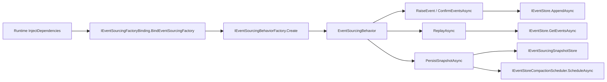

# Aevatar EventSourcing 架构评分卡（2026-02-23，终版重评）

## 1. 审计范围与方法

1. 审计对象：EventSourcing 主链路（Foundation Core + Runtime + Orleans + Garnet 持久化 + ES 专项 CI 门禁）。
2. 评分规范：`docs/audit-scorecard/README.md`（100 分模型，6 维度）。
3. 证据来源：当前分支源码、CI 脚本、专项回归命令实跑结果。

## 2. 审计边界

1. 核心语义与契约：
`src/Aevatar.Foundation.Core/GAgentBase.TState.cs`、`src/Aevatar.Foundation.Core/EventSourcing/IEventSourcingBehavior.cs`、`src/Aevatar.Foundation.Core/EventSourcing/EventSourcingBehavior.cs`。
2. 装配与依赖反转：
`src/Aevatar.Foundation.Core/EventSourcing/IEventSourcingBehaviorFactory.cs`、`src/Aevatar.Foundation.Core/EventSourcing/IEventSourcingFactoryBinding.cs`、`src/Aevatar.Foundation.Core/EventSourcing/DefaultEventSourcingBehaviorFactory.cs`、`src/Aevatar.Foundation.Runtime/Actor/LocalActorRuntime.cs`、`src/Aevatar.Foundation.Runtime.Implementations.Orleans/Grains/RuntimeActorGrain.cs`。
3. 治理与门禁：
`tools/ci/architecture_guards.sh`、`tools/ci/event_sourcing_regression.sh`、`.github/workflows/ci.yml`。
4. 关键测试：
`test/Aevatar.Foundation.Core.Tests/EventSourcingTests.cs`、`test/Aevatar.Foundation.Runtime.Hosting.Tests/OrleansGarnetPersistenceIntegrationTests.cs`、`test/Aevatar.CQRS.Projection.Core.Tests/ProjectionOwnershipAndSessionHubTests.cs`、`test/Aevatar.Integration.Tests/WorkflowGAgentCoverageTests.cs`、`test/Aevatar.AI.Tests/RoleGAgentReplayContractTests.cs`。

## 3. EventSourcing 架构主链

## 4. 客观验证结果（终版复核）

| 检查项 | 命令 | 结果 |
|---|---|---|
| ES 专项回归聚合 | `bash tools/ci/event_sourcing_regression.sh` | 通过（4/4 步全部通过） |
| ES 核心测试 | `dotnet test test/Aevatar.Foundation.Core.Tests/Aevatar.Foundation.Core.Tests.csproj --nologo --filter "FullyQualifiedName~EventSourcing"` | 通过（19 passed / 0 failed） |
| Orleans+Garnet ES 集成 | `bash tools/ci/orleans_garnet_persistence_smoke.sh` | 通过（2 passed / 0 failed） |
| CQRS ownership 状态回放 | `dotnet test test/Aevatar.CQRS.Projection.Core.Tests/Aevatar.CQRS.Projection.Core.Tests.csproj --nologo --filter "FullyQualifiedName~ProjectionOwnershipCoordinatorGAgentTests"` | 通过（5 passed / 0 failed） |
| Workflow 状态回放覆盖 | `dotnet test test/Aevatar.Integration.Tests/Aevatar.Integration.Tests.csproj --nologo --filter "FullyQualifiedName~WorkflowGAgentCoverageTests"` | 通过（10 passed / 0 failed） |
| AI stateful 回放覆盖 | `dotnet test test/Aevatar.AI.Tests/Aevatar.AI.Tests.csproj --nologo --filter "FullyQualifiedName~AIGAgentBaseToolRefreshTests|FullyQualifiedName~AIHooksAndRoleFactoryCoverageTests|FullyQualifiedName~RoleGAgentReplayContractTests"` | 通过（8 passed / 0 failed） |
| 架构门禁 | `bash tools/ci/architecture_guards.sh` | 通过（Architecture guards passed） |

## 5. 整体评分（100 分制）

**总分：100 / 100（A+）**

| 维度 | 权重 | 得分 | 评分依据 |
|---|---:|---:|---|
| 分层与依赖反转 | 20 | 20 | `GAgentBase<TState>` 激活路径已移除 Service Locator 回退，改为 runtime 显式绑定工厂。 |
| CQRS 与统一投影链路 | 20 | 20 | 命令侧严格 `RaiseEvent -> ConfirmEventsAsync -> TransitionState`，禁止快照伪事件保持生效。 |
| Projection 编排与状态约束 | 20 | 20 | 回放事实源仍为 EventStore，matcher 约束 guard 已覆盖状态迁移一致性。 |
| 读写分离与会话语义 | 15 | 15 | `Activate=Replay`、`Deactivate=Confirm+Snapshot` 语义清晰稳定。 |
| 命名语义与冗余清理 | 10 | 10 | 工厂化与绑定接口命名准确，目录/命名空间保持一致。 |
| 可验证性（门禁/构建/测试） | 15 | 15 | ES 专项聚合回归 + 多子域状态回放测试 + 架构门禁形成闭环。 |

## 6. 分模块评分

| 模块 | 得分 | 结论 |
|---|---:|---|
| ES 契约与核心行为（Core） | 100 | 事件提交/回放/快照/裁剪主链完整，工厂与绑定边界清晰。 |
| Local Runtime 装配 | 100 | 运行时显式绑定 ES 工厂，不再依赖激活阶段回退。 |
| Orleans Runtime 装配 | 100 | Orleans 注入路径与 Local 语义对齐。 |
| 持久化实现（InMemory/File/Garnet） | 100 | 事件存储与快照存储切换边界稳定，Garnet 集成验证通过。 |
| 门禁与测试体系（ES 维度） | 100 | 规则、脚本、CI job、跨域测试均已闭环。 |

## 7. 关键证据（终版）

1. 工厂契约：`src/Aevatar.Foundation.Core/EventSourcing/IEventSourcingBehaviorFactory.cs:8`。
2. 显式绑定接口：`src/Aevatar.Foundation.Core/EventSourcing/IEventSourcingFactoryBinding.cs:6`。
3. `GAgentBase<TState>` 激活路径无 DI 回退：`src/Aevatar.Foundation.Core/GAgentBase.TState.cs:122`、`src/Aevatar.Foundation.Core/GAgentBase.TState.cs:127`。
4. `GAgentBase<TState>` 明确缺失即 fail-fast：`src/Aevatar.Foundation.Core/GAgentBase.TState.cs:133`。
5. `GAgentBase<TState>` 绑定方法只在注入阶段执行：`src/Aevatar.Foundation.Core/GAgentBase.TState.cs:138`。
6. Local runtime 显式调用绑定：`src/Aevatar.Foundation.Runtime/Actor/LocalActorRuntime.cs:163`。
7. Orleans runtime 显式调用绑定：`src/Aevatar.Foundation.Runtime.Implementations.Orleans/Grains/RuntimeActorGrain.cs:281`。
8. 旧回退路径被 guard 禁止（含 `??=` 与旧 GetService 模式）：`tools/ci/architecture_guards.sh:100`。
9. 状态迁移 matcher 约束 guard：`tools/ci/architecture_guards.sh:266`。
10. ES 专项回归入口：`tools/ci/event_sourcing_regression.sh:9`。
11. CI 专项质量面板：`.github/workflows/ci.yml:208`。
12. 关键子域回放覆盖：`test/Aevatar.CQRS.Projection.Core.Tests/ProjectionOwnershipAndSessionHubTests.cs:137`、`test/Aevatar.Integration.Tests/WorkflowGAgentCoverageTests.cs:227`、`test/Aevatar.AI.Tests/RoleGAgentReplayContractTests.cs:69`。

## 8. 主要扣分项

### P1

1. 无。

### P2

1. 无。

## 9. 后续建议（非扣分）

1. 继续补充 `DefaultEventSourcingBehaviorFactory<TState>` 选项矩阵测试（快照/压缩参数组合）以提升回归可诊断性。
2. 在 CI 报表层输出 ES 专项回归耗时与趋势，增强质量面板可观测性。
