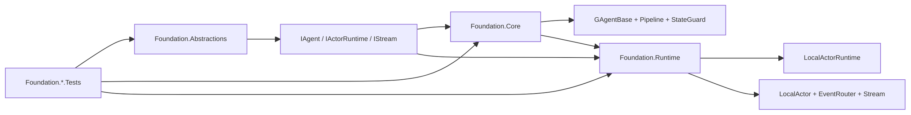

# Aevatar Foundation 子解决方案评分卡（2026-02-21）

## 1. 审计范围与方法

1. 审计对象：`aevatar.foundation.slnf`（单一子解决方案）。
2. 评分规范：`docs/audit-scorecard/README.md`（100 分模型，6 维度）。
3. 证据来源：`slnf/csproj` 依赖关系、Foundation 核心源码、测试源码、CI guard、本地命令结果。

## 2. 子解决方案组成

`aevatar.foundation.slnf` 包含 5 个项目（3 个生产项目 + 2 个测试项目）：

1. `src/Aevatar.Foundation.Abstractions/Aevatar.Foundation.Abstractions.csproj`
2. `src/Aevatar.Foundation.Core/Aevatar.Foundation.Core.csproj`
3. `src/Aevatar.Foundation.Runtime/Aevatar.Foundation.Runtime.csproj`
4. `test/Aevatar.Foundation.Abstractions.Tests/Aevatar.Foundation.Abstractions.Tests.csproj`
5. `test/Aevatar.Foundation.Core.Tests/Aevatar.Foundation.Core.Tests.csproj`

证据：`aevatar.foundation.slnf:5`、`aevatar.foundation.slnf:7`、`aevatar.foundation.slnf:9`。

## 3. 相关源码架构分析

### 3.1 分层与依赖反转

1. `Abstractions -> Core -> Runtime` 依赖方向清晰，`Core` 仅依赖抽象层，`Runtime` 组合抽象层与核心层实现。  
证据：`src/Aevatar.Foundation.Core/Aevatar.Foundation.Core.csproj:10`、`src/Aevatar.Foundation.Runtime/Aevatar.Foundation.Runtime.csproj:10`、`src/Aevatar.Foundation.Runtime/Aevatar.Foundation.Runtime.csproj:11`。
2. 契约层仅承载接口与 proto，不引入运行时实现依赖。  
证据：`src/Aevatar.Foundation.Abstractions/Aevatar.Foundation.Abstractions.csproj:12`、`src/Aevatar.Foundation.Abstractions/Aevatar.Foundation.Abstractions.csproj:22`。
3. Runtime 通过 DI 注册抽象接口，不反向污染 `Abstractions/Core`。  
证据：`src/Aevatar.Foundation.Runtime/DependencyInjection/ServiceCollectionExtensions.cs:45`、`src/Aevatar.Foundation.Runtime/DependencyInjection/ServiceCollectionExtensions.cs:48`、`src/Aevatar.Foundation.Runtime/DependencyInjection/ServiceCollectionExtensions.cs:56`。

### 3.2 CQRS 与统一投影链路（Foundation 侧职责）

1. Foundation 提供统一事件传输契约：`IAgent.HandleEventAsync(EventEnvelope)`、`IEventPublisher`、`IStreamProvider`。  
证据：`src/Aevatar.Foundation.Abstractions/IAgent.cs:19`、`src/Aevatar.Foundation.Abstractions/IEventPublisher.cs:17`、`src/Aevatar.Foundation.Abstractions/IStreamProvider.cs:14`。
2. 路由实现统一由 `LocalActorPublisher + EventRouter` 承载，事件方向语义（`Self/Up/Down/Both`）单轨执行。  
证据：`src/Aevatar.Foundation.Runtime/Actor/LocalActorPublisher.cs:36`、`src/Aevatar.Foundation.Runtime/Actor/LocalActorPublisher.cs:63`、`src/Aevatar.Foundation.Runtime/Routing/EventRouter.cs:46`、`src/Aevatar.Foundation.Runtime/Routing/EventRouter.cs:56`。
3. `EventEnvelope` 结构与 `EventDirection` 枚举在契约层有测试回归保障。  
证据：`test/Aevatar.Foundation.Abstractions.Tests/EventEnvelopeTests.cs:12`、`test/Aevatar.Foundation.Abstractions.Tests/EventEnvelopeTests.cs:57`。

### 3.3 编排与状态约束

1. Actor 运行时事实状态由 `LocalActorRuntime` 统一承载（`_actors`），符合“运行态由 Actor/Runtime 持有”的约束。  
证据：`src/Aevatar.Foundation.Runtime/Actor/LocalActorRuntime.cs:21`、`src/Aevatar.Foundation.Runtime/Actor/LocalActorRuntime.cs:57`。
2. `LocalActor` 通过 mailbox（`SemaphoreSlim`）确保串行处理，避免并发写态冲突。  
证据：`src/Aevatar.Foundation.Runtime/Actor/LocalActor.cs:13`、`src/Aevatar.Foundation.Runtime/Actor/LocalActor.cs:116`、`src/Aevatar.Foundation.Runtime/Actor/LocalActor.cs:119`。
3. 状态写保护由 `StateGuard` 的 `AsyncLocal` scope 强约束，只允许在事件处理/激活等写作用域修改。  
证据：`src/Aevatar.Foundation.Core/StateGuard.cs:14`、`src/Aevatar.Foundation.Core/StateGuard.cs:23`、`src/Aevatar.Foundation.Core/GAgentBase.TState.cs:24`。
4. 对应约束有单测覆盖（写保护、路由、运行时 link/restore）。  
证据：`test/Aevatar.Foundation.Core.Tests/StateGuardTests.cs:34`、`test/Aevatar.Foundation.Core.Tests/EventRouterTests.cs:90`、`test/Aevatar.Foundation.Core.Tests/RuntimeAndContextTests.cs:116`、`test/Aevatar.Foundation.Core.Tests/RuntimeAndContextTests.cs:133`。

### 3.4 读写分离与会话语义（Foundation 层）

1. 写侧语义以事件驱动为核心：`GAgentBase.HandleEventAsync` 合并静态 handler 与动态模块统一执行。  
证据：`src/Aevatar.Foundation.Core/GAgentBase.cs:93`、`src/Aevatar.Foundation.Core/GAgentBase.cs:101`、`src/Aevatar.Foundation.Core/Pipeline/EventPipelineBuilder.cs:16`。
2. 事件上下文（`_activeInboundEnvelope`）在 publish/send 时被显式透传，保持调用链会话关联。  
证据：`src/Aevatar.Foundation.Core/GAgentBase.cs:32`、`src/Aevatar.Foundation.Core/GAgentBase.cs:227`、`src/Aevatar.Foundation.Core/GAgentBase.cs:232`。
3. 运行时链路中的 parent/child 会话关系由 link/unlink 与 stream 订阅控制，不依赖 Host 层临时拼装。  
证据：`src/Aevatar.Foundation.Runtime/Actor/LocalActorRuntime.cs:94`、`src/Aevatar.Foundation.Runtime/Actor/LocalActor.cs:73`、`src/Aevatar.Foundation.Runtime/Actor/LocalActor.cs:99`。

### 3.5 命名语义与冗余清理

1. 项目名、AssemblyName、RootNamespace 一致。  
证据：`src/Aevatar.Foundation.Abstractions/Aevatar.Foundation.Abstractions.csproj:7`、`src/Aevatar.Foundation.Core/Aevatar.Foundation.Core.csproj:6`、`src/Aevatar.Foundation.Runtime/Aevatar.Foundation.Runtime.csproj:6`。
2. 目录与职责语义一致：`Abstractions`（契约）、`Core`（编排内核）、`Runtime`（运行时实现）。

### 3.6 子解结构图

## 4. 客观验证结果

| 检查项 | 命令 | 结果 |
|---|---|---|
| 子解构建 | `dotnet build aevatar.foundation.slnf --nologo --no-restore --tl:off -m:1 -p:UseSharedCompilation=false -p:NuGetAudit=false` | 通过（0 warning / 0 error） |
| 子解测试 | `dotnet test aevatar.foundation.slnf --nologo --tl:off -m:1 -p:UseSharedCompilation=false -p:NuGetAudit=false --no-restore` | 通过（`96 passed / 0 failed`） |
| 架构门禁 | `bash tools/ci/architecture_guards.sh` | 通过（diff mode: worktree） |
| 分片构建门禁 | `bash tools/ci/solution_split_guards.sh` | 通过 |
| 分片测试门禁 | `bash tools/ci/solution_split_test_guards.sh` | 通过（Foundation 分片 `96 passed / 0 failed`） |
| 覆盖率采集 | `dotnet test aevatar.foundation.slnf ... --collect:"XPlat Code Coverage"` | 行覆盖率 `44.13%`，分支覆盖率 `34.35%` |

覆盖率证据：`test/Aevatar.Foundation.Abstractions.Tests/TestResults/4ba21e4f-c0e4-483f-9931-5ed5c3728c3d/coverage.cobertura.xml:2`、`test/Aevatar.Foundation.Core.Tests/TestResults/510ce2db-0ffc-4496-9ad8-87adc75f6676/coverage.cobertura.xml:2`。

## 5. 评分结果（100 分制）

**总分：99 / 100（A+）**

| 维度 | 权重 | 得分 | 说明 |
|---|---:|---:|---|
| 分层与依赖反转 | 20 | 20 | `Abstractions -> Core -> Runtime` 依赖方向清晰，无反向耦合。 |
| CQRS 与统一投影链路 | 20 | 20 | 统一 `EventEnvelope + Stream + Direction` 主链路，未出现双轨消息通道。 |
| Projection 编排与状态约束 | 20 | 20 | Actor/Runtime 承载运行态，mailbox 串行与 StateGuard 约束完整。 |
| 读写分离与会话语义 | 15 | 15 | 事件驱动写侧与上下文传播语义清晰，会话关系由 runtime 显式管理。 |
| 命名语义与冗余清理 | 10 | 10 | 项目命名、命名空间、目录职责一致。 |
| 可验证性（门禁/构建/测试） | 15 | 14 | build/test/guards 全绿，覆盖率表现较好；但测试门禁仍未纳入覆盖率阈值。 |

## 6. 主要扣分项（按影响度）

### P1

1. 暂无 P1 阻断项。

### P2

1. 当前分片测试门禁只执行 `dotnet test`，尚未包含覆盖率阈值判定，存在后续覆盖率回落风险。  
证据：`tools/ci/solution_split_test_guards.sh:40`。

## 7. 改进建议（优先级）

1. P2：为 `aevatar.foundation.slnf` 增加 line/branch 覆盖率最低阈值门禁（建议纳入 `solution_split_test_guards.sh` 或独立 guard）。
2. P2：为 `LocalActorRuntime` 的恢复与销毁路径补充故障注入测试（manifest/store 异常场景），增强回归鲁棒性。
