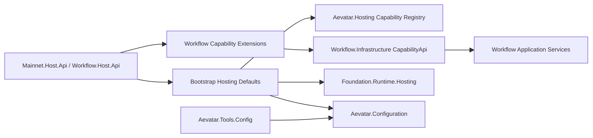

# Aevatar Hosting 子解决方案评分卡（2026-02-21）

## 1. 审计范围与方法

1. 审计对象：`aevatar.hosting.slnf`（单一子解决方案）。
2. 评分规范：`docs/audit-scorecard/README.md`（100 分模型，6 维度）。
3. 证据来源：`slnf/csproj`、Host 入口与能力装配源码、架构门禁脚本、本地构建测试命令结果。

## 2. 子解决方案组成

`aevatar.hosting.slnf` 包含 13 个项目（10 个生产项目 + 3 个测试项目）：

1. `src/Aevatar.Configuration/Aevatar.Configuration.csproj`
2. `src/Aevatar.Hosting/Aevatar.Hosting.csproj`
3. `src/Aevatar.Foundation.Runtime.Hosting/Aevatar.Foundation.Runtime.Hosting.csproj`
4. `src/Aevatar.Bootstrap/Aevatar.Bootstrap.csproj`
5. `src/Aevatar.Bootstrap.Extensions.AI/Aevatar.Bootstrap.Extensions.AI.csproj`
6. `src/Aevatar.Mainnet.Host.Api/Aevatar.Mainnet.Host.Api.csproj`
7. `src/workflow/extensions/Aevatar.Workflow.Extensions.AIProjection/Aevatar.Workflow.Extensions.AIProjection.csproj`
8. `src/workflow/extensions/Aevatar.Workflow.Extensions.Hosting/Aevatar.Workflow.Extensions.Hosting.csproj`
9. `src/workflow/Aevatar.Workflow.Host.Api/Aevatar.Workflow.Host.Api.csproj`
10. `tools/Aevatar.Tools.Config/Aevatar.Tools.Config.csproj`
11. `test/Aevatar.Hosting.Tests/Aevatar.Hosting.Tests.csproj`
12. `test/Aevatar.Foundation.Runtime.Hosting.Tests/Aevatar.Foundation.Runtime.Hosting.Tests.csproj`
13. `test/Aevatar.Bootstrap.Tests/Aevatar.Bootstrap.Tests.csproj`

证据：`aevatar.hosting.slnf:4`、`aevatar.hosting.slnf:17`。

## 3. 相关源码架构分析

### 3.1 分层与依赖反转

1. 宿主抽象与能力注册解耦：`Aevatar.Hosting` 只定义 capability 注册与路由挂载抽象，不承载业务实现。  
证据：`src/Aevatar.Hosting/Aevatar.Hosting.csproj:10`、`src/Aevatar.Hosting/AevatarCapabilityHostExtensions.cs:10`、`src/Aevatar.Hosting/AevatarCapabilityHostExtensions.cs:47`。
2. 运行时宿主层通过 `Foundation.Runtime.Hosting` 进行 provider 适配，避免 Host 直接拼装 runtime 细节。  
证据：`src/Aevatar.Foundation.Runtime.Hosting/DependencyInjection/ServiceCollectionExtensions.cs:10`、`src/Aevatar.Foundation.Runtime.Hosting/DependencyInjection/ServiceCollectionExtensions.cs:26`。
3. `Bootstrap` 只做组合注册（Config + Runtime + Connector Builders），符合“协议/组合在 Host，业务在能力层”。  
证据：`src/Aevatar.Bootstrap/ServiceCollectionExtensions.cs:12`、`src/Aevatar.Bootstrap/ServiceCollectionExtensions.cs:17`、`src/Aevatar.Bootstrap/Aevatar.Bootstrap.csproj:10`。

### 3.2 CQRS 与统一投影链路（宿主接入）

1. 两个 Host 入口均采用统一默认接入方式：`AddAevatarDefaultHost(...) + UseAevatarDefaultHost()`。  
证据：`src/Aevatar.Mainnet.Host.Api/Program.cs:7`、`src/Aevatar.Mainnet.Host.Api/Program.cs:18`、`src/workflow/Aevatar.Workflow.Host.Api/Program.cs:17`、`src/workflow/Aevatar.Workflow.Host.Api/Program.cs:27`。
2. 两个 Host 均走 `AddWorkflowCapabilityWithAIDefaults()`，把 Workflow capability + AI features + AI projection extension 统一装配到同一链路。  
证据：`src/Aevatar.Mainnet.Host.Api/Program.cs:13`、`src/workflow/Aevatar.Workflow.Host.Api/Program.cs:23`、`src/workflow/extensions/Aevatar.Workflow.Extensions.Hosting/WorkflowCapabilityHostBuilderExtensions.cs:10`、`src/workflow/extensions/Aevatar.Workflow.Extensions.Hosting/WorkflowCapabilityHostBuilderExtensions.cs:24`。
3. Mainnet 通过插件化方式挂载 Maker（`AddWorkflowMakerExtensions`），符合“单主链 + 插件扩展”。  
证据：`src/Aevatar.Mainnet.Host.Api/Program.cs:14`、`docs/CQRS_ARCHITECTURE.md:67`。

### 3.3 Projection 编排与状态约束（宿主侧合规）

1. Workflow capability 通过 `AddAevatarCapability` 注册和 `MapWorkflowCapabilityEndpoints` 挂载，避免宿主重复端点实现。  
证据：`src/workflow/Aevatar.Workflow.Infrastructure/CapabilityApi/WorkflowCapabilityHostBuilderExtensions.cs:14`、`src/workflow/Aevatar.Workflow.Infrastructure/CapabilityApi/ChatEndpoints.cs:13`。
2. 默认 Host 启动时仅注入通用 hosted service（connector bootstrap / actor restore），不在 Program 中持有流程事实态。  
证据：`src/Aevatar.Bootstrap/Hosting/WebApplicationBuilderExtensions.cs:46`、`src/Aevatar.Bootstrap/Hosting/WebApplicationBuilderExtensions.cs:49`、`src/Aevatar.Bootstrap/Hosting/ActorRestoreHostedService.cs:24`。
3. 架构门禁对 Host 接入与禁止项有硬约束（必须默认 Host 装配、禁止 AddMakerCapability、禁止 Host/Infrastructure 直接 `AddCqrsCore`）。  
证据：`tools/ci/architecture_guards.sh:150`、`tools/ci/architecture_guards.sh:160`、`tools/ci/architecture_guards.sh:170`、`tools/ci/architecture_guards.sh:205`。

### 3.4 读写分离与会话语义

1. Workflow capability endpoint 分离命令与查询职责：`POST /chat` 调命令服务，`GET /agents|/workflows|/actors/*` 调查询服务。  
证据：`src/workflow/Aevatar.Workflow.Infrastructure/CapabilityApi/ChatEndpoints.cs:17`、`src/workflow/Aevatar.Workflow.Infrastructure/CapabilityApi/ChatEndpoints.cs:31`、`src/workflow/Aevatar.Workflow.Infrastructure/CapabilityApi/ChatQueryEndpoints.cs:12`、`src/workflow/Aevatar.Workflow.Infrastructure/CapabilityApi/ChatQueryEndpoints.cs:27`。
2. WebSocket 路径与 SSE 路径都通过同一 command execution 服务进入应用层，不在 Host 程序内拼业务状态机。  
证据：`src/workflow/Aevatar.Workflow.Infrastructure/CapabilityApi/ChatEndpoints.cs:152`、`src/workflow/Aevatar.Workflow.Infrastructure/CapabilityApi/ChatEndpoints.cs:184`。

### 3.5 命名语义与冗余清理

1. 项目名、AssemblyName、RootNamespace 一致。  
证据：`src/Aevatar.Hosting/Aevatar.Hosting.csproj:6`、`src/Aevatar.Bootstrap/Aevatar.Bootstrap.csproj:6`、`src/workflow/Aevatar.Workflow.Host.Api/Aevatar.Workflow.Host.Api.csproj:6`。
2. 能力扩展命名语义明确：`Aevatar.Workflow.Extensions.Hosting` 与 `Aevatar.Workflow.Extensions.AIProjection` 分别承担宿主装配与投影扩展职责。  
证据：`src/workflow/extensions/Aevatar.Workflow.Extensions.Hosting/Aevatar.Workflow.Extensions.Hosting.csproj:6`、`src/workflow/extensions/Aevatar.Workflow.Extensions.AIProjection/Aevatar.Workflow.Extensions.AIProjection.csproj:6`。

### 3.6 子解结构图

## 4. 客观验证结果

| 检查项 | 命令 | 结果 |
|---|---|---|
| 子解构建 | `dotnet build aevatar.hosting.slnf --nologo --no-restore --tl:off -m:1 -p:UseSharedCompilation=false -p:NuGetAudit=false` | 通过（0 warning / 0 error） |
| 子解测试 | `dotnet test aevatar.hosting.slnf --nologo --tl:off -m:1 -p:UseSharedCompilation=false -p:NuGetAudit=false --no-restore` | 通过（`11 passed / 0 failed`） |
| 架构门禁 | `bash tools/ci/architecture_guards.sh` | 通过（diff mode: worktree） |
| 分片构建门禁 | `bash tools/ci/solution_split_guards.sh` | 通过（含 hosting 分片） |
| 分片测试门禁 | `bash tools/ci/solution_split_test_guards.sh` | 通过（含 hosting 分片） |
| 覆盖率采集 | `dotnet test aevatar.hosting.slnf ... --collect:"XPlat Code Coverage"` | 行覆盖率 `6.23%`，分支覆盖率 `3.41%` |

覆盖率证据：`test/Aevatar.Bootstrap.Tests/TestResults/93f32a7f-ca69-4fa0-95c1-aa891c879689/coverage.cobertura.xml:2`、`test/Aevatar.Hosting.Tests/TestResults/7e225c61-209d-4bf8-8044-76aa905383c4/coverage.cobertura.xml:2`、`test/Aevatar.Foundation.Runtime.Hosting.Tests/TestResults/c26dbc9d-67e4-47f7-b9d8-bb3aae572b04/coverage.cobertura.xml:2`。

## 5. 评分结果（100 分制）

**总分：97 / 100（A+）**

| 维度 | 权重 | 得分 | 说明 |
|---|---:|---:|---|
| 分层与依赖反转 | 20 | 20 | 宿主抽象、运行时宿主、Bootstrap 组合分层清晰。 |
| CQRS 与统一投影链路 | 20 | 20 | 两个 Host 统一按默认 Host + Workflow capability + AI defaults 装配。 |
| Projection 编排与状态约束 | 20 | 20 | 端点挂载与能力注册由扩展层统一管理，门禁约束完整。 |
| 读写分离与会话语义 | 15 | 15 | 命令与查询职责在 capability API 层分离，Host 入口保持薄层。 |
| 命名语义与冗余清理 | 10 | 10 | 命名语义一致，扩展职责明确，无重复 Host 入口实现。 |
| 可验证性（门禁/构建/测试） | 15 | 12 | build/test/guard 全绿，hosting 子解已纳入分片测试门禁，但覆盖率仍偏低。 |

## 6. 主要扣分项（按影响度）

### P1

1. 暂无 P1 阻断项。

### P2

1. hosting 子解当前覆盖率仍偏低（行 6.23%，分支 3.41%），对子系统回归风险的量化覆盖不足。  
证据：`test/Aevatar.Bootstrap.Tests/TestResults/93f32a7f-ca69-4fa0-95c1-aa891c879689/coverage.cobertura.xml:2`、`test/Aevatar.Hosting.Tests/TestResults/7e225c61-209d-4bf8-8044-76aa905383c4/coverage.cobertura.xml:2`、`test/Aevatar.Foundation.Runtime.Hosting.Tests/TestResults/c26dbc9d-67e4-47f7-b9d8-bb3aae572b04/coverage.cobertura.xml:2`。
2. 当前新增测试以宿主装配与扩展注册为主，Host API 端到端行为（HTTP/SSE/WS）仍依赖 workflow 侧测试覆盖。  
证据：`test/Aevatar.Bootstrap.Tests/BootstrapServiceCollectionExtensionsTests.cs:55`、`test/Aevatar.Hosting.Tests/AevatarCapabilityHostExtensionsTests.cs:57`。

## 7. 改进建议（优先级）

1. P2：为 `Mainnet.Host.Api` 与 `Workflow.Host.Api` 增加最小端到端 smoke tests（能力挂载、`/` 健康检查、关键 API 路由存在性）。
2. P2：在 `aevatar.hosting.slnf` 测试流水线上增加覆盖率阈值门禁（line/branch 双阈值）。
3. P2：补充 `Aevatar.Bootstrap.Extensions.AI` 的装配失败路径测试（provider key 缺失、connector 构建失败）以提升异常分支覆盖。
