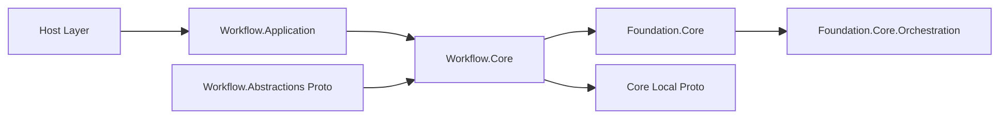
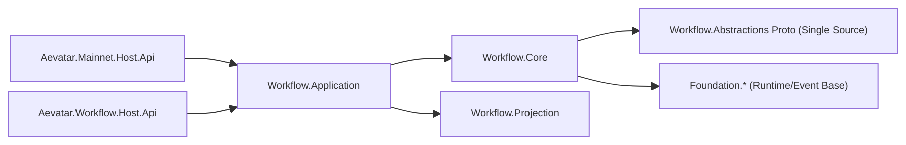
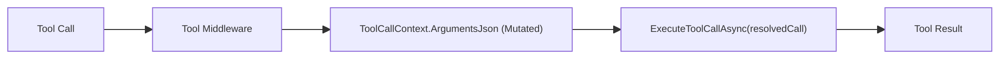

# Merge `origin/dev` 架构评分审计（复审，2026-02-21）

## 1. 审计结论

- 结论：`PASS`
- 审计对象：`merge/dev-integration` 上的 merge 结果（`1a437bc`）
- 审计基线：`704479753655800080fee5787922d339f68ce4e5`（merge commit 第一父提交）
- 审计范围：`git diff --name-status 704479753655800080fee5787922d339f68ce4e5..1a437bc`（24 文件：`15A/8M/1D`）
- 验证状态：
  - `dotnet build aevatar.slnx --nologo`：通过
  - `dotnet test aevatar.slnx --nologo`：通过
  - `bash tools/ci/architecture_guards.sh`：通过

## 2. 评分结果（100 分）

- 总分：`95 / 100`（通过）

| 维度 | 权重 | 得分 | 说明 |
|---|---:|---:|---|
| 合并完整性与可构建性 | 20 | 20 | 冲突已清零，`slnx` 可构建。 |
| 分层与依赖反转 | 20 | 18 | Host 拓扑收敛，Foundation 未再引入编排语义。 |
| 事件契约一致性 | 20 | 19 | Workflow Core 平行 proto 已移除，契约源收敛。 |
| 并发与隔离正确性 | 20 | 19 | 本次增量无跨 run pending map 路径引入。 |
| 扩展性与 OCP | 20 | 19 | Middleware 与可观测性扩展点清晰，且补了回归测试。 |

## 3. 发现列表（按严重级别）

### P1（阻断）

1. 未发现。

### P2（需修复）

1. 未发现。

### P3（改进项）

1. 未发现。

## 4. 已关闭问题（相对上一版审计）

1. `ToolCallLoop` 参数重写失效问题已修复：
   - `src/Aevatar.AI.Core/Tools/ToolCallLoop.cs:108`
   - 执行时使用 `ToolCallContext.ArgumentsJson` 构建 `ToolCall`，非原始 `call`。
2. 回归测试已补齐：
   - `test/Aevatar.AI.Tests/ToolCallLoopTests.cs:161`
3. Host 拓扑回摆风险已收敛：
   - `aevatar.slnx:41` 保留 `Aevatar.Mainnet.Host.Api`。
4. Foundation 编排语义污染已移除：
   - `src/Aevatar.Foundation.Core/Orchestration/*` 不存在。
5. Workflow Core 平行 proto 已移除：
   - `src/workflow/Aevatar.Workflow.Core/cognitive_messages.proto` 不存在。
6. `ProjectionOwnershipProtoCoverageTests` 的 `CS8602` 可空警告已修复：
   - `test/Aevatar.CQRS.Projection.Core.Tests/ProjectionOwnershipProtoCoverageTests.cs:101`

## 5. 架构图（复审）

### 5.1 变更前（问题态）

### 5.2 变更后（收敛态）

### 5.3 风险路径（已修复）

## 6. 门禁与验收命令

1. `dotnet build aevatar.slnx --nologo`
2. `dotnet test aevatar.slnx --nologo`
3. `bash tools/ci/architecture_guards.sh`
4. `git diff --name-only --diff-filter=U`（应为空）

## 7. 审计说明

- 是否发现增量阻断缺陷：否
- 残余风险：未发现阻断级残余风险
- 测试空白：本次增量未发现新的关键路径测试空白
