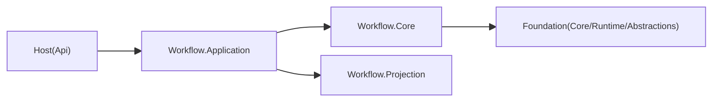
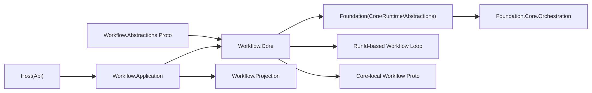
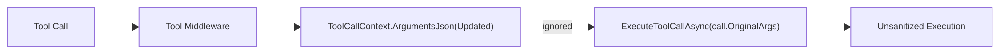

# Merge `origin/dev` 架构评分审计（2026-02-21）

## 1. 审计结论

- 结论：`BLOCK`
- 审计对象：`merge/dev-integration` 分支合并 `origin/dev` 的增量
- 审计基线：`c2daa3229f9730f5b4171a30151e479c9307a503`
- 审计范围：`git diff --name-status HEAD...origin/dev`（59 文件：`34A/20M/5D`）
- 当前状态：存在 12 个未解决冲突，`dotnet build aevatar.slnx --nologo` 失败

## 2. 评分结果（100 分）

- 总分：`58 / 100`（不通过）

| 维度 | 权重 | 得分 | 说明 |
|---|---:|---:|---|
| 合并完整性与可构建性 | 20 | 0 | `aevatar.slnx` 含冲突标记，构建阻断。 |
| 分层与依赖反转 | 20 | 14 | Foundation 层引入编排语义，边界收敛被削弱。 |
| 事件契约一致性 | 20 | 13 | Workflow 事件契约出现双源与语义分叉。 |
| 并发与隔离正确性 | 20 | 15 | Human 模块 pending key 设计有跨 run 串扰风险。 |
| 扩展性与 OCP | 20 | 16 | 核心主链可扩展，但并行编排模型增加认知与维护成本。 |

## 3. 发现列表（按严重级别）

### P1（阻断）

1. 合并结果不可构建（slnx 冲突未解）
   - 位置：`aevatar.slnx`
   - 现象：存在冲突标记，`dotnet build` 报 XML 解析错误。
   - 影响：CI 与本地构建全部阻断，无法验收后续改动。
   - 修复要求：先完成冲突消解并恢复可解析 `.slnx`。
   - 验收标准：`dotnet build aevatar.slnx --nologo` 通过。

2. Tool middleware 参数重写未生效
   - 位置：`src/Aevatar.AI.Core/Tools/ToolCallLoop.cs:103`, `src/Aevatar.AI.Core/Tools/ToolCallLoop.cs:110`（incoming `origin/dev`）
   - 现象：`ToolCallContext.ArgumentsJson` 可被中间件修改，但执行仍使用原始 `call`。
   - 影响：校验/规范化/策略中间件被绕过。
   - 修复要求：工具执行必须使用 middleware 更新后的参数。
   - 验收标准：新增测试覆盖“middleware 改参后实际生效”。

3. Human-in-the-loop pending 按 `StepId` 键控导致跨 run 串扰
   - 位置：`src/workflow/Aevatar.Workflow.Core/Modules/HumanApprovalModule.cs:20`, `src/workflow/Aevatar.Workflow.Core/Modules/HumanApprovalModule.cs:48`, `src/workflow/Aevatar.Workflow.Core/Modules/HumanApprovalModule.cs:69`
   - 位置：`src/workflow/Aevatar.Workflow.Core/Modules/HumanInputModule.cs:20`, `src/workflow/Aevatar.Workflow.Core/Modules/HumanInputModule.cs:49`, `src/workflow/Aevatar.Workflow.Core/Modules/HumanInputModule.cs:73`
   - 现象：pending map 仅使用 `StepId`，并发 run 同 step id 可覆盖/误恢复。
   - 影响：错误 run 被恢复、状态串线、流程悬挂。
   - 修复要求：pending key 至少包含 `runId + stepId`。
   - 验收标准：并发双 run 同 stepId 测试通过且无串扰。

### P2（需修复）

1. Workflow 事件契约双源分叉
   - 位置：`src/workflow/Aevatar.Workflow.Abstractions/workflow_execution_messages.proto:5`
   - 位置：`src/workflow/Aevatar.Workflow.Core/cognitive_messages.proto:5`
   - 现象：同名事件在 Abstractions 与 Core 两套 proto 并存，字段语义不同（是否带 `run_id`）。
   - 影响：契约真源不唯一，跨层映射复杂度和回归概率上升。
   - 修复要求：统一单一事件契约源，Core 不再维护平行消息定义。
   - 验收标准：仅保留一套 workflow 事件 proto，生成类型无重复语义。

2. Foundation 层新增编排能力与 Workflow 编排重叠
   - 位置：`src/Aevatar.Foundation.Core/Orchestration/IOrchestration.cs:1`
   - 位置：`src/workflow/Aevatar.Workflow.Core/Modules/WorkflowLoopModule.cs:18`
   - 现象：`Foundation.Core` 引入 MAF 风格编排模式，与 `Workflow.Core` 模块编排并行。
   - 影响：基础层语义污染，形成双轨编排模型，边界变模糊。
   - 修复要求：迁出 Foundation 主干（扩展层）或删除未落地主链能力。
   - 验收标准：Foundation 仅保留 runtime/event 基础能力。

3. 主机拓扑语义回摆风险
   - 位置：`aevatar.slnx:37`（incoming 为 `Aevatar.Host.Api`）
   - 现象：与当前 `Aevatar.Mainnet.Host.Api` 主机语义冲突，存在回退旧 host 路径趋势。
   - 影响：宿主边界与部署入口不稳定，文档/CI/运维口径难统一。
   - 修复要求：以单一主 host 口径收敛解决方案清单。
   - 验收标准：`slnx` 仅保留目标主机入口并通过构建。

## 4. 架构图（合并前/候选后/风险路径）

### 4.1 合并前（当前主线）

### 4.2 合并候选后（origin/dev 引入）

### 4.3 风险路径（关键）

## 5. 门禁与验收命令

1. `git diff --name-only --diff-filter=U` 必须为空
2. `dotnet build aevatar.slnx --nologo`
3. `dotnet test aevatar.slnx --nologo`
4. `bash tools/ci/architecture_guards.sh`

## 6. 审计说明

- 是否发现增量缺陷：是（P1/P2 均存在）
- 残余风险：run 语义回摆（`runId`）与 Foundation 层职责扩散
- 测试空白：缺少“并发同 stepId 人工恢复隔离”与“middleware 改参生效”门禁测试
