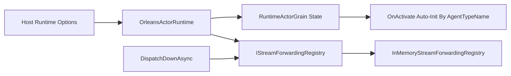
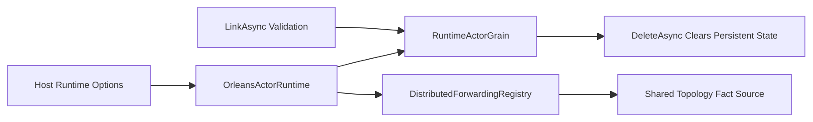
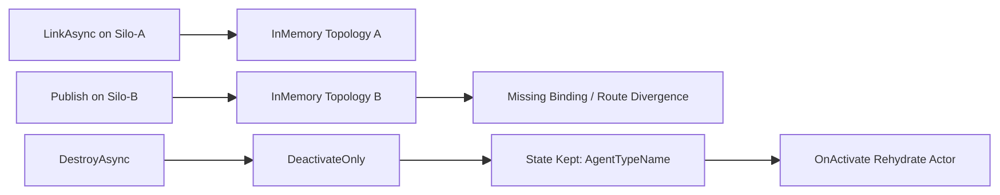

# Orleans 相关架构完整审计评分卡（2026-02-22）

## 1. 审计结论

- 结论：`BLOCK`
- 审计对象：`Aevatar.Foundation.Runtime.Implementations.Orleans` + `Aevatar.Foundation.Runtime.Hosting`（Orleans 装配入口）
- 审计基线：`HEAD`（全量现状审计，不限定 PR 增量）
- 审计范围：
- `src/Aevatar.Foundation.Runtime.Implementations.Orleans/*.cs`（23 个 C# 文件）
- `src/Aevatar.Foundation.Runtime.Hosting/DependencyInjection/ServiceCollectionExtensions.cs`
- `test/Aevatar.Foundation.Runtime.Hosting.Tests/*Orleans*Tests.cs` + 相关运行时测试（27 个测试）
- 审计时间：`2026-02-22 18:03 +0800`

## 2. 综合评分

- 综合分：`72 / 100`
- 等级：`C`

| 维度 | 权重 | 得分 | 说明 |
|---|---:|---:|---|
| 分层与依赖反转 | 20 | 19 | Orleans 实现保持在 Foundation Runtime Implementation 层，Host 仅做 provider/transport 组合。 |
| 状态权威与分布式一致性 | 25 | 13 | 关键转发拓扑依赖进程内 `InMemoryStreamForwardingRegistry`，不满足多节点事实源唯一性。 |
| Actor 生命周期正确性 | 20 | 10 | `DestroyAsync` 未清理 Grain 持久态，已销毁 Actor 可被再次激活。 |
| 读写分离与事件传播语义 | 15 | 12 | 事件传播链路完整，但 `LinkAsync` 对未初始化 actor 缺少防御校验。 |
| 可验证性（门禁/测试） | 20 | 18 | build/test/guards 通过；但 Kafka+Orleans 端到端生产语义测试缺失。 |

## 3. 发现列表（按严重级别）

### P1（阻断）

1. Destroy 语义不闭环：仅停用激活实例，未删除 Grain 持久态
- 位置：`src/Aevatar.Foundation.Runtime.Implementations.Orleans/Actors/OrleansActorRuntime.cs:77`
- 位置：`src/Aevatar.Foundation.Runtime.Implementations.Orleans/Actors/OrleansActorRuntime.cs:80`
- 位置：`src/Aevatar.Foundation.Runtime.Implementations.Orleans/Grains/RuntimeActorGrain.cs:35`
- 位置：`src/Aevatar.Foundation.Runtime.Implementations.Orleans/Grains/RuntimeActorGrain.cs:143`
- 现象：`DestroyAsync` 调用 `DeactivateAsync()` 后只删 manifest，不清空 Grain `AgentTypeName/Children/Parent` 持久态；而 Grain 激活时会根据已有 `AgentTypeName` 自动重新初始化 agent。
- 影响：已“销毁”的 actor 在后续访问/消息触发时可被复活，生命周期语义被破坏，可能产生幽灵实例与重复业务副作用。
- 修复要求：新增 grain 级 `DeleteAsync/PurgeAsync`（执行 `_state.ClearStateAsync()` 或等效字段清空并落盘），`DestroyAsync` 改为“先清状态再 Deactivate”。
- 验收标准：新增集成测试验证 `DestroyAsync -> ExistsAsync` 连续多次调用均为 `false`，且发送消息不会重新激活已销毁 actor。

2. Orleans 分布式路径的拓扑事实态落在进程内 InMemory 注册表
- 位置：`src/Aevatar.Foundation.Runtime.Implementations.Orleans/DependencyInjection/ServiceCollectionExtensions.cs:30`
- 位置：`src/Aevatar.Foundation.Runtime/Streaming/InMemoryStreamForwardingRegistry.cs:15`
- 位置：`src/Aevatar.Foundation.Runtime.Implementations.Orleans/Actors/OrleansActorRuntime.cs:104`
- 位置：`src/Aevatar.Foundation.Runtime.Implementations.Orleans/Actors/OrleansGrainEventPublisher.cs:118`
- 现象：Orleans provider 默认将 `IStreamForwardingRegistry` 绑定为进程内 `ConcurrentDictionary` 实现；`LinkAsync` 写入该注册表，`DispatchDownAsync` 读取同一注册表路由传播。
- 影响：多 Silo/多进程时拓扑状态不一致，跨节点传播可能丢路由或行为分叉，不满足“跨节点事实源唯一”约束。
- 修复要求：Orleans provider 默认改为分布式/持久化 `IStreamForwardingRegistry`（如 Grain-backed 或外部分布式状态），InMemory 仅限显式 dev/test 开关。
- 验收标准：双 Silo 集成测试中，在 Silo-A 建链、Silo-B 发事件仍可稳定按拓扑传播；单节点重启后拓扑不丢失。

### P2（需修复）

1. `LinkAsync` 未校验 parent/child 是否已初始化，可能创建无效拓扑
- 位置：`src/Aevatar.Foundation.Runtime.Implementations.Orleans/Actors/OrleansActorRuntime.cs:99`
- 位置：`src/Aevatar.Foundation.Runtime.Implementations.Orleans/Actors/OrleansActorRuntime.cs:102`
- 位置：`src/Aevatar.Foundation.Runtime.Implementations.Orleans/Grains/RuntimeActorGrain.cs:91`
- 位置：`src/Aevatar.Foundation.Runtime.Implementations.Orleans/Grains/RuntimeActorGrain.cs:110`
- 位置：`src/Aevatar.Foundation.Runtime.Implementations.Orleans/Grains/RuntimeActorGrain.cs:70`
- 现象：`LinkAsync` 直接操作 grain 拓扑状态，不校验 `IsInitializedAsync()`；拼错或未创建的 ID 也可建立父子关系。
- 影响：后续事件投递至未初始化 actor 将触发 `Grain agent is not initialized.` 异常，产生运行期不确定失败。
- 修复要求：`LinkAsync` 前强制校验 parent/child 均已初始化，不满足时抛显式异常并拒绝落盘拓扑。
- 验收标准：新增单元/集成测试覆盖“未初始化 link 拒绝且无状态污染”。

### P3（改进项）

1. Kafka transport 缺少真实 broker + Orleans 多节点端到端回归
- 位置：`test/Aevatar.Foundation.Runtime.Hosting.Tests/OrleansKafkaTransportServiceCollectionExtensionsTests.cs:10`
- 位置：`test/Aevatar.Foundation.Runtime.Hosting.Tests/OrleansActorTransportDispatchTests.cs:12`
- 现象：当前覆盖主要是 DI 注册与内存替身 sender 路径；`test/Aevatar.Integration.Tests` 与 `test/Aevatar.Workflow.Host.Api.Tests` 无 Orleans Kafka 关键字命中（`rg` 为空）。
- 影响：重平衡、重试、重复投递、顺序语义等生产风险无自动化证据。
- 修复建议：引入 Testcontainers（Kafka + 2 Silo）端到端测试，覆盖 remote dispatch、重复消息去重、消费异常重试。

## 4. 架构图（当前/目标/风险路径）

### 4.1 当前实现（问题态）

### 4.2 目标实现（修复后）

### 4.3 风险路径

## 5. 门禁与验证命令（实测）

- `dotnet build aevatar.slnx --nologo --no-restore -m:1 -nodeReuse:false --tl:off`：通过（0 warning / 0 error）
- `dotnet test test/Aevatar.Foundation.Runtime.Hosting.Tests/Aevatar.Foundation.Runtime.Hosting.Tests.csproj --nologo --no-build --no-restore -m:1 -nodeReuse:false --tl:off`：通过（27/27）
- `bash tools/ci/architecture_guards.sh`：通过
- `bash tools/ci/projection_route_mapping_guard.sh`：通过
- `bash tools/ci/solution_split_guards.sh`：通过
- `bash tools/ci/solution_split_test_guards.sh`：通过

## 6. 审计说明

- 是否发现阻断缺陷：`是（2 项 P1）`
- 是否建议直接合并当前 Orleans 架构实现：`否`
- 主要阻断原因：`销毁语义不正确` + `分布式事实态落进程内`
