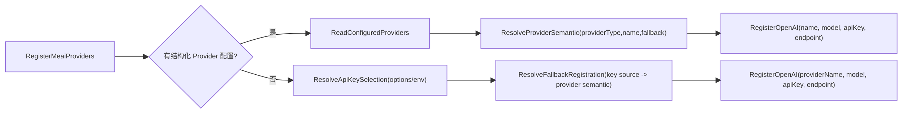

# AI Provider Bootstrap PR Review 修复复评打分（2026-02-25）

## 1. 审计范围与方法

1. 审计对象：`src/Aevatar.Bootstrap.Extensions.AI/ServiceCollectionExtensions.cs`（AI Provider bootstrap 主链）。
2. 复评目标：确认前一版审计中的两条 P1 已彻底关闭，且无新增架构回归。
3. 评分口径：`docs/audit-scorecard/README.md`（100 分制，6 维度）。
4. 证据来源：源码复核 + 测试命令实跑结果。

## 2. 客观验证结果

| 检查项 | 命令 | 结果 |
|---|---|---|
| 全量测试 | `dotnet test aevatar.slnx --nologo` | 通过（含 Bootstrap/Integration/Workflow/CQRS/Foundation 全套测试） |
| 架构门禁 | `bash tools/ci/architecture_guards.sh` | 通过（含 projection route-mapping guard） |
| 测试稳定性门禁 | `bash tools/ci/test_stability_guards.sh` | 通过 |

## 3. 架构主链（修复后）

## 4. 整体评分（100 分制）

**总分：96 / 100（A+）**

| 维度 | 权重 | 得分 | 评分依据 |
|---|---:|---:|---|
| 分层与依赖反转 | 20 | 20 | 解析逻辑集中在 bootstrap 层内部，职责边界清晰。 |
| CQRS 与统一投影链路 | 20 | 19 | 本次映射为“provider 装配单主链”；结构化与 fallback 已统一语义入口。 |
| Projection 编排与状态约束 | 20 | 19 | 本次映射为“provider 事实源一致性”；已消除默认 `openai` 漂移。 |
| 读写分离与会话语义 | 15 | 14 | key 来源与 provider 选择已绑定，回退语义稳定。 |
| 命名语义与冗余清理 | 10 | 9 | 新增 `ResolveProviderSemantic` / `ResolveFallbackRegistration` 消除分支重复规则。 |
| 可验证性（门禁/构建/测试） | 15 | 15 | 全量测试 + 架构门禁 + 稳定性门禁均通过。 |

## 5. 关键修复证据

1. fallback 统一注册入口：`src/Aevatar.Bootstrap.Extensions.AI/ServiceCollectionExtensions.cs:91`。
2. 结构化 provider 统一语义解析：`src/Aevatar.Bootstrap.Extensions.AI/ServiceCollectionExtensions.cs:136`。
3. API key 来源解析：`src/Aevatar.Bootstrap.Extensions.AI/ServiceCollectionExtensions.cs:179`。
4. provider 语义统一 resolver：`src/Aevatar.Bootstrap.Extensions.AI/ServiceCollectionExtensions.cs:199`。
5. DeepSeek/OpenAI 语义构造器：`src/Aevatar.Bootstrap.Extensions.AI/ServiceCollectionExtensions.cs:238`。
6. `ProviderType` 缺失推断回归测试：`test/Aevatar.Bootstrap.Tests/AIFeatureBootstrapCoverageTests.cs:23`。
7. 仅 `DEEPSEEK_API_KEY` fallback 回归测试：`test/Aevatar.Bootstrap.Tests/AIFeatureBootstrapCoverageTests.cs:74`。
8. 双 key 并存优先级回归测试：`test/Aevatar.Bootstrap.Tests/AIFeatureBootstrapCoverageTests.cs:100`。

## 6. 关闭项清单

### P1（已关闭）

1. `ProviderType` 缺失时默认 `openai` 导致 DeepSeek 配置漂移：已关闭。
2. fallback provider 未绑定 key 来源导致凭证/后端错配：已关闭。

## 7. 后续建议（非阻断）

1. 若后续扩展更多 provider（如 `azure`/`moonshot`），建议将 `ProviderKind` 提升为可配置映射表，避免再次出现字符串分支散落。
2. 在 `docs/` 增补 `DefaultProvider` 与环境变量优先级说明，降低运维误配概率。
