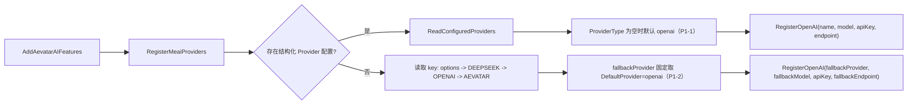

# AI Provider Bootstrap PR Review 审计打分（2026-02-25）

## 1. 审计范围与方法

1. 审计对象：`src/Aevatar.Bootstrap.Extensions.AI/ServiceCollectionExtensions.cs`（AI Provider 启动装配主链）。
2. 审计输入：本次 PR review 结论（2 条 P1）+ 源码逐行复核。
3. 评分口径：`docs/audit-scorecard/README.md` 的 100 分模型。
4. 证据标准：仅采纳可定位到 `文件:行号` 的实现证据。

## 2. 审计边界

1. 在范围内：`RegisterMeaiProviders`、`ReadConfiguredProviders` 的 provider 解析、默认回退、endpoint/model 决策。
2. 不在范围内：下游 SDK 内部鉴权、模型调用细节、非 bootstrap 模块。

## 3. 现状主链与问题位点

## 4. 发现摘要（按严重度）

| 严重度 | 问题 | 证据 | 影响 |
|---|---|---|---|
| P1 | 缺失 `ProviderType` 时强制回退到 `openai`，未从 provider 名推断真实类型。 | `src/Aevatar.Bootstrap.Extensions.AI/ServiceCollectionExtensions.cs:140`、`:144`、`:146`、`:149` | `LLMProviders:Providers:deepseek:ApiKey` 这类常见配置会被按 OpenAI 默认 model/endpoint 注册，导致请求后端错误与鉴权失败。 |
| P1 | 无结构化配置时，key 来源可能是 `DEEPSEEK_API_KEY`，但 provider 固定取 `DefaultProvider`（当前默认为 `openai`）。 | `src/Aevatar.Bootstrap.Extensions.AI/ServiceCollectionExtensions.cs:91`、`:92`、`:93`、`:102`、`:111` | 仅设置 DeepSeek key 或同时设置双 key 时，都会生成 OpenAI 客户端+DeepSeek 凭证组合，运行时 LLM 调用失败。 |

## 5. 整体评分（100 分制）

**总分：66 / 100（C）**

| 维度 | 权重 | 得分 | 扣分依据 |
|---|---:|---:|---|
| 分层与依赖反转 | 20 | 19 | 分层边界基本正确，但 provider 解析规则分散，缺统一解析入口。 |
| CQRS 与统一投影链路 | 20 | 12 | 本次映射为“单一 provider 装配主链一致性”；结构化路径与 fallback 路径语义不一致。 |
| Projection 编排与状态约束 | 20 | 10 | 本次映射为“provider 类型事实源唯一性”；`ProviderType` 缺失时错误默认导致事实源漂移。 |
| 读写分离与会话语义 | 15 | 12 | 本次映射为“回退策略与输入来源一致性”；key 来源与 provider 选择未绑定。 |
| 命名语义与冗余清理 | 10 | 8 | `DefaultProvider` 语义与 key 来源语义耦合不清晰。 |
| 可验证性（门禁/构建/测试） | 15 | 5 | 现有测试未覆盖 `DEEPSEEK_API_KEY` 回退和 `ProviderType` 缺失推断场景，P1 回归未被阻断。 |

## 6. 主要扣分项（必须整改）

### P1-1：ProviderType 缺失时的类型推断错误

1. 问题位置：`src/Aevatar.Bootstrap.Extensions.AI/ServiceCollectionExtensions.cs:144`。
2. 要求：在 `ProviderType` 缺失时，先按实例名（如 `deepseek`）或统一 resolver 推断，再回退默认值。
3. 验收标准：`LLMProviders:Providers:deepseek:ApiKey` 且无 `ProviderType` 时，最终 endpoint/model 必须落到 DeepSeek 语义。

### P1-2：fallback provider 未绑定 key 来源

1. 问题位置：`src/Aevatar.Bootstrap.Extensions.AI/ServiceCollectionExtensions.cs:102`。
2. 要求：fallback provider/model/endpoint 必须与实际命中的 key 来源绑定（`DEEPSEEK_API_KEY` 命中即 DeepSeek 语义）。
3. 验收标准：仅设置 `DEEPSEEK_API_KEY`、同时设置 `DEEPSEEK_API_KEY` 与 `OPENAI_API_KEY` 两种场景均可稳定成功调用。

## 7. 修复优先级与测试补齐建议

1. 第一优先级：抽出统一 `ResolveProviderSemantic(name, providerType, keySource)`，结构化与 fallback 共用。
2. 第一优先级：新增 `Aevatar.Bootstrap.Tests/AIFeatureBootstrapCoverageTests.cs` 场景用例：
   - `ProviderType` 缺失 + provider 名 `deepseek`。
   - 仅 `DEEPSEEK_API_KEY`。
   - 同时设置 `DEEPSEEK_API_KEY` 与 `OPENAI_API_KEY`（显式优先级断言）。
3. 第二优先级：为 `DefaultProvider` 增加语义说明与配置约束，避免与 key 来源决策冲突。

## 8. 复评准入条件

1. 两条 P1 均完成并有自动化测试覆盖。
2. 至少执行：`dotnet test test/Aevatar.Bootstrap.Tests/Aevatar.Bootstrap.Tests.csproj --nologo`。
3. 复评目标：总分恢复到 `90+`，且 P1 清零。
