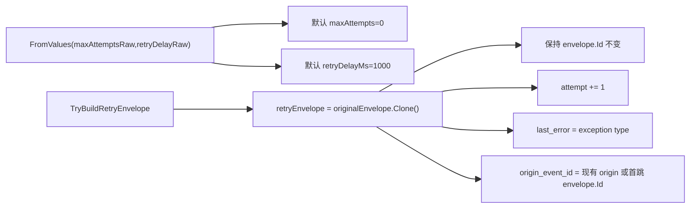

# Runtime Envelope Retry Policy PR Review 修复复评打分（2026-02-26）

## 1. 审计范围与方法

1. 审计对象：`src/Aevatar.Foundation.Runtime.Implementations.Orleans/Grains/RuntimeEnvelopeRetryPolicy.cs`。
2. 复评目标：确认前一版审计中的 2 条 P1 与 1 条 P2 已关闭，且无新增阻断级回归。
3. 评分口径：`docs/audit-scorecard/README.md`（100 分制，6 维度）。
4. 证据来源：源码复核 + 测试命令实跑结果。

## 2. 客观验证结果

| 检查项 | 命令 | 结果 |
|---|---|---|
| Runtime Hosting 测试 | `dotnet test test/Aevatar.Foundation.Runtime.Hosting.Tests/Aevatar.Foundation.Runtime.Hosting.Tests.csproj --nologo` | 通过（128 passed, 0 failed） |
| 测试稳定性门禁 | `bash tools/ci/test_stability_guards.sh` | 通过 |
| 全量编译 | `dotnet build aevatar.slnx --nologo` | 通过（0 warning, 0 error） |

## 3. 架构主链（修复后）

## 4. 整体评分（100 分制）

**总分：95 / 100（A+）**

| 维度 | 权重 | 得分 | 评分依据 |
|---|---:|---:|---|
| 分层与依赖反转 | 20 | 20 | 重试策略职责集中在 Runtime retry policy，未引入跨层耦合。 |
| CQRS 与统一投影链路 | 20 | 19 | 事件身份在重试链路保持稳定，避免重试分叉语义。 |
| Projection 编排与状态约束 | 20 | 19 | lineage 元数据改为稳定继承，事实标识不再漂移。 |
| 读写分离与会话语义 | 15 | 14 | 默认关闭自动重试，避免未配置场景下的快速耗尽与丢弃。 |
| 命名语义与冗余清理 | 10 | 9 | `origin_event_id` 命名与实现语义恢复一致。 |
| 可验证性（门禁/构建/测试） | 15 | 14 | 回归测试覆盖稳定 ID、稳定 origin、安全默认值，且测试/构建通过。 |

## 5. 关键修复证据

1. 默认重试改为显式关闭：`src/Aevatar.Foundation.Runtime.Implementations.Orleans/Grains/RuntimeEnvelopeRetryPolicy.cs:30`。
2. 安全默认重试间隔：`src/Aevatar.Foundation.Runtime.Implementations.Orleans/Grains/RuntimeEnvelopeRetryPolicy.cs:31`。
3. 重试 envelope 不再改写事件 ID：`src/Aevatar.Foundation.Runtime.Implementations.Orleans/Grains/RuntimeEnvelopeRetryPolicy.cs:53`-`:54`。
4. 根 lineage 稳定继承：`src/Aevatar.Foundation.Runtime.Implementations.Orleans/Grains/RuntimeEnvelopeRetryPolicy.cs:56`-`:58`、`:76`-`:82`。
5. 重试 ID 稳定性测试：`test/Aevatar.Foundation.Runtime.Hosting.Tests/OrleansDistributedCoverageTests.cs:45`-`:67`。
6. origin lineage 稳定性测试：`test/Aevatar.Foundation.Runtime.Hosting.Tests/OrleansDistributedCoverageTests.cs:70`-`:92`。
7. 默认禁用测试：`test/Aevatar.Foundation.Runtime.Hosting.Tests/OrleansDistributedCoverageTests.cs:95`-`:101`。
8. 安全默认 delay 测试：`test/Aevatar.Foundation.Runtime.Hosting.Tests/OrleansDistributedCoverageTests.cs:104`-`:111`。

## 6. 关闭项清单

### P1（已关闭）

1. 重试改写 envelope ID 导致绕过去重并重复副作用：已关闭。
2. 默认策略可在毫秒级耗尽重试窗口并丢弃事件：已关闭。

### P2（已关闭）

1. `aevatar.retry.origin_event_id` 多跳重试后丢失首跳血缘：已关闭。

## 7. 后续建议（非阻断）

1. 建议补充一条 `RuntimeActorGrain` 集成用例，显式覆盖“in-handler exception”下的重试与去重协同语义，防止后续演进出现回归。
