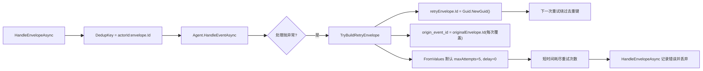

# Runtime Envelope Retry Policy PR Review 审计打分（2026-02-26）

## 1. 审计范围与方法

1. 审计对象：`src/Aevatar.Foundation.Runtime.Implementations.Orleans/Grains/RuntimeEnvelopeRetryPolicy.cs` 与 `src/Aevatar.Foundation.Runtime.Implementations.Orleans/Grains/RuntimeActorGrain.cs`。
2. 审计输入：本次 PR review 的 3 条问题（2 条 P1、1 条 P2）+ 源码复核证据。
3. 评分口径：`docs/audit-scorecard/README.md` 的 100 分制六维模型。
4. 证据标准：仅采纳可定位到 `文件:行号` 的实现证据与测试证据。

## 2. 审计边界

1. 在范围内：重试策略默认值、重试 envelope 标识与 metadata 继承策略、`HandleEnvelopeAsync` 去重与重试调度交互。
2. 不在范围内：业务 Agent 内部幂等实现、外部消息中间件投递语义、下游存储一致性实现。

## 3. 架构主链与风险路径

## 4. 发现摘要（按严重度）

| 严重度 | 问题 | 证据 | 架构影响 |
|---|---|---|---|
| P1 | 重试时改写 `envelope.Id`，破坏基于 `actorId + envelope.Id` 的幂等去重。 | `src/Aevatar.Foundation.Runtime.Implementations.Orleans/Grains/RuntimeEnvelopeRetryPolicy.cs:54`；`src/Aevatar.Foundation.Runtime.Implementations.Orleans/Grains/RuntimeActorGrain.cs:132`-`:136` | 同一业务事件在“已产生部分副作用后抛错”场景下会重复执行副作用。 |
| P1 | 默认 `maxAttempts=5` 且 `retryDelayMs=0`，重试窗口过短，滚动升级期间可能提前耗尽并丢弃消息。 | `src/Aevatar.Foundation.Runtime.Implementations.Orleans/Grains/RuntimeEnvelopeRetryPolicy.cs:30`-`:31`；`src/Aevatar.Foundation.Runtime.Implementations.Orleans/Grains/RuntimeActorGrain.cs:172`-`:181` | 混部版本下兼容性失败可能在新版本接管前即耗尽重试，导致事件丢失。 |
| P2 | `aevatar.retry.origin_event_id` 每次重试都从上一跳 `Id` 重写，根事件血缘不稳定。 | `src/Aevatar.Foundation.Runtime.Implementations.Orleans/Grains/RuntimeEnvelopeRetryPolicy.cs:57`-`:58` | 追踪、审计、回放链路无法稳定定位首个失败事件。 |

## 5. 整体评分（100 分制）

**总分：64 / 100（C）**

| 维度 | 权重 | 得分 | 扣分依据 |
|---|---:|---:|---|
| 分层与依赖反转 | 20 | 19 | 分层未破坏，但重试策略与去重契约语义未对齐。 |
| CQRS 与统一投影链路 | 20 | 14 | 事件处理主链一致，但失败重试路径破坏事件身份一致性。 |
| Projection 编排与状态约束 | 20 | 10 | 事件身份与 lineage 元数据不稳定，削弱运行态事实一致性。 |
| 读写分离与会话语义 | 15 | 8 | 兼容失败重试默认过快耗尽，导致异步最终一致性窗口不足。 |
| 命名语义与冗余清理 | 10 | 7 | `origin_event_id` 命名语义为“根事件”，但实现为“上一跳事件”。 |
| 可验证性（门禁/构建/测试） | 15 | 6 | 现有测试断言了“重试 ID 必变”，未覆盖“根 lineage 稳定”和“安全默认值”。 |

## 6. 主要扣分项与整改要求

### P1-1：重试保持稳定消息身份（Blocking）

1. 问题位置：`src/Aevatar.Foundation.Runtime.Implementations.Orleans/Grains/RuntimeEnvelopeRetryPolicy.cs:54`。
2. 整改要求：重试 envelope 保持稳定 `Id`，或改为在去重层基于稳定 origin key 去重；两者至少满足其一且需全链一致。
3. 验收标准：同一 `actorId` 下，首次失败与后续重试命中同一 dedup identity，不可重复执行业务副作用。

### P1-2：默认策略避免“毫秒级耗尽”（Blocking）

1. 问题位置：`src/Aevatar.Foundation.Runtime.Implementations.Orleans/Grains/RuntimeEnvelopeRetryPolicy.cs:30`-`:31`。
2. 整改要求：默认策略改为显式禁用（`maxAttempts=0`）或提供保守默认（非零 delay + 足够重试窗口）。
3. 验收标准：环境变量未配置时，不发生“短时间自动耗尽重试后丢弃”的行为。

### P2-1：origin 元数据仅初始化一次

1. 问题位置：`src/Aevatar.Foundation.Runtime.Implementations.Orleans/Grains/RuntimeEnvelopeRetryPolicy.cs:57`-`:58`。
2. 整改要求：若已存在 `aevatar.retry.origin_event_id` 则保持原值；仅首跳从原始 envelope 初始化。
3. 验收标准：多跳重试后 `aevatar.retry.origin_event_id` 始终指向首个失败事件 ID。

## 7. 测试补齐建议

1. 更新 `test/Aevatar.Foundation.Runtime.Hosting.Tests/OrleansDistributedCoverageTests.cs:45`，将“重试 ID 变化”改为“重试 ID 稳定/或稳定 dedup key”断言。
2. 新增 `FromValues(null, null)` 默认行为测试，覆盖“默认禁用或安全窗口”。
3. 新增多跳重试 metadata 测试，验证 `aevatar.retry.origin_event_id` 不被覆盖。
4. 新增 `RuntimeActorGrain` 失败重试幂等集成测试，验证同一事件不会因重试产生重复副作用。

## 8. 复评准入条件

1. 2 条 P1 必须关闭，且无新增 P1/P0。
2. 至少执行：`dotnet test test/Aevatar.Foundation.Runtime.Hosting.Tests/Aevatar.Foundation.Runtime.Hosting.Tests.csproj --nologo`。
3. 建议执行：`bash tools/ci/architecture_guards.sh` 与 `bash tools/ci/test_stability_guards.sh`。
4. 复评目标：总分恢复到 `90+`，并验证混部升级窗口下事件不丢失、不重复副作用。
