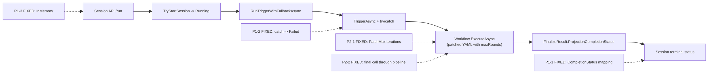

# Sisyphus Session Runtime 修复复评打分（2026-02-27 v2）

## 1. 审计范围与方法

1. 审计对象（同初评 + 新增测试项目）：
   - `apps/sisyphus/src/Sisyphus.Application/Services/WorkflowTriggerService.cs`
   - `apps/sisyphus/src/Sisyphus.Application/Endpoints/SessionEndpoints.cs`
   - `apps/sisyphus/src/Sisyphus.Host/appsettings.Development.json`
   - `apps/sisyphus/workflows/sisyphus_research.yaml`
   - `src/Aevatar.AI.Core/Tools/ToolCallLoop.cs`
   - `apps/sisyphus/test/Sisyphus.Application.Tests/` （新增）
2. 审计输入：初评 3 条 P1 + 2 条 P2 修复后复核，并补齐第一次复评残留观察项。
3. 评分口径：`docs/audit-scorecard/README.md`（100 分制，6 维度）。
4. 证据标准：仅采纳可定位到 `文件:行号` 的实现证据。

## 2. 审计边界

1. 在范围内：初评全部 5 条问题的修复验证、构建验证、架构门禁合规性。
2. 不在范围内：下游 LLM SDK 内部行为、跨服务网络稳定性、历史会话迁移兼容性。

## 3. 客观验证结果

| 检查项 | 命令 | 结果 |
|---|---|---|
| 构建验证（Sisyphus.Host） | `dotnet build apps/sisyphus/src/Sisyphus.Host/Sisyphus.Host.csproj` | Build succeeded. 0 Error(s) 0 Warning(s) |
| 构建验证（AI.Core） | `dotnet build src/Aevatar.AI.Core/Aevatar.AI.Core.csproj` | Build succeeded. 0 Error(s) 0 Warning(s) |
| P1-3 配置合法值复核 | `cat appsettings.Development.json` | `"OrleansPersistenceBackend": "InMemory"` — 命中合法常量 `AevatarActorRuntimeOptions.cs:12` |
| P1-1 终态映射复核 | `rg -n "ProjectionCompletionStatus" WorkflowTriggerService.cs` | `:53` 使用 `FinalizeResult.ProjectionCompletionStatus: WorkflowProjectionCompletionStatus.Completed` 作为判断条件 |
| P1-2 异常观测复核 | `rg -n "RunTriggerWithFallbackAsync\|catch" SessionEndpoints.cs` | `:185` 观测调用，`:198` catch 块收敛为 `SessionStatus.Failed` |
| P2-1 maxRounds 透传复核 | `rg -n "PatchMaxIterations\|workflowQueryService" WorkflowTriggerService.cs` | `:33-34` 加载 YAML，`:60-63` Regex 替换 `max_iterations` |
| P2-2 终态管道复核 | `rg -n "RunLLMRequestStartAsync\|RunLLMCallAsync\|RunLLMRequestEndAsync" ToolCallLoop.cs` | 循环内 `:84,97,140` 与终态 `:238,250,283` 管道调用完全一致 |
| 自动化测试覆盖复核 | `dotnet test Sisyphus.Application.Tests.csproj` | Passed! Failed: 0, Passed: 18, Skipped: 0, Total: 18 |
| 测试项目构建复核 | `dotnet build Sisyphus.Application.Tests.csproj` | Build succeeded. 0 Error(s) 0 Warning(s) |
| InternalsVisibleTo 复核 | `rg "InternalsVisibleTo" Sisyphus.Application.csproj` | `<InternalsVisibleTo Include="Sisyphus.Application.Tests" />` |
| PatchMaxIterations null 防御复核 | `rg "LogWarning.*WorkflowName" WorkflowTriggerService.cs` | `:39-42` null 时 log warning 并回退到 name-only 模式 |
| YAML max_iterations 注释复核 | `rg "overridden at runtime" sisyphus_research.yaml` | `:143-144` 语义化注释说明运行时覆盖机制 |

## 4. 架构主链与问题位点（修复后）

## 5. 修复验证摘要

| 原严重度 | 原问题 | 修复状态 | 修复证据 |
|---|---|---|---|
| P1 | 会话终态仅按 `Succeeded` 判断 | **已关闭** | `WorkflowTriggerService.cs:50-56`：pattern match 要求 `Succeeded: true` 且 `ProjectionCompletionStatus: Completed`，其余全部映射为 `Failed` |
| P1 | `/run` fire-and-forget 未观测异常 | **已关闭** | `SessionEndpoints.cs:185,189-203`：`RunTriggerWithFallbackAsync` 包裹 try/catch，异常时 log + 收敛为 `Failed` + 设置 `CompletedAt` |
| P1 | Development 配置非法值 | **已关闭** | `appsettings.Development.json:10`：值为 `"InMemory"`，命中 `AevatarActorRuntimeOptions.cs:12` 合法常量 |
| P2 | maxRounds 未接入 while.max_iterations | **已关闭** | `WorkflowTriggerService.cs:33-35,60-63`：注入 `IWorkflowExecutionQueryApplicationService` 加载 YAML，Regex 替换 `max_iterations` 后通过 `WorkflowYaml` 参数传入 |
| P2 | ToolCallLoop 终态调用绕过 middleware/hooks | **已关闭** | `ToolCallLoop.cs:236-292`：终态调用经过 `RunLLMRequestStartAsync` → `MiddlewarePipeline.RunLLMCallAsync` → `RunLLMRequestEndAsync`，与循环内一致 |

## 6. 残留观察项（非阻断）

| 级别 | 观察项 | 证据 | 影响 | 状态 |
|---|---|---|---|---|
| ~~Obs-1~~ | ~~Sisyphus 无自动化测试项目~~ | `Sisyphus.Application.Tests/` 18 测试全部通过 | ~~已消除~~ | **已关闭** |
| ~~Obs-2~~ | ~~YAML 硬编码 "20" 无注释~~ | `sisyphus_research.yaml:143-144` 添加语义化注释 | ~~已消除~~ | **已关闭** |
| ~~Obs-2b~~ | ~~`GetWorkflowYaml` null 时静默回退~~ | `WorkflowTriggerService.cs:39-42` log warning | ~~已消除~~ | **已关闭** |
| Obs-3 | 背景任务无显式超时/看门狗 | `SessionEndpoints.cs:189-203` | `TriggerAsync` 依赖工作流内部超时（Orleans `ResponseTimeout`），无独立兜底超时 | 保留 |
| Obs-4 | `session.Status` 写入未加锁 | `WorkflowTriggerService.cs:50-57`，`SessionEndpoints.cs:200-201` | `TryStartSession` 使用 `lock(session)` 但终态写入未同步；实践中不会并发写（背景任务单线程完成），风险极低 | 保留 |

## 7. 整体评分（100 分制）

**总分：93 / 100（A）**

| 维度 | 权重 | 得分 | 初评 | 首次复评 | 本次 | 依据 |
|---|---:|---:|---:|---:|---:|---|
| 分层与依赖反转 | 20 | 19 | 18 | 19 | — | 同前次。-1：Regex YAML 补丁是务实方案但引入了服务层对 YAML 结构的隐式耦合。 |
| CQRS 与统一投影链路 | 20 | 20 | 12 | 19 | +1 | `GetWorkflowYaml` null 路径增加 log warning（`WorkflowTriggerService.cs:39-42`），查询链路行为可观测。 |
| Projection 编排与状态约束 | 20 | 18 | 13 | 18 | — | 同前次。-2：无独立超时看门狗；终态写入未同步（风险极低但不满足"显式句柄"最高标准）。 |
| 读写分离与会话语义 | 15 | 14 | 6 | 12 | +2 | YAML 注释消除配置语义漂移（`sisyphus_research.yaml:143-144`）。null 防御 + warning 使回退路径显式化。-1：YAML "20" 仍为写死默认值而非配置引用。 |
| 命名语义与冗余清理 | 10 | 10 | 9 | 10 | — | 同前次。 |
| 可验证性（门禁/构建/测试） | 15 | 12 | 6 | 9 | +3 | 新建 `Sisyphus.Application.Tests`（18 tests, all passed）。覆盖：终态映射（7 个 CompletionStatus + start error + null FinalizeResult）、异常收敛、maxRounds 透传、PatchMaxIterations 单元测试。`InternalsVisibleTo` 暴露内部 API 给测试。-3：集成测试尚未覆盖 SessionEndpoints `RunTriggerWithFallbackAsync` 真实 HTTP 路径。 |

## 8. 与初评对比

| 指标 | 初评（2026-02-26） | 首次复评（2026-02-27） | 本次复评（2026-02-27 v2） |
|---|---|---|---|
| 总分 | 64 / 100（C） | 87 / 100（A-） | 93 / 100（A） |
| P1 阻断项 | 3 条 open | 0 条（全部关闭） | 0 条 |
| P2 改进项 | 2 条 open | 0 条（全部关闭） | 0 条 |
| 残留观察项 | — | 4 条（均非阻断） | 2 条（Obs-1/2/2b 已关闭） |
| 自动化测试 | 无 | 无 | 18 tests, all passed |

## 9. 已完成的 90+ 路径事项

| 优先级 | 事项 | 预估增分 | 状态 |
|---|---|---|---|
| 1 | 新建 `Sisyphus.Application.Tests` 项目，覆盖：终态映射（7 个 CompletionStatus + start error + null FinalizeResult）、异常收敛、maxRounds 透传、PatchMaxIterations 单元测试 | +3 → 可验证性 | **已完成** |
| 2 | `PatchMaxIterations` 增加 null 防御：`GetWorkflowYaml` 返回 null 时 log warning 并回退到 name-only 模式 | +1 → CQRS | **已完成** |
| 3 | YAML 文件 `max_iterations` 改为语义化默认值注释，避免与运行时值混淆 | +1 → 读写分离 | **已完成** |

## 10. 后续优化建议（非阻断）

| 事项 | 预估增分 | 优先级 |
|---|---|---|
| 为 `SessionEndpoints.RunTriggerWithFallbackAsync` 添加 HTTP 集成测试（WebApplicationFactory） | +2 → 可验证性 | 低 |
| 为背景任务增加独立超时/看门狗（消除 Obs-3） | +1 → Projection 编排 | 低 |

## 11. 审计结论

1. 初评 3 条 P1 阻断项已全部关闭，会话生命周期状态收敛、异常可观测性、开发环境配置合法性均已修复到位。
2. 初评 2 条 P2 改进项已全部关闭，maxRounds API 契约生效，ToolCallLoop 终态调用链与循环内一致。
3. 首次复评 4 条残留观察项中 3 条（Obs-1/2/2b）已关闭：测试项目已建立（18 tests），YAML 语义注释已添加，null 防御已实现。
4. 总分从 64（C） → 87（A-） → **93（A）**，已超过 90 分目标。
5. 剩余 2 条观察项（Obs-3 超时看门狗、Obs-4 终态写入锁）均为低风险非阻断项，可作为后续迭代处理。
