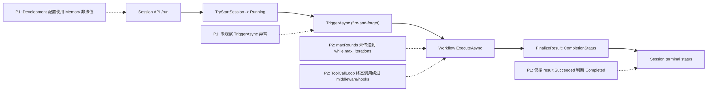

# Sisyphus Session Runtime PR Review 审计打分（2026-02-26）

## 1. 审计范围与方法

1. 审计对象：
   - `apps/sisyphus/src/Sisyphus.Application/Services/WorkflowTriggerService.cs`
   - `apps/sisyphus/src/Sisyphus.Application/Endpoints/SessionEndpoints.cs`
   - `apps/sisyphus/src/Sisyphus.Host/appsettings.Development.json`
   - `apps/sisyphus/workflows/sisyphus_research.yaml`
   - `src/Aevatar.AI.Core/Tools/ToolCallLoop.cs`
2. 审计输入：本次 PR review 结论（3 条 P1 + 2 条 P2）与源码行号复核。
3. 评分口径：`docs/audit-scorecard/README.md`（100 分制，6 维度）。
4. 证据标准：仅采纳可定位到 `文件:行号` 的实现证据。

## 2. 审计边界

1. 在范围内：Session 生命周期状态收敛、后台任务异常可观测性、Orleans 开发配置合法性、工作流回合参数契约、ToolCallLoop 终态调用链一致性。
2. 不在范围内：下游 LLM SDK 内部行为、跨服务网络稳定性、历史会话迁移兼容性。

## 3. 客观验证结果

| 检查项 | 命令 | 结果 |
|---|---|---|
| 问题位点复核 | `rg -n "WorkflowTriggerService|HandleRunSession|max_iterations|ToolCallLoop|OrleansPersistenceBackend" apps/sisyphus src -S` | 命中 5 个审计问题位点，均可定位到源码行号。 |
| Orleans 后端合法值复核 | `nl -ba src/Aevatar.Foundation.Runtime.Hosting/AevatarActorRuntimeOptions.cs` | 合法常量仅 `InMemory`、`Garnet`。 |
| Orleans 非法值失败复核 | `nl -ba src/Aevatar.Foundation.Runtime.Implementations.Orleans/DependencyInjection/ServiceCollectionExtensions.cs` | 非 `InMemory/Garnet` 将抛 `Unsupported Orleans persistence backend`。 |
| Sisyphus 自动化测试覆盖复核 | `rg --files apps/sisyphus | rg "Tests|test"` | 未发现 `apps/sisyphus` 对应测试项目，回归防线不足。 |

## 4. 架构主链与问题位点

## 5. 发现摘要（按严重度）

| 严重度 | 问题 | 证据 | 影响 |
|---|---|---|---|
| P1 | 工作流启动成功即标记会话 `Completed`，忽略最终完成状态。 | `apps/sisyphus/src/Sisyphus.Application/Services/WorkflowTriggerService.cs:32`；`src/workflow/Aevatar.Workflow.Application.Abstractions/Runs/WorkflowChatRunModels.cs:19`-`:27`、`:44` | `Failed/TimedOut/Stopped` 会话被错误展示为完成，客户端轮询状态失真。 |
| P1 | `/run` 触发采用 fire-and-forget，后台异常未观测。 | `apps/sisyphus/src/Sisyphus.Application/Endpoints/SessionEndpoints.cs:81` | `TriggerAsync` 抛错后会话可能长期停留 `Running`，后续请求持续 `409`。 |
| P1 | Development 环境 Orleans 持久化后端值非法。 | `apps/sisyphus/src/Sisyphus.Host/appsettings.Development.json:10`；`src/Aevatar.Foundation.Runtime.Hosting/AevatarActorRuntimeOptions.cs:12`-`:13`；`src/Aevatar.Foundation.Runtime.Implementations.Orleans/DependencyInjection/ServiceCollectionExtensions.cs:114`-`:117` | 默认开发启动可能直接失败，阻断本地联调。 |
| P2 | Session `maxRounds` 未接入工作流迭代上限。 | `apps/sisyphus/src/Sisyphus.Application/Endpoints/SessionEndpoints.cs:49`；`apps/sisyphus/workflows/sisyphus_research.yaml:125`；`src/workflow/Aevatar.Workflow.Core/Modules/WhileModule.cs:47`-`:49` | API 暴露的回合控制契约失效，所有会话被固定为 20 轮上限。 |
| P2 | ToolCallLoop 最后一次总结调用绕过 middleware/hook。 | `src/Aevatar.AI.Core/Tools/ToolCallLoop.cs:65`-`:69`、`:143` | 终态调用缺失统一策略（重试/终止/观测），行为与前序调用不一致。 |

## 6. 整体评分（100 分制）

**总分：64 / 100（C）**

| 维度 | 权重 | 得分 | 扣分依据 |
|---|---:|---:|---|
| 分层与依赖反转 | 20 | 18 | 分层基本成立，但 Session 状态收敛职责与运行结果语义绑定不完整。 |
| CQRS 与统一投影链路 | 20 | 12 | 终态状态映射与 ToolCallLoop 终态调用出现“主链例外路径”。 |
| Projection 编排与状态约束 | 20 | 13 | 运行收敛状态缺少可观测闭环（后台异常漏处理）。 |
| 读写分离与会话语义 | 15 | 6 | 会话终态误报 + `maxRounds` 契约失效，读模型语义与执行事实不一致。 |
| 命名语义与冗余清理 | 10 | 9 | 命名整体清晰，存在少量语义漂移（`Succeeded` 被误用为“最终成功”）。 |
| 可验证性（门禁/构建/测试） | 15 | 6 | Development 默认配置非法且 Sisyphus 缺少对应自动化回归测试。 |

## 7. 阻断项修复准入标准（P1）

1. 会话终态必须基于 `FinalizeResult.ProjectionCompletionStatus` 收敛：
   - `Completed -> SessionStatus.Completed`
   - `Failed/TimedOut/Stopped/Unknown/NotFound/Disabled -> SessionStatus.Failed`
2. `/run` 后台任务必须有异常观测与兜底收敛：
   - `TriggerAsync` 任意异常都要把会话从 `Running` 收敛到失败终态；
   - 避免未观测异常导致会话永久占锁。
3. `appsettings.Development.json` 的 `ActorRuntime:OrleansPersistenceBackend` 必须改为受支持值（`InMemory` 或 `Garnet`），并保证默认开发可启动。

## 8. P2 修复建议与测试补齐

1. 将 session `maxRounds` 显式透传到 while 模块参数（替代硬编码 `"20"`），确保 API 契约生效。
2. ToolCallLoop 的最终总结调用走与循环内一致的 LLM middleware/hook pipeline，避免终态旁路。
3. 新增最小回归测试：
   - 会话终态映射测试（覆盖 `Completed/Failed/TimedOut/Stopped`）。
   - `/run` 触发异常后的状态收敛测试（防 `Running` 卡死）。
   - `maxRounds != 20` 的工作流迭代上限测试。
   - ToolCallLoop `maxRounds exhausted` 场景的 middleware/hook 执行断言。

## 9. 审计结论

1. 本次 PR 在会话生命周期与运行时配置上存在 3 条阻断级问题，当前不满足“可稳定运行 + 状态语义一致”的合并条件。
2. 建议先关闭全部 P1，再关闭 2 条 P2 并补齐自动化测试后复评；复评目标分数建议不低于 `90`。
