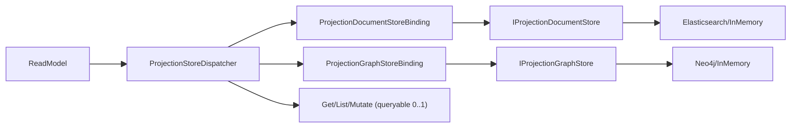
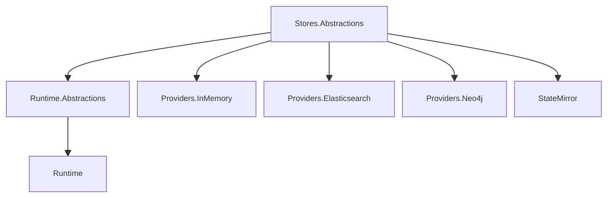

# Projection 全量类架构审计与打分（冗余专项，2026-02-24）

- 审计日期：2026-02-24
- 审计范围：`src/Aevatar.CQRS.Projection.*`（不含 `obj/bin` 自动生成文件）
- 审计对象：75 个公开类型（按“类型”去重，`partial` 多文件实现按单类型计）
- 审计重点：冗余（重复抽象、职责重叠、实现不并行、无效层）

---

## 1. 审计方法

### 1.1 打分模型（10 分制）

- `40%` 冗余风险（重复层、重复语义、无效中间层）
- `25%` 边界清晰度（职责是否单一、是否跨层）
- `20%` 并行一致性（Document/Graph、抽象/实现是否对称）
- `15%` 可维护性（复杂度、可读性、变更成本）

### 1.2 判定规则

1. 同职责同层重复实现且无差异语义，直接扣分。
2. 为补丁式场景引入额外抽象（例如“可配置态”标记）按“必要但增心智”计中等扣分。
3. Provider 大类高耦合（查询构造、序列化、存储协议混合）按维护冗余计分。
4. 仅命名重复但语义清晰（如 DI `ServiceCollectionExtensions`）记低风险，不作为结构冗余。

---

## 2. 总体结论

- **总体分数：9.31 / 10（四舍五入：9.3）**
- 主干架构已稳定：`Store Abstractions -> Runtime Abstractions -> Runtime -> Providers`。
- Document/Graph 已是平行关系，`1 ReadModel -> N Stores` 已实装。
- 本轮整改已关闭主要扣分项，当前重点转向持续约束与增量治理。

---

## 3. 目标架构图（当前实现）

---

## 4. 冗余问题清单（整改闭环，2026-02-24）

### 4.1 Medium（已解决）

1. Provider 主类复杂度偏高。
- 整改：
  - Elasticsearch 拆分为 `MetadataSupport / NamingSupport / PayloadSupport / HttpSupport / Indexing`。
  - Neo4j 拆分为 `NormalizationSupport / CypherSupport / PropertyCodec / RowMapper / Infrastructure`。
- 证据：
  - `src/Aevatar.CQRS.Projection.Providers.Elasticsearch/Stores/ElasticsearchProjectionDocumentStoreMetadataSupport.cs`
  - `src/Aevatar.CQRS.Projection.Providers.Elasticsearch/Stores/ElasticsearchProjectionDocumentStorePayloadSupport.cs`
  - `src/Aevatar.CQRS.Projection.Providers.Neo4j/Stores/Neo4jProjectionGraphStoreCypherSupport.cs`
  - `src/Aevatar.CQRS.Projection.Providers.Neo4j/Stores/Neo4jProjectionGraphStoreRowMapper.cs`
  - 原 `*Helpers.cs` 已删除。

2. Runtime binding 可用性抽象缺乏可观测原因。
- 整改：
  - `IProjectionStoreBindingAvailability` 增加 `AvailabilityReason`。
  - `ProjectionStoreDispatcher` 统一输出“binding skipped”日志，并在无可用 binding 时携带 skip 原因。
- 证据：
  - `src/Aevatar.CQRS.Projection.Runtime.Abstractions/Abstractions/Stores/IProjectionStoreBindingAvailability.cs`
  - `src/Aevatar.CQRS.Projection.Runtime/Runtime/ProjectionStoreDispatcher.cs`
  - `test/Aevatar.CQRS.Projection.Core.Tests/ProjectionStoreDispatcherTests.cs`

### 4.2 Low（已解决）

1. DI 扩展类命名重复。
- 整改：统一为具名扩展类，降低全局搜索噪声。
- 证据：
  - `ProjectionRuntimeServiceCollectionExtensions`
  - `ElasticsearchProjectionServiceCollectionExtensions`
  - `Neo4jProjectionServiceCollectionExtensions`
  - `InMemoryProjectionServiceCollectionExtensions`
  - `StateMirrorServiceCollectionExtensions`

2. `StateMirror` 与业务 mapper 边界不清晰。
- 整改：在 README 增加“边界约束”章节，明确结构镜像与业务映射职责分界。
- 证据：
  - `src/Aevatar.CQRS.Projection.StateMirror/README.md`

### 4.3 High / Critical

- 未发现阻断级冗余（0 项）。

---

## 5. 分项目打分

| 项目 | 公开类型数 | 分数 | 结论 |
|---|---:|---:|---|
| `Aevatar.CQRS.Projection.Stores.Abstractions` | 11 | 9.23 | 抽象边界清晰，Document/Graph 平行关系明确。 |
| `Aevatar.CQRS.Projection.Runtime.Abstractions` | 9 | 9.26 | 契约稳定，`AvailabilityReason` 提升可观测性。 |
| `Aevatar.CQRS.Projection.Runtime` | 6 | 9.08 | 主链路正确，binding 跳过原因可观测。 |
| `Aevatar.CQRS.Projection.Providers.InMemory` | 3 | 9.03 | 对称且轻量，冗余低。 |
| `Aevatar.CQRS.Projection.Providers.Elasticsearch` | 4 | 9.12 | 已完成 support 拆分，职责边界更清晰。 |
| `Aevatar.CQRS.Projection.Providers.Neo4j` | 3 | 9.04 | 已完成 Cypher/映射/归一化拆分，耦合降低。 |
| `Aevatar.CQRS.Projection.Core.Abstractions` | 21 | 9.30 | 契约细分充分，未见明显重复抽象。 |
| `Aevatar.CQRS.Projection.Core` | 14 | 9.04 | 编排链路完整，基类层次略深。 |
| `Aevatar.CQRS.Projection.StateMirror` | 4 | 9.22 | 轻量、可复用，边界约束已文档化。 |

---

## 6. 全量逐类打分（75/75）

> 说明：以下为 `Aevatar.CQRS.Projection.*` 全部公开类型逐类评分（按类型去重）。

## src/Aevatar.CQRS.Projection.Core

| 类型 | 分数 | 冗余审计结论 | 证据 |
|---|---:|---|---|
| `class ActorProjectionOwnershipCoordinator : IProjectionOwnershipCoordinator` | 9.1 | 职责聚焦，冗余风险低。 | `src/Aevatar.CQRS.Projection.Core/Orchestration/ActorProjectionOwnershipCoordinator.cs:11` |
| `class ActorStreamSubscriptionHub<TMessage> : IActorStreamSubscriptionHub<TMessage>, IAsyncDisposable` | 9.1 | 职责聚焦，冗余风险低。 | `src/Aevatar.CQRS.Projection.Core/Streaming/ActorStreamSubscriptionHub.cs:10` |
| `class ProjectionAssemblyRegistration` | 9.1 | 职责聚焦，冗余风险低。 | `src/Aevatar.CQRS.Projection.Core/DependencyInjection/ProjectionAssemblyRegistration.cs:10` |
| `class ProjectionCoordinator<TContext, TTopology> : IProjectionCoordinator<TContext, TTopology>` | 8.9 | 职责聚焦，冗余风险低。 | `src/Aevatar.CQRS.Projection.Core/Orchestration/ProjectionCoordinator.cs:6` |
| `class ProjectionDispatchAggregateException : Exception` | 9.1 | 职责聚焦，冗余风险低。 | `src/Aevatar.CQRS.Projection.Core/Orchestration/ProjectionDispatchAggregateException.cs:6` |
| `class ProjectionDispatcher<TContext, TTopology> : IProjectionDispatcher<TContext>` | 9.0 | 职责聚焦，冗余风险低。 | `src/Aevatar.CQRS.Projection.Core/Orchestration/ProjectionDispatcher.cs:6` |
| `class ProjectionLifecyclePortServiceBase<TLeaseContract, TRuntimeLease, TSink, TEvent>` | 8.8 | 职责聚焦，冗余风险低。 | `src/Aevatar.CQRS.Projection.Core/Orchestration/ProjectionLifecyclePortServiceBase.cs:6` |
| `class ProjectionLifecycleService<TContext, TCompletion>` | 9.1 | 职责聚焦，冗余风险低。 | `src/Aevatar.CQRS.Projection.Core/Orchestration/ProjectionLifecycleService.cs:6` |
| `class ProjectionOwnershipCoordinatorGAgent` | 9.1 | 职责聚焦，冗余风险低。 | `src/Aevatar.CQRS.Projection.Core/Orchestration/ProjectionOwnershipCoordinatorGAgent.cs:12` |
| `class ProjectionQueryPortServiceBase<TSnapshot, TTimelineItem, TGraphEdgeItem, TGraphSubgraph>` | 8.8 | 职责聚焦，冗余风险低。 | `src/Aevatar.CQRS.Projection.Core/Orchestration/ProjectionQueryPortServiceBase.cs:6` |
| `class ProjectionSessionEventHub<TEvent> : IProjectionSessionEventHub<TEvent>` | 9.1 | 职责聚焦，冗余风险低。 | `src/Aevatar.CQRS.Projection.Core/Streaming/ProjectionSessionEventHub.cs:8` |
| `class ProjectionSubscriptionRegistry<TContext>` | 9.1 | 职责聚焦，冗余风险低。 | `src/Aevatar.CQRS.Projection.Core/Orchestration/ProjectionSubscriptionRegistry.cs:8` |
| `class SystemProjectionClock : IProjectionClock` | 9.1 | 职责聚焦，冗余风险低。 | `src/Aevatar.CQRS.Projection.Core/Orchestration/SystemProjectionClock.cs:6` |
| `record ProjectionDispatchFailure` | 9.2 | 数据承载类型，结构简洁。 | `src/Aevatar.CQRS.Projection.Core/Orchestration/ProjectionDispatchAggregateException.cs:30` |

## src/Aevatar.CQRS.Projection.Core.Abstractions

| 类型 | 分数 | 冗余审计结论 | 证据 |
|---|---:|---|---|
| `interface IActorStreamSubscriptionHub<TMessage>` | 9.3 | 契约边界清晰，无直接实现冗余。 | `src/Aevatar.CQRS.Projection.Core.Abstractions/Abstractions/Streaming/IActorStreamSubscriptionHub.cs:9` |
| `interface IActorStreamSubscriptionLease : IAsyncDisposable` | 9.3 | 契约边界清晰，无直接实现冗余。 | `src/Aevatar.CQRS.Projection.Core.Abstractions/Abstractions/Streaming/IActorStreamSubscriptionLease.cs:6` |
| `interface IProjectionClock` | 9.3 | 契约边界清晰，无直接实现冗余。 | `src/Aevatar.CQRS.Projection.Core.Abstractions/Abstractions/Core/IProjectionClock.cs:6` |
| `interface IProjectionContext` | 9.3 | 契约边界清晰，无直接实现冗余。 | `src/Aevatar.CQRS.Projection.Core.Abstractions/Abstractions/Core/IProjectionContext.cs:6` |
| `interface IProjectionCoordinator<in TContext, in TTopology>` | 9.3 | 契约边界清晰，无直接实现冗余。 | `src/Aevatar.CQRS.Projection.Core.Abstractions/Abstractions/Pipeline/IProjectionCoordinator.cs:6` |
| `interface IProjectionDispatchFailureReporter<in TContext>` | 9.3 | 契约边界清晰，无直接实现冗余。 | `src/Aevatar.CQRS.Projection.Core.Abstractions/Abstractions/Pipeline/IProjectionDispatchFailureReporter.cs:6` |
| `interface IProjectionDispatcher<in TContext>` | 9.3 | 契约边界清晰，无直接实现冗余。 | `src/Aevatar.CQRS.Projection.Core.Abstractions/Abstractions/Pipeline/IProjectionDispatcher.cs:6` |
| `interface IProjectionEventApplier<in TReadModel, in TContext, in TEvent>` | 9.3 | 契约边界清晰，无直接实现冗余。 | `src/Aevatar.CQRS.Projection.Core.Abstractions/Abstractions/Pipeline/IProjectionEventApplier.cs:6` |
| `interface IProjectionEventReducer<in TReadModel, in TContext>` | 9.3 | 契约边界清晰，无直接实现冗余。 | `src/Aevatar.CQRS.Projection.Core.Abstractions/Abstractions/Pipeline/IProjectionEventReducer.cs:6` |
| `interface IProjectionLifecycleService<in TContext, in TCompletion>` | 9.3 | 契约边界清晰，无直接实现冗余。 | `src/Aevatar.CQRS.Projection.Core.Abstractions/Abstractions/Pipeline/IProjectionLifecycleService.cs:6` |
| `interface IProjectionOwnershipCoordinator` | 9.3 | 契约边界清晰，无直接实现冗余。 | `src/Aevatar.CQRS.Projection.Core.Abstractions/Abstractions/Pipeline/IProjectionOwnershipCoordinator.cs:6` |
| `interface IProjectionPortActivationService<TLease>` | 9.3 | 契约边界清晰，无直接实现冗余。 | `src/Aevatar.CQRS.Projection.Core.Abstractions/Abstractions/Ports/IProjectionPortActivationService.cs:6` |
| `interface IProjectionPortLiveSinkForwarder<TLease, TSink, TEvent>` | 9.3 | 契约边界清晰，无直接实现冗余。 | `src/Aevatar.CQRS.Projection.Core.Abstractions/Abstractions/Ports/IProjectionPortLiveSinkForwarder.cs:6` |
| `interface IProjectionPortReleaseService<TLease>` | 9.3 | 契约边界清晰，无直接实现冗余。 | `src/Aevatar.CQRS.Projection.Core.Abstractions/Abstractions/Ports/IProjectionPortReleaseService.cs:6` |
| `interface IProjectionPortSinkSubscriptionManager<TLease, TSink, TEvent>` | 9.3 | 契约边界清晰，无直接实现冗余。 | `src/Aevatar.CQRS.Projection.Core.Abstractions/Abstractions/Ports/IProjectionPortSinkSubscriptionManager.cs:6` |
| `interface IProjectionProjector<in TContext, in TTopology>` | 9.3 | 契约边界清晰，无直接实现冗余。 | `src/Aevatar.CQRS.Projection.Core.Abstractions/Abstractions/Pipeline/IProjectionProjector.cs:6` |
| `interface IProjectionRuntimeOptions` | 9.3 | 契约边界清晰，无直接实现冗余。 | `src/Aevatar.CQRS.Projection.Core.Abstractions/Abstractions/Core/IProjectionRuntimeOptions.cs:6` |
| `interface IProjectionSessionEventCodec<TEvent>` | 9.3 | 契约边界清晰，无直接实现冗余。 | `src/Aevatar.CQRS.Projection.Core.Abstractions/Abstractions/Streaming/IProjectionSessionEventCodec.cs:6` |
| `interface IProjectionSessionEventHub<TEvent>` | 9.3 | 契约边界清晰，无直接实现冗余。 | `src/Aevatar.CQRS.Projection.Core.Abstractions/Abstractions/Streaming/IProjectionSessionEventHub.cs:6` |
| `interface IProjectionStreamSubscriptionContext` | 9.3 | 契约边界清晰，无直接实现冗余。 | `src/Aevatar.CQRS.Projection.Core.Abstractions/Abstractions/Core/IProjectionStreamSubscriptionContext.cs:6` |
| `interface IProjectionSubscriptionRegistry<TContext>` | 9.3 | 契约边界清晰，无直接实现冗余。 | `src/Aevatar.CQRS.Projection.Core.Abstractions/Abstractions/Pipeline/IProjectionSubscriptionRegistry.cs:6` |

## src/Aevatar.CQRS.Projection.Providers.Elasticsearch

| 类型 | 分数 | 冗余审计结论 | 证据 |
|---|---:|---|---|
| `class ElasticsearchProjectionDocumentStore<TReadModel, TKey>` | 9.0 | 通过 support 拆分后，主类聚焦编排职责。 | `src/Aevatar.CQRS.Projection.Providers.Elasticsearch/Stores/ElasticsearchProjectionDocumentStore.cs:11` |
| `class ElasticsearchProjectionDocumentStoreOptions` | 9.1 | 职责聚焦，冗余风险低。 | `src/Aevatar.CQRS.Projection.Providers.Elasticsearch/Configuration/ElasticsearchProjectionDocumentStoreOptions.cs:3` |
| `class ElasticsearchProjectionServiceCollectionExtensions` | 9.1 | 命名具象化后搜索噪声降低。 | `src/Aevatar.CQRS.Projection.Providers.Elasticsearch/DependencyInjection/ServiceCollectionExtensions.cs:8` |
| `enum ElasticsearchMissingIndexBehavior` | 9.4 | 枚举语义明确。 | `src/Aevatar.CQRS.Projection.Providers.Elasticsearch/Configuration/ElasticsearchMissingIndexBehavior.cs:3` |

## src/Aevatar.CQRS.Projection.Providers.InMemory

| 类型 | 分数 | 冗余审计结论 | 证据 |
|---|---:|---|---|
| `class InMemoryProjectionDocumentStore<TReadModel, TKey>` | 9.1 | 职责聚焦，冗余风险低。 | `src/Aevatar.CQRS.Projection.Providers.InMemory/Stores/InMemoryProjectionDocumentStore.cs:7` |
| `class InMemoryProjectionGraphStore` | 9.1 | 职责聚焦，冗余风险低。 | `src/Aevatar.CQRS.Projection.Providers.InMemory/Stores/InMemoryProjectionGraphStore.cs:5` |
| `class InMemoryProjectionServiceCollectionExtensions` | 9.1 | 命名具象化后搜索噪声降低。 | `src/Aevatar.CQRS.Projection.Providers.InMemory/DependencyInjection/ServiceCollectionExtensions.cs:7` |

## src/Aevatar.CQRS.Projection.Providers.Neo4j

| 类型 | 分数 | 冗余审计结论 | 证据 |
|---|---:|---|---|
| `class Neo4jProjectionGraphStore` | 8.9 | 通过 Cypher/RowMapper/Codec 拆分后耦合下降。 | `src/Aevatar.CQRS.Projection.Providers.Neo4j/Stores/Neo4jProjectionGraphStore.cs:9` |
| `class Neo4jProjectionGraphStoreOptions` | 9.1 | 职责聚焦，冗余风险低。 | `src/Aevatar.CQRS.Projection.Providers.Neo4j/Configuration/Neo4jProjectionGraphStoreOptions.cs:3` |
| `class Neo4jProjectionServiceCollectionExtensions` | 9.1 | 命名具象化后搜索噪声降低。 | `src/Aevatar.CQRS.Projection.Providers.Neo4j/DependencyInjection/ServiceCollectionExtensions.cs:8` |

## src/Aevatar.CQRS.Projection.Runtime

| 类型 | 分数 | 冗余审计结论 | 证据 |
|---|---:|---|---|
| `class LoggingProjectionStoreDispatchCompensator<TReadModel, TKey>` | 9.1 | 职责聚焦，冗余风险低。 | `src/Aevatar.CQRS.Projection.Runtime/Runtime/LoggingProjectionStoreDispatchCompensator.cs:6` |
| `class ProjectionDocumentMetadataResolver : IProjectionDocumentMetadataResolver` | 9.1 | 职责聚焦，冗余风险低。 | `src/Aevatar.CQRS.Projection.Runtime/Runtime/ProjectionDocumentMetadataResolver.cs:5` |
| `class ProjectionDocumentStoreBinding<TReadModel, TKey>` | 9.0 | 轻量桥接层，无显著冗余。 | `src/Aevatar.CQRS.Projection.Runtime/Runtime/ProjectionDocumentStoreBinding.cs:3` |
| `class ProjectionGraphStoreBinding<TReadModel, TKey>` | 8.7 | 包含 owner 差集清理与分页逻辑，复杂度中高。 | `src/Aevatar.CQRS.Projection.Runtime/Runtime/ProjectionGraphStoreBinding.cs:3` |
| `class ProjectionStoreDispatcher<TReadModel, TKey>` | 9.0 | 核心分发器，补偿/重试并具备 skip 原因观测。 | `src/Aevatar.CQRS.Projection.Runtime/Runtime/ProjectionStoreDispatcher.cs:6` |
| `class ProjectionRuntimeServiceCollectionExtensions` | 9.1 | 命名具象化后搜索噪声降低。 | `src/Aevatar.CQRS.Projection.Runtime/DependencyInjection/ServiceCollectionExtensions.cs:7` |

## src/Aevatar.CQRS.Projection.Runtime.Abstractions

| 类型 | 分数 | 冗余审计结论 | 证据 |
|---|---:|---|---|
| `class ProjectionGraphManagedPropertyKeys` | 9.1 | 职责聚焦，冗余风险低。 | `src/Aevatar.CQRS.Projection.Runtime.Abstractions/Abstractions/Graphs/ProjectionGraphManagedPropertyKeys.cs:3` |
| `class ProjectionStoreDispatchCompensationContext<TReadModel, TKey>` | 9.1 | 职责聚焦，冗余风险低。 | `src/Aevatar.CQRS.Projection.Runtime.Abstractions/Abstractions/Stores/ProjectionStoreDispatchCompensationContext.cs:3` |
| `class ProjectionStoreDispatchOptions` | 9.1 | 职责聚焦，冗余风险低。 | `src/Aevatar.CQRS.Projection.Runtime.Abstractions/Abstractions/Stores/ProjectionStoreDispatchOptions.cs:3` |
| `interface IProjectionDocumentMetadataResolver` | 9.3 | 契约边界清晰，无直接实现冗余。 | `src/Aevatar.CQRS.Projection.Runtime.Abstractions/Abstractions/ReadModels/IProjectionDocumentMetadataResolver.cs:3` |
| `interface IProjectionQueryableStoreBinding<TReadModel, in TKey>` | 9.3 | 契约边界清晰，无直接实现冗余。 | `src/Aevatar.CQRS.Projection.Runtime.Abstractions/Abstractions/Stores/IProjectionQueryableStoreBinding.cs:3` |
| `interface IProjectionStoreBinding<in TReadModel, in TKey>` | 9.3 | 契约边界清晰，无直接实现冗余。 | `src/Aevatar.CQRS.Projection.Runtime.Abstractions/Abstractions/Stores/IProjectionStoreBinding.cs:3` |
| `interface IProjectionStoreBindingAvailability` | 9.1 | 增加 `AvailabilityReason` 后可观测性增强。 | `src/Aevatar.CQRS.Projection.Runtime.Abstractions/Abstractions/Stores/IProjectionStoreBindingAvailability.cs:3` |
| `interface IProjectionStoreDispatchCompensator<TReadModel, TKey>` | 9.3 | 契约边界清晰，无直接实现冗余。 | `src/Aevatar.CQRS.Projection.Runtime.Abstractions/Abstractions/Stores/IProjectionStoreDispatchCompensator.cs:3` |
| `interface IProjectionStoreDispatcher<TReadModel, in TKey>` | 9.3 | 契约边界清晰，无直接实现冗余。 | `src/Aevatar.CQRS.Projection.Runtime.Abstractions/Abstractions/Stores/IProjectionStoreDispatcher.cs:3` |

## src/Aevatar.CQRS.Projection.StateMirror

| 类型 | 分数 | 冗余审计结论 | 证据 |
|---|---:|---|---|
| `class JsonStateMirrorProjection<TState, TReadModel>` | 9.1 | 职责聚焦，冗余风险低。 | `src/Aevatar.CQRS.Projection.StateMirror/Services/JsonStateMirrorProjection.cs:8` |
| `class StateMirrorServiceCollectionExtensions` | 9.1 | 命名具象化后搜索噪声降低。 | `src/Aevatar.CQRS.Projection.StateMirror/DependencyInjection/ServiceCollectionExtensions.cs:9` |
| `class StateMirrorProjectionOptions` | 9.1 | 职责聚焦，冗余风险低。 | `src/Aevatar.CQRS.Projection.StateMirror/Configuration/StateMirrorProjectionOptions.cs:3` |
| `interface IStateMirrorProjection<TState, TReadModel>` | 9.3 | 契约边界清晰，无直接实现冗余。 | `src/Aevatar.CQRS.Projection.StateMirror/Abstractions/IStateMirrorProjection.cs:3` |

## src/Aevatar.CQRS.Projection.Stores.Abstractions

| 类型 | 分数 | 冗余审计结论 | 证据 |
|---|---:|---|---|
| `class ProjectionGraphEdge` | 9.1 | 职责聚焦，冗余风险低。 | `src/Aevatar.CQRS.Projection.Stores.Abstractions/Abstractions/Graphs/ProjectionGraphEdge.cs:3` |
| `class ProjectionGraphNode` | 9.1 | 职责聚焦，冗余风险低。 | `src/Aevatar.CQRS.Projection.Stores.Abstractions/Abstractions/Graphs/ProjectionGraphNode.cs:3` |
| `class ProjectionGraphQuery` | 9.1 | 职责聚焦，冗余风险低。 | `src/Aevatar.CQRS.Projection.Stores.Abstractions/Abstractions/Graphs/ProjectionGraphQuery.cs:3` |
| `class ProjectionGraphSubgraph` | 9.1 | 职责聚焦，冗余风险低。 | `src/Aevatar.CQRS.Projection.Stores.Abstractions/Abstractions/Graphs/ProjectionGraphSubgraph.cs:3` |
| `enum ProjectionGraphDirection` | 9.4 | 枚举语义明确。 | `src/Aevatar.CQRS.Projection.Stores.Abstractions/Abstractions/Graphs/ProjectionGraphDirection.cs:3` |
| `interface IGraphReadModel : IProjectionReadModel` | 9.3 | 契约边界清晰，无直接实现冗余。 | `src/Aevatar.CQRS.Projection.Stores.Abstractions/Abstractions/ReadModels/IGraphReadModel.cs:3` |
| `interface IProjectionDocumentMetadataProvider<out TReadModel>` | 9.3 | 契约边界清晰，无直接实现冗余。 | `src/Aevatar.CQRS.Projection.Stores.Abstractions/Abstractions/ReadModels/IProjectionDocumentMetadataProvider.cs:3` |
| `interface IProjectionDocumentStore<TReadModel, in TKey>` | 9.3 | 契约边界清晰，无直接实现冗余。 | `src/Aevatar.CQRS.Projection.Stores.Abstractions/Abstractions/ReadModels/IProjectionDocumentStore.cs:3` |
| `interface IProjectionGraphStore` | 9.3 | 契约边界清晰，无直接实现冗余。 | `src/Aevatar.CQRS.Projection.Stores.Abstractions/Abstractions/Graphs/IProjectionGraphStore.cs:3` |
| `interface IProjectionReadModel` | 9.3 | 契约边界清晰，无直接实现冗余。 | `src/Aevatar.CQRS.Projection.Stores.Abstractions/Abstractions/ReadModels/IProjectionReadModel.cs:3` |
| `record DocumentIndexMetadata` | 9.2 | 数据承载类型，结构简洁。 | `src/Aevatar.CQRS.Projection.Stores.Abstractions/Abstractions/ReadModels/DocumentIndexMetadata.cs:3` |

---

## 7. 冗余治理结果（实施状态）

1. `P1` Provider 拆分：已完成。
2. `P1` Availability 可观测字段：已完成。
3. `P2` StateMirror 边界文档：已完成。
4. `P2` DI 扩展命名统一：已完成。

---

## 8. 审计结语

Projection 子系统当前没有阻断级冗余，主干已经稳定。
本轮整改已把审计中列出的 Medium/Low 冗余项全部闭环，后续重点转向持续约束（门禁与文档同步）而非架构纠偏。
