# Aevatar Projection ReadModel 架构评分卡（2026-02-23，重评终版）

## 1. 审计范围与方法

1. 审计对象：Projection ReadModel 主链路（Abstractions + Runtime + Providers + Workflow 集成 + CI 门禁）。
2. 评分规范：`docs/audit-scorecard/README.md`（100 分模型，6 维度）。
3. 证据来源：当前分支源码、CI 脚本、定向命令实跑结果（重构后复核）。

## 2. 审计边界

1. 抽象与能力模型：  
`src/Aevatar.CQRS.Projection.Abstractions/Abstractions/IProjectionReadModelStore.cs`、`src/Aevatar.CQRS.Projection.Abstractions/Abstractions/ProjectionReadModelStoreSelector.cs`、`src/Aevatar.CQRS.Projection.Abstractions/Abstractions/ProjectionReadModelCapabilityValidator.cs`。
2. Runtime 选择与装配：  
`src/Aevatar.CQRS.Projection.Runtime/Runtime/ProjectionReadModelProviderSelector.cs`、`src/Aevatar.CQRS.Projection.Runtime/Runtime/ProjectionReadModelStoreFactory.cs`、`src/Aevatar.CQRS.Projection.Runtime/Runtime/ProjectionReadModelBindingResolver.cs`。
3. Provider 实现：  
`src/Aevatar.CQRS.Projection.Providers.InMemory/Stores/InMemoryProjectionReadModelStore.cs`、`src/Aevatar.CQRS.Projection.Providers.Elasticsearch/Stores/ElasticsearchProjectionReadModelStore.cs`、`src/Aevatar.CQRS.Projection.Providers.Neo4j/Stores/Neo4jProjectionReadModelStore.cs`。
4. Workflow 读侧集成：  
`src/workflow/Aevatar.Workflow.Projection/Orchestration/WorkflowReadModelSelectionPlanner.cs`、`src/workflow/Aevatar.Workflow.Projection/DependencyInjection/ServiceCollectionExtensions.cs`、`src/workflow/Aevatar.Workflow.Projection/Orchestration/WorkflowReadModelStartupValidationHostedService.cs`、`src/workflow/Aevatar.Workflow.Projection/Projectors/WorkflowExecutionReadModelProjector.cs`。
5. CI 与治理：  
`tools/ci/architecture_guards.sh`、`tools/ci/projection_route_mapping_guard.sh`、`tools/ci/projection_provider_e2e_smoke.sh`、`.github/workflows/ci.yml`。

## 3. Projection ReadModel 主链

```mermaid
%%{init: {"maxTextSize": 100000, "flowchart": {"useMaxWidth": false, "nodeSpacing": 10, "rankSpacing": 50}, "themeVariables": {"fontSize": "10px"}}}%%
flowchart LR
    A["Host Wiring"] --> B["AddWorkflowProjectionReadModelProviders"]
    B --> C["AddWorkflowExecutionProjectionCQRS"]
    C --> D["WorkflowReadModelSelectionPlanner.Build"]
    D --> E["ProjectionReadModelStoreFactory.Create"]
    E --> F["ProviderRegistry.GetRegistrations"]
    E --> G["ProviderSelector.Select"]
    G --> H["ProjectionReadModelStoreSelector.Select"]
    H --> I["Selected Registration.Create Store"]
    I --> J["WorkflowExecutionReadModelProjector"]
    J --> K["UpsertAsync / MutateAsync"]
    C --> L["ActorProjectionOwnershipCoordinator"]
    L --> M["WorkflowExecutionRuntimeLease"]
```

## 4. 客观验证结果（重评复核）

| 检查项 | 命令 | 结果 |
|---|---|---|
| 架构门禁（含 route mapping） | `bash tools/ci/architecture_guards.sh` | 通过（`Architecture guards passed.`） |
| 路由映射专项门禁 | `bash tools/ci/projection_route_mapping_guard.sh` | 通过（`Projection route-mapping guard passed.`） |
| Provider E2E 烟雾回归（容器 + 完整执行校验） | `bash tools/ci/projection_provider_e2e_smoke.sh` | 通过（2 passed / 0 skipped，`total=2 executed=2`） |
| Projection Core 定向回归 | `dotnet test test/Aevatar.CQRS.Projection.Core.Tests/Aevatar.CQRS.Projection.Core.Tests.csproj --nologo --filter "FullyQualifiedName~ProjectionReadModelRuntimeTests|FullyQualifiedName~ProjectionReadModelStoreSelectorTests|FullyQualifiedName~ProjectionProviderE2EIntegrationTests"` | 通过（8 passed / 0 failed / 2 skipped） |
| Workflow Host 定向回归 | `dotnet test test/Aevatar.Workflow.Host.Api.Tests/Aevatar.Workflow.Host.Api.Tests.csproj --nologo --filter "FullyQualifiedName~WorkflowExecutionProjectionRegistrationTests|FullyQualifiedName~WorkflowReadModelSelectionPlannerTests"` | 通过（20 passed / 0 failed / 0 skipped） |

## 5. 整体评分（100 分制）

**总分：100 / 100（A+）**

| 维度 | 权重 | 得分 | 评分依据 |
|---|---:|---:|---|
| 分层与依赖反转 | 20 | 20 | 选择、能力校验、存储实现、业务集成边界明确；上层依赖抽象。 |
| CQRS 与统一投影链路 | 20 | 20 | Workflow/AGUI 共用统一投影输入链路，ReadModel 入口已收敛到统一 Provider 选择链。 |
| Projection 编排与状态约束 | 20 | 20 | ownership actor 化，lease/session 句柄传递，无中间层事实态 ID 映射字典。 |
| 读写分离与会话语义 | 15 | 15 | `Projector/Updater` 写、`QueryReader` 读，应用层仅经 projection port 访问。 |
| 命名语义与冗余清理 | 10 | 10 | 已消除双实现/重复规则，命名与职责保持一致。 |
| 可验证性（门禁/构建/测试） | 15 | 15 | guards + route-mapping + provider e2e（含执行完整性校验）形成闭环。 |

## 6. 分模块评分

| 模块 | 得分 | 结论 |
|---|---:|---|
| Abstractions（契约/能力模型） | 100 | 单一权威选择器 + 结构化异常，契约稳定清晰。 |
| Runtime（选择/绑定/工厂） | 100 | Runtime 复用权威选择逻辑并增强日志，避免语义分叉。 |
| Provider（InMemory/ES/Neo4j） | 100 | 能力声明一致，写路径日志门禁到位，e2e 烟雾验证通过。 |
| Workflow 集成（DI/Projector/Orchestration） | 100 | ReadModel 规划规则统一，DI 与启动校验一致。 |
| CI + Guards（治理） | 100 | 触发路径覆盖补齐，provider e2e 执行完整性可机器验证。 |

## 7. 关键证据（终版）

1. 统一选择权威入口：`src/Aevatar.CQRS.Projection.Abstractions/Abstractions/ProjectionReadModelStoreSelector.cs:5`。
2. 选择失败采用结构化异常：`src/Aevatar.CQRS.Projection.Abstractions/Abstractions/ProjectionReadModelStoreSelector.cs:20`。
3. Runtime selector 复用权威选择器：`src/Aevatar.CQRS.Projection.Runtime/Runtime/ProjectionReadModelProviderSelector.cs:32`。
4. Runtime 能力校验失败日志：`src/Aevatar.CQRS.Projection.Runtime/Runtime/ProjectionReadModelProviderSelector.cs:44`。
5. Workflow 统一规划器接口：`src/workflow/Aevatar.Workflow.Projection/Orchestration/IWorkflowReadModelSelectionPlanner.cs:10`。
6. Workflow 规划器统一 provider/mode/binding 规则：`src/workflow/Aevatar.Workflow.Projection/Orchestration/WorkflowReadModelSelectionPlanner.cs:16`。
7. DI 解析链路复用规划器：`src/workflow/Aevatar.Workflow.Projection/DependencyInjection/ServiceCollectionExtensions.cs:127`。
8. Startup 校验链路复用规划器：`src/workflow/Aevatar.Workflow.Projection/Orchestration/WorkflowReadModelStartupValidationHostedService.cs:41`。
9. CI 触发范围补齐（Workflow projection/provider 装配路径）：`.github/workflows/ci.yml:47`。
10. Provider e2e 强制完整执行校验：`tools/ci/projection_provider_e2e_smoke.sh:81`。
11. Selector 语义回归测试：`test/Aevatar.CQRS.Projection.Core.Tests/ProjectionReadModelStoreSelectorTests.cs:24`。
12. 规划器语义回归测试：`test/Aevatar.Workflow.Host.Api.Tests/WorkflowReadModelSelectionPlannerTests.cs:15`。

## 8. 问题闭环状态（相对上一版）

1. 已关闭：Provider 选择双实现语义漂移风险（改为单一权威选择逻辑）。
2. 已关闭：Workflow ReadModel 规则在 DI/Startup 双处重复维护问题（改为统一规划器）。
3. 已关闭：CI `projection_provider` 变更筛选漏覆盖 Workflow 装配路径问题。
4. 已关闭：Provider e2e 仅依赖 skip 语义导致“假通过”风险（新增 TRX 完整执行校验）。

## 9. 主要扣分项

### P1

1. 无。

### P2

1. 无。

## 10. 后续建议（非扣分）

1. 将 `projection_provider_e2e` 的 `total/executed/notExecuted` 指标上报到 CI summary，便于趋势观测。
2. 为 Provider e2e 增加失败时自动抓取容器关键日志，提升诊断效率。
