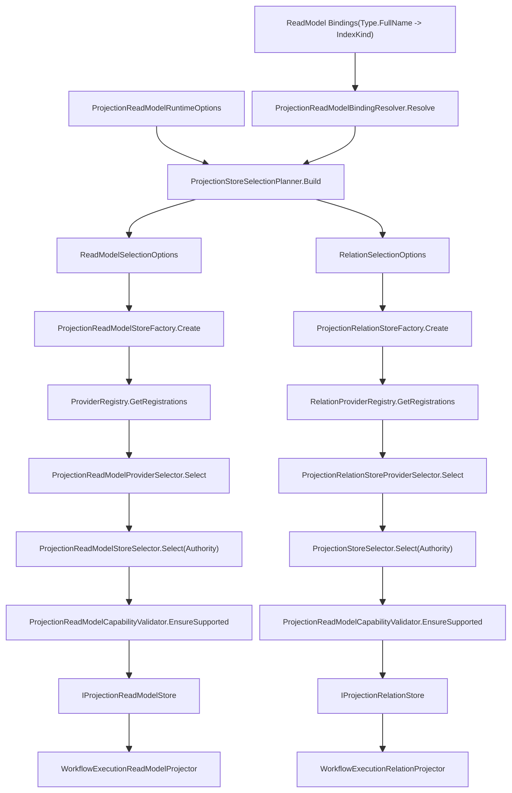

# Projection ReadModel 架构评分卡（2026-02-24，严格详细版）

## 1. 审计范围与方法

1. 审计对象：`Projection ReadModel` 端到端链路（Host 接线、Application 端口、Projection Core 编排、Runtime 选型、Provider 存储、AGUI 同链路分支、CI 门禁与测试）。
2. 评分规范：`docs/audit-scorecard/README.md`（100 分，6 维度）。
3. 评分原则：按“先满分后扣分”，仅对已落地且可复现的问题扣分；每项扣分绑定代码证据（文件+行号）或命令结果。
4. 审计基线：遵循评分规范第 2 节（InMemory/Local Actor/ProjectReference 不作为扣分项）。

## 2. 关键验证结果（本次实跑）

| 检查项 | 命令 | 结果 |
|---|---|---|
| 架构门禁（含 route mapping） | `bash tools/ci/architecture_guards.sh` | 通过（`Architecture guards passed.`） |
| 路由映射专项 | `bash tools/ci/projection_route_mapping_guard.sh` | 通过（`Projection route-mapping guard passed.`） |
| Projection Core 定向测试 | `dotnet test test/Aevatar.CQRS.Projection.Core.Tests/Aevatar.CQRS.Projection.Core.Tests.csproj --nologo --filter "FullyQualifiedName~ProjectionReadModelRuntimeTests\|FullyQualifiedName~ProjectionReadModelStoreSelectorTests\|FullyQualifiedName~ProjectionProviderE2EIntegrationTests" -m:1 -p:UseSharedCompilation=false` | 通过（`10 passed / 0 failed / 2 skipped`） |
| Workflow Projection 定向测试 | `dotnet test test/Aevatar.Workflow.Host.Api.Tests/Aevatar.Workflow.Host.Api.Tests.csproj --nologo --filter "FullyQualifiedName~WorkflowExecutionProjectionRegistrationTests\|FullyQualifiedName~WorkflowExecutionReadModelProjectorTests\|FullyQualifiedName~WorkflowProjectionOrchestrationComponentTests" -m:1 -p:UseSharedCompilation=false` | 通过（`36 passed / 0 failed / 0 skipped`） |

## 3. 总分与等级

**总分：95 / 100（A+）**

| 维度 | 权重 | 得分 | 扣分说明 |
|---|---:|---:|---|
| 分层与依赖反转 | 20 | 20 | 未发现跨层反向依赖与宿主承载核心业务编排问题。 |
| CQRS 与统一投影链路 | 20 | 19 | 默认去重器为透传实现，降低 at-least-once 场景下 readmodel 幂等鲁棒性。 |
| Projection 编排与状态约束 | 20 | 17 | live sink 订阅关系保存在进程内 lease 对象，未 actor/distributed 化。 |
| 读写分离与会话语义 | 15 | 14 | 完成阶段时间源使用 `DateTimeOffset.UtcNow`，未统一走 `IProjectionClock`。 |
| 命名语义与冗余清理 | 10 | 10 | 命名、职责边界与扩展点语义一致，未见重复空壳层。 |
| 可验证性（门禁/构建/测试） | 15 | 15 | 架构门禁 + 路由门禁 + 相关定向测试均通过。 |

## 4. 详细扣分项（严格）

### 4.1 P2-1：Live Sink 订阅运行态仍为进程内事实（-3）

1. 证据：`WorkflowExecutionRuntimeLease` 内维护 `_liveSinkSubscriptions` 列表，并提供 attach/detach/count 逻辑。  
   `src/workflow/Aevatar.Workflow.Projection/Orchestration/WorkflowExecutionRuntimeLease.cs:8`  
   `src/workflow/Aevatar.Workflow.Projection/Orchestration/WorkflowExecutionRuntimeLease.cs:31`  
   `src/workflow/Aevatar.Workflow.Projection/Orchestration/WorkflowExecutionRuntimeLease.cs:60`
2. 证据：`ReleaseIfIdleAsync` 依赖该本地计数决定是否释放投影 ownership。  
   `src/workflow/Aevatar.Workflow.Projection/Orchestration/WorkflowProjectionReleaseService.cs:31`
3. 影响：在多节点/连接迁移场景，sink 订阅事实与 ownership 释放决策可能出现节点本地视角偏差。
4. 结论：不属于“actorId->context 字典”硬违规，但与“投影会话/订阅运行态 actor 化”目标相比仍有架构欠账。

### 4.2 P2-2：默认去重策略为透传（-1）

1. 证据：默认注入 `PassthroughEventDeduplicator`。  
   `src/workflow/Aevatar.Workflow.Projection/DependencyInjection/ServiceCollectionExtensions.cs:46`
2. 证据：透传实现始终返回 `true`，不记录任何去重状态。  
   `src/workflow/Aevatar.Workflow.Projection/DependencyInjection/ServiceCollectionExtensions.cs:165`
3. 证据：projector 去重逻辑依赖该接口。  
   `src/workflow/Aevatar.Workflow.Projection/Projectors/WorkflowExecutionReadModelProjector.cs:61`
4. 影响：在重复投递或重放噪声下，timeline/summary 可能重复累计，影响 readmodel 一致性鲁棒性。

### 4.3 P3-1：时间源未完全统一（-1）

1. 证据：`CompleteAsync` 直接使用 `DateTimeOffset.UtcNow`。  
   `src/workflow/Aevatar.Workflow.Projection/Projectors/WorkflowExecutionReadModelProjector.cs:88`
2. 对比：同链路其他组件已使用 `IProjectionClock`（activation/updater/failure reporter）。  
   `src/workflow/Aevatar.Workflow.Projection/Orchestration/WorkflowProjectionActivationService.cs:39`  
   `src/workflow/Aevatar.Workflow.Projection/Orchestration/WorkflowProjectionReadModelUpdater.cs:24`  
   `src/workflow/Aevatar.Workflow.Projection/Orchestration/WorkflowProjectionDispatchFailureReporter.cs:42`
3. 影响：测试可控性与跨组件时间语义一致性略受影响。

## 5. 正向证据（加分项）

1. 统一选择权威入口：Runtime selector 复用抽象层权威 `ProjectionReadModelStoreSelector.Select(...)`。  
   `src/Aevatar.CQRS.Projection.Runtime/Runtime/ProjectionReadModelProviderSelector.cs:32`  
   `src/Aevatar.CQRS.Projection.Stores.Abstractions/Abstractions/ReadModels/ProjectionReadModelStoreSelector.cs:5`
2. ReadModel/Relation 统一规划：单一 `ProjectionStoreSelectionPlanner` 产出双存储 selection plan。  
   `src/Aevatar.CQRS.Projection.Runtime/Runtime/ProjectionStoreSelectionPlanner.cs:12`  
   `src/workflow/Aevatar.Workflow.Projection/DependencyInjection/ServiceCollectionExtensions.cs:155`
3. startup 校验与运行时选择同源：`WorkflowReadModelStartupValidationHostedService` 复用同一 selection plan。  
   `src/workflow/Aevatar.Workflow.Projection/Orchestration/WorkflowReadModelStartupValidationHostedService.cs:47`
4. 生命周期显式 lease/session：Lifecycle port 不暴露 `actorId` 反查，Attach/Detach/Release 都基于 lease。  
   `src/workflow/Aevatar.Workflow.Application.Abstractions/Projections/IWorkflowExecutionProjectionLifecyclePort.cs:16`
5. ownership actor 化：acquire/release 通过 `ActorProjectionOwnershipCoordinator -> ProjectionOwnershipCoordinatorGAgent`。  
   `src/Aevatar.CQRS.Projection.Core/Orchestration/ActorProjectionOwnershipCoordinator.cs:23`  
   `src/Aevatar.CQRS.Projection.Core/Orchestration/ProjectionOwnershipCoordinatorGAgent.cs:25`
6. 统一入口一对多分发：同一 `EventEnvelope` 在 coordinator 中分发到多个 projector 分支。  
   `src/Aevatar.CQRS.Projection.Core/Orchestration/ProjectionCoordinator.cs:19`
7. AGUI 与 ReadModel 共用同链路输入：AGUI projector 作为同一 projector 分支发布 run event。  
   `src/workflow/Aevatar.Workflow.Infrastructure/DependencyInjection/WorkflowCapabilityServiceCollectionExtensions.cs:22`  
   `src/workflow/Aevatar.Workflow.Presentation.AGUIAdapter/WorkflowExecutionAGUIEventProjector.cs:15`
8. Route mapping 守卫要求 `TypeUrl` 派生 + 精确键匹配 + `TryGetValue` 命中。  
   `tools/ci/projection_route_mapping_guard.sh:11`  
   `tools/ci/projection_route_mapping_guard.sh:71`
9. 中间层 ID 映射字典门禁已落地（full-scan）。  
   `tools/ci/architecture_guards.sh:548`  
   `tools/ci/architecture_guards.sh:590`

## 6. 分模块评分

| 模块 | 得分 | 结论 |
|---|---:|---|
| Projection Core（编排/订阅/ownership） | 95 | 主链清晰，ownership actor 化到位；runtime sink 运行态仍有本地化残留。 |
| Runtime（provider registry/selector/factory/planner） | 100 | 单一权威选择逻辑 + 统一规划，结构化日志与失败语义完整。 |
| Workflow Projection（port/orchestration/projector） | 92 | 端口分离、链路完整；默认去重透传与完成时间源不统一需收敛。 |
| Provider（InMemory/ES/Neo4j + relation） | 96 | 能力声明与写路径日志规范较完整；可观测性和一致性策略仍可增强。 |
| Host/API 组合层 | 96 | API 主要负责协议适配与组合；未下沉到 projection 内核细节。 |
| Guards + Tests | 98 | 守卫覆盖关键架构约束，相关定向测试通过，验证闭环较完整。 |

## 7. 详细架构图

### 7.1 Projection ReadModel 主链路（命令驱动 + 同链路 AGUI）

```mermaid
%%{init: {"maxTextSize": 100000, "flowchart": {"useMaxWidth": false, "nodeSpacing": 10, "rankSpacing": 50}, "themeVariables": {"fontSize": "10px"}}}%%
flowchart LR
    subgraph H["Host / API"]
        H1["/api/chat /api/ws/chat"]
        H2["ICommandExecutionService"]
        H3["IWorkflowExecutionQueryApplicationService"]
    end

    subgraph A["Application Layer"]
        A1["WorkflowRunContextFactory"]
        A2["IWorkflowExecutionProjectionLifecyclePort"]
        A3["WorkflowRunExecutionEngine"]
        A4["WorkflowRunResourceFinalizer"]
        A5["IWorkflowExecutionProjectionQueryPort"]
    end

    subgraph P["Projection Ports + Orchestration"]
        P1["WorkflowExecutionProjectionLifecycleService"]
        P2["WorkflowProjectionActivationService"]
        P3["WorkflowProjectionLeaseManager"]
        P4["ActorProjectionOwnershipCoordinator"]
        P5["ProjectionOwnershipCoordinatorGAgent(State)"]
        P6["ProjectionLifecycleService"]
        P7["ProjectionSubscriptionRegistry"]
        P8["ActorStreamSubscriptionHub<EventEnvelope>"]
    end

    subgraph B["Projector Branches (Same Envelope)"]
        B1["WorkflowExecutionReadModelProjector"]
        B2["WorkflowExecutionRelationProjector"]
        B3["WorkflowExecutionAGUIEventProjector"]
    end

    subgraph R["Runtime Selection + Stores"]
        R1["ProjectionStoreSelectionPlanner"]
        R2["ProjectionReadModelBindingResolver"]
        R3["ProjectionReadModelStoreFactory"]
        R4["ProjectionRelationStoreFactory"]
        R5["InMemory / Elasticsearch / Neo4j"]
    end

    subgraph S["Session Stream + Live Sink"]
        S1["ProjectionSessionEventHub<WorkflowRunEvent>"]
        S2["WorkflowRunEventChannel / Sink"]
    end

    H1 --> H2
    H2 --> A1
    A1 --> A2
    A2 --> P1
    P1 --> P2
    P2 --> P3 --> P4 --> P5
    P2 --> P6 --> P7 --> P8
    P8 --> B1
    P8 --> B2
    P8 --> B3

    R1 --> R2
    P2 --> R1
    B1 --> R3 --> R5
    B2 --> R4 --> R5
    B3 --> S1 --> S2
    A3 --> A4 --> A2

    H3 --> A5
    A5 --> R3
    A5 --> R4
```

### 7.2 Store 选型与能力校验链（ReadModel + Relation）

## 8. 结论与优先级建议

### P1

1. 无。

### P2

1. 将 live sink 订阅计数/绑定关系从 `WorkflowExecutionRuntimeLease` 迁移到 actor 持久态或抽象化分布式状态，避免多节点本地视角偏差。
2. 用可替换的持久化 `IEventDeduplicator` 作为默认实现（至少按 `rootActorId + envelopeId` 做幂等记录），透传实现仅用于 dev/test。

### P3

1. 将 `WorkflowExecutionReadModelProjector.CompleteAsync` 的时间源统一到 `IProjectionClock`，消除链路内时间语义分叉。
