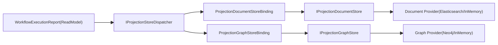

# Projection Store / ReadModel 架构审计与打分（2026-02-24）

- 范围：
  - `src/Aevatar.CQRS.Projection.Stores.Abstractions`
  - `src/Aevatar.CQRS.Projection.Core.Abstractions`
  - `src/Aevatar.CQRS.Projection.Runtime.Abstractions`
  - `src/Aevatar.CQRS.Projection.Runtime`
  - `src/Aevatar.CQRS.Projection.Providers.*`
  - `src/workflow/Aevatar.Workflow.Projection`
  - `src/workflow/extensions/Aevatar.Workflow.Extensions.Hosting`
- 审计目标：确认 `DocumentStore` 与 `GraphStore` 为平行关系，且 `ReadModel -> Stores` 为一对多模型。

## 1. 总分

- **9.3 / 10**

扣分点：

1. Runtime 仍允许通过额外 binding 扩展更多写入目标（通用能力），对首次接入者理解门槛略高。(-0.4)
2. 历史文档存在过旧版本痕迹（已重写主要文档，但仓库仍可能有历史性参考文档）。(-0.3)

## 2. 分项打分

| 维度 | 分数 | 结论 |
|---|---:|---|
| 分层清晰度 | 9.5 | Stores.Abstractions / Runtime.Abstractions / Runtime / Providers 职责边界清晰 |
| 并行一致性（Document vs Graph） | 9.4 | 命名与实现层次已并行（`IProjectionDocumentStore` vs `IProjectionGraphStore`） |
| 一对多模型完整性 | 9.2 | `IProjectionStoreDispatcher + Bindings` 明确支持一个 ReadModel 多 Store 分发 |
| 冗余消除程度 | 9.3 | Fanout/Router/Registration/Marker/双模型已删除 |
| Host 装配正确性 | 9.4 | Workflow Host 强制同类 Provider 仅一个，并支持 Document+Graph 双写 |
| 可测试性 | 9.1 | Dispatcher/GraphBinding/Workflow host tests 覆盖关键路径 |
| 运维可控性 | 9.0 | 策略位与 fail-fast 完整，日志和 guard 已对齐新模型 |

## 3. 核心审计结论

1. `DocumentStore` 与 `GraphStore` 为平行关系，不存在继承或主从关系。
2. `ReadModel` 与 Store 是 `1:N` 关系：一个 ReadModel 可写入多个 Store。
3. 当前 Workflow 生产组合为 `N=2`：Document + Graph 同步投影。
4. 同类 Provider 强制单实现：
   - Document: Elasticsearch 或 InMemory（二选一）
   - Graph: Neo4j 或 InMemory（二选一）

## 4. 目标架构图

## 5. 并行性核对（结论：通过）

| 层级 | Document | Graph | 结果 |
|---|---|---|---|
| 抽象层 | `IProjectionDocumentStore<TReadModel,TKey>` | `IProjectionGraphStore` | 平行 |
| Runtime Binding | `ProjectionDocumentStoreBinding` | `ProjectionGraphStoreBinding` | 平行 |
| Runtime 分发 | `IProjectionStoreDispatcher` 统一调度 | `IProjectionStoreDispatcher` 统一调度 | 平行 |
| InMemory Provider | `InMemoryProjectionDocumentStore` | `InMemoryProjectionGraphStore` | 平行 |
| Durable Provider | `ElasticsearchProjectionDocumentStore` | `Neo4jProjectionGraphStore` | 平行 |

## 6. 冗余审计（已清理）

已删除冗余层：

- `IProjectionStoreRegistration` / `DelegateProjectionStoreRegistration`
- `IProjectionMaterializationRouter` / `ProjectionMaterializationRouter`
- `IProjectionGraphMaterializer` / `ProjectionGraphMaterializer`
- `ProjectionDocumentStoreFanout` / `ProjectionGraphStoreFanout`
- `IDocumentReadModel`
- `GraphNodeDescriptor` / `GraphEdgeDescriptor`
- `ProjectionGraphSystemPropertyKeys`

## 7. 实施核对

已落地关键项：

1. Workflow Projector / Updater 全部使用 `IProjectionStoreDispatcher`。
2. Workflow Host Provider 装配强制“同类 Provider 仅一个”。
3. Document/Graph 双写通过 Dispatcher + Binding 实现，不依赖 Router/Fanout。
4. CI 守卫脚本已更新到新命名（DocumentStore 命名体系）。

## 8. 验证记录

执行通过：

1. `dotnet build aevatar.slnx --nologo`
2. `dotnet test test/Aevatar.CQRS.Projection.Core.Tests/Aevatar.CQRS.Projection.Core.Tests.csproj --nologo`
3. `dotnet test test/Aevatar.Workflow.Host.Api.Tests/Aevatar.Workflow.Host.Api.Tests.csproj --nologo`
4. `bash tools/ci/architecture_guards.sh`
5. `bash tools/ci/projection_route_mapping_guard.sh`
6. `bash tools/ci/test_stability_guards.sh`

结论：当前 Projection Store/ReadModel 架构已满足“彻底重构，无兼容性包袱”的目标。
