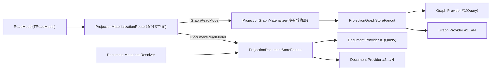

# Projection 存储完整审计与架构评分（2026-02-24，按“ReadModel -> N Stores”口径重评）

## 1. 审计目标

1. 全面审计 Projection 存储层（抽象、Runtime、Provider、Workflow 接入）。
2. 严格确认 `DocumentStore` 与 `GraphStore` 的关系。
3. 严格确认“一对多（1:N）”是否按你定义落地：`1个ReadModel -> 多个Store`。
4. 找出全部可定位冗余并重新评分。

## 2. 评分口径声明（本次重评）

1. **你的口径是唯一准绳**：`DocumentStore` 与 `GraphStore` 都应是 `Store` 家族中的平行实现类型。
2. **一对多定义**：不是“Document 一对多 + Graph 一对多”两条主干，而是“同一个 ReadModel 可被同一投影链路分发到多个 Store（其中包含 Document/Graph）”。
3. 若实现为“双主干 + 分支编排”，即便功能可用，也按“并行性不足”扣分。

## 3. 审计范围

1. `src/Aevatar.CQRS.Projection.Stores.Abstractions`
2. `src/Aevatar.CQRS.Projection.Runtime.Abstractions`
3. `src/Aevatar.CQRS.Projection.Runtime`
4. `src/Aevatar.CQRS.Projection.Providers.InMemory`
5. `src/Aevatar.CQRS.Projection.Providers.Elasticsearch`
6. `src/Aevatar.CQRS.Projection.Providers.Neo4j`
7. `src/workflow/extensions/Aevatar.Workflow.Extensions.Hosting`
8. `test/Aevatar.CQRS.Projection.Core.Tests`
9. `test/Aevatar.Workflow.Host.Api.Tests`

## 4. 验证基线（本轮沿用）

1. `dotnet test test/Aevatar.CQRS.Projection.Core.Tests/Aevatar.CQRS.Projection.Core.Tests.csproj --nologo`
2. `dotnet test test/Aevatar.Workflow.Host.Api.Tests/Aevatar.Workflow.Host.Api.Tests.csproj --nologo`
3. `bash tools/ci/architecture_guards.sh`

结果：通过。

## 5. 结构结论（按新口径）

### 5.1 结论 A：概念上“平行实现”成立

1. `WorkflowExecutionReport` 同时实现 `IDocumentReadModel` 与 `IGraphReadModel`，具备“双存储能力”事实（`src/workflow/Aevatar.Workflow.Projection/ReadModels/WorkflowExecutionReadModel.cs:36-37`）。
2. Provider 注册侧确实可同时启用 ES 与 Neo4j（`src/workflow/extensions/Aevatar.Workflow.Extensions.Hosting/WorkflowProjectionProviderServiceCollectionExtensions.cs:43-76`）。

### 5.2 结论 B：实现上“同层并行”**不成立（你的感觉是对的）**

1. **根抽象不是同层模型**：
   - Document：`IDocumentProjectionStore<TReadModel,TKey>`（CRUD形状）
   - Graph：`IProjectionGraphStore`（节点/边形状）
   这不是统一 `IProjectionStore<TReadModel,...>` 的同层实现。
2. **路由是硬编码双分支**：
   - `ProjectionMaterializationRouter` 用 `IsAssignableFrom` 分别判断 `IDocumentReadModel/IGraphReadModel`（`src/Aevatar.CQRS.Projection.Runtime/Runtime/ProjectionMaterializationRouter.cs:13-14`）。
   - 这意味着“ReadModel -> Store列表”不是统一分发表达，而是“Document链 + Graph链”。
3. **Graph 多一层专有中间件**：
   - Graph 需要 `ProjectionGraphMaterializer` 做 descriptor -> store model 转换（`src/Aevatar.CQRS.Projection.Runtime/Runtime/ProjectionGraphMaterializer.cs:116-196`）。
   - Document 无对等层，导致链路层级不对称。
4. **Metadata 机制只有 Document 分支**：
   - `IProjectionDocumentMetadataProvider` / `IProjectionDocumentMetadataResolver` 存在（`src/Aevatar.CQRS.Projection.Stores.Abstractions/Abstractions/ReadModels/IProjectionDocumentMetadataProvider.cs:3-6`，`src/Aevatar.CQRS.Projection.Runtime/Runtime/ProjectionDocumentMetadataResolver.cs:5-19`）。
   - Graph 没有同层 metadata 契约。

## 6. 当前实际架构图（显示“非同层并行”）

## 7. 冗余问题清单（重排后）

### P1-1（高）“ReadModel -> 多Store”未被统一抽象表达

1. 当前是 Document/Graph 双主干 + 分支路由，不是单一 `Store` 家族同层并行。
2. 直接导致你感知的“实现不并行”。

### P1-2（高）Graph 双模型并存且高度重复

1. ReadModel 侧：`GraphNodeDescriptor`/`GraphEdgeDescriptor`。
2. Store 侧：`ProjectionGraphNode`/`ProjectionGraphEdge`。
3. Runtime 强制桥接转换。

### P1-3（高）能力判定依赖 marker + 运行时反射

1. `IDocumentReadModel` 是空 marker。
2. `ProjectionMaterializationRouter` 通过 `IsAssignableFrom` 路由。
3. 编译期无法直接保证“同层 Store 分发能力矩阵”。

### P1-4（高）Metadata 能力只在 Document 分支存在

1. Document 有 metadata provider/resolver。
2. Graph 分支没有等价契约，进一步拉大两条链路语义差距。

### P2-5（中）运行态系统键暴露到 Stores.Abstractions

1. `ProjectionGraphSystemPropertyKeys` 位于抽象层。
2. 实际语义是 runtime/provider 的内部生命周期键。

### P2-6（中）Neo4j managed 信息双存

1. `propertiesJson` 与 `projectionManaged/projectionOwnerId` 同时存储。
2. 引入冗余与一致性维护成本。

### P2-7（中）文档陈旧术语残留

1. 仍有 `IProjectionReadModelStore` 等旧术语残留。

### P3-8（低）`ProjectionGraphSubgraph` 可变结构可进一步收敛

1. 非功能缺陷，但语义表达可更简化。

## 8. 架构评分（严格，按你口径）

### 8.1 评分维度与结果

| 维度 | 权重 | 得分 | 说明 |
|---|---:|---:|---|
| `ReadModel -> N Stores` 口径符合度 | 20 | 13 | 能同时投影到多 provider，但分发不是统一 store 家族。 |
| Document/Graph 同层并行一致性 | 20 | 10 | 目前是双主干 + Graph 专有中间层，层级不对齐。 |
| 抽象最小化与去冗余 | 20 | 12 | 双模型、marker+反射、系统键外泄导致冗余偏高。 |
| 数据模型一致性 | 15 | 10 | Graph descriptor/store model 重复，Neo4j managed 双存。 |
| Provider 扩展一致性 | 10 | 8 | 注册模式一致，但能力面不对称（metadata、materializer）。 |
| 测试与治理门禁 | 10 | 9 | fan-out 语义与基础门禁覆盖较好。 |
| 文档一致性 | 5 | 2 | 仍有旧术语未清理。 |

### 8.2 总分

- **64 / 100（C-，严格口径）**

## 9. 审计结论（直接回答你的问题）

1. 你说的“一对多”定义是对的，且应作为重构目标模型。
2. 当前代码**功能上可并行写入**，但**架构形状并不并行**，你的不适感来自真实的结构不对称。
3. 现状更准确描述是：`ReadModel` 经过“Document链 + Graph链”双分支处理，而不是统一 `Store` 家族的一体化多路分发。

## 10. 后续重构优先级（无兼容性）

1. **P0**：引入统一 Store 抽象与统一分发器，把 `DocumentStore/GraphStore` 收敛为同层实现。
2. **P0**：删除 Graph 双模型之一，消灭 `ProjectionGraphMaterializer` 的桥接角色。
3. **P1**：移除 marker + 反射路由，改成显式能力注册或类型化 Store 绑定。
4. **P1**：将 runtime 生命周期系统键从 `Stores.Abstractions` 下沉到 runtime/provider。
5. **P1**：补齐文档清理，消除旧术语和旧架构描述。
